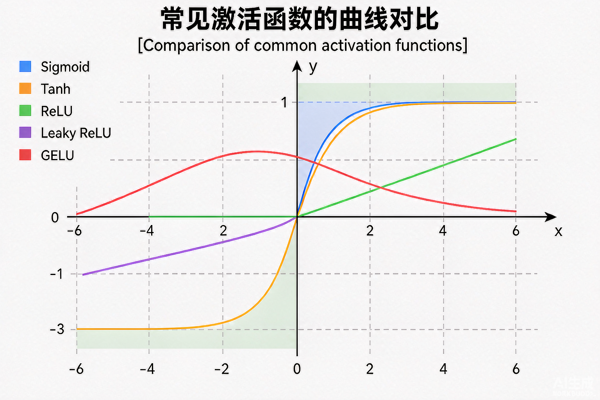
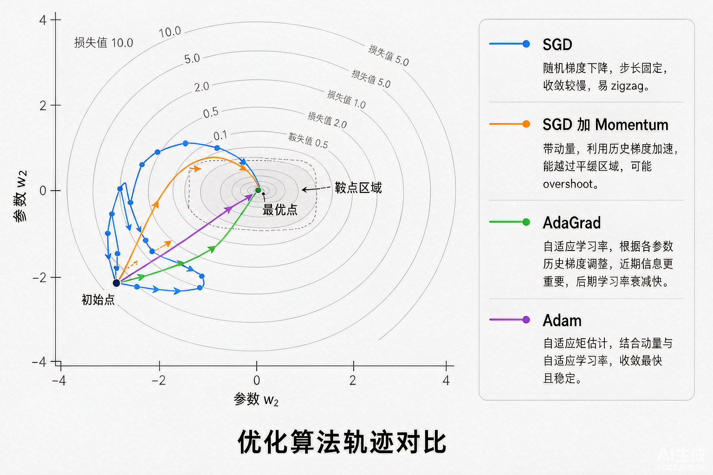
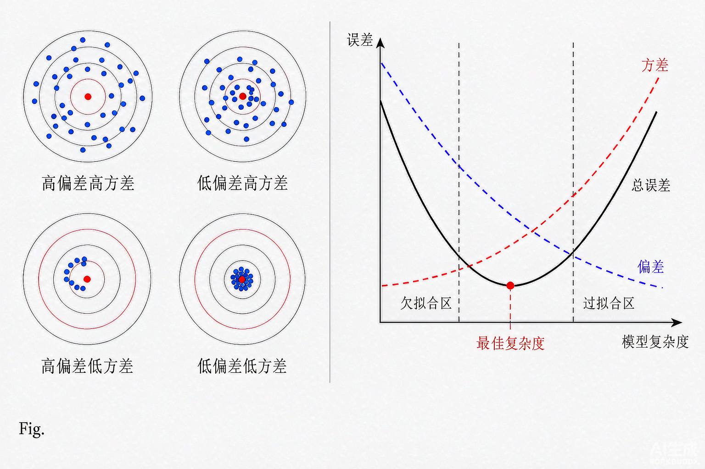
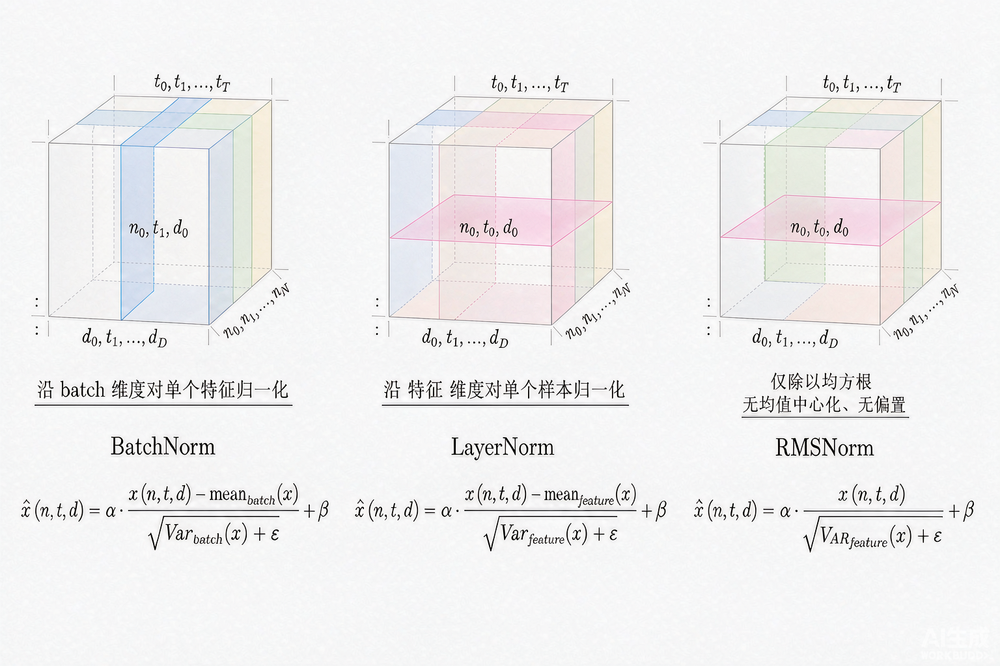
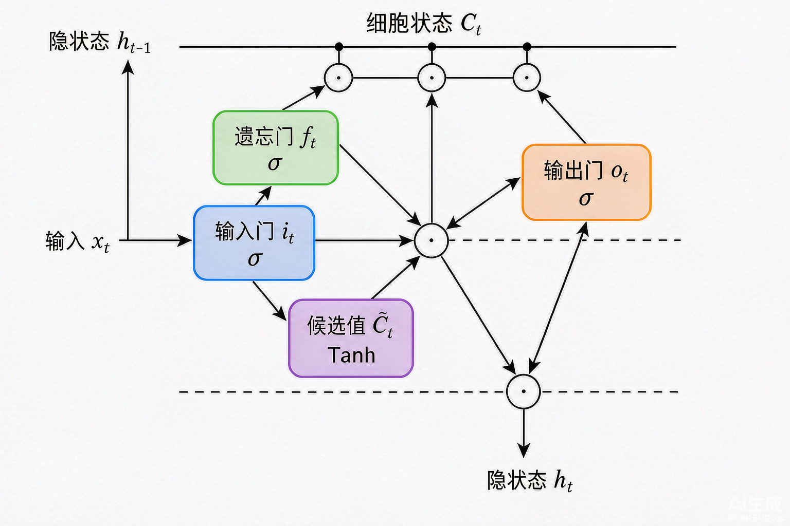
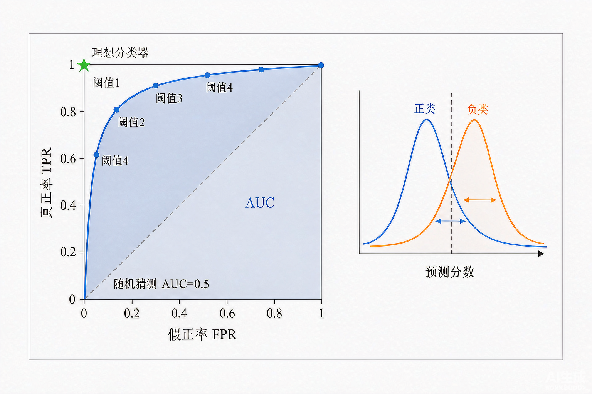

## 1.5 机器学习与深度学习基础（面试够用版）

<details markdown="1">
<summary>📑 <strong>本章目录</strong>（点击展开）</summary>

- [1.5.0 本章知识地图](#150-本章知识地图)
- [1.5.1 机器学习的三种范式与问题分类](#151-机器学习的三种范式与问题分类)
  - [1.5.1.1 监督 / 无监督 / 自监督 / 强化学习](#1511-监督--无监督--自监督--强化学习)
  - [1.5.1.2 分类 / 回归 / 序列 / 生成的边界](#1512-分类--回归--序列--生成的边界)
  - [1.5.1.3 生成模型 vs 判别模型](#1513-生成模型-vs-判别模型)
  - [1.5.1.4 数据集划分与交叉验证](#1514-数据集划分与交叉验证)
- [1.5.2 线性模型：回归与分类](#152-线性模型回归与分类)
  - [1.5.2.1 线性回归与最小二乘（正规方程）](#1521-线性回归与最小二乘正规方程)
  - [1.5.2.2 逻辑回归：sigmoid + 交叉熵](#1522-逻辑回归sigmoid--交叉熵)
  - [1.5.2.3 softmax 多分类](#1523-softmax-多分类)
  - [1.5.2.4 为什么用交叉熵不用 MSE](#1524-为什么用交叉熵不用-mse)
- [1.5.3 树模型与集成学习](#153-树模型与集成学习)
  - [1.5.3.1 决策树：信息增益 / Gini](#1531-决策树信息增益--gini)
  - [1.5.3.2 随机森林与 Bagging](#1532-随机森林与-bagging)
  - [1.5.3.3 Gradient Boosting / XGBoost](#1533-gradient-boosting--xgboost)
  - [1.5.3.4 树模型 vs 神经网络：什么时候选谁](#1534-树模型-vs-神经网络什么时候选谁)
- [1.5.4 神经网络基础](#154-神经网络基础)
  - [1.5.4.1 从感知机到 MLP](#1541-从感知机到-mlp)
  - [1.5.4.2 万能逼近定理](#1542-万能逼近定理)
  - [1.5.4.3 前向传播与反向传播](#1543-前向传播与反向传播)
  - [1.5.4.4 计算图与自动微分](#1544-计算图与自动微分)
- [1.5.5 激活函数](#155-激活函数)
  - [1.5.5.1 Sigmoid / Tanh 及其饱和问题](#1551-sigmoid--tanh-及其饱和问题)
  - [1.5.5.2 ReLU 家族](#1552-relu-家族)
  - [1.5.5.3 GELU / SwiGLU（大模型主流）](#1553-gelu--swiglu大模型主流)
  - [1.5.5.4 激活函数选型速查](#1554-激活函数选型速查)
- [1.5.6 损失函数](#156-损失函数)
  - [1.5.6.1 回归损失：MSE / MAE / Huber](#1561-回归损失mse--mae--huber)
  - [1.5.6.2 分类损失：交叉熵 / Focal](#1562-分类损失交叉熵--focal)
  - [1.5.6.3 对比损失 InfoNCE](#1563-对比损失-infonce)
  - [1.5.6.4 大模型为什么都用交叉熵](#1564-大模型为什么都用交叉熵)
- [1.5.7 优化器](#157-优化器)
  - [1.5.7.1 SGD / Mini-batch / 动量](#1571-sgd--mini-batch--动量)
  - [1.5.7.2 AdaGrad / RMSProp / Adam](#1572-adagrad--rmsprop--adam)
  - [1.5.7.3 AdamW 与学习率调度](#1573-adamw-与学习率调度)
  - [1.5.7.4 优化器选型速查](#1574-优化器选型速查)
- [1.5.8 正则化与归一化](#158-正则化与归一化)
  - [1.5.8.1 偏差-方差权衡](#1581-偏差-方差权衡)
  - [1.5.8.2 L1 / L2 / 权重衰减 / Dropout](#1582-l1--l2--权重衰减--dropout)
  - [1.5.8.3 BatchNorm / LayerNorm / RMSNorm](#1583-batchnorm--layernorm--rmsnorm)
  - [1.5.8.4 归一化选型速查](#1584-归一化选型速查)
- [1.5.9 梯度消失与爆炸](#159-梯度消失与爆炸)
  - [1.5.9.1 成因：链式法则连乘](#1591-成因链式法则连乘)
  - [1.5.9.2 六种解法](#1592-六种解法)
  - [1.5.9.3 残差连接为什么有效](#1593-残差连接为什么有效)
- [1.5.10 卷积神经网络 CNN](#1510-卷积神经网络-cnn)
  - [1.5.10.1 卷积与池化](#15101-卷积与池化)
  - [1.5.10.2 感受野与参数共享](#15102-感受野与参数共享)
  - [1.5.10.3 经典网络演进](#15103-经典网络演进)
  - [1.5.10.4 CNN 在大模型时代的处境](#15104-cnn-在大模型时代的处境)
- [1.5.11 序列模型 RNN / LSTM / GRU](#1511-序列模型-rnn--lstm--gru)
  - [1.5.11.1 RNN 与 BPTT](#15111-rnn-与-bptt)
  - [1.5.11.2 LSTM 三门](#15112-lstm-三门)
  - [1.5.11.3 GRU](#15113-gru)
  - [1.5.11.4 为什么 Transformer 取代了 RNN](#15114-为什么-transformer-取代了-rnn)
- [1.5.12 评估指标](#1512-评估指标)
  - [1.5.12.1 混淆矩阵](#15121-混淆矩阵)
  - [1.5.12.2 精确率 / 召回率 / F1](#15122-精确率--召回率--f1)
  - [1.5.12.3 ROC / AUC](#15123-roc--auc)
  - [1.5.12.4 多分类指标与平均方式](#15124-多分类指标与平均方式)
  - [1.5.12.5 生成任务指标：BLEU / ROUGE / PPL](#15125-生成任务指标bleu--rouge--ppl)
- [1.5.13 手算模板与高频面试题](#1513-手算模板与高频面试题)
  - [1.5.13.1 手算模板一：线性回归的正规方程](#15131-手算模板一线性回归的正规方程)
  - [1.5.13.2 手算模板二：逻辑回归一步梯度](#15132-手算模板二逻辑回归一步梯度)
  - [1.5.13.3 手算模板三：softmax + 交叉熵的反向](#15133-手算模板三softmax--交叉熵的反向)
  - [1.5.13.4 手算模板四：决策树信息增益](#15134-手算模板四决策树信息增益)
  - [1.5.13.5 手算模板五：混淆矩阵算指标](#15135-手算模板五混淆矩阵算指标)
  - [1.5.13.6 手算模板六：AUC 的秩公式](#15136-手算模板六auc-的秩公式)
  - [1.5.13.7 手算模板七：BatchNorm 前向](#15137-手算模板七batchnorm-前向)
  - [1.5.13.8 手算模板八：LSTM 参数量](#15138-手算模板八lstm-参数量)
  - [1.5.13.9 高频面试题](#15139-高频面试题)
  - [1.5.13.10 三句话总结本章](#151310-三句话总结本章)
- [1.5.14 延伸阅读](#1514-延伸阅读)

</details>

### 1.5.0 本章知识地图

> **本章定位与阅读建议**：第 1 章只覆盖了"大模型够用的数学"，但**数学和机器学习不是一回事**。这一章补上"从数学到能训出模型"的中间层：监督/无监督/自监督/强化学习的边界、线性模型与树模型各自适合什么、神经网络为什么是非线性万能逼近器、激活函数与损失函数的设计取舍、优化器与正则化在工程里的真实角色，以及 CNN/RNN/Transformer 三种架构的来龙去脉。
>
> **面试真相**：算法岗面试在这一层最容易"识破背题者"——背过公式的人很多，**理解"为什么这样设计"的人很少**。比如面试官问"为什么 ResNet 能训深网络"，他要的不是"用了残差连接"这句，而是"BN 在加和之后让梯度恒等通路绕过饱和激活"。
>
> **与后续章节的接口**：§1.5.4 的反向传播是 §1.3 矩阵求导的实操版；§1.5.5–1.5.7 的激活、损失、优化器是第 3 章预训练与第 4 章微调的"运行底盘"；§1.5.8 的归一化是第 2 章 Transformer 中 RMSNorm / LayerNorm 的理论基础；§1.5.11 的 LSTM 三门是第 5 章 RLHF 中"长上下文信用分配"的思维源头。

| 节号 | 知识点 | 在大模型中的用途 | 面试权重 |
|---|---|---|---|
| 1.5.1 | 范式与问题分类：监督/无监督/自监督/强化 | 决定用什么训练数据、什么损失、什么评估 | ★★★ |
| 1.5.2 | 线性模型：回归/分类/softmax | 一切神经网络的最后输出层都是它 | ★★★★ |
| 1.5.3 | 树模型与集成学习 | 结构化数据的工业基线，面试常考与神经网络的边界 | ★★★ |
| 1.5.4 | 神经网络基础：MLP / 反向传播 / 自动微分 | Transformer 的计算单元就是 MLP | ★★★★★ |
| 1.5.5 | 激活函数：Sigmoid / ReLU / GELU / SwiGLU | 直接决定梯度是否消失、表达力是否足够 | ★★★★★ |
| 1.5.6 | 损失函数：MSE / 交叉熵 / Focal / InfoNCE | 决定模型"在学什么" | ★★★★ |
| 1.5.7 | 优化器：SGD / Adam / AdamW | 大模型训练的全部工程都是优化器调度 | ★★★★★ |
| 1.5.8 | 正则化与归一化：L1/L2/Dropout/BN/LN/RMSNorm | **大模型几乎全部用 RMSNorm** | ★★★★★ |
| 1.5.9 | 梯度消失与爆炸 + 残差连接 | Transformer 为什么能训 96 层以上 | ★★★★ |
| 1.5.10 | CNN 与 ViT | VLM/多模态卷土重来的 CNN 复兴 | ★★★ |
| 1.5.11 | RNN / LSTM / GRU | 序列建模的"前 Transformer 时代"，理解位置编码的前提 | ★★★ |
| 1.5.12 | 评估指标：混淆矩阵 / F1 / ROC-AUC / BLEU/ROUGE/PPL | 第 11 章评估体系的底层符号系统 | ★★★★ |
| 1.5.13 | 手算模板与高频面试题 | 白板推导 | ★★★★★ |

---

### 1.5.1 机器学习的三种范式与问题分类

**在大模型里用在哪**：这一节回答"LLM 究竟属于哪一种范式"——它本质是**自监督生成**（next-token prediction），不是监督学习，也不是强化学习（虽然后训练阶段会用到 RL）。理解范式边界，能解释为什么 LLM 不需要人工标注、为什么预训练数据规模比 RLHF 数据规模大成千上万倍。

#### 1.5.1.1 监督 / 无监督 / 自监督 / 强化学习

四种范式的核心区别在"**数据是否带标签**"和"**反馈来自何处**"：

| 范式 | 数据形态 | 学习目标 | 在 LLM 中的位置 |
|---|---|---|---|
| **监督学习** | `(x, y)`：输入+人工标签 | 学习 `p(y \| x)` | 分类微调（SFT）、奖励模型训练 |
| **无监督学习** | `x`：无标签 | 学习数据分布 `p(x)` | 聚类、降维、密度估计，与 LLM 主线无关 |
| **自监督学习** | `x`：无标签但**自带监督信号** | 用 `x` 的一部分预测另一部分 | **预训练本身**（next-token prediction） |
| **强化学习** | `(s, a, r)`：状态-动作-奖励 | 学习 $π(a\|s)$ 使累计奖励最大 | RLHF / DPO / GRPO 等对齐阶段 |

**自监督的核心洞察**：next-token prediction 是自监督——文本 $x = (x_1, x_2, ..., x_n)$ 中，$x_t$ 就是 $x_<t$ 的天然标签，**整个互联网文本都是免费标签**。这就是为什么 LLM 能在几万亿 token 上训练而不用担心"标签不够"。

**强化学习与监督学习的关键差异**：监督学习假设所有样本独立同分布、标签一次给齐；强化学习的奖励是**延迟、稀疏、带噪声**的——一条 200 token 的回答要等生成完才知道好不好，而且同一回答让三个人打分可能给出三个不同的分数。这就是 PPO / DPO / GRPO 等算法要解决的工程难题（第 5 章会展开）。

**面试官怎么问**：
- "LLM 预训练是监督还是无监督？" —— **自监督**。最容易答错的题，因为"没有人工标签"很容易被错答为"无监督"。
- "自监督和无监督有什么区别？" —— 自监督的"标签"是从数据本身结构里"挖"出来的（next token / masked token / 对比正负对），无监督则没有显式的预测目标，只有分布层面的目标（聚类、降维）。

#### 1.5.1.2 分类 / 回归 / 序列 / 生成的边界

机器学习任务的"四象限"分类，看**输出空间**和**样本关系**：

| 任务类型 | 输出空间 | 样本独立？ | LLM 中的对应 |
|---|---|---|---|
| **分类** | 离散类别 | 样本独立 | 情感分类、意图识别、奖励模型打分 |
| **回归** | 连续实数 | 样本独立 | 奖励模型回归头、regression 评测 |
| **序列标注** | 每个 token 一个标签 | 样本独立，token 强相关 | NER、词性标注（LLM 不擅长） |
| **生成** | 变长序列 | 样本独立，**输出 token 强相关** | **LLM 主任务**：机器翻译、摘要、对话 |

**关键认识**：LLM 主任务是**自回归生成**——既不是分类也不是回归，而是"每一步都是一个 K 类分类（vocab size），但 K 步之间有自回归依赖"。所以 LLM 的损失本质是 K 个分类问题的交叉熵之和。

#### 1.5.1.3 生成模型 vs 判别模型

**判别模型**：直接学 `p(y \| x)`，边界清楚。
- 代表：逻辑回归、SVM、判别式 BERT（用 `[CLS]` 分类头）。
- 优点：分类准确率高、训练稳定。

**生成模型**：学联合分布 `p(x, y)` 或 `p(x)`，然后用贝叶斯反推 `p(y\|x)`。
- 代表：朴素贝叶斯、VAE、GAN、扩散模型、自回归 LLM。
- 优点：能"创造"新样本、能做无监督密度估计、能做无条件生成。

**LLM 是生成模型**：预训练目标是 next-token 的 $p(x_t \| x_<t)$，本质是联合分布的因式分解。这是为什么 LLM 能在 zero-shot 完成任务——它学会了"语言的形状"，就能对任何 prompt 生成合理延续。

#### 1.5.1.4 数据集划分与交叉验证

**三划分的逻辑**：
- **训练集**：拟合参数。
- **验证集（dev）**：调超参（学习率、正则化系数、早停点）。
- **测试集**：只用一次，给出最终无偏估计。

**黄金法则**：测试集**绝对不能**参与任何调参决策，否则评估结果会偏高且无法复现。这条规则被违反的最常见场景是"用 test set 选了最好的 checkpoint"。

**K 折交叉验证**：当数据量不够（几千~几万样本）时，把训练集均分成 K 份，每次拿 K-1 份训练、1 份验证，循环 K 次取平均。常见 K=5 或 K=10。
- 优点：用全部数据做训练和验证，**对小数据是必须的**。
- 代价：训练量变成 K 倍。
- LLM 训练中**几乎不用** K 折——数据量太大、训练太贵，预训练用单次固定切分就够了；只在评测小样本任务（如 MMLU 子集）时偶尔用 bootstrap 估计置信区间。

**留一法（LOOCV）**：K=N。理论无偏但方差大，仅在数据极少时考虑。

---

### 1.5.2 线性模型：回归与分类

**在大模型里用在哪**：Transformer 的最后输出层 $softmax(W·h)$ 就是一个 softmax 回归；预训练 loss 是它 + 交叉熵；RLHF 的奖励模型头、分类任务的 classifier head，全都是这一节的延伸。把线性模型吃透，Transformer 输出层就没有盲点。

#### 1.5.2.1 线性回归与最小二乘（正规方程）

**模型**：对 $x ∈ (R, d)$，预测 $ŷ = wᵀ x + b$。
**损失**（均方误差）：

$$
\mathcal{L}(w, b) = \frac{1}{N} \sum_{i=1}^{N} \left( w^\top x_i + b - y_i \right)^2
$$

**闭式解（正规方程）**：把 `(w, b)` 合成一个向量（在 `x` 上拼一个常数 1），记为 $θ$，则最优解

$$
\theta^\star = \left( X^\top X \right)^{-1} X^\top y
$$

**三条要点必须澄清**（面试高频）：
1. $X^{\top}X$ 可逆才存在闭式解。当 $X^{\top}X$ 不可逆（特征冗余/共线），需要 $λI + XᵀX$ 的**岭正则**版本；这就是为什么 §1.5.8.2 的 L2 正则不仅"防过拟合"还"防矩阵奇异"。
2. 闭式解是 $O(d³)$，主要花在矩阵求逆上。$d > 10⁴$ 时基本不可用，必须改梯度下降。大模型 `d` 是 vocab size × hidden，`d` 巨大，所以**永远用 SGD/Adam**。
3. 闭式解是凸问题的全局最优；线性回归的 MSE loss 是凸二次型，所以闭式解 = 全局最优。这条性质让线性回归成为少有的"有真解"的模型。

#### 1.5.2.2 逻辑回归：sigmoid + 交叉熵

**模型**：先做线性打分 $z = w^{\top}x + b$，再过 sigmoid $σ(z) = 1/(1 + e^{-z})$，得到 $P(y=1|x) = σ(z)$。

**损失（交叉熵，对二分类）**：

$$
\mathcal{L} = -\frac{1}{N} \sum_{i=1}^{N} \left[ y_i \log \hat{y}_i + (1 - y_i) \log (1 - \hat{y}_i) \right]
$$

**梯度**（最经典的白板推导题）：

$$
\frac{\partial \mathcal{L}}{\partial w} = \frac{1}{N} X^\top (\hat{y} - y)
$$

**形式上的妙处**：$∂L/∂w$ 形式与线性回归 MSE 的梯度**完全相同**，都是"输入乘以（预测-真实）"。这就是交叉熵 + sigmoid 的工程魔力：**梯度简洁、不含 σ'(z)，避开了饱和问题**。详见 §1.5.2.4。

#### 1.5.2.3 softmax 多分类

**模型**：对 K 类，线性打分 $z ∈ R^K$，过 softmax

$$
p_k = \frac{\exp(z_k)}{\sum_{j=1}^{K} \exp(z_j)}
$$

**损失（多类交叉熵）**：

$$
\mathcal{L} = -\sum_{k=1}^{K} y_k \log p_k = -\log p_{y}
$$

其中 `y` 是真实类别下标。LLM 的预训练 loss 就是它（$K =$ `vocab_size`，`y` 是 next token id）。

**数值稳定**：softmax 的指数在 `z` 较大时溢出。工程上先做 $z_k - max(z)$ 平移：

$$
p_k = \frac{\exp(z_k - m)}{\sum_j \exp(z_j - m)}, \quad m = \max_j z_j
$$

或者直接用 PyTorch 的 `log_softmax` / 融合算子，**禁止先算 softmax 再取 log**（会产生大量 `-inf`，详见 §1.5.13.3）。

#### 1.5.2.4 为什么用交叉熵不用 MSE

**梯度性质差异**（面试必答，要能从两个角度各说一遍）：

**角度一：梯度是否依赖 σ'(z)**

- 交叉熵 + sigmoid/softmax：$∂L/∂w = (1/N) Xᵀ(ŷ − y)$，**不出现 σ'(z)**。即使预测完全错误（ŷ ≈ 0 或 1，σ' 趋近 0），梯度也不会消失。
- MSE + sigmoid：$∂L/∂w = (2/N) Xᵀ (ŷ − y) · σ'(z)$，**多出一个 σ'(z) 因子**。当预测完全错误（饱和区）时 σ'(z) ≈ 0，梯度消失 → **学习停滞**。

**角度二：损失曲面是否凸**

- 逻辑回归 + 交叉熵：损失对 `w` **凸**（可证），所以梯度下降必收敛到全局最优。
- 逻辑回归 + MSE：损失对 `w` **非凸**，梯度下降可能卡在差的局部最优。

**结论**：分类问题一律用交叉熵。这条规则对所有 sigmoid/softmax 输出都成立——LLM、奖励模型、分类头都一样。

---

### 1.5.3 树模型与集成学习

**在大模型里用在哪**：很多算法岗面试会问"结构化数据（表格特征）为什么不用神经网络而用树模型"。这一节回答：**树模型对异构特征、缺失值、单调约束、可解释性的处理，神经网络到今天也没全面追上**。大模型时代，树模型依然统治搜索/推荐/风控的精排模型——XGBoost / LightGBM 与神经网络长期共存。

#### 1.5.3.1 决策树：信息增益 / Gini

**决策树的核心**：递归地把特征空间按某个特征切一刀，让每个叶节点尽量"纯"（同一类）。切分的判据：

**信息增益（ID3 / C4.5）**：

$$
\mathrm{IG}(D, A) = H(D) - \sum_{v \in V_A} \frac{|D_v|}{|D|} H(D_v)
$$

其中 $H(D) = -Σ p_k log p_k$ 是信息熵，$D_v$ 是按特征 A 取值 v 切出的子集。**信息增益倾向于取值多的特征**（取值越多越容易切到纯净），所以 C4.5 引入信息增益比：

$$
\mathrm{GainRatio}(D, A) = \frac{\mathrm{IG}(D, A)}{\mathrm{IV}(A)}, \quad \mathrm{IV}(A) = -\sum_v \frac{|D_v|}{|D|} \log \frac{|D_v|}{|D|}
$$

**Gini 系数（CART）**：

$$
\mathrm{Gini}(D) = 1 - \sum_{k=1}^{K} p_k^2 = 1 - \sum_k p_k^2
$$

$p_k$ 是第 k 类样本占比。Gini 反映"随机抽两个样本，类别不一致的概率"。**CART 用 Gini**——计算比熵更快（不用 log），在大数据集上常成为默认。

**剪枝**：防止过拟合，分预剪枝（限制深度、最小样本数）和后剪枝（先生成完整树再剪掉提升小的分支）。

#### 1.5.3.2 随机森林与 Bagging

**Bagging 思想**（Bootstrap Aggregating）：对训练集有放回抽样 K 次得到 K 个子集，分别训练 K 个**强模型**，预测时平均（回归）或投票（分类）。**关键：模型之间要有差异**——同模型同数据 K 份就退化成一个模型。

**随机森林**：在 Bagging 的基础上再加一层随机性——**每次切分时只考虑特征的随机子集**（典型 $√d$ 个）。两个随机性叠加让树之间的相关性大幅降低。

**为什么能降方差不减偏差**：单棵决策树是高方差模型（数据微动树就大变），N 棵独立模型的均值方差是 $σ²/N$。**前提是相关性低**——这就是为什么要再随机特征。

#### 1.5.3.3 Gradient Boosting / XGBoost

**Boosting 思想**（与 Bagging 相反）：串行训练 K 个**弱模型**，每个模型拟合前一轮的**残差**。偏差不断下降，方差可控。代表：AdaBoost、Gradient Boosting。

**Gradient Boosting 的本质**：把"拟合残差"换成"拟合损失函数的负梯度"——这是一个用函数空间做梯度下降的精彩重构。

**XGBoost 的工程创新**：
- **二阶泰勒展开**（用一阶 + 二阶导数）+ 正则项，构造类似牛顿法的目标。
- **特征预排序 + 直方图近似**——把连续特征的候选切分点量化到桶里，大幅加速。
- **稀疏感知的分裂**——天然支持缺失值方向。
- **缓存感知 + 并行化**——按特征列并行计算梯度。

**面试官怎么问**：
- "XGBoost 和 LightGBM 有什么区别？" —— 主要在直方图实现（XGBoost 后续版本也加了）、Leaf-wise vs Level-wise 生长、单边梯度采样（GOSS）、互斥特征捆绑（EFB）。
- "GBDT 为什么对类别特征要做 target encoding？" —— 因为 GBDT 的切分只对单特征做数值比较，类别特征没有"序"，必须编码成数值；target encoding 用"该类别下目标均值"代替，引入信息但也带来 leakage 风险（用 K 折 target encoding 缓解）。

#### 1.5.3.4 树模型 vs 神经网络：什么时候选谁

| 维度 | 树模型（XGBoost 等） | 神经网络 |
|---|---|---|
| **数据形态** | 异构表格特征（数值 + 类别 + 缺失） | 同质稠密特征（图像、文本、音频） |
| **特征规模** | 中小（几百~几万列） | 大到极大（百万~十亿 token） |
| **可解释性** | 强（特征重要性、SHAP） | 弱（除非专门设计） |
| **缺失值** | 原生支持（方向学习） | 需要预处理（填充、embedding） |
| **外推** | 差（切分外区域外推为常数） | 好（连续函数） |
| **训练数据需求** | 中等（万级可起步） | 大（万级起步，亿级才好） |
| **工程复杂度** | 低（CPU 即可） | 高（GPU 集群、分布式） |
| **典型场景** | 风控、推荐精排、广告 CTR | 文本、图像、语音、多模态 |

**一句话口诀**：**结构化数据小规模选树，非结构化数据大规模选神经网络**。这条经验在 2026 年依然成立。

---

### 1.5.4 神经网络基础

**在大模型里用在哪**：这一节是第 2 章 Transformer 的前置。Transformer 编码器的每一层就是一个"多头注意力 + MLP + 残差 + 归一化"的复合 MLP；MLP 的反向传播就是 Transformer 反向传播的子模块。

#### 1.5.4.1 从感知机到 MLP

**感知机（1958）**：$y = σ(wᵀx + b)$，单层，线性可分时收敛，**遇到异或问题就死**。Minsky 1969 年的著名批评让神经网络研究陷入低谷十多年。

**多层感知机（MLP）**：堆多个全连接 + 激活：

$$
h^{(1)} = \sigma(W^{(1)} x + b^{(1)}), \quad h^{(2)} = \sigma(W^{(2)} h^{(1)} + b^{(2)}), \quad \hat{y} = W^{(3)} h^{(2)} + b^{(3)}
$$

加上至少一层隐藏层和**非线性激活**，异或可解。**非线性是关键**——没有它，多层堆叠等价于单层线性变换。

#### 1.5.4.2 万能逼近定理

**定理（Cybenko 1989 / Hornik 1991）**：一个**足够宽**的单隐藏层 MLP（带 sigmoid 类激活）可以在任意精度上逼近 $R^d$ 上的任意连续函数（紧集上）。

**三条必须澄清**：
1. 定理保证**存在**这样的网络，不告诉你**怎么找到**。训练仍可能卡在坏的局部最优。
2. 定理对"宽度"的要求可能指数级增长。实践中靠**深度 + 有限宽度**（如 Transformer 的 12 层、batch size 几十）也能逼近大多数真实分布。
3. 万能逼近 ≠ 学得会。**逼近能力是容量，学习能力还要看数据、优化器、正则化**——这是经验风险最小化 vs 结构风险最小化的全部故事。

#### 1.5.4.3 前向传播与反向传播

**前向**：按拓扑顺序算每个节点的输出。
**反向（BP）**：按反拓扑顺序，用链式法则算每个参数的梯度。

**链式法则的具体形式**：对 `L = f(g(h(x)))`，

$$
\frac{\partial L}{\partial x} = \frac{\partial f}{\partial g} \cdot \frac{\partial g}{\partial h} \cdot \frac{\partial h}{\partial x}
$$

每一项都是局部导数，**不需要重算整图**——这是 BP 比"数值微分"快几个数量级的根本原因。详见 §1.3 矩阵求导章。

**反向传播的工程边界**：每一步梯度计算的内存与前向激活成正比。LLM 训练时显存的大部分就是给前向激活的——这就是为什么需要 gradient checkpointing、混合精度、ZeRO 等显存优化技术（详见 §3 章）。

#### 1.5.4.4 计算图与自动微分

**计算图**：把表达式拆成基本算子（+, ×, exp, log, matmul, relu, ...）的有向无环图。

**两种自动微分模式**：
- **前向模式（Forward-mode AD / JVP）**：从输入向输出传播 Jacobian-vector。一次算出一个方向上的导数。
- **反向模式（Reverse-mode AD / VJP）**：从输出向输入传播。一次算出所有输入的梯度，**对神经网络天然友好**——因为网络有"海量输入（参数）+ 少量输出（loss）"。

**PyTorch / JAX 都是反向模式**。前向模式在某些场景（ODE 求解、对抗样本的隐式微分）更合适。深度学习里**几乎只用反向模式**。

**关键认识**：你写 `loss.backward()` 时，PyTorch 在背后已经把所有中间激活存下来（`requires_grad=True` 的张量），用拓扑序反向遍历一次算所有参数的梯度。`torch.no_grad()` 关闭梯度跟踪可以省显存和加速推理。

---

### 1.5.5 激活函数

**在大模型里用在哪**：激活函数决定"梯度能不能传下去"。**现代 LLM 几乎全用 GELU 或 SwiGLU**（LLaMA、Qwen、DeepSeek 全部）。理解激活函数的演进，就理解了"为什么 Transformer 能训几百层"。

#### 1.5.5.1 Sigmoid / Tanh 及其饱和问题

**Sigmoid** $σ(x) = 1/(1 + e^{-x})$：
- 输出范围 (0, 1)，不是零中心的。
- **饱和问题**：$x → ±∞$ 时梯度趋近 0，反向传播几层后梯度消失。
- 计算含 exp，较慢。

**Tanh** $tanh(x) = 2σ(2x) − 1$：
- 输出范围 (-1, 1)，**零中心**，训练更稳。
- 仍有饱和问题（$x → ±∞$ 时梯度趋近 0）。

**为什么饱和会致死**：反向传播时若进入饱和区，$σ'(x) ≈ 0$，下游参数几乎收不到梯度信号。深层网络若上一层就饱和，下面整条链学不动——这就是 §1.5.9 梯度消失的核心机制。

#### 1.5.5.2 ReLU 家族

**ReLU** $max(0, x)$：
- **正半轴梯度恒为 1**——永远不饱和，彻底解决 sigmoid/tanh 的梯度消失。
- 计算只需比较和赋值，**极快**。
- **缺陷**：负半轴梯度为 0，"死亡"神经元对任何输入都不再激活。实践中约 10–40% 的 ReLU 神经元会"死"，但通常不影响最终性能。

**PReLU / Leaky ReLU**：负半轴斜率 $α$（PReLU 可学，Leaky ReLU 固定 $α=0.01$）。让负半轴也有微弱梯度，缓解"死亡"。

**ELU**：负半轴用指数 $α(e^x - 1)$，让均值更接近 0。

**ReLU6**（MobileNet 系列）：$min(6, max(0, x))$，限制正半轴上限，便于低精度推理。



*图 1.5.5-1 常见激活函数曲线对比。Sigmoid/Tanh 在饱和区梯度消失；ReLU 在负半轴死亡；GELU 是平滑版的"软 ReLU"，是大模型主流。*

#### 1.5.5.3 GELU / SwiGLU（大模型主流）

**GELU**（Hendrycks & Gimpel 2016）：

$$
\mathrm{GELU}(x) = x \cdot \Phi(x) = x \cdot \frac{1}{2}\left(1 + \mathrm{erf}\left(\frac{x}{\sqrt{2}}\right)\right)
$$

直观：把输入按"正态分布 $Φ(x)$ 的概率"加权——输入越大越像恒等，越小越像 0。比 ReLU 多了平滑性，**在大模型上稳定带来零点几个百分点的提升**。

**近似** $GELU(x) ≈ 0.5 x (1 + tanh(√(2/π)(x + 0.044715x³)))$，速度快、精度足够，PyTorch 默认走近似。

**SwiGLU**（Shazeer 2020）：

$$
\mathrm{SwiGLU}(x) = \mathrm{Swish}_\beta(x) \otimes \mathrm{Swish}_\beta(x) \quad \text{用门控 } = \mathrm{Swish}(W_1 x) \otimes (W_2 x)
$$

其中 $Swish_β(x) = x · σ(βx)$（β=1 时就是 SiLU）。SwiGLU 用"门控线性单元"把输入切成两半一半过激活一半当门，**比纯 ReLU/GELU 多一倍的参数但效果更好**——LLaMA、Qwen、DeepSeek、PaLM 全用 SwiGLU 或其变体。

**为什么 GELU/SwiGLU 能打败 ReLU**（待研究界未完全定论）：
- 平滑性让优化曲面更光滑，避免 ReLU 在 0 点的非角性。
- 门控机制让信息筛选更精细——输入的部分维度被显式压制。

#### 1.5.5.4 激活函数选型速查

| 场景 | 推荐激活 | 理由 |
|---|---|---|
| **现代 Transformer 大模型** | **SwiGLU / GELU** | 已被验证稳定涨点，平滑性 + 门控 |
| 早期 Transformer / 简单 MLP | ReLU | 计算最快，无饱和 |
| CNN（ResNet 之前） | ReLU | 同上 |
| CNN（轻量化：MobileNet） | ReLU6 / h-swish | 适配低精度 |
| 输出层二分类 | sigmoid | 输出 (0,1) 直接当概率 |
| 输出层多分类 | softmax | 同上 |
| 注意力里的 score | **softmax**（温度 $√d_k$ 缩放） | 必须归一化 |
| RNN 隐藏 | tanh | 零中心 + 输出有界 |
| GAN 生成器输出（图像像素） | tanh | 把输出范围对齐到 (-1, 1) |

**面试官怎么问**：
- "为什么现在几乎不用 sigmoid/tanh？" —— 饱和 → 梯度消失，深层训不动。
- "ReLU 死了的神经元怎么办？" —— 没有恢复机制，要么换 Leaky ReLU / GELU，要么接受"死一些不影响"——实践中后者居多。
- "SwiGLU 比 GELU 好在哪？" —— 门控，多一倍参数但收益高于代价。

---

### 1.5.6 损失函数

**在大模型里用在哪**：损失函数决定模型"在学什么"。**LLM 预训练几乎只用交叉熵**；对齐阶段才有 MSE / Brier / hinge / KL 出现；强化学习阶段有 reward 和 policy gradient。这一节把回归/分类/对比三大类损失讲清楚。

#### 1.5.6.1 回归损失：MSE / MAE / Huber

**MSE（均方误差）**：

$$
\mathcal{L}_{\mathrm{MSE}} = \frac{1}{N}\sum_i (y_i - \hat{y}_i)^2
$$

- 梯度 $(ŷ − y)$，与误差成正比，**远离极小值时梯度大**——收敛快。
- 异常值敏感（误差平方放大）。
- 隐含高斯噪声假设。

**MAE（平均绝对误差）**：

$$
\mathcal{L}_{\mathrm{MAE}} = \frac{1}{N}\sum_i |y_i - \hat{y}_i|
$$

- 梯度 $sign(ŷ − y)$，**常数大小**——收敛慢但对异常值鲁棒。
- $y = ŷ$ 处不可导，需要做 subgradient。
- 隐含拉普拉斯噪声假设。

**Huber Loss**：MSE 和 MAE 的混合，误差小时走 MSE（梯度随误差），误差大时走 MAE（常数梯度）：

$$
\mathcal{L}_{\delta}(r) = \begin{cases}
\frac{1}{2} r^2 & |r| \le \delta \\
\delta \cdot \left(|r| - \frac{1}{2}\delta\right) & |r| > \delta
\end{cases}
$$

$r = y - ŷ$。**RLHF 奖励模型的训练常用 Huber**——奖励回归对异常样本（标注噪声）敏感，Huber 比 MSE 更鲁棒。

#### 1.5.6.2 分类损失：交叉熵 / Focal

**多类交叉熵**（已在 §1.5.2.3 给出）：

$$
\mathcal{L}_{\mathrm{CE}} = -\log p_y
$$

**二分类交叉熵**（已在 §1.5.2.2 给出）。**LLM 预训练就是它**，$K =$ `vocab_size`，$p_y$ = softmax 后真实 token 的概率。

**标签平滑（Label Smoothing）**：把 one-hot `y` 替换成 $(1 − ε) y + ε / (K − 1) · (1 − y)$。效果：① 防止过自信；② 改善校准；③ 蒸馏中天然兼容（详见 §1.6.4）。

**Focal Loss**（Lin et al. 2017）：

$$
\mathcal{L}_{\mathrm{focal}} = -\alpha (1 - p_y)^\gamma \log p_y
$$

$(1 − p_y)^γ$ 是**调制因子**——$p_y$ 大（容易样本）权重被压低，$p_y$ 小（难样本）权重保留。**γ=0 退化为交叉熵**；$γ=2$ 是常用值。原始动机是解决检测中的正负样本不均（背景类压倒前景类），现在被广泛用作"难样本挖掘"的工具。

**面试官怎么问**：
- "Focal Loss 解决什么问题？" —— 类别不平衡 + 难易样本不均。
- "为什么不用 Focal Loss 训 LLM？" —— LLM 预训练的"难样本"是天然存在的稀见 token，但词汇表分布很均匀（每个 token 都该学好），用 Focal 会反而损伤对常用 token 的拟合。

#### 1.5.6.3 对比损失 InfoNCE

**InfoNCE**（van den Oord et al. 2018）：

$$
\mathcal{L}_{\mathrm{InfoNCE}} = -\mathbb{E}\left[\log \frac{\exp(s(z_i, z_i^+)/\tau)}{\sum_{j=1}^{N} \exp(s(z_i, z_j)/\tau)}\right]
$$

其中 `s` 是相似度（点积或余弦），$τ$ 是温度，$z_i⁺$ 是正样本对的另一个向量，$z_j$（$j ≠ i$）是负样本。

**三条核心认识**：
1. **InfoNCE 是互信息的下界**——$I(z; z⁺) ≥ log(N) − L_{\mathrm{InfoNCE}}$，所以最小化 InfoNCE = 最大化互互的。
2. **N 越大，下界越紧**——batch 内负样本越多，互互下界越接近真实互互。这就是为什么 CLIP / SimCSE / BGE 训练都追求大 batch。
3. **温度 $τ$ 控制分布尖度**：$τ$ 小则分布尖锐（聚焦难负样本），$τ$ 大则分布平滑（强调全局结构）。BGE 默认 $τ=0.02$，CLIP 默认 $τ=0.07$。

#### 1.5.6.4 大模型为什么都用交叉熵

**三个理由**：
1. **生成任务本质是序列多分类**：每个位置都是一个 K=vocab_size 的分类问题，交叉熵是天然选择。
2. **梯度形式简洁**：$∂L/∂logit = ŷ − y$（one-hot 或软标签），不依赖 softmax 的二阶导，无饱和问题。
3. **与极大似然一致**：交叉熵 = 负对数似然（去掉常数），是极大似然估计的直接体现。

**蒸馏中的 KL 与交叉熵**：教师分布 `p` 与学生分布 `q` 的 KL 散度最小化，等价于最小化 $H(p, q) = H(p) + D_{\mathrm{KL}}(p‖q)$，其中 `H(p)` 是常数。所以**蒸馏目标 `H(p, q)` = 交叉熵，预测分布用教师的软分布**——这与分类场景只是把 one-hot 换成软标签，梯度公式 $ŷ − y$ 仍成立（只要 y 归一化）。

---

### 1.5.7 优化器

**在大模型里用在哪**：**大模型训练几乎全部用 AdamW**（GPT-3、LLaMA、Qwen、DeepSeek、Claude、Mistral）。这一节回答"为什么 AdamW 能一统江湖"以及"SGD 在大模型时代是否还有一席之地"。

#### 1.5.7.1 SGD / Mini-batch / 动量

**SGD（随机梯度下降）**：每次用一个样本（或一个 mini-batch）的梯度估计做更新：

$$
\theta_{t+1} = \theta_t - \eta \nabla \mathcal{L}_{\mathrm{batch}}(\theta_t)
$$

**Mini-batch SGD**：batch size 从 1 增到 `B`。`B=1` 噪声太大不稳定，`B=N` 太贵。常用 `B = 32 ~ 8192`，大模型训练 `B` 可以到几百万 token。

**为什么 Mini-batch 工作**：单样本梯度是噪声，估计有偏但**无偏**（$E[∇L_b] = ∇L$）；batch 内样本越多方差越小。**噪声反而是正则化**——过小的 batch（`B=1`）会让损失曲线抖动剧烈，泛化反而好（隐式正则）。

**SGD with Momentum**：

$$
v_t = \beta v_{t-1} + \nabla \mathcal{L}, \quad \theta_{t+1} = \theta_t - \eta v_t
$$

$β ≈ 0.9$ 时等价于把过去约 $1/(1-β) = 10$ 步的梯度指数加权平均。**本质是用历史梯度平滑当前噪声**。

**Nesterov 动量**：先"用动量探一步"，再在探出的位置算梯度。比标准动量略好，但对噪声不鲁棒（深度学习里优势不明显）。

#### 1.5.7.2 AdaGrad / RMSProp / Adam

**AdaGrad**（2011）：对每个参数自适应学习率——频繁更新的参数学习率小，稀疏更新的大学习率大：

$$
g_t = \nabla \mathcal{L}, \quad s_t = s_{t-1} + g_t^2, \quad \theta_{t+1} = \theta_t - \frac{\eta}{\sqrt{s_t + \epsilon}} g_t
$$

**致命缺陷**：$s_t$ 单调递增，学习率单调下降，**训练后期几乎学不动**。

**RMSProp**（Hinton 2012 讲义）：把 $s_t$ 改成指数加权移动平均：

$$
s_t = \beta s_{t-1} + (1 - \beta) g_t^2
$$

**Adam**（Kingma & Ba 2015）= 动量 + RMSProp：

$$
m_t = \beta_1 m_{t-1} + (1 - \beta_1) g_t, \quad s_t = \beta_2 s_{t-1} + (1 - \beta_2) g_t^2
$$

$$
\hat{m}_t = \frac{m_t}{1 - \beta_1^t}, \quad \hat{s}_t = \frac{s_t}{1 - \beta_2^t}, \quad \theta_{t+1} = \theta_t - \eta \frac{\hat{m}_t}{\sqrt{\hat{s}_t} + \epsilon}
$$

$β_1 = 0.9, β_2 = 0.999, ε = 10^{-8}$ 是默认。$m̂_t, ŝ_t$ 是**偏置校正**——冷启动时 $m_0 = s_0 = 0$ 会让前期估计偏小，除以 $(1 − β^t)$ 修回来。

**Adam 为什么稳态步长约等于学习率**：梯度恒为 `g` 时，$m̂ → g, ŝ → g²$，步长 $η · g / |g| = η · sign(g)$——梯度放大 10 倍，步长基本不变。这是 Adam "自适应"的本质：**归一化掉梯度尺度**。



*图 1.5.7-1 四优化器在非凸损失曲面上的轨迹。SGD 抖动剧烈；Momentum 平滑但可能 overshoot；AdaGrad 后期几乎不动；Adam 最快最稳。*

#### 1.5.7.3 AdamW 与学习率调度

**AdamW**（Loshchilov & Hutter 2019）= Adam + **解耦的权重衰减**：

$$
\theta_{t+1} = \theta_t - \eta \left( \frac{\hat{m}_t}{\sqrt{\hat{s}_t} + \epsilon} + \lambda \theta_t \right)
$$

**关键**：权重衰减项 $λ θ_t$ 是**直接加到梯度上、而不是加到 loss 上再求导**。

**AdamW vs Adam+L2 的本质差异**（面试高频辨析题）：
- Adam + L2 正则：在 loss 里加 $λ/2 · ‖θ‖²$，对 $θ$ 求导得 $λθ$。但 Adam 会把 $λθ$ 除以 $√ŝ$——**对每个参数的正则强度不同**，正则效果不均匀。
- AdamW：直接 $θ ← −η(Adam更新 + λθ)$，**正则强度对所有参数一致**。这才是"权重衰减"的本意。

**LLaMA / GPT-3 / 主流大模型全用 AdamW**——$β_1=0.9, β_2=0.95, λ=0.1$（LLaMA）；$β_1=0.9, β_2=0.95, λ=0.1$（GPT-3）。

**学习率调度**：

| 调度策略 | 公式 | 用途 |
|---|---|---|
| **Warmup** | $η(t) = η_\max · t / T_{\mathrm{warmup}}$ for $t < T_{\mathrm{warmup}}$ | 头 1–5% 步线性升，避免早期梯度大破坏初始化 |
| **Cosine 衰减** | $η(t) = η_\min + (η_\max − η_\min) · 0.5(1 + cos(π · (t − T_{\mathrm{warmup}}) / (T − T_{\mathrm{warmup}})))$ | LLaMA、GPT-3 默认，平滑收敛 |
| **Linear 衰减** | $η(t) = η_\max · (1 − (t − T_{\mathrm{warmup}})/(T − T_{\mathrm{warmup}}))$ | 简单，但末段过于激进 |
| **Constant + Cooldown** | 前 80% 步恒定，后 20% 余弦退火 | 部分 MoE 模型用 |

**Warmup 为什么必须**：训练初期权重随机，梯度方向也不准。如果一开始就用大学习率，第一步可能把模型推到很差的位置再难回弹。Warmup 让模型先"稳一稳"再"冲"。

#### 1.5.7.4 优化器选型速查

| 场景 | 推荐优化器 | 超参典型值 |
|---|---|---|
| **大模型预训练** | **AdamW** | $β_1=0.9, β_2=0.95, λ=0.1$，warmup + cosine |
| **大模型微调** | **AdamW** | $β_1=0.9, β_2=0.95, λ=0.1$ 或更小（如 $λ=0.01$） |
| **RLHF PPO** | AdamW（actor）+ AdamW（critic） | critic 单独一组学习率 |
| **CNN 视觉训练（中小规模）** | SGD with Momentum | `lr=0.1, momentum=0.9, weight_decay=5e-4` |
| **CNN 微调** | Adam / AdamW | `lr=1e-4` |
| **GAN** | Adam（双时间尺度） | G/D 不同学习率 |
| **强化学习** | Adam（PPO/SAC） | 各种变体 |
| **极小数据**（< 1000 样本） | SGD / LBFGS | Adam 在小数据上易过拟合 |

**面试官怎么问**：
- "Adam 和 SGD 哪个更好？" —— 没绝对答案。**大规模训练 AdamW 几乎全胜**（不用调学习率，抗噪声好）；**CNN 视觉训练 SGD+Momentum 在某些 benchmark 仍能打平甚至略超**（泛化更好，但需精细调参）。
- "Adam 在小数据上为什么容易过拟合？" —— Adam 自适应学习率 + 提前收敛到尖锐极小值，泛化差；SGD 噪声大反而收敛到平坦极小值。
- "AdamW 和 Adam 加 weight decay 一样"？" —— **不一样**。Adam 的 L2 正则强度对参数维度非均匀（除以 $√ŝ$ 后），AdamW 解耦后均匀。详见 §1.7.3。

---

### 1.5.8 正则化与归一化

**在大模型里用在哪**：正则化决定模型"会不会背数据"，归一化决定"梯度传得稳不稳"。**现代 LLM 几乎不用 Dropout、不用 L1，权重衰减用 AdamW 的解耦版本，归一化统一用 RMSNorm**。理解这套选择，就理解了"大模型训练工程的核心 trick 集合"。

#### 1.5.8.1 偏差-方差权衡

**偏差（Bias）**：模型期望预测与真实函数的偏离，反映"模型能不能拟合"。
**方差（Variance）**：模型在不同训练集上的预测波动，反映"模型稳不稳"。
**噪声（Noise）**：问题本身的不可约误差。

总误差分解：

$$
\mathbb{E}\left[(\hat{y} - y)^2\right] = \mathrm{Bias}^2 + \mathrm{Variance} + \sigma^2_{\mathrm{noise}}
$$

**直觉**：简单模型（如线性回归）偏差大、方差小——拟合不够但稳；复杂模型（如深度网络）偏差小、方差大——拟合好但容易抖。



*图 1.5.8-1 左：四个靶心直观对比（散得远 + 中心远 = 高偏差高方差；散得远 + 中心近 = 低偏差高方差；紧但偏 = 高偏差低方差；紧且正中心 = 低偏差低方差）。右：总误差 = U 型曲线，由下降的偏差与上升的方差合成，最小值在 最佳复杂度。*

**模型复杂度 vs 误差的三个区段**：
- **欠拟合区**：模型太弱，偏差主导；总误差随复杂度下降。
- **过拟合区**：模型太强，方差主导；总误差随复杂度上升。
- **最佳复杂度**：偏差与方差的均衡点；总误差最小。

**面试官怎么问**：
- "偏差和方差能同时下降吗？" —— **理论上可以**（如换更好的模型类、增加数据）；**但代价是引入更强的正则或更大的数据**。
- "深度学习主要担心哪个？" —— **方差**。所以正则化（限制模型容量）和集成（多模型平均）是核心工具。

#### 1.5.8.2 L1 / L2 / 权重衰减 / Dropout

| 正则化方法 | 形式 | 在大模型中的位置 |
|---|---|---|
| **L2 正则**（加到 loss） | $λ/2 · ‖θ‖²$ | **等价于权重衰减**但对 Adam 不等价 |
| **权重衰减**（直接作用 θ） | $θ ← −η(grad + λθ)$ | AdamW 用的就是它，LLaMA/PaLM 全部 |
| **L1 正则** | $λ · ‖θ‖₁$ | 产生稀疏解；**大模型不用**（要稠密能力） |
| **Dropout** | 训练时随机置 0 部分神经元 | **大模型几乎不用**（BN/LN 已足够正则） |
| **Label Smoothing** | one-hot → (1−ε)y + ε/(K−1)·1 | 蒸馏与分类常用 |
| **数据增强** | 训练样本加扰动生成新样本 | 视觉必用；NLP 用回译/EDA |

**L1 vs L2 几何直觉**（已在 §1.1.1 详述，此处精简）：
- L2 圆 vs L1 菱形，**菱形顶点落在坐标轴**，故 L1 产生稀疏解。
- L2 永远不会精确到 0（导数随 w→0 也趋近 0，推力趋近 0）。
- 大模型需要**稠密能力**（每个参数都贡献一点），L1 稀疏化反而掉点。

**Dropout**（Srivastava 2014）：
- 训练时每个神经元以概率 `p` 被置 0（典型 `p=0.5`）。
- 测试时所有神经元都激活，但输出乘以 `(1 − p)`（等价于期望不变）。
- 直观：训练 $2^n$ 个"子网络"的集成；测试时是它们的平均。
- **大模型为什么不用**：① 训练极贵，浪费计算在"被丢弃的神经元"上；② 大模型本身容量大，靠数据规模和正则项就够；③ 现代归一化（BN/LN/RMSNorm）+ 大数据已经提供了足够的正则。

#### 1.5.8.3 BatchNorm / LayerNorm / RMSNorm

**为什么需要归一化**：每层输入的分布会随前层参数更新而漂移（Internal Covariate Shift）。归一化固定每层输入分布，让优化更稳、允许更大学习率。

**BatchNorm**（Ioffe & Szegedy 2015）：

$$
\hat{x}(n, t, d) = \alpha \cdot \frac{x(n, t, d) - \mu_{\mathrm{batch}}(d)}{\sqrt{\sigma^2_{\mathrm{batch}}(d) + \epsilon}} + \beta
$$

- 沿 batch 维度 `n` 计算均值/方差，对单个特征 `d` 归一化。
- 训练用 batch 统计量，**推理用移动平均**的全局统计量。
- 优点：① 允许更大学习率；② 一定程度正则（每个 batch 统计有噪声）。
- 缺点：① batch size 小时不稳；② **RNN/Transformer 不友好**（变长序列难算）。

**LayerNorm**（Ba et al. 2016）：

$$
\hat{x}(n, t, d) = \alpha \cdot \frac{x(n, t, d) - \mu_{\mathrm{feature}}(n, t)}{\sqrt{\sigma^2_{\mathrm{feature}}(n, t) + \epsilon}} + \beta
$$

- 沿特征维度 `d` 计算均值/方差，对单个样本 `n` 归一化。
- **不依赖 batch**，适合 RNN/Transformer/小 batch。
- 训练/推理行为一致（无需存移动平均）。
- GPT-2、原始 Transformer 用它。

**RMSNorm**（Zhang & Sennrich 2019）：

$$
\hat{x}(n, t, d) = \alpha \cdot \frac{x(n, t, d)}{\sqrt{\mathrm{Mean}\left(x(n, t, d)^2\right) + \epsilon}} \cdot x(n, t, d)
$$

- **不要均值中心化，不要偏置**（α 当可学缩放）。
- 计算量约为 LayerNorm 的 50–70%（少算均值和减均值），效果持平或更好。
- **LLaMA、Qwen、DeepSeek、Mistral、GPT-J、Falcon 等主流开源 LLM 全部用 RMSNorm**。



*图 1.5.8-2 BatchNorm 沿 batch 维度对单个特征归一化（垂直切一片），LayerNorm 沿特征维度对单个样本归一化（水平切一片），RMSNorm 同样是按样本的特征归一化但少一次均值中心化、少一组偏置。*

**为什么 RMSNorm 比 LayerNorm 略好**（经验观察）：
- 少算一次均值 = 少一个非线性路径 → 优化更稳。
- 无偏置 → 不强迫模型学习"重置分布的均值"，让位给前面的网络。
- 工程上更快（GPU 单条 reduce 指令就能算 RMS）。

#### 1.5.8.4 归一化选型速查

| 场景 | 推荐归一化 | 备注 |
|---|---|---|
| **现代 LLM（GPT 类）** | **RMSNorm** | LLaMA/Qwen/DeepSeek 标配 |
| **原始 Transformer / BERT** | LayerNorm | GPT-2 / BERT |
| **CNN 视觉（推理 batch=1）** | BatchNorm | 训练/推理行为差异，推理需冻结统计 |
| **CNN 视觉（轻量）** | GroupNorm | 不依赖 batch |
| **RNN** | LayerNorm | 不依赖 batch 维度 |
| **GAN** | 视具体架构 | 各家有差异

**面试官怎么问**：
- "为什么 LLM 不用 BatchNorm？" —— ① Transformer 序列变长，每个 token 单独算 batch 统计不稳；② batch size 常常被显存压得很小（数据并行后每个 GPU 看到的 batch 更小）；③ 推理时统计量要缓存，移动平均与真实分布漂移会掉点。
- "RMSNorm 比 LayerNorm 优势有多大？" —— 通常在 loss 上持平或略好（0.01–0.05 PPL），主要价值是省 30–50% 归一化时间和显存。

---

### 1.5.9 梯度消失与爆炸

**在大模型里用在哪**：这是 §1.5.5（激活）和 §1.5.8（归一化）的根因问题——**为什么需要 ReLU/RMSNorm/残差**。理解梯度消失的本质，就理解了现代深度学习架构设计的 80% 工程逻辑。

#### 1.5.9.1 成因：链式法则连乘

**反向传播的链式法则**：对 $L = f_n(...f_2(f_1(x))...)$，

$$
\frac{\partial L}{\partial x} = \frac{\partial f_n}{\partial f_{n-1}} \cdots \frac{\partial f_2}{\partial f_1} \cdot \frac{\partial f_1}{\partial x}
$$

**关键观察**：每层局部梯度连乘。如果每层局部梯度幅值 |·|< 1，n 层后总梯度指数级趋近 0（**消失**）；如果 |·|> 1，n 层后指数级爆炸（**爆炸**）。

**典型值**：
- Sigmoid 局部梯度最大 0.25（$σ'(0)=0.25$），n=10 层后总梯度最大 $0.25^10 ≈ 10^{-6}$——这就是为什么 sigmoid 训不动深网络。
- ReLU 局部梯度 `0 或 1`，既不消失也不爆炸（但有"死亡"问题）。

**梯度爆炸的症状**：训练时 loss 突然变成 NaN 或极大值；权重突然变成 NaN。
**梯度消失的症状**：loss 几乎不动；前层参数几乎不更新。

#### 1.5.9.2 六种解法

| 解法 | 原理 | 在 LLM 中的应用 |
|---|---|---|
| **ReLU 系激活** | 正半轴梯度恒为 1 | 所有 LLM |
| **合理初始化** | Xavier / He，保证前向/反向方差稳定 | 默认实现 |
| **BatchNorm / LayerNorm / RMSNorm** | 归一化每层输入，固定方差 | 所有 LLM |
| **残差连接** | `y = F(x) + x`，梯度有恒等通路 | Transformer / ResNet 标配 |
| **梯度裁剪** | $g ← g · min(1, τ/‖g‖)$ | LLM 标配（τ=1.0） |
| **Warmup + 调度** | 学习率从 0 起步 | LLM 标配 |

**梯度裁剪的细节**（已在 §1.7.5 详述）：全局范数裁剪算所有参数梯度的 L2 范数 $‖g‖$，超过阈值 $τ$ 就整体等比缩放。GPT-3 与 LLaMA 都用 $τ = 1.0$。

**注意**：梯度裁剪**只缩放梯度幅值，不改变方向**——它修不了"方向本身就是错的"问题，只能修"步子太大"的问题。

#### 1.5.9.3 残差连接为什么有效

**公式**：

$$
y = F(x) + x, \quad \frac{\partial y}{\partial x} = \frac{\partial F}{\partial x} + I
$$

**反向传播的恒等通路**：`+I` 保证即使 $∂F/∂x$ 趋近 0（如 `F` 是恒等映射附近），总梯度至少有 `I`——**梯度永远能传到前层**。

**深度网络的实际效果**：ResNet 152 层 vs VGG 19 层——同样的任务，ResNet 不仅能训更深，**训练 loss 也更低**（说明残差不是"为了能训"而是"更好训"）。

**Transformer 的双重残差**：每一层有两条残差——

$$
x \leftarrow x + \mathrm{Sublayer}(\mathrm{LN}(x))
$$

其中 `Sublayer` 是多头注意力或 MLP。**两条残差 + 两条前置 LN** 是 Transformer 能训 96 层以上（LLaMA 405B）的关键。

---

### 1.5.10 卷积神经网络 CNN

**在大模型里用在哪**：纯文本 LLM 已经不用 CNN，但**多模态 VLM 时代 CNN 复兴**——视觉编码器仍是 SigLIP / DINOv2 / ConvNeXt 主导；视频生成里 3D CNN 也在回归。理解 CNN 是理解多模态 LLM 视觉塔的前置。

#### 1.5.10.1 卷积与池化

**2D 卷积**：用一个小的卷积核（典型 3×3 或 5×5）在输入特征图上滑动，每一步做"元素级乘 + 求和"，输出一个标量；所有位置的输出拼起来就是输出特征图。

```
输入 5×5                卷积核 3×3             输出 3×3
┌─┬─┬─┬─┬─┐             ┌─┬─┬─┐             ┌──┬──┬──┐
│1│2│3│4│5│             │w0│w1│w2│            │ ?│ ?│ ?│
├─┼─┼─┼─┼─┤             ├─┼─┼─┤             ├──┼──┼──┤
│1│2│3│4│5│             │w3│w4│w5│   ──→     │ ?│ ?│ ?│
├─┼─┼─┼─┼─┤             ├─┼─┼─┤             ├──┼──┼──┤
│1│2│3│4│5│             │w6│w7│w8│            │ ?│ ?│ ?│
├─┼─┼─┼─┼─┤             └─┴─┴─┘             └──┴──┴──┘
│1│2│3│4│5│
├─┼─┼─┼─┼─┤            输出 [i,j] = Σ w_k · 输入 [i+k-1, j+k-1]
│1│2│3│4│5│
└─┴─┴─┴─┴─┘
```

**关键参数**：
- **步幅（stride）**：卷积核每步移动的距离。`stride=2` 等价于"下采样 2 倍"。
- **填充（padding）**：边界外补 0（"same padding" 让输出与输入同尺寸）。

**池化（Pooling）**：在每个小块（典型 2×2）内取最大值（max pooling）或均值（average pooling），降维。**最大池化保留最显著特征，平均池化保留整体平滑**。

**卷积的三个关键性质**：
1. **局部连接**：每个输出只依赖输入的一小块。
2. **参数共享**：同一个卷积核在所有位置复用，参数数量与输入尺寸无关。
3. **平移等变**：输入平移 `k`，输出也平移 `k`（**但不等不变**——平移后 max 取的位置变了）。

#### 1.5.10.2 感受野与参数共享

**感受野（Receptive Field）**：一个输出单元"看到"的输入区域。第 1 层 3×3 卷积核输出看到 3×3；第 2 层叠加后看到 5×5；第 N 层看到 `2N+1` 见方。

**为什么感受野重要**：分类需要"看到全局"，感受野不足就判不准。深层堆叠 + 大步幅是扩大感受野的标准手段。

**参数共享的代价**：标准 CNN 的**平移等变但不等不变**——对位置敏感。改进：SPP（空间金字塔池化）、全局平均池化、CoordConv（加坐标通道）。

#### 1.5.10.3 经典网络演进

| 网络 | 年份 | 关键创新 | Top-1 错误率（ImageNet） |
|---|---|---|---|
| LeNet-5 | 1998 | CNN 原型，卷积+池化+全连接 | — |
| AlexNet | 2012 | ReLU + Dropout + GPU 训练 + 数据增强 | 16.4% |
| VGG-19 | 2014 | 全部 3×3 卷积堆叠，证明"小核+深"有效 | 7.3% |
| GoogLeNet | 2014 | Inception：多尺度并行卷积 | 6.7% |
| ResNet-152 | 2015 | **残差连接**，可训 152 层 | 3.6% |
| DenseNet | 2017 | 密集跨层连接 | — |
| EfficientNet | 2019 | 复合缩放（深度+宽度+分辨率） | 8.1%（B0） |
| ConvNeXt | 2022 | "现代化"CNN（LN、GeLU、大核），比肩 ViT | < 10% |

**关键趋势**：从"小核深堆"到"大核 + 残差 + LN"—— ConvNeXt 显示**用现代 Transformer 训练 trick 改造 CNN，效果接近 ViT**。

#### 1.5.10.4 CNN 在大模型时代的处境

**文本 LLM 不用 CNN**：序列建模被 Transformer 的注意力全面取代（详见 §1.5.11.4）。

**多模态 LLM 仍大量用 CNN/ConvNet**：
- **视觉编码器**：SigLIP、DINOv2、CLIP 的视觉塔仍是 ViT/ConvNeXt。ConvNeXt 在某些 benchmark 与 ViT 持平甚至略超。
- **视频理解**：3D CNN（如 Video Swin 的早期版本、I3D）做时空特征。
- **遥感 / 医学影像**：大尺寸图像 CNN 仍是 SOTA（ViT 计算量太高）。

**CNN 的不可替代优势**：① 局部归纳偏置让小数据训得稳；② 计算效率高于 ViT（无需全局注意力）；③ 大核 CNN（7×7, 31×31）在某些视觉任务反超 ViT。

---

### 1.5.11 序列模型 RNN / LSTM / GRU

**在大模型里用在哪**：RNN/LSTM 是"前 Transformer 时代"的序列建模主力。今天 LLM 主体是 Transformer，但**很多边角场景仍用 RNN**（流式语音、时序数据、某些 Agent 状态机）。理解 LSTM 的三门结构能解释为什么 Transformer 用 LayerNorm/RMSNorm + 残差——它们就是 RNN 中"cell state 长程记忆"的现代等价物。

#### 1.5.11.1 RNN 与 BPTT

**RNN 核心循环**：

$$
h_t = \sigma(W_{hh} h_{t-1} + W_{xh} x_t + b_h), \quad y_t = W_{hy} h_t + b_y
$$

每个时间步共享同一组权重 `W_hh, W_xh, W_hy`，天然处理变长序列。

**BPTT（Backpropagation Through Time）**：把 RNN 沿时间"展开"成一个深度网络，反向传播梯度。n 步序列等价于 n 层网络，**消失/爆炸问题严重**——这就是为什么朴素 RNN 训不动长序列。

**LSTM** 通过 cell state 的加法更新绕过连乘；GRU 是简化版；Transformer 通过注意力直接连接任意两个位置，根本不依赖时间步的连乘——这是 Transformer 取代 RNN 的根因。

#### 1.5.11.2 LSTM 三门

**LSTM 公式**：

$$
\begin{aligned}
\text{遗忘门: } & f_t = \sigma(W_f [h_{t-1}, x_t] + b_f) \\
\text{输入门: } & i_t = \sigma(W_i [h_{t-1}, x_t] + b_i) \\
\text{候选值: } & \tilde{C}_t = \tanh(W_C [h_{t-1}, x_t] + b_C) \\
\text{新记忆: } & C_t = f_t \odot C_{t-1} + i_t \odot \tilde{C}_t \\
\text{输出门: } & o_t = \sigma(W_o [h_{t-1}, x_t] + b_o) \\
\text{隐藏: } & h_t = o_t \odot \tanh(C_t)
\end{aligned}
$$

**三门的直觉**：
- **遗忘门 $f_t$**：决定"上一刻的记忆 $C_{t-1}$ 要忘掉多少"（值 1 全保留，0 全忘）。
- **输入门 $i_t$**：决定"新候选 $\tilde{C}_t$ 要写进记忆多少"（值 1 全写，0 不写）。
- **输出门 $o_t$**：决定"记忆 $C_t$ 要暴露出多少到隐藏 $h_t$"。

**为什么能解决梯度消失**：cell state 的更新是 $f_t · C_{t-1} + i_t · \tilde{C}_t$——**加法而非乘法的链式传播**。梯度沿 cell state 走时累加而非连乘，传播距离可以很长。



*图 1.5.11-1 LSTM 的 cell state 直线传播，遗忘门、输入门、输出门分别决定 cell state 的遗忘、写入和暴露比例。Cell state 的加法更新是 LSTM 解决梯度消失的根本机制。*

#### 1.5.11.3 GRU

**GRU**（Cho et al. 2014）= 简化版 LSTM，把遗忘门和输入门合并成**更新门**，把 cell state 和 hidden state 合并：

$$
\begin{aligned}
\text{更新门: } & z_t = \sigma(W_z [h_{t-1}, x_t]) \\
\text{重置门: } & r_t = \sigma(W_r [h_{t-1}, x_t]) \\
\text{候选: } & \tilde{h}_t = \tanh(W [r_t \odot h_{t-1}, x_t]) \\
\text{隐藏: } & h_t = (1 - z_t) \odot h_{t-1} + z_t \odot \tilde{h}_t
\end{aligned}
$$

**LSTM vs GRU**：
- GRU 参数量约为 LSTM 的 75%，训练更快。
- 多数任务上性能持平，LSTM 在需要精细控制记忆/遗忘的任务（如长文档 QA）略好。
- LLM 时代两者都被 Transformer 取代，但 GRU 在边缘部署/小模型仍有应用。

#### 1.5.11.4 为什么 Transformer 取代了 RNN

**三大本质差异**：

| 维度 | RNN/LSTM | Transformer |
|---|---|---|
| **长程依赖** | 沿时间步连乘/累加，距离越长梯度越差 | 自注意力直接连接任意两个位置，O(1) 跳数 |
| **并行训练** | 必须按时序串行计算 $h_t$，GPU 利用率低 | 所有位置并行计算，GPU 利用率极高 |
| **位置信息** | 时序本身是位置 | 需要额外位置编码（sinusoidal / RoPE / ALiBi） |

**RNN 的优势在 2026 年仍存在**：① 流式推理——RNN 边输入边输出，适合语音流、视频流；② O(1) 单步推理——不需要等整个序列；③ 小模型场景下 RNN 参数量更小。

**Mamba / RWKV 等"线性注意力"架构**：试图在保留 Transformer 表达力的同时获得 RNN 的线性推理复杂度。**2026 年仍是研究前沿，尚未在主流 LLM 中大规模取代 Transformer**。

---

### 1.5.12 评估指标

**在大模型里用在哪**：评估指标是模型选型、阈值调优、版本对比的统一语言。第 11 章评估体系会用本章的符号系统。这一节给"指标全家桶"打地基。

#### 1.5.12.1 混淆矩阵

二分类的四种可能：

| | 预测正 | 预测负 |
|---|---|---|
| **实际正** | TP（真阳） | FN（假阴） |
| **实际负** | FP（假阳） | TN（真阴） |

**所有分类指标都是这四个数字的函数**。

#### 1.5.12.2 精确率 / 召回率 / F1

**精确率（Precision）**：预测为正的里面真的正的比例——`P = TP / (TP + FP)`。**"我说这是的，**对的有多少**"**。

**召回率（Recall）**：真实为正的里面被找出的比例——`R = TP / (TP + FN)`。**"真阳性里，**我找回了多少**"**。

**精确率-召回率权衡**：阈值越严（只输出高置信度正例）→ 精确率高、召回率低；阈值越松（愿意报正例）→ 精确率低、召回率高。**这是不可调和的——除非要换算法**。

**F1**（精确率和召回率的调和平均）：

$$
F_1 = \frac{2 P R}{P + R}
$$

**为什么用调和平均而非算术平均**：算术平均 `0.9 * 0.1 = 0.5` 给 0.5（看似还行）；调和平均给 `0.18`（真实很差）。**调和平均惩罚极端不平衡**，这正是我们要的。

**Fβ 家族**：$F_β = (1+β²) PR / (β² P + R)$。$β > 1$ 偏重召回（如医疗诊断），$β < 1$ 偏重精确率（如垃圾邮件过滤）。

#### 1.5.12.3 ROC / AUC

**TPR（真正率）** = Recall = `TP / (TP + FN)`。
**FPR（假正率）** = `FP / (FP + TN)`。

**ROC 曲线**：遍历所有阈值 `(0, 1)`，每个阈值算一组 `(FPR, TPR)`，在二维平面上连成曲线。
- 起点：阈值=1（没有预测正）→ `(0, 0)`。
- 终点：阈值=0（所有预测正）→ `(1, 1)`。
- 对角线：随机猜测的 ROC，`AUC = 0.5`。
- 完美分类器：`AUC = 1`（曲线先冲到 `(0, 1)` 再走 `(1, 1)`）。

**AUC 的概率意义**：随机抽一个正样本和一个负样本，**正样本得分高于负样本的概率**。

**AUC 的秩公式**（手算模板六）：

$$
\mathrm{AUC} = \frac{\sum_{i \in P} r_i - \frac{|P|(|P|+1)}{2}}{|P| \cdot |N|}
$$

其中 $r_i$ 是正样本 i 在合并排序中的秩。**这条公式把 AUC 计算变成 O(N log N) 的排序问题**。



*图 1.5.12-1 左：ROC 曲线下面积 = AUC，理想分类器 (0,1) 处，对角线 = 随机。 右：阈值如何把正/负类分数分布切开，决定 FPR 与 TPR 的取舍。*

**为什么 AUC 在类别不均衡时更稳**：精确率/召回率依赖具体阈值，AUC 遍历所有阈值不受单一选择影响；Precision/Recall 在正样本极少时（`P=5`，$N=10^{6}$）分母极不稳定。

#### 1.5.12.4 多分类指标与平均方式

**多分类的宏观/微观平均**：

| 平均方式 | 计算方式 | 等价于 |
|---|---|---|
| **Macro-F1** | 每类算一次 F1，最后求平均 | 不考虑类别样本量，**平等对待所有类** |
| **Micro-F1** | 全局算 TP/FP/FN 再算 F1 | **样本加权**，大类主导 |
| **Weighted-F1** | 每类 F1 按样本量加权 | 介于 Macro 与 Micro |

**多分类的混淆矩阵**：K×K 矩阵 `[i, j]` 表示"真实 i 预测 j"。对角线越亮越好。

**Top-K Accuracy**：预测的前 K 个类别中包含真实类别——`Top-5 acc` 在 ImageNet 评估标准里。

#### 1.5.12.5 生成任务指标：BLEU / ROUGE / PPL

**BLEU**（Papineni et al. 2002）：机器翻译——n-gram 精确率的几何平均，乘以长度惩罚（防短译作弊）。`BLEU-4` 用 4-gram。

**ROUGE**（Lin 2004）：摘要——n-gram 召回率主导（`ROUGE-N`）/ 最长公共子序列（`ROUGE-L`）。**BLEU 重精确、ROUGE 重召回**。

**Perplexity（PPL）**：

$$
\mathrm{PPL} = \exp\left(-\frac{1}{N}\sum_i \log p_{\theta}(x_i)\right) = \exp(H)
$$

其中 `H` 是模型在数据上的平均交叉熵。**PPL = exp(交叉熵)**，是语言模型最常用的评估指标。**PPL 越低越好**——直觉是"模型在多少个候选间犹豫"，PPL=10 相当于模型在 10 个候选里挑答案。

**生成任务的指标局限**：BLEU/ROUGE 都不能完整衡量语义/流畅性/事实性，需要配合人工评测或 LLM-as-judge（第 11 章会展开）。

---

### 1.5.13 手算模板与高频面试题

**为什么需要手算模板**：算法岗面试的"白板推导"环节最爱考这一章——出题简单、区分度高、能一眼看出"是否真懂"。**8 个模板覆盖 90% 的白板推导场景**，建议每个模板都默写一遍。

#### 1.5.13.1 手算模板一：线性回归的正规方程

**题面**：给定 $X ∈ R^{N×d}, y ∈ R^N$，求 $θ = (w, b)$ 使 MSE 最小。

**推导**：
1. 把 `b` 吸收进 `w`：在 `X` 右侧加一列 1，扩展为 $\tilde{X} ∈ R^{N×(d+1)}$。
2. 损失 $L = 1/(2N) ‖\tilde{X}θ − y‖^{2}$（系数 1/2 仅为消导数时省事）。
3. 令 $∂L/∂θ = \tilde{X}^{\top}(\tilde{X}θ − y) / N = 0$，得 $\tilde{X}^{\top}\tilde{X}θ = \tilde{X}^{\top}y$。
4. **正规方程**：$θ^{\star} = (\tilde{X}^{\top}\tilde{X})^{-1} \tilde{X}^{\top}y$，前提 $\tilde{X}^{\top}\tilde{X}$ 可逆。

**关键提醒**：若 $\tilde{X}^{\top}\tilde{X}$ 不可逆（特征冗余/共线），加 $λI$ 的岭正则版本：$θ^{\star} = (\tilde{X}^{\top}\tilde{X} + λI)^{-1} \tilde{X}^{\top}y$。这就是 §1.5.8.2 的 L2 正则与岭回归的等价性。

#### 1.5.13.2 手算模板二：逻辑回归一步梯度

**题面**：给定 $(x_i, y_i)$ 二分类数据，对 $\hat{y} = σ(w^{\top}x)$，求 $∂L/∂w$。

**推导**：
1. 单样本损失 `L = −[y log ŷ + (1−y) log(1−ŷ)]`。
2. $∂L/∂ŷ = −y/ŷ + (1−y)/(1−ŷ) = (ŷ − y) / (ŷ(1−ŷ))$。
3. $∂ŷ/∂z = σ(z)(1−σ(z)) = ŷ(1−ŷ)$。
4. $∂z/∂w = x$。
5. 链式：$∂L/∂w = (∂L/∂ŷ) · (∂ŷ/∂z) · (∂z/∂w) = (ŷ − y) · x$。

**结论**：单样本梯度 `(ŷ − y) · x`，对 batch 是 $(1/N) X^{\top}(\hat{y} − y)$。**妙处：σ'(z) 自动消去，避开了饱和区梯度消失**。

#### 1.5.13.3 手算模板三：softmax + 交叉熵的反向

**题面**：给定 K 类分类，对 `p = softmax(z)`，真实类为 `y`，求 $∂L/∂z$（其中 $L = −log p_y$）。

**推导**（直接法）：
1. $∂p_k/∂z_i = p_k (δ_{ki} − p_i)$（softmax 的 Jacobian）。
2. $∂L/∂z_i = −(1/p_y) · ∂p_y/∂z_i = −(1/p_y) · p_y (δ_{yi} − p_i) = p_i − δ_{yi}$。
3. **结论**：$∂L/∂z = p − y$（one-hot 或软标签 `y` 都成立，只要 $Σ y_i = 1$）。

**推导**（聪明法）：利用"交叉熵 + softmax 的梯度都是 `p − y`"——把 softmax 当 `argmax` 的平滑，预测错时梯度把对应 logit 推高、其他推低，幅度恰好 $p_i − y_i$。

**关键认识**：软标签也成立。**蒸馏实现里可以直接复用交叉熵算子**，**只要教师分布归一化**——这是蒸馏比 MSE 蒸馏稳定的关键。

#### 1.5.13.4 手算模板四：决策树信息增益

**题面**：数据集 D 10 个样本、2 类（A 类 6、B 类 4）。特征 X 有两个取值 `x=0`（6 个样本：A 5、B 1）和 `x=1`（4 个样本：A 1、B 3）。问按 X 切分的信息增益。

**推导**：
1. `H(D) = −(6/10) log(6/10) − (4/10) log(4/10) = 0.971`。
2. $H(D_{0}) = −(5/6) log(5/6) − (1/6) log(1/6) = 0.650$，$H(D_{1}) = −(1/4) log(1/4) − (3/4) log(3/4) = 0.811$。
3. `IG(D, X) = H(D) − (6/10) · 0.650 − (4/10) · 0.811 = 0.971 − 0.39 − 0.324 = 0.257`。

**关键提醒**：信息增益偏好取值多的特征，所以 C4.5 加了信息增益比（`IV`）。本题 X 只有 2 取值，`IV = 0.971`，增益比 = 0.264。

#### 1.5.13.5 手算模板五：混淆矩阵算指标

**题面**：二分类 100 个样本，`TP=30, FP=10, FN=20, TN=40`。

**推导**：
- `Precision = 30 / (30+10) = 0.75`
- `Recall = 30 / (30+20) = 0.60`
- `F1 = 2 · 0.75 · 0.60 / (0.75 + 0.60) = 0.667`
- `Accuracy = 70 / 100 = 0.70`
- `TPR = 30 / 50 = 0.60`，`FPR = 10 / 50 = 0.20`

**关键认识**：准确率 0.70 比 F1 0.667 高——是因为大量 TN（40）让准确率"看上去好"。**正负样本极不均衡时，优先看 F1 / AUC，别看准确率**。

#### 1.5.13.6 手算模板六：AUC 的秩公式

**题面**：10 个样本，正类 4 个得分 `[0.9, 0.8, 0.6, 0.4]`，负类 6 个得分 `[0.7, 0.5, 0.3, 0.2, 0.1, 0.05]`。算 AUC。

**推导**：
1. 合并排序（降序）：正 `[0.9, 0.8, 0.6, 0.4]`、负 `[0.7, 0.5, 0.3, 0.2, 0.1, 0.05]`。
2. 全排：`0.9, 0.8, 0.7, 0.6, 0.5, 0.4, 0.3, 0.2, 0.1, 0.05`。
3. 正样本位置：第 1、2、4、6 位 → 秩 `1, 2, 4, 6`（降序排序下，秩 = 位置）。
4. $Σ r_i = 13$，`AUC = (13 − 4·5/2) / (4·6) = (13 − 10) / 24 = 0.125`。
5. **解读**：0.125 < 0.5，**模型实际是负向的**——大多数正样本得分低于负样本。

**常见错**：忘记减去 `|P|(|P|+1)/2` 这一项。

#### 1.5.13.7 手算模板七：BatchNorm 前向

**题面**：batch=4，特征维度=3 的 2 个样本：

| n | d0 | d1 | d2 |
|---|---|---|---|
| 0 | 1 | 2 | 3 |
| 1 | 4 | 5 | 6 |

$γ = (1,1,1), β = (0,0,0)$，算 BN 输出。

**推导**：
1. $μ_d = (1+4)/2, (2+5)/2, (3+6)/2 = (2.5, 3.5, 4.5)$。
2. $σ²_d = ((1-2.5)² + (4-2.5)²)/2, ... = (2.25, 2.25, 2.25)$。
3. $σ_d = 1.5$。
4. $\hat{x} = (x − μ) / σ$：样本 0 = `(-1, -1, -1)`；样本 1 = `(1, 1, 1)`。
5. $BN = γ · \hat{x} + β = (-1, -1, -1)$ 和 `(1, 1, 1)`。

**关键认识**：BN 后每个特征维度都是零均值单位方差，**但不同样本的同一特征保留相对差异**。

#### 1.5.13.8 手算模板八：LSTM 参数量

**题面**：输入维度 `d=8`，隐藏维度 `h=128`，单向 LSTM。问参数量。

**推导**：
- 4 个门（遗忘、输入、候选、输出），每个门都从 `[h_{t-1}, x_t]`（`h + d = 136` 维）映射到 `h` 维。
- 每个门：$136 × 128 + 128 = 17472 + 128 = 17600$（权重 + 偏置）。
- 4 个门合计：$4 × 17600 = 70400$。

**常见错**：把候选值的 tanh 当作 sigmoid 也算 1 个——其实是 tanh，门结构是 3 个 sigmoid + 1 个 tanh，参数量完全相同。

#### 1.5.13.9 高频面试题

**Q1：什么是自监督？和无监督有什么区别？**

- 自监督：标签从数据内部结构"挖"出来（next token、masked token、对比正负对）。
- 无监督：没有显式预测目标，只有分布层面目标（聚类、降维）。
- **LLM 预训练是自监督，不是无监督**——最容易答错的题。

**Q2：偏差-方差权衡是什么？怎么理解？**

- 偏差：模型期望预测与真值的偏离，反映"能不能拟合"。
- 方差：模型在不同数据集上的预测波动，反映"稳不稳"。
- 简单模型偏差大、方差小；复杂模型偏差小、方差大。
- **深度学习主要担心方差**，所以正则化、集成、增广数据是核心。

**Q3：为什么 ReLU 替代了 Sigmoid？**

- 解决饱和区梯度消失：正半轴梯度恒为 1。
- 计算极快：只需 `max(0, x)`。
- 副作用：负半轴"死亡"神经元——实践中 10–40% 死亡但不影响性能。

**Q4：Adam 和 SGD 哪个更好？**

- 没绝对答案。大规模训练 AdamW 几乎全胜（自适应、抗噪声、调参省事）。
- CNN 视觉训练 SGD+Momentum 在某些 benchmark 仍能打平（收敛到平坦极小值，泛化更好）。
- 小数据训练 SGD 更鲁棒（Adam 容易过拟合）。

**Q5：AdamW 和 Adam+L2 正则有什么本质区别？**

- Adam+L2：在 loss 加 $λ/2 ‖θ‖²$，对 θ 求导得 $λθ$，但 Adam 把 $λθ$ 除以 $√ŝ$——**对每个参数正则强度不同**。
- AdamW：直接 $\theta \leftarrow -\eta(\text{Adam 更新} + \lambda\theta)$，**正则强度对所有参数一致**。
- LLaMA / GPT-3 / 主流大模型全用 AdamW。

**Q6：BatchNorm 和 LayerNorm 的本质差异？**

- BN 沿 batch 维度归一化同一特征：依赖 batch size，小 batch 不稳定。
- LN 沿特征维度归一化同一样本：不依赖 batch，适合 RNN/Transformer/小 batch。
- **大模型几乎全部用 RMSNorm**（LN 的简化版，无均值中心化、无偏置），少算一步 = 优化更稳。

**Q7：为什么 LLM 不用 Dropout？**

- Dropout 浪费计算在"被丢弃的神经元"上。
- 大模型本身容量大，靠数据规模 + 权重衰减就够正则。
- 现代归一化（BN/LN/RMSNorm）+ 大数据已提供足够正则。
- 极少数情况下（LoRA 微调小模型）仍用 Dropout 防止过拟合。

**Q8：残差连接为什么能训深网络？**

- 公式 $y = F(x) + x$ → $∂y/∂x = ∂F/∂x + I$。
- **梯度恒等通路**保证即使 $∂F/∂x$ 趋近 0，总梯度至少有 I。
- 不是"为了能训"而是"更好训"——ResNet 152 层 loss 比 VGG 19 层更低。
- Transformer 的两条残差 + 两条前置 LN 是它能训 96 层以上的关键。

**Q9：LSTM 的遗忘门是做什么的？和输入门有什么区别？**

- 遗忘门 $f_t$ 决定"上一刻的 cell state $C_{t-1}$ 保留多少"（值 1 全保留、0 全忘）。
- 输入门 $i_t$ 决定"新候选 $\tilde{C}_t$ 写入多少"（值 1 全写、0 不写）。
- 两者**配合**：cell state 更新 $C_t = f_t · C_{t-1} + i_t · \tilde{C}_t$——**加法而非乘法**是 LSTM 解决梯度消失的根本机制。

**Q10：Transformer 为什么能取代 RNN？**

- 长程依赖：自注意力 O(1) 跳数 vs RNN 连乘/累加。
- 并行训练：所有位置并行 vs RNN 串行。
- 位置信息：RNN 天然有时序，Transformer 需要位置编码（sinusoidal/RoPE/ALiBi）。
- 代价：注意力 O(n²) 序列长度——长序列仍需要稀疏/线性注意力等技巧。

**Q11：准确率高模型就一定好吗？**

- 不一定。**类别不均衡时准确率会骗人**：1000 样本里 990 个负类，全部预测负类也能有 99% 准确率，但实际 Recall=0。
- **优先看 F1、AUC、PR-AUC**，而非单一准确率。

**Q12：精确率和召回率能同时提高吗？**

- 调阈值不可调和：阈值严→ 精确率高召回率低，阈值松→ 反之。
- **算法层面可以**：换更强的模型、加数据、改善特征，让精确率和召回率同步提升。
- 不要在调阈值上死磕，**真正的问题是模型能力**。

**Q13：什么是 F1？为什么要用调和平均而非算术平均？**

- `F1 = 2PR/(P+R)`。
- 调和平均惩罚极端不平衡：P=0.9, R=0.1 → 调和 0.18 vs 算术 0.5。
- **真实很差的时候调和平均会如实告诉你很差**。

**Q14：AUC 的概率意义是什么？为什么类别不均衡时 AUC 比精确率更稳？**

- AUC = 随机抽一个正样本和一个负样本，正样本得分高于负样本的概率。
- AUC 不依赖阈值，遍历所有阈值；精确率/召回率在单一阈值上计算，分母极不稳定（`P=5` 时精确率分母最多 5）。
- **AUC 是阈值无关的内在度量，类别不均衡下更稳**。

**Q15：为什么大模型都用交叉熵？**

- 生成任务本质是序列多分类，每步一个 K=vocab_size 的分类。
- 梯度简洁：$∂L/∂logit = ŷ − y$，不依赖 softmax 二阶导，无饱和问题。
- 与极大似然一致：交叉熵 = 负对数似然（去掉常数）。

**Q16：什么是万能逼近定理？有什么局限性？**

- 单隐藏层足够宽的 MLP 可以逼近任意连续函数（紧集上）。
- **局限**：① 定理只保证"存在"不告诉你"怎么找到"；② 宽度要求可能指数级；③ 逼近能力 ≠ 学习能力——还要看数据、优化、正则。

**Q17：什么是 Internal Covariate Shift？归一化为什么有效？**

- 每层输入分布随前层参数更新而漂移，导致后层不断适应新分布。
- 归一化（BN/LN/RMSNorm）固定每层输入分布，让优化更稳。
- **现代研究**：归一化的成功更多来自"让 loss surface 更光滑"而非真的消除 ICS。

**Q18：为什么 Adam 在小数据上容易过拟合？**

- Adam 自适应学习率 + 提前收敛到尖锐极小值，泛化差。
- SGD 噪声大反而收敛到平坦极小值。
- 小数据训练可考虑 SGD / LBFGS。

**Q19：什么是 SwiGLU？为什么 LLM 几乎都用它或 GELU？**

- SwiGLU = $Swish(W_1 x) ⊗ (W_2 x)$，门控线性单元，参数多一倍但收益超过代价。
- 比 ReLU 平滑，优化曲面更光滑，避免 ReLU 在 0 点的非角性。
- LLaMA、Qwen、DeepSeek、PaLM 全用 SwiGLU 或其变体。

#### 1.5.13.10 三句话总结本章

1. **机器学习范式回答"用什么样的数据学什么样的东西"**：自监督（next-token）是 LLM 预训练的核心，它让几万亿 token 的"免费标签"成为可能；监督用于 SFT 与奖励模型；强化学习用于 RLHF 的对齐阶段。线性模型与树模型各自统治"结构化小数据"，神经网络统治"非结构化大数据"。
2. **神经网络的设计取舍都在解决一个核心矛盾——梯度传得稳不稳**：ReLU/GELU 解决激活饱和，RMSNorm/LayerNorm 解决输入漂移，残差连接解决梯度消失，AdamW + Warmup 解决优化稳定性。这套组合是 Transformer 能训 96 层以上的工程基石，也是大模型时代几乎所有"默认值"的来源。
3. **评估指标是模型选型的统一语言**：混淆矩阵 → 精确率/召回率/F1 是分类基本盘；ROC-AUC 提供阈值无关的内在度量；BLEU/ROUGE/PPL 是生成任务的主流选择（都有局限）。**算法岗面试最爱考的是"指标在极端情况下的稳定性"——类别不均衡时看 F1/AUC 而非准确率，正负样本极少时 AUC 比 Precision 更稳，生成任务必须配合人工评测或 LLM-as-judge**。

---

### 1.5.14 延伸阅读

#### 一、论文与经典文献

| 主题 | 文献 | 可访问资源 |
|---|---|---|
| **感知机** | Rosenblatt, 1958 | "The Perceptron: A Probabilistic Model for Information Storage and Organization in the Brain"，可按标题检索 |
| **万能逼近** | Hornik et al., Neural Networks 1991 | "Multilayer Feedforward Networks are Universal Approximators" |
| **反向传播** | Rumelhart, Hinton, Williams, Nature 1986 | "Learning representations by back-propagating errors" |
| **XGBoost** | Chen & Guestrin, KDD 2016 | https://github.com/dmlc/xgboost |
| **LightGBM** | Ke et al., NeurIPS 2017 | https://github.com/microsoft/LightGBM |
| **BatchNorm** | Ioffe & Szegedy, ICML 2015 | "Batch Normalization: Accelerating Deep Network Training by Reducing Internal Covariate Shift" |
| **LayerNorm** | Ba, Kiros & Hinton, 2016 | "Layer Normalization" |
| **RMSNorm** | Zhang & Sennrich, ICLR 2019 | "Root Mean Square Layer Normalization" |
| **GELU** | Hendrycks & Gimpel, EMNLP 2016 | "Gaussian Error Linear Units (GELUs)" |
| **SwiGLU** | Shazeer, 2020 | "GLU Variants Improve Transformer" |
| **Adam** | Kingma & Ba, ICLR 2015 | "Adam: A Method for Stochastic Optimization" |
| **AdamW** | Loshchilov & Hutter, ICLR 2019 | "Decoupled Weight Decay Regularization" |
| **Focal Loss** | Lin et al., ICCV 2017 | https://github.com/facebookresearch/detectron2 |
| **InfoNCE** | van den Oord et al., 2018 | "Representation Learning with Contrastive Predictive Coding" |
| **LSTM** | Hochreiter & Schmidhuber, Neural Computation 1997 | "Long Short-Term Memory" |
| **GRU** | Cho et al., 2014 | "Learning Phrase Representations using RNN Encoder-Decoder" |
| **ResNet** | He et al., CVPR 2016 | https://github.com/KaimingHe/deep-residual-learning |
| **ConvNeXt** | Liu et al., CVPR 2022 | https://github.com/facebookresearch/ConvNeXt |
| **BLEU** | Papineni et al., ACL 2002 | "BLEU: a Method for Automatic Evaluation of Machine Translation" |
| **ROUGE** | Lin, 2004 | "ROUGE: A Package for Automatic Evaluation of Summaries" |

#### 二、官方文档与课程

| 主题 | 来源 | 链接 |
|---|---|---|
| **PyTorch 官方教程** | PyTorch 官方 | https://pytorch.org/tutorials/ |
| **Dive into Deep Learning（李沐）** | 沐神 GitHub 教材 | https://zh.d2l.ai/ |
| **Neural Networks and Deep Learning** | Michael Nielsen, 在线书 | http://neuralnetworksanddeeplearning.com/ |
| **Deep Learning** | Goodfellow, Bengio, Courville | https://www.deeplearningbook.org/ |
| **CS231n（CNN）** | Stanford 课程 | http://cs231n.stanford.edu/ |
| **CS224n（NLP）** | Stanford 课程 | http://web.stanford.edu/class/cs224n/ |
| **Fast.ai** | Howard & Gugger | https://course.fast.ai/ |
| **3Blue1Brown 神经网络系列** | YouTube 中文配音 | https://www.youtube.com/playlist?list=PLZHQObOWTQDNU6R1_67000Dx_ZCJB-3pi |
| **XGBoost 官方文档** | dmlc | https://xgboost.readthedocs.io/ |
| **LightGBM 官方文档** | Microsoft | https://lightgbm.readthedocs.io/ |

#### 三、开源仓库

| 项目 | 说明 | 链接 |
|---|---|---|
| **PyTorch** | Meta 开源深度学习框架 | https://github.com/pytorch/pytorch |
| **TensorFlow** | Google 开源深度学习框架 | https://github.com/tensorflow/tensorflow |
| **JAX** | Google 开源可组合函数变换框架 | https://github.com/google/jax |
| **Hugging Face Transformers** | 预训练模型库（含 SwiGLU/RMSNorm 实现） | https://github.com/huggingface/transformers |
| **XGBoost** | 梯度提升树经典实现 | https://github.com/dmlc/xgboost |
| **LightGBM** | 微软轻量级 GBDT | https://github.com/microsoft/LightGBM |
| **CatBoost** | Yandex 类别特征友好的 GBDT | https://github.com/catboost/catboost |
| **scikit-learn** | 经典机器学习库 | https://github.com/scikit-learn/scikit-learn |
| **d2l-zh** | 李沐《动手学深度学习》中文版仓库 | https://github.com/d2l-ai/d2l-zh |
| **Mamba** | 线性复杂度的状态空间序列建模 | https://github.com/state-spaces/mamba |
| **RWKV** | RNN 风格的线性注意力 LLM 架构 | https://github.com/BlinkDL/RWKV-LM |
| **Datasets（HF）** | 数据集加载与处理 | https://github.com/huggingface/datasets |

---

