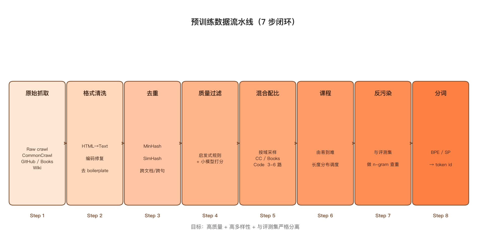
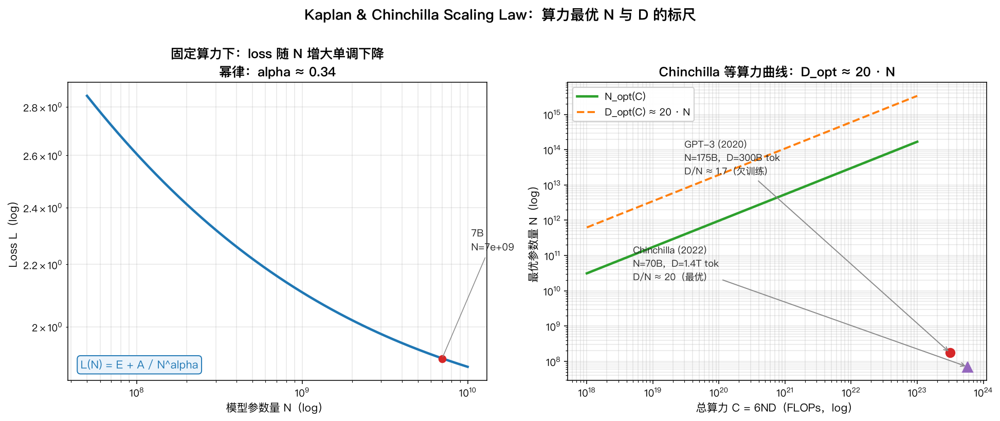
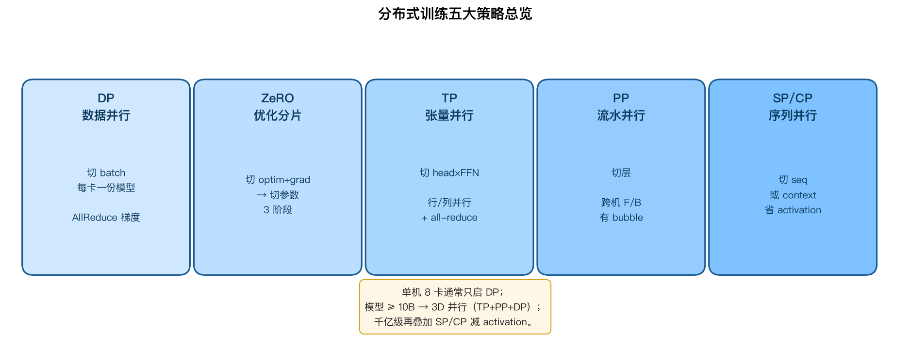

## 3. 预训练 Pre-Training

<details markdown="1">
<summary>📑 <strong>本章目录</strong>（点击展开）</summary>

- [3.0 本章导览](#30-本章导览)
- [3.1 训练目标：语言建模的数学基础](#31-训练目标语言建模的数学基础)
  - [3.1.1 语言模型的概率分解](#311-语言模型的概率分解)
  - [3.1.2 CLM：因果语言建模（Decoder-only 标配）](#312-clm因果语言建模decoder-only-标配)
  - [3.1.3 MLM：掩码语言建模（Encoder-only 标配）](#313-mlm掩码语言建模encoder-only-标配)
  - [3.1.4 困惑度 PPL：定义、直觉与局限](#314-困惑度-ppl定义直觉与局限)
  - [3.1.5 其他训练目标（了解即可）](#315-其他训练目标了解即可)
- [3.2 数据工程：决定模型上限的环节](#32-数据工程决定模型上限的环节)
  - [3.2.1 数据规模的演进](#321-数据规模的演进)
  - [3.2.2 数据流水线七步](#322-数据流水线七步)
  - [3.2.3 面试要点速记](#323-面试要点速记)
- [3.3 Scaling Law：参数、数据与算力怎么分](#33-scaling-law参数数据与算力怎么分)
  - [3.3.1 Kaplan 定律（OpenAI, 2020）](#331-kaplan-定律openai-2020)
  - [3.3.2 Chinchilla 修正（DeepMind, 2022）](#332-chinchilla-修正deepmind-2022)
  - [3.3.3 实际影响](#333-实际影响)
  - [3.3.4 第三个 scaling 维度：推理时算力](#334-第三个-scaling-维度推理时算力)
  - [3.3.5 Scaling Law 的局限与争议](#335-scaling-law-的局限与争议)
- [3.4 训练稳定性工程：让千卡训练不崩](#34-训练稳定性工程让千卡训练不崩)
  - [3.4.1 学习率调度：warmup + 余弦衰减](#341-学习率调度warmup--余弦衰减)
  - [3.4.2 优化器：为什么是 AdamW](#342-优化器为什么是-adamw)
  - [3.4.3 混合精度：bf16 为什么取代了 fp16](#343-混合精度bf16-为什么取代了-fp16)
  - [3.4.4 Loss Spike：现象、原因与处理](#344-loss-spike现象原因与处理)
  - [3.4.5 初始化：为什么大模型要用 scaled initialization](#345-初始化为什么大模型要用-scaled-initialization)
- [3.5 分布式并行：五件套与组合策略](#35-分布式并行五件套与组合策略)
  - [3.5.1 一张表说清五种并行](#351-一张表说清五种并行)
  - [3.5.2 数据并行（DP / DDP）](#352-数据并行dp--ddp)
  - [3.5.3 ZeRO：把冗余状态切掉](#353-zero把冗余状态切掉)
  - [3.5.4 张量并行（TP，Megatron-LM 的核心）](#354-张量并行tpmegatron-lm-的核心)
  - [3.5.5 流水线并行（PP）](#355-流水线并行pp)
  - [3.5.6 序列并行与上下文并行](#356-序列并行与上下文并行)
  - [3.5.7 三维并行组合：工业标准配方](#357-三维并行组合工业标准配方)
- [3.6 训练框架对比](#36-训练框架对比)
- [3.7 手算模板：显存、算力、时间与通信量](#37-手算模板显存算力时间与通信量)
  - [3.7.1 训练显存的四大部分](#371-训练显存的四大部分)
  - [3.7.2 训练算力与时间](#372-训练算力与时间)
  - [3.7.3 通信量速算](#373-通信量速算)
- [3.8 继续预训练与增量预训练](#38-继续预训练与增量预训练)
  - [3.8.1 什么是继续预训练](#381-什么是继续预训练)
  - [3.8.2 关键工程要点](#382-关键工程要点)
  - [3.8.3 风险与误区](#383-风险与误区)
  - [3.8.4 三种知识注入方式的成本对比](#384-三种知识注入方式的成本对比)
- [3.9 本章面试题与手算题](#39-本章面试题与手算题)
  - [3.9.1 概念题（12 问）](#391-概念题12-问)
  - [3.9.2 手算题（务必现场练一遍）](#392-手算题务必现场练一遍)
  - [3.9.3 三句话总结本章](#393-三句话总结本章)

</details>

### 3.0 本章导览

预训练是"用海量无标注文本，把世界知识压缩进参数"的过程，也是整个大模型产业链中**成本最高、门槛最高**的环节。本章按"目标 → 数据 → 规律 → 稳定性 → 工程 → 算账"六层展开：

| 层次 | 小节 | 要解决的问题 |
| --- | --- | --- |
| 目标层 | 3.1 | 语言建模的数学形式与评价指标 |
| 数据层 | 3.2 | 数据工程流水线——决定模型上限的环节 |
| 规律层 | 3.3 | Scaling Law：参数、数据、算力怎么分配 |
| 稳定层 | 3.4 | 学习率、混合精度、梯度裁剪等训练稳定性工程 |
| 工程层 | 3.5–3.6 | 分布式并行五件套与框架选型 |
| 算账层 | 3.7 | 显存、算力、通信量的手算模板 |
| 实战层 | 3.8–3.9 | 继续预训练、面试题与手算题 |

---

### 3.1 训练目标：语言建模的数学基础

#### 3.1.1 语言模型的概率分解

语言建模的本质是对一个词序列的联合概率建模。给定序列 x₁, x₂, …, xₙ，联合概率由链式法则分解：

$$
P(x_1, \dots, x_n) = \prod_{t=1}^{n} P(x_t \mid x_1, \dots, x_{t-1})
$$

神经语言模型用神经网络参数化每个条件概率：

$$
P(x_t \mid x_{<t}) = \text{softmax}(h_t W_{\text{head}})
$$

其中 h_t 是第 t 个位置的隐藏状态，W_head 是输出投影矩阵（词表大小 V × 隐藏维度 d）。

#### 3.1.2 CLM：因果语言建模（Decoder-only 标配）

训练目标是最大化整个序列的对数似然，等价于最小化交叉熵损失：

$$
\mathcal{L}_{\text{CLM}} = -\frac{1}{n}\sum_{t=1}^{n} \log P_\theta(x_t \mid x_{<t})
$$

**关键性质**：每个位置都产生监督信号。一个长度为 2048 的序列，一次前向就产生 2048 个训练样本——这是 Decoder-only 训练效率高的根本原因。

#### 3.1.3 MLM：掩码语言建模（Encoder-only 标配）

随机遮盖约 15% 的 token，让模型预测被遮盖的词：

$$
\mathcal{L}_{\text{MLM}} = -\frac{1}{|\mathcal{M}|}\sum_{t \in \mathcal{M}} \log P_\theta(x_t \mid x_{\setminus \mathcal{M}})
$$

其中 M 是被遮盖位置的集合。

**BERT 的 80/10/10 策略**（面试细节）：被选中的 15% 位置中：

- 80% 替换为 `[MASK]` 标记；
- 10% 替换为随机 token；
- 10% **保持不变**。

后两步的目的是缓解**预训练-微调不一致**：微调时输入中没有 `[MASK]`，如果预训练时模型只见过 `[MASK]`，就学会了"只要看到 MASK 就认真预测，其他位置随便糊弄"的惰性策略。

**三种目标的效率对比**：

| 目标 | 有效监督比例 | 适用范式 | 局限 |
| --- | --- | --- | --- |
| CLM | 100% | Decoder-only | 单向，看不到未来 |
| MLM | 约 15% | Encoder-only | 效率低，预训练/微调不一致 |
| Span Corruption（T5） | 约 15%（按 span 计） | Encoder-Decoder | 效率介于两者之间 |

#### 3.1.4 困惑度 PPL：定义、直觉与局限

**定义**：困惑度是交叉熵的指数形式。对分词后的序列（共 N 个 token）：

$$
\text{PPL} = \exp\left(-\frac{1}{N}\sum_{t=1}^{N} \log P_\theta(x_t \mid x_{<t})\right) = \exp(\mathcal{L})
$$

**直觉理解**：PPL 可以理解为"模型在每个位置上，相当于在多少个候选词之间做等概率的随机猜测"。PPL = 10 意味着模型的不确定度等价于在 10 个词里均匀瞎猜。

**必须知道的三个局限**（面试常问）：

1. **与分词器强耦合**：同一个模型、同一段文本，换一个分词器，PPL 数值完全不同。因此**跨分词器的 PPL 比较是无效的**。更公平的指标是 bits-per-character（BPC）或 bits-per-byte。
2. **不反映生成质量**：PPL 低不代表生成的内容有用、真实、无害。它只衡量"对下一个 token 的预测置信度"。
3. **对长尾和事实性不敏感**：模型对高频模式（"的"、"了"、固定搭配）预测极准，会稀释掉对关键事实词的预测误差。

#### 3.1.5 其他训练目标（了解即可）

| 目标 | 说明 | 代表 |
| --- | --- | --- |
| Prefix LM | 前缀部分双向、生成部分单向 | T5 部分配置、GLM |
| UL2 | 统一多种去噪任务（R-denoising、S-denoising、X-denoising） | UL2、PaLM 部分 |
| MTP 多 token 预测 | 一次预测未来 K 个 token，加密训练信号 | DeepSeek-V3、Qwen3-Next |
| 对比学习目标 | 用于句向量（SimCSE）等专用场景 | — |

---

### 3.2 数据工程：决定模型上限的环节

业内有句话："**模型架构是公开的，数据配方是保密的**。" 预训练的差距，八成在数据。

#### 3.2.1 数据规模的演进

| 模型 | 年份 | 训练 token 量 | 参数量 | token/参数比 |
| --- | --- | --- | --- | --- |
| GPT-1 | 2018 | 约 5B | 117M | 约 43 |
| GPT-2 | 2019 | 约 40B | 1.5B | 约 27 |
| GPT-3 | 2020 | 300B | 175B | 约 1.7 |
| LLaMA-1 | 2023 | 1.4T | 7B–65B | 20–200 |
| LLaMA-3 | 2024 | 15T+ | 8B–405B | 约 37 |
| Qwen3 | 2025 | 36T | 0.6B–235B | — |

**注意 GPT-3 这一行**：300B token / 175B 参数 ≈ 1.7，远低于 Chinchilla 建议的 20。**这就是 Chinchilla 论文批评的"欠训练"典型**——参数给足了，数据没喂够。

#### 3.2.2 数据流水线七步



**图：预训练数据处理流水线。每一步都会显著影响最终模型质量，其中去重与质量过滤的收益最大。**

**① 获取**：Common Crawl 网页快照、书籍、代码（GitHub）、论文（arXiv）、百科、多语言语料、合成数据。

**② 清洗**：
- 去除 HTML 标签、广告、导航栏、Cookie 提示等模板化噪声；
- 语言识别（fastText langid）过滤非目标语言；
- 去除乱码、过短文本、重复段落；
- 隐私与有害内容过滤（PII 脱敏）。

**③ 去重**（收益最大的步骤之一）：

| 层级 | 方法 | 说明 |
| --- | --- | --- |
| 精确去重 | 哈希（MD5/SHA） | 去除完全相同的文档 |
| 段落级去重 | 段落哈希 | 网页间大量共享的模板段落 |
| 模糊去重 | **MinHash + LSH** | 用最小哈希估计 Jaccard 相似度，局部敏感哈希加速检索 |
| 近似去重 | SimHash | 汉明距离近似余弦相似度 |

**为什么要去重？** 三重收益：① 省算力（不重复学习相同内容）；② 防记忆化（重复数据会被模型死记硬背，导致过拟合与隐私泄漏）；③ 提升泛化（重复数据会让模型高估某些模式的频率）。

**④ 质量过滤**：
- 启发式规则：长度、标点比例、字母/数字比例、困惑度阈值；
- 分类器打分：用高质量语料（如 Wikipedia、教科书）作为正样本训练 fastText/bert 分类器，对网页打分；
- 模型打分：用已有 LLM 对教育价值、事实密度打分，构造"精选子集"（如 Microsoft 的 Phi 系列、 textbooks are all you need 路线）。

**⑤ 配比（Mixture）**：网页、书籍、代码、数学、多语言按经验比例混合。业界共识：
- **代码数据对推理能力有迁移增益**（即使目标是自然语言任务）；
- **高质量子森可以上采样**（multi-epoch），低质量数据只过一遍；
- 配比需要小模型做消融实验确定（用 1B 模型试配比，再放大）。

**⑥ 课程学习（Curriculum）**：在训练末期提高高质量数据（教科书、数学、代码、长文本）的比例，让模型在"退火阶段"吸收最精华的知识。LLaMA-3 就明确采用了退火阶段上采样高质量数据的策略。

**⑦ 去污染（Decontamination）**：移除与评测集（MMLU、GSM8K、HumanEval 等）重叠的内容，否则评测分数虚高。常用方法是 n-gram 重叠检测。

#### 3.2.3 面试要点速记

- **数据质量 > 数据数量**：Phi、TinyStories 等研究表明，用"教科书级"数据训练的小模型可以在特定能力上超过用脏数据训练的大模型。
- **去重既是省算力，也是防记忆化**。
- **代码数据是推理能力的"补品"**。
- **数据配比没有理论最优解，只能靠小模型消融实验**。

---

### 3.3 Scaling Law：参数、数据与算力怎么分

#### 3.3.1 Kaplan 定律（OpenAI, 2020）

**核心发现**：测试损失随参数量 N、数据量 D、算力 C 呈**幂律下降**：

$$
L(N) = \left(\frac{N_c}{N}\right)^{\alpha_N}, \quad
L(D) = \left(\frac{D_c}{D}\right)^{\alpha_D}, \quad
L(C) = \left(\frac{C_c}{C}\right)^{\alpha_C}
$$

**三个结论**：

1. 损失与 N、D、C 分别是幂律关系，在双对数坐标上是直线；
2. 模型性能主要由规模决定，**架构细节影响很小**；
3. **给定算力预算，应优先把参数做大**（当时的结论）——大模型可以用更少的训练步数达到同等损失。

**局限**（当时未充分研究）：所有实验都在"固定训练步数、固定 batch、余弦调度到收敛"的设定下做，且**训练数据严重不足**（大模型只训练了很少的 token）。这导致参数的重要性被高估。

#### 3.3.2 Chinchilla 修正（DeepMind, 2022）

Chinchilla 用三种方法重新研究该问题，结论完全反转：

**方法一：固定算力，变模型规模**。训练 400 多个模型，从 70M 到 16B，每个都在给定的 9 个算力预算下训练到不同的 token 数，拟合出"给定算力下的最优参数量"曲线。

**方法二：IsoFLOP 曲线**。固定算力预算，扫模型规模，画出损失曲线，取每个预算下的最低点。

**方法三：拟合参数化损失模型**：

$$
L(N, D) = E + \frac{A}{N^{\alpha}} + \frac{B}{D^{\beta}}
$$

其中 E 是不可约损失（数据本身的熵），A/N^α 是参数受限项，B/D^β 是数据受限项。

**核心结论**：**参数量与数据量应等比放大**。具体地说，每增加 1 倍参数，应同时增加 1 倍训练 token。

**量化结论**：最优配比约为 **每个参数对应约 20 个训练 token**。

$$
D_{\text{opt}} \approx 20\,N
$$

**Chinchilla 模型的配置验证**：70B 参数 × 1.4T token ≈ 20 token/参数。结果：**Chinchilla（70B）全面超越 GPT-3（175B）**，尽管参数只有 40%。

**为什么会这样？** Kaplan 的实验中，大模型没有训练足够多的 token，处于严重的"欠训练"状态，因此看起来参数比数据更有效。Chinchilla 修正了这个实验设计缺陷。

#### 3.3.3 实际影响

| 影响 | 说明 |
| --- | --- |
| 小模型 + 大数据路线 | LLaMA 系列（7B/13B 训练 1T–2T token）就是这一路线的产物，推理成本低而效果好 |
| 推理成本被纳入考量 | 训练时多花算力换小模型，但推理时省下的钱更多——因为推理是持续成本 |
| "过训练"成为新常态 | 2024 年后的模型普遍训练 20–50 token/参数（如 Qwen、Gemma），远超 Chinchilla 的 20 |

**为什么现在又"超训练"了？** 因为 Chinchilla 最优是**训练算力最优**（compute-optimal），而不是**推理成本最优**。如果模型要被服务数十亿次推理，那么"多花训练算力把模型训得更小更好"是划算的。这就是所谓的 "over-trained" / "training-optimal for inference" 思路。

#### 3.3.4 第三个 scaling 维度：推理时算力

2024 年 o1、2025 年 R1 之后，业界公认存在**第三个可 scale 的维度**：推理时的思维链长度。

| 维度 | 含义 | 代表 |
| --- | --- | --- |
| 参数 scaling | 把模型做大 | GPT-3 → GPT-4 |
| 数据 scaling | 把数据变多 | Chinchilla → LLaMA-3 |
| 推理时 scaling | 让模型"想更久"（长 CoT + RL） | o1、DeepSeek-R1 |

**意义**：这是一个根本性的范式转变——过去"能力提升 = 训练更大模型"，现在"能力提升 = 训练时给好基础 + 推理时给更多算力"。RLVR（可验证奖励强化学习）是实现推理时 scaling 的核心技术手段（详见第 5 章）。

#### 3.3.5 Scaling Law 的局限与争议

- **不可外推到能力**：损失下降不等于能力涌现，某些能力（如多步推理）在损失平稳下降时突然出现（涌现现象，尽管该现象本身存在评测假象的争议）；
- **数据墙（Data Wall）**：高质量公开文本总量有限（估计几十 T token），继续放大数据会撞墙，因此合成数据与多模态数据成为新方向；
- **收益递减**：从 1B 到 10B 的提升远大于从 100B 到 1T，边际效益下降明显。



**图：Scaling Law 示意——左为损失随算力的幂律下降；右为 Chinchilla 的 IsoFLOP 曲线，每个算力预算下存在一个最优模型规模，其轨迹对应"参数与数据等比放大"。**

### 3.4 训练稳定性工程：让千卡训练不崩

大模型训练最昂贵的不是算力，而是**崩溃后的重训**。这一节讲让训练稳住的关键工程手段。

#### 3.4.1 学习率调度：warmup + 余弦衰减

$$
\eta_t = \eta_{\min} + \frac{1}{2}(\eta_{\max} - \eta_{\min})\left(1 + \cos\frac{t\pi}{T}\right) \quad (t > T_{\text{warmup}})
$$

warmup 阶段（通常前 1%–2% 步数，或 2000 步左右）从 0 线性升到峰值：

$$
\eta_t = \eta_{\max} \cdot \frac{t}{T_{\text{warmup}}} \quad (t \le T_{\text{warmup}})
$$

**为什么需要 warmup？** 训练初期，模型参数是随机初始化的，梯度方向极不稳定，且 Adam 的二阶动量估计 v 还没收敛（初期 v 偏小，导致更新步幅被放大）。直接用大学习率会让参数"跳飞"，损失发散。warmup 让模型先在小学习率下"稳住阵脚"。

**为什么用余弦衰减？** 训练末期需要精细收敛，余弦曲线在后期下降缓慢，给模型充分的"退火"时间。实践中余弦衰减的最终学习率通常设为峰值的 10%（而非 0），保留一点探索能力。

#### 3.4.2 优化器：为什么是 AdamW

AdamW 的更新规则（解耦权重衰减）：

$$
m_t = \beta_1 m_{t-1} + (1-\beta_1) g_t
$$

$$
v_t = \beta_2 v_{t-1} + (1-\beta_2) g_t^2
$$

$$
\theta_t = \theta_{t-1} - \eta \cdot \frac{\hat{m}_t}{\sqrt{\hat{v}_t} + \epsilon} - \eta\lambda\theta_{t-1}
$$

其中 `m_t = m_t/(1-β_1ᵗ)`、`v_t = v_t/(1-β_2ᵗ)` 是偏差修正项。

**与 Adam 的关键区别**：AdamW 把权重衰减 λθ 作为**独立的加性项**，而不是加在梯度上（Adam 的 L2 正则会被自适应学习率缩放，导致衰减强度不均）。

**大模型常用超参**：

| 超参 | 典型取值 | 说明 |
| --- | --- | --- |
| β₁ | 0.9 | 一阶动量 |
| β₂ | **0.95**（大模型）或 0.999 | 二阶动量；大模型常用 0.95 以加快对梯度变化的响应 |
| ε | 1e-8 | 数值稳定项 |
| weight decay | 0.1 | 通常**不对 bias 和 LayerNorm 参数施加** |
| 峰值学习率 | 1e-4（小模型）→ 1e-5（大模型） | 参数越大、batch 越大，学习率越小 |
| 梯度裁剪 | 1.0 | 按全局梯度范数裁剪 |

#### 3.4.3 混合精度：bf16 为什么取代了 fp16

| 精度 | 指数位 | 尾数位 | 动态范围 | 特点 |
| --- | --- | --- | --- | --- |
| FP32 | 8 | 23 | 约 1e-38–3e38 | 精确，慢 |
| FP16 | 5 | 10 | 约 6e-5–65504 | 范围窄，易溢出/下溢 |
| BF16 | 8 | 7 | 约 1e-38–3e38 | **范围与 FP32 相同，精度略低** |

**BF16 胜出的原因**：它的指数位数与 FP32 相同，**动态范围一致**，因此**不需要 loss scaling**（FP16 必须配合动态 loss scaling 处理梯度下溢），训练稳定性大幅提升。虽然尾数只有 7 位（精度低），但对神经网络足够了。

**混合精度的标准配置**（AMP）：

- **主权重**：FP32（4 字节/参数），优化器更新在这个副本上进行；
- **前向/反向计算**：BF16（2 字节/参数）；
- **梯度**：BF16 存储，累加时可转 FP32；
- **优化器状态**：FP32（m 和 v 各 4 字节/参数）。

#### 3.4.4 Loss Spike：现象、原因与处理

**现象**：训练中途损失突然飙升（例如从 1.8 跳到 3.5），然后可能恢复，也可能永久损坏模型。

**常见原因**：

1. **数据噪声**：某个 batch 包含极端异常样本（超长重复文本、编码错乱的页面）；
2. **数值问题**：BF16 下的累加误差、极端激活值；
3. **长序列阶段**：切换到更长上下文训练时，注意力分布变化剧烈；
4. **MoE 路由失衡**：专家负载突然失衡。

**处理手段**：

| 手段 | 做法 |
| --- | --- |
| 梯度裁剪 | 防止单步更新过大（第一道防线） |
| 跳过异常步 | 检测到损失突增时跳过该步更新 |
| 检查点回滚 | 回退到最近的检查点，跳过问题数据后继续 |
| Z-loss / QK-Norm | 从结构上约束 logits 幅值（预防） |
| 数据过滤加强 | 剔除引发尖峰的样本 |

**预防优于治疗**：PaLM 等模型的报告显示，通过在关键位置加归一化（如 QK-Norm）、使用合适的初始化，可以几乎消除 loss spike。

#### 3.4.5 初始化：为什么大模型要用 scaled initialization

标准初始化（如正态分布，标准差与 1/√d 成正比）会导致残差分支的输出方差**随层数累积**：第 L 层的输出方差约为输入方差的 L 倍，深层网络难以训练。

GPT-2 的做法是按层数缩放残差分支的初始化标准差：

$$
\sigma_{\text{residual}} = \frac{\sigma_0}{\sqrt{2L}}
$$

这样 L 层累积后的方差保持在合理量级。现代框架普遍内置这一策略（如 `scaled_init_method`）。

---

### 3.5 分布式并行：五件套与组合策略

当模型超过单卡显存，或需要加速训练时，就必须并行。五种策略切的东西各不相同。

#### 3.5.1 一张表说清五种并行

| 策略 | 切什么 | 解决什么问题 | 通信内容 | 主要代价 |
| --- | --- | --- | --- | --- |
| 数据并行 DP/DDP | batch 维度 | 提升吞吐 | 梯度 all-reduce | 每卡存全模型 |
| ZeRO 1/2/3 | 优化器状态/梯度/参数 | 省显存 | 参数或梯度 gather | 通信量随阶段增加 |
| 张量并行 TP | 单层内的矩阵 | 单层放不下、加速 | 激活 all-reduce | 通信频繁，限机内 |
| 流水线并行 PP | 层（纵向） | 模型太深放不下 | 激活边界（点对点） | 气泡（bubble） |
| 专家并行 EP | MoE 专家 | 专家参数分布 | all-to-all | 通信不均衡 |
| 序列/上下文并行 SP/CP | 序列维度 | 超长上下文 | 环形 KV 传递 | 实现复杂 |

#### 3.5.2 数据并行（DP / DDP）

**机制**：每张卡持有完整模型副本，处理不同的数据分片，各自算梯度，然后用 **all-reduce** 求平均，保证各卡参数同步。

**通信量**（Ring All-Reduce，Ψ 为参数量）：

$$
\text{Comm} = 2\Psi \cdot \frac{N-1}{N} \approx 2\Psi
$$

**显存**：每卡都要存完整模型、梯度、优化器状态 → **16Ψ 字节**（混合精度），这是它最大的问题。

**优化**：梯度累积（多个 micro-batch 累积后再 all-reduce）、通信与计算重叠（backward 时边算边传）。

#### 3.5.3 ZeRO：把冗余状态切掉

**核心洞察**：数据并行中，每张卡都存了**完全相同**的优化器状态、梯度和参数——这是巨大的冗余。ZeRO 把它们切分到各卡，需要时再通信获取。

**三个阶段与显存公式**（Ψ 为参数量，N 为卡数，混合精度）：

| 阶段 | 切分内容 | 每卡显存（不含激活） | 通信量 |
| --- | --- | --- | --- |
| 基线 DP | 无 | 16Ψ | 2Ψ |
| ZeRO-1 | 优化器状态 | 4Ψ + 12Ψ/N | 2Ψ |
| ZeRO-2 | 优化器状态 + 梯度 | 2Ψ + 14Ψ/N | 2Ψ |
| ZeRO-3 | 再加参数 | 16Ψ/N | 3Ψ |

**实例**：7B 模型（Ψ = 7×10⁹），单卡需 112GB；用 ZeRO-3 在 8 卡上，每卡只需 14GB（再加激活值）。

**代价**：ZeRO-3 需要在前向/反向时按需 gather 参数，通信量从 2Ψ 增至 3Ψ。因此**能用 ZeRO-2 就不用 ZeRO-3**，只有当 ZeRO-2 仍放不下时才上 ZeRO-3（或配合 offload 到 CPU/NVMe）。

**ZeRO-Offload / Infinity**：把优化器状态甚至参数卸载到 CPU 内存或 NVMe SSD，用带宽换显存。适合单卡/少卡微调大模型的场景。

#### 3.5.4 张量并行（TP，Megatron-LM 的核心）

**机制**：把单层的大矩阵乘法按**列或行**切开，分到多张卡上并行计算。

以 FFN 为例（Y = GeLU(XA)·B）：

1. **列切（Column Parallel）**：把 A 按列切成 [A₁, A₂]，两卡分别算 Y₁ = GeLU(XA₁)、Y₂ = GeLU(XA₂)；
2. **行切（Row Parallel）**：把 B 按行切成 [B₁; B₂]，两卡分别算 Z₁ = Y₁B₁、Z₂ = Y₂B₂；
3. **All-Reduce**：Z = Z₁ + Z₂。

注意力层同理：W_Q、W_K、W_V 列切，W_O 行切。

**通信量**：每层前向需要 1 次 all-reduce（FFN）+ 1 次（注意力），反向各 1 次，共 4 次。单次传输量为 batch × seq × hidden × 2 字节。

**硬性限制**：通信极其频繁，**必须跑在机内 NVLink 上**（带宽 600GB/s+），跨机用 IB 网络会慢到不可用。因此 **TP 度数通常 ≤ 8（单机内 GPU 数）**。

#### 3.5.5 流水线并行（PP）

**机制**：把 L 层切成 p 个 stage，每个 stage 放在不同设备上。为填满流水线，把一个 batch 拆成 m 个 micro-batch 依次流入。

**气泡（Bubble）问题**：流水线的启动和排空阶段存在空闲时间。气泡占比：

$$
\text{Bubble Ratio} = \frac{p - 1}{m}
$$

其中 p 为流水级数，m 为 micro-batch 数。**降低气泡的方法就是增大 m**（即增大全局 batch size）。

**1F1B 调度**（One Forward One Backward）：先做 m 次前向填满流水线，然后每次做 1 个前向 + 1 个反向，把显存占用从 O(m) 降到 O(p)，是 Megatron 的标准调度。

**通信量**：只传 stage 边界的激活值，量很小，因此 **PP 适合跨机**（通信压力小）。

#### 3.5.6 序列并行与上下文并行

**序列并行（SP，Megatron）**：TP 只对注意力和 FFN 的矩阵做切分，而 LayerNorm、Dropout 的激活仍是完整复制的。SP 把这些部分按**序列维度**切开，进一步省显存。通常与 TP 绑定使用。

**上下文并行 / Ring Attention**：把超长序列切分到多卡，每张卡只算局部注意力，通过**环形通信**传递 KV 块，累加结果。可以让上下文长度几乎无限扩展（受限于 GPU 数量）。

#### 3.5.7 三维并行组合：工业标准配方

Megatron-LM 的经典组合（**记住这个层级关系**）：

```
机内（NVLink 高带宽）   → 张量并行 TP（+ 序列并行 SP）
机间（IB 网络，通信少） → 流水线并行 PP
最外层                 → 数据并行 DP（+ ZeRO）
MoE 模型额外加         → 专家并行 EP
```

**选型经验（可直接背诵）**：

| 场景 | 推荐配置 |
| --- | --- |
| 7B 模型，8 卡单机 | ZeRO-2/3 或 TP=2/4 + DP |
| 70B 模型，8 卡单机 | TP=8 + PP=1（机内）或 ZeRO-3 + Offload |
| 70B 模型，64 卡（8 机） | TP=8（机内）+ PP=2（机间）+ DP=4 |
| 千亿级，数百卡 | TP=8 + PP=8 + DP=N，配合 ZeRO-1 省优化器状态 |
| MoE 千亿级 | 上述 + EP，专家分布在机间 |



**图：五种并行策略的切分视角。DP 切数据、TP 切矩阵、PP 切层、ZeRO 切状态、SP/CP 切序列，实际训练中是多种策略的组合。**

---

### 3.6 训练框架对比

| 框架 | 出品方 | 核心优势 | 适用场景 |
| --- | --- | --- | --- |
| **Megatron-LM** | NVIDIA | TP/PP/SP 的工业标杆，MFU 最高 | 大规模预训练，追求极致性能 |
| **DeepSpeed** | Microsoft | ZeRO 系列独创，Offload 完善，易用 | 显存受限场景，快速上手 |
| **FSDP** | PyTorch 官方 | 原生集成，类 ZeRO-3 分片 | PyTorch 生态内首选 |
| **Accelerate / Trainer** | HuggingFace | 极简 API，屏蔽设备差异 | 微调、学术研究 |
| **LLaMA-Factory** | 社区 | 中文友好，WebUI，多方法一站式 | 国内微调首选 |
| **Unsloth** | 社区 | 单卡训练提速 2–5 倍，显存大降 | 资源受限的 LoRA/QLoRA 微调 |
| **Colossal-AI / internLM** | 社区 | 多维并行与国产适配 | 国产硬件与特定场景 |

**选型建议**：
- 预训练（百亿以上）：Megatron-LM 或 DeepSpeed + Megatron 混合（Megatron-DeepSpeed）；
- 微调（70B 以下）：FSDP + PEFT，或 LLaMA-Factory；
- 单卡微调：Unsloth + QLoRA。

### 3.7 手算模板：显存、算力、时间与通信量

这一节给出可以直接在白板上使用的完整计算模板。

#### 3.7.1 训练显存的四大部分

$$
\text{总显存} = \text{模型状态} + \text{激活值} + \text{临时缓冲} + \text{显存碎片}
$$

**① 模型状态**（混合精度 AdamW，Ψ 为参数量）：

| 项目 | 字节/参数 |
| --- | --- |
| BF16 参数（前向用） | 2 |
| BF16 梯度 | 2 |
| FP32 主权重 | 4 |
| Adam 一阶动量 m | 4 |
| Adam 二阶动量 v | 4 |
| **合计** | **16** |

> 注：若框架额外保留 FP32 梯度副本，则为 20 字节/参数。面试时说明假设即可。

**② 激活值**（与 batch、序列长度、是否重计算强相关）

Megatron 论文给出的经典公式（无重计算，混合精度）：

$$
\text{Activation per layer} \approx s \cdot b \cdot h \cdot \left(34 + \frac{5 \cdot a \cdot s}{h}\right) \ \text{bytes}
$$

其中 s = 序列长度，b = micro-batch size，h = 隐藏维度，a = 注意力头数。

**三项重计算策略的对比**：

| 策略 | 保存内容 | 激活显存 | 额外计算 |
| --- | --- | --- | --- |
| 不重计算 | 所有中间激活 | 100%（基准） | 0 |
| 选择性重计算 | 只重算注意力部分 | 约 40% | 约 5% |
| 完全重计算 | 只存每层输入 | 约 2·s·b·h·L | 约 33% |

**实战计算示例**：7B 模型（L=32, h=4096, a=32），序列 2048，micro-batch 8。

激活显存（无重计算）：

$$
2048 \times 8 \times 4096 \times \left(34 + \frac{5 \times 32 \times 2048}{4096}\right) \times 32 \text{ layers}
$$

先算括号内：34 + 5×32×2048/4096 = 34 + 80 = 114

$$
2048 \times 8 \times 4096 \times 114 \times 32 \approx 2.45 \times 10^{11} \text{ bytes} \approx 228 \text{ GB}
$$

**激活显存（228GB）远超模型状态（112GB）**——这就是为什么大模型训练必须开重计算。启用完全重计算后可降到约 8GB。

**③ 临时缓冲与碎片**：通常按 10%–20% 预留。

#### 3.7.2 训练算力与时间

**6ND 法则**（前向 2ND + 反向 4ND）：

$$
C \approx 6 N D
$$

**MFU（Model FLOPs Utilization）**：实际算力利用率 = 实际达成的 FLOPS / 硬件峰值 FLOPS。业界优秀水平：

| 规模 | 典型 MFU |
| --- | --- |
| 小模型、配置不当 | 20%–30% |
| 配置良好的大模型训练 | 40%–50% |
| 极致优化（Megatron + FP8） | 55%–60% |

**训练时间**：

$$
T = \frac{6ND}{\text{PeakFLOPS} \times \text{MFU} \times N_{\text{GPU}}}
$$

**完整算例**：用 1024 张 H100（BF16 峰值 989 TFLOPS，MFU 取 45%）训练 70B 模型，数据 2T token。

$$
C = 6 \times 70 \times 10^9 \times 2 \times 10^{12} = 8.4 \times 10^{23} \text{ FLOPs}
$$

$$
T = \frac{8.4 \times 10^{23}}{9.89 \times 10^{14} \times 0.45 \times 1024} \approx 1.85 \times 10^6 \text{ 秒} \approx 21.4 \text{ 天}
$$

**这就是"大模型预训练需要上千卡跑数周"的量化来源**，面试现场能算到这个程度非常加分。

#### 3.7.3 通信量速算

| 并行方式 | 每步通信量（Ψ = 参数量，N = 卡数） |
| --- | --- |
| DDP / ZeRO-1 / ZeRO-2 | 约 2Ψ |
| ZeRO-3 | 约 3Ψ |
| TP | 约 4 × b × s × h × 2 bytes × L（每层 4 次 all-reduce） |
| PP | b × s × h × 2 bytes（每边界一次点对点） |

**关键判断**：训练是否会被通信拖慢，取决于 **计算时间 / 通信时间** 的比值。TP 的计算粒度小、通信频繁，所以只能机内；PP 通信量小，所以适合跨机。

---

### 3.8 继续预训练与增量预训练

#### 3.8.1 什么是继续预训练

在已有基座模型（如 Qwen2.5-7B）上，用**领域语料**继续做 CLM 训练，让模型吸收领域知识，再进行 SFT。

**典型场景**：法律、医疗、金融、代码、企业内部文档等垂直领域。

#### 3.8.2 关键工程要点

| 要点 | 建议 |
| --- | --- |
| **数据配比** | 领域数据 20%–50%，其余混入通用数据回放。纯领域数据会导致通用能力崩塌 |
| **数据量** | 通常需要 1B–10B token 量级才能产生明显的领域能力提升 |
| **学习率** | 峰值取预训练的 10%–20%（如预训练 3e-4，则这里用 3e-5），仍配 warmup + 余弦衰减 |
| **训练轮数** | 通常 1–2 个 epoch，避免过拟合 |
| **Tokenizer** | 若领域术语特殊（如医学缩写、专业符号），可扩展词表，但需重新训练新词的嵌入 |
| **必测项** | 训练后必须回归测试通用能力（MMLU、C-Eval 等），确认未崩塌 |

#### 3.8.3 风险与误区

- **灾难性遗忘**：见 4.6 节；
- **"知识注入"的期望管理**：继续预训练能让模型熟悉领域的**语言分布和表达习惯**，但难以精确注入大量事实——**事实性知识更应该用 RAG**（见 4.7 的选型决策）；
- **成本认知**：继续预训练的成本远高于 SFT 和 RAG，只有在"领域语言分布差异极大"（如古文、代码、小语种）时才真正必要。

#### 3.8.4 三种知识注入方式的成本对比

| 方式 | 成本 | 知识可更新 | 适合的知识类型 |
| --- | --- | --- | --- |
| 继续预训练 | 最高 | 差（需重训） | 领域语言分布、术语体系 |
| SFT 微调 | 中 | 差 | 任务格式、风格、能力 |
| RAG | 低 | 好（换文档即可） | 事实、政策、产品信息等易变知识 |

---

### 3.9 本章面试题与手算题

#### 3.9.1 概念题（12 问）

| # | 问题 | 核心答案 |
| --- | --- | --- |
| 1 | CLM 和 MLM 的区别？ | CLM 预测下一个 token，100% 位置有监督；MLM 遮盖 15%，只有 15% 有监督 |
| 2 | BERT 的 80/10/10 策略是什么，为什么？ | 15% 中 80% 换 MASK、10% 换随机词、10% 不变；缓解预训练-微调不一致 |
| 3 | PPL 是什么，有什么局限？ | 交叉熵的指数；与分词器强耦合、不反映生成质量、对长尾不敏感 |
| 4 | 数据流水线有哪些步骤？ | 获取 → 清洗 → 去重 → 质量过滤 → 配比 → 课程学习 → 去污染 |
| 5 | 为什么要去重？ | 省算力、防记忆化、提升泛化 |
| 6 | Kapkan 与 Chinchilla 的结论差异？ | Kaplan：优先放大参数；Chinchilla：参数与数据等比放大，约 20 token/参数 |
| 7 | 为什么现在很多模型"超训练"？ | Chinchilla 是训练算力最优；考虑推理成本后，训练更久换更小的模型更划算 |
| 8 | 第三个 scaling 维度是什么？ | 推理时算力（长思维链 + RL），代表为 o1 / R1 |
| 9 | 为什么需要 warmup？ | 初期梯度不稳定、Adam 二阶动量未收敛，大学习率会让参数跳飞 |
| 10 | BF16 相对 FP16 的优势？ | 指数位与 FP32 相同，动态范围一致，不需要 loss scaling，更稳定 |
| 11 | ZeRO-1/2/3 各切什么？ | 1 切优化器状态、2 再切梯度、3 再切参数；显存 16Ψ/N，通信量 3Ψ |
| 12 | TP 为什么只能机内？ | 通信极频繁（每层 4 次 all-reduce），必须依赖 NVLink 高带宽 |

#### 3.9.2 手算题（务必现场练一遍）

**题 1**：7B 模型，混合精度训练，模型状态占多少显存？若用 8 卡 ZeRO-3 呢？
> 答案：16 × 7B = 112 GB；ZeRO-3 下每卡 112/8 = 14 GB（不含激活）。

**题 2**：训练一个 13B 模型，数据 1T token，用 512 张 A100（312 TFLOPS 峰值，MFU 40%），需要多少天？
> 答案：C = 6 × 13e9 × 1e12 = 7.8e22 FLOPs；有效算力 = 312e12 × 0.4 × 512 = 6.39e16 FLOP/s；T = 7.8e22 / 6.39e16 ≈ 1.22e6 秒 ≈ 14.1 天。

**题 3**：70B 模型推理，BF16 权重占多少显存？INT4 量化后呢？
> 答案：70 × 2 = 140 GB；INT4 为 70 × 0.5 = 35 GB。

**题 4**：某模型 L=40、h=8192、a=64，序列 8192、micro-batch 1，估算单层激活显存（无重计算）。
> 答案：s·b·h·(34 + 5as/h) = 8192×1×8192×(34 + 5×64×8192/8192) = 8192×8192×354 ≈ 2.38e10 bytes ≈ 23.8 GB/层。40 层共约 950 GB —— 说明长上下文训练**必须**开重计算或序列并行。

#### 3.9.3 三句话总结本章

1. **预训练的本质是把数据压缩进参数**，因此数据工程（去重、过滤、配比）比架构细节更能决定模型上限；
2. **Scaling Law 给出了资源分配的定量法则**：参数与数据等比放大，约 20 token/参数；推理时算力是第三个可 scale 的维度；
3. **并行策略的选择本质是通信与显存的权衡**：机内用 TP（带宽高、通信密），机间用 PP（通信少），外层用 DP/ZeRO（省显存）。
