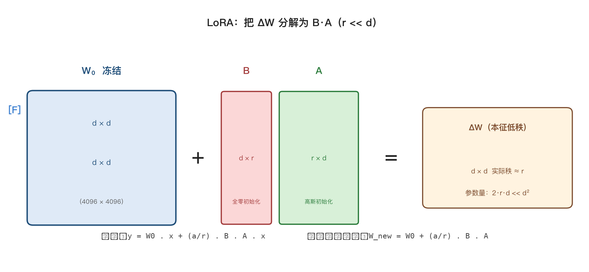
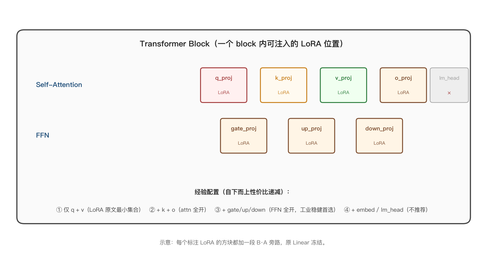
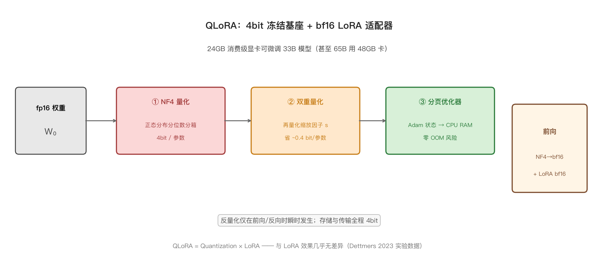
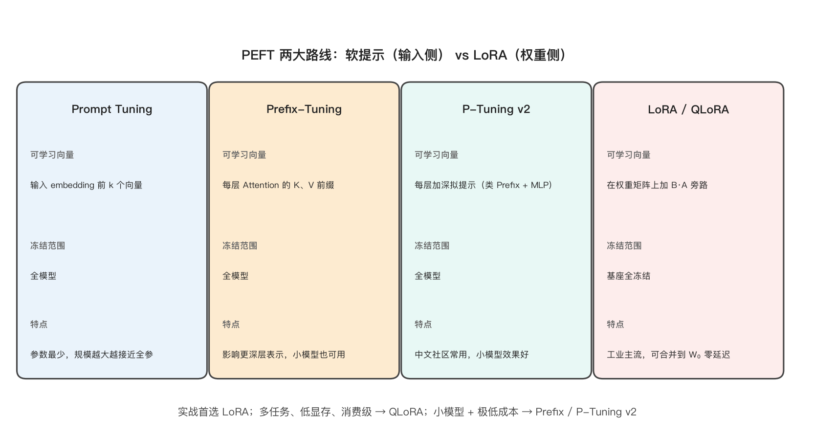

## 4. 微调与参数高效微调（PEFT）

<details markdown="1">
<summary>📑 <strong>本章目录</strong>（点击展开）</summary>

- [4.0 本章知识地图](#40-本章知识地图)
- [4.1 全参微调的三大问题](#41-全参微调的三大问题)
  - [问题 ① 显存爆炸（16 字节 / 参数）](#问题--显存爆炸16-字节--参数)
  - [问题 ② 灾难性遗忘（Catastrophic Forgetting）](#问题--灾难性遗忘catastrophic-forgetting)
  - [问题 ③ 多任务存储成本](#问题--多任务存储成本)
  - [解决方向](#解决方向)
- [4.2 SFT 监督微调](#42-sft-监督微调)
  - [4.2.1 数据格式：多轮对话 JSON](#421-数据格式多轮对话-json)
  - [4.2.2 训练要点（面试高频，必背）](#422-训练要点面试高频必背)
  - [4.2.3 SFT 与继续预训练的区别](#423-sft-与继续预训练的区别)
- [4.3 LoRA（Low-Rank Adaptation，必考中的必考）](#43-loralow-rank-adaptation必考中的必考)
  - [4.3.1 动机：权重更新的"本征维度"假说](#431-动机权重更新的本征维度假说)
  - [4.3.2 数学与初始化](#432-数学与初始化)
  - [4.3.3 参数量从 d² 降到 2·r·d](#433-参数量从-d-降到-2rd)
  - [4.3.4 推理集成（无额外延迟）](#434-推理集成无额外延迟)
  - [4.3.5 关键超参表](#435-关键超参表)
  - [4.3.6 适配位置的选择](#436-适配位置的选择)
  - [4.3.7 LoRA 变体族谱（高频加分项）](#437-lora-变体族谱高频加分项)
  - [4.3.8 最小可运行代码（手撕必会）](#438-最小可运行代码手撕必会)
  - [4.3.9 LoRA 的 3 个常被追问的点](#439-lora-的-3-个常被追问的点)
- [4.4 QLoRA：单卡微调 65B 的工程奇迹](#44-qlora单卡微调-65b-的工程奇迹)
  - [4.4.1 三大组件](#441-三大组件)
  - [4.4.2 显存公式](#442-显存公式)
  - [4.4.3 与 LoRA 的本质区别](#443-与-lora-的本质区别)
  - [4.4.4 工程实操要点](#444-工程实操要点)
- [4.5 软提示家族（Prompt / Prefix / P-Tuning v2）](#45-软提示家族prompt--prefix--p-tuning-v2)
  - [4.5.1 三种思路对比](#451-三种思路对比)
  - [4.5.2 Prompt Tuning](#452-prompt-tuning)
  - [4.5.3 Prefix-Tuning](#453-prefix-tuning)
  - [4.5.4 P-Tuning v2](#454-p-tuning-v2)
  - [4.5.5 与 LoRA 的工程取舍](#455-与-lora-的工程取舍)
- [4.6 灾难性遗忘：原因与缓解](#46-灾难性遗忘原因与缓解)
  - [4.6.1 现象与机理](#461-现象与机理)
  - [4.6.2 量化诊断](#462-量化诊断)
  - [4.6.3 缓解策略](#463-缓解策略)
  - [4.6.4 LoRA 为何天然抗遗忘](#464-lora-为何天然抗遗忘)
- [4.7 微调 vs RAG vs Prompt vs 长上下文（选型决策）](#47-微调-vs-rag-vs-prompt-vs-长上下文选型决策)
  - [4.7.1 四方案对比表（面试按表回答）](#471-四方案对比表面试按表回答)
  - [4.7.2 决策路径（面试话术）](#472-决策路径面试话术)
  - [4.7.3 实战常见组合](#473-实战常见组合)
- [4.8 主流框架对比](#48-主流框架对比)
  - [4.8.1 一张选型表](#481-一张选型表)
  - [4.8.2 选型决策树](#482-选型决策树)
  - [4.8.3 训练监控](#483-训练监控)
- [4.9 手算模板（面试碰到就让算）](#49-手算模板面试碰到就让算)
  - [4.9.1 LoRA 参数量](#491-lora-参数量)
  - [4.9.2 QLoRA 单卡可行性](#492-qlora-单卡可行性)
  - [4.9.3 LoRA 推理无延迟证明](#493-lora-推理无延迟证明)
  - [4.9.4 多任务 LoRA 服务显存账](#494-多任务-lora-服务显存账)
  - [4.9.5 LoRA 训练显存组成](#495-lora-训练显存组成)
- [4.10 面试题与工程经验（20 选 10 高频）](#410-面试题与工程经验20-选-10-高频)
  - [概念类（必背）](#概念类必背)
  - [工程类（动手）](#工程类动手)
- [4.11 三句话总结与延伸阅读](#411-三句话总结与延伸阅读)

</details>

### 4.0 本章知识地图

| 节号 | 主题 | 面试权重 |
|---|---|---|
| 4.1 | 全参微调的三大问题 | ★★ |
| 4.2 | SFT 监督微调（数据 / 训练） | ★★★ |
| 4.3 | LoRA（动机 / 数学 / 工程） | ★★★★★（最高） |
| 4.4 | QLoRA（NF4 / 双量化 / 分页） | ★★★★ |
| 4.5 | 软提示家族（Prompt / Prefix / P-Tuning v2） | ★★★ |
| 4.6 | 灾难性遗忘（机理 / 缓解） | ★★ |
| 4.7 | 微调 vs RAG vs Prompt vs 长上下文 | ★★★★ |
| 4.8 | 主流框架对比（HF PEFT / LLaMA-Factory / Unsloth / MS-Swift） | ★★ |
| 4.9 | 手算模板（LoRA 参数量、QLoRA 显存） | ★★★ |
| 4.10 | 面试题与工程经验 | ★★★★★ |

> **本章主线问题**：7B 全参微调需要多少显存？为什么 LoRA 只调 0.6% 参数就能逼近全参效果？单卡 24GB 怎么微调 65B？灾难性遗忘怎么压？RAG 与微调怎么选？

### 4.1 全参微调的三大问题

把基座 LLM 的全部参数在下游数据上继续训练，称为 **Full-parameter Fine-Tuning（全参微调）**。这条路看起来"最干净"，却有三个工程上几乎不可调和的问题，催生了整个 PEFT 方向。

#### 问题 ① 显存爆炸（16 字节 / 参数）

回顾第 3 章的混合精度训练内存构成：

$$
\text{Mem}_{\text{Adam 混合精度}} \;\approx\; \underbrace{2}_{\text{权重 fp16}} \;+\; \underbrace{2}_{\text{梯度 fp16}} \;+\; \underbrace{4}_{\text{fp32 主权重}} \;+\; \underbrace{4}_{\text{Adam 一阶矩}} \;+\; \underbrace{4}_{\text{Adam 二阶矩}} \;=\; 16\,\text{B/参数}
$$

对 $N$ 个参数的模型，全参训练总内存近似为 $16N$ 字节（外加激活与缓存）。

- **7B 全参微调** ≈ 7 × 16 = **112 GB**，单卡（80GB A100）装不下，需至少 2 张卡 + 模型并行；
- **70B 全参微调** ≈ 70 × 16 = **1120 GB ≈ 1.1 TB**，八卡 H100 也只能勉强分片（ZeRO-3 或 TP）。

| 模型 | 16B/参数内存 | 单卡能否放 |
|---|---|---|
| 7B | 112 GB | 80GB A100 ❌ |
| 13B | 208 GB | 80GB A100 ❌ |
| 70B | 1120 GB | 多卡必并行 |
| 405B | 6480 GB | 至少 64 张 H100 |

#### 问题 ② 灾难性遗忘（Catastrophic Forgetting）

- **机理**：新任务梯度覆盖旧任务决策边界；基座原本会写代码 / 翻译 / 解数学题，被下游数据洗一遍后这些能力大幅退化。
- **典型症状**：领域内指标（MMLU 子集）涨 5%，但通用能力（MMLU 整体、GSM8K、HumanEval）跌 10–20%。

#### 问题 ③ 多任务存储成本

- 每来一个下游任务就存一份完整模型权重（7B × 2B = 14GB / 任务），10 个任务就 140GB——既占盘又难做热切换（在线服务多模型）。

#### 解决方向

| 方案 | 核心思路 | 代表 |
|---|---|---|
| **PEFT**（主流） | 冻结大部分原参数，只训少量新参数 | LoRA / Prefix / Adapter |
| **分布式并行** | 把内存压力分摊到多卡 | ZeRO / TP / PP |
| **量化训练** | 把基座权重量化到 4bit 再训 | QLoRA |
| **解耦推理** | 不改模型，推理时外挂知识 | RAG（见第 8 章） |

PEFT 是工程性价比最高的一条：把"调整权重分布"与"重训整个模型"解耦。

### 4.2 SFT 监督微调

**Supervised Fine-Tuning (SFT)** 是把基座"预训练模型"变成"对话模型"的标准第一步。本节用一张图说清数据格式与损失计算。

#### 4.2.1 数据格式：多轮对话 JSON

业界主流用 ChatML 或 ShareGPT 风格，结构清晰、易于扩展：

```
[
  {
    "messages": [
      {"role": "system",    "content": "你是一位严谨的助手。"},
      {"role": "user",      "content": "什么是 Chinchilla？"},
      {"role": "assistant", "content": "Chinchilla 是 DeepMind 2022 年的 ..."},
      {"role": "user",      "content": "它的核心结论？"},
      {"role": "assistant", "content": "在固定算力下，模型参数量 N 与数据量 D ..."}
    ]
  },
  ...
]
```

字段说明：

| 字段 | 用途 |
|---|---|
| `system` | 全局人设 / 风格约束（也可不要） |
| `user` | 用户输入（含 prompt / 上下文 / 工具调用） |
| `assistant` | 期望模型输出的目标 |
| `tool` | 工具调用返回（Agent 训练时） |

#### 4.2.2 训练要点（面试高频，必背）

1. **只对 assistant 部分算损失**：prompt 部分 token 设为 `-100`（PyTorch 忽略索引），避免模型学"模仿提问"。

$$
\mathcal{L}_{\text{SFT}} \;=\; -\frac{1}{|M|}\sum_{t \in M} \log p_\theta(y_t \mid y_{<t},\, x)
$$

其中 $M$ 是 assistant token 的索引集合（prompt 部分不在内），$|M|$ 是其大小。

```
labels = input_ids.clone()
labels[:prompt_len] = -100
loss = CrossEntropyLoss()(logits.view(-1, V), labels.view(-1))
```

2. **数据质量 > 数量**：LIMA 论文（2023）证明——**1000 条精挑细选的数据** 微调 LLaMA-65B 可以超越 10 万噪声数据；微软 phi 系列同样贯彻"教科书级数据"路线。

3. **学习率小**（基座学习率的 1/10–1/50）：基座预训练 LR 通常 3e-4–6e-4，SFT 用 1e-5–2e-5。

4. **1–3 epoch**：epoch 过多会过拟合到 SFT 数据风格、损害通用能力。

5. **数据多样性覆盖目标分布**：单任务 SFT（只做情感分类）会让模型丧失其他能力。

#### 4.2.3 SFT 与继续预训练的区别

| 维度 | 继续预训练（CPT） | SFT |
|---|---|---|
| 训练目标 | CLM（自回归下一 token） | 标签只在 assistant 部分 |
| 数据 | 领域无标注文本 | 指令-回复对 |
| 目的 | 注入领域知识 | 学会听话 / 对齐格式 |
| 学习率 | 中（1e-5–5e-5） | 小（1e-5–2e-5） |

### 4.3 LoRA（Low-Rank Adaptation，必考中的必考）

**LoRA（Low-Rank Adaptation, Hu et al. 2021）** 是 PEFT 时代开启之作，迄今仍是工程首选。本节把数学动机、参数量、推理集成、超参选择一次讲透。

#### 4.3.1 动机：权重更新的"本征维度"假说

观察：预训练模型适配下游任务时，权重更新 ΔW 实际所栖息的子空间维度远低于全参维度。

- 论文证据——ΔW 的秩在大多数任务上 ≤ 4（即使原始 W 是 4096×4096）。
- 推论：**用一个低秩分解 B·A 来逼近 ΔW 就够了**。

形式化表达：把 LoRA 加在某个 d×d 权重矩阵 W 上时，冻结 W₀ 不变，只学习一个低秩增量 ΔW：

$$
\Delta W \approx B A, \qquad B \in \mathbb{R}^{d \times r},\ A \in \mathbb{R}^{r \times d},\ r \ll d
$$

**解读**：r 远小于 d，把 d×d 的更新矩阵「压缩」到 r 维潜空间，参数量从 d² 骤降到 r(d+d)=2rd。

#### 4.3.2 数学与初始化

前向公式（带 LoRA 旁路）：

$$
y = W_0 x + \Delta W \cdot x = W_0 x + (B A) x
$$

其中：

- $W_0 \in \mathbb{R}^{d \times d}$：**冻结**，不参与梯度；
- $A \in \mathbb{R}^{r \times d}$：**高斯初始化** $\mathcal{N}(0, \sigma^2)$，$\sigma$ 小（如 $1/\sqrt{r}$）保证训练起点信号小；
- $B \in \mathbb{R}^{d \times r}$：**全零初始化**，保证 $\Delta W = 0$ → 训练起点与原模型等价。

合并到前向（引入缩放因子 $\alpha/r$，用于不同 rank 之间学习率等价）：

$$
y = \left( W_0 + \frac{\alpha}{r} B A \right) x
$$

**解读**：$\alpha/r$ 是一个**缩放常数**，与可学习参数分开。训练时优化 $B$、$A$，推理时按公式合并回 $W_0$，零额外算子。



#### 4.3.3 参数量从 d² 降到 2·r·d

单个 LoRA 层的参数量（d_in × d_out，r ≪ min(d_in, d_out)）：

$$
|\Delta W|_{\text{全量}} = d_{\text{in}} \cdot d_{\text{out}}
$$

$$
|\Delta W|_{\text{LoRA}} = r \cdot d_{\text{in}} + d_{\text{out}} \cdot r = r \cdot (d_{\text{in}} + d_{\text{out}})
$$

当 $d_{\text{in}} = d_{\text{out}} = d$ 时化简为 $2rd$，即常说的「$d^2 \to 2rd$」。

| 维度 | 全参 ΔW | LoRA ΔW | 比例（r=8, d=4096） |
|---|---|---|---|
| 元素数 | d × d = 16.78M | 2 × r × d = 65.5K | **0.39%** |
| 单层存储（fp16） | 32 MB | 128 KB | 0.39% |

整模型（每层多个 target）：

$$
|\Theta_{\text{LoRA}}| = \sum_{\text{layer}} \sum_{m \in \text{targets}} r \cdot (d_{m,\text{in}} + d_{m,\text{out}})
$$

LoRA 论文实验设定：**r = 8，仅调 attention 的 q、v 投影**——7B 模型可训参数只有 **4.7M**（约 0.07%），效果就能逼近全参。

#### 4.3.4 推理集成（无额外延迟）

训练完成后两种集成方式：

1. **合并模式**（默认）：把 $BA$ 吸收回 $W_0$

$$
W_{\text{new}} = W_0 + \frac{\alpha}{r} B A
$$

**复杂度**：单次矩阵加法，$O(d^2 r)$（由 $BA$ 的乘法主导），训练完成后一次性合并，与原始 $W_0$ 同形状。

推理时与原模型 **完全等价**，无任何额外算子 / 延迟 / 显存。

2. **挂载模式**：W₀ 与 B·A 分离保存；一个基座挂多个 LoRA，按需热切换——**服务多任务场景**。

#### 4.3.5 关键超参表

| 超参 | 经验范围 | 影响 |
|---|---|---|
| **rank r** | 4 / 8 / 16 / 32 / 64 | 越大表达越强、参数量线性涨 |
| **alpha α** | 常用 2r 或 r | 缩放 ΔW 的幅度，过大易震荡 |
| **dropout** | 0–0.1 | 小数据集加，抑制过拟合 |
| **target_modules** | q_proj / v_proj（最少）；all linear（更稳） | 调哪些层，越多越接近全参 |
| **learning_rate** | 1e-4–5e-4（比全参大 10×） | LoRA 是新增参数，可大胆学 |

#### 4.3.6 适配位置的选择

- **最小集合**：`q_proj, v_proj`（LoRA 原文）——参数量最少、效果已经不错；
- **推荐集合**：`q_proj, k_proj, v_proj, o_proj`（Attention 全部）+ `gate_proj, up_proj, down_proj`（FFN 全部）——经验上鲁棒性更好；
- **不要调**：`lm_head`、Embedding（除非任务极其特殊）；
- **误区**：以为"调得越多越好"——增加 rank / 范围确实能涨点，但也接近全参成本，性价比下降。



#### 4.3.7 LoRA 变体族谱（高频加分项）

| 变体 | 改动 | 动机 |
|---|---|---|
| **LoRA+** | A、B 用不同学习率（B 用更大的 lr） | 经验涨点 |
| **rsLoRA** | 缩放因子从 α/r 改为 α/√r | 高秩训练更稳 |
| **DoRA** | 把权重分解为"方向 + 幅度"两分量，LoRA 只调方向 | 量化友好、涨点 |
| **AdaLoRA** | 每层自适应分配不同 rank | 省参数保性能 |
| **QLoRA** | 基座 4bit + LoRA 适配器 bf16 | 单卡微调大模型 |
| **LongLoRA** | Shifted sparse attention + LoRA | 扩展上下文到 100K+ |
| **LoRA-GA** | 用 ΔW 的 SVD 初始化 A、B | 收敛更快 |

**DoRA 的核心分解**（把权重拆成幅度与方向）：

$$
W = m \cdot \frac{V}{\|V\|_c}, \qquad m \in \mathbb{R}^{1 \times d_{\text{out}}},\ V \in \mathbb{R}^{d_{\text{out}} \times d_{\text{in}}}
$$

$\|V\|_c$ 是沿输出通道方向的 F-范数。微调时 LoRA 只更新 $V$（方向），$m$ 单独作为幅度向量学习。**解读**：LoRA 隐式同时调方向和幅度，而 DoRA 显式分开——对量化更鲁棒，因为方向变化独立于幅度。

#### 4.3.8 最小可运行代码（手撕必会）

```python
import torch
import torch.nn as nn

class LoRALinear(nn.Module):
    """原 Linear 外面包一层 LoRA。"""
    def __init__(self, base: nn.Linear, r: int = 8, alpha: int = 16):
        super().__init__()
        self.base = base                  # 冻结
        for p in self.base.parameters():
            p.requires_grad = False
        self.r, self.alpha = r, alpha
        d_in, d_out = base.in_features, base.out_features
        # A: 高斯；B: 全零 → 训练起点 = 原模型
        self.A = nn.Parameter(torch.randn(r, d_in) * (1.0 / r ** 0.5))
        self.B = nn.Parameter(torch.zeros(d_out, r))
        self.scale = alpha / r

    def forward(self, x):
        return self.base(x) + (x @ self.A.T @ self.B.T) * self.scale

# 把目标层替换掉
for name, mod in model.named_modules():
    if isinstance(mod, nn.Linear) and name in {"q_proj", "v_proj"}:
        parent_name = name.rsplit(".", 1)[0]
        parent = model.get_submodule(parent_name)
        setattr(parent, name.split(".")[-1], LoRALinear(mod, r=8, alpha=16))
```

代码理解要点：① `base` 冻结；② A 高斯、B 零初始化；③ $scale = α/r$ 等价缩放；④ 前向是 **base + 旁路低秩增量**。

#### 4.3.9 LoRA 的 3 个常被追问的点

1. **为什么不用全量梯度下降优化 W？** → 显存爆炸 + 多任务存储贵。
2. **为什么 LoRA 只调低秩就够？** → ΔW 经验上秩很低（intrinsic rank hypothesis）；理论见 **Aghajanyan et al. 2020**。
3. **为什么训练完后可合并？** → W₀ 与 ΔW 同属线性算子，加和即可，零额外算子。

### 4.4 QLoRA：单卡微调 65B 的工程奇迹

**QLoRA（Dettmers et al. 2023）** 让"24GB 消费级显卡微调 65B"成为现实。本节拆解它的三件套。

#### 4.4.1 三大组件



1. **NF4（4-bit NormalFloat）**：信息论最优的 4bit 数据类型。
   - 观察：神经网络权重近似 **正态分布**（中心多、两端少），等距分箱浪费区间；
   - 做法：把正态分布的分位数当分箱边界，使每个箱内的概率质量相等 → 信息论最优；
   - 配 **双重量化**：对每个分组的缩放因子 s 再做一次量化 → 省–0.4 bit/参数。

   NF4 的 16 个码点取正态分布的等概率分位数（关于 0 对称展开，覆盖 $[-1, 1]$，再通过缩放推到任意范围）：

   $$
   Q_i^{\text{NF4}} \;=\; \tfrac{1}{2}\!\left(\Phi^{-1}\!\left(\tfrac{i}{2^4 - 1}\right) + 1\right),\quad i = 0, 1, \dots, 15
   $$
   
   其中 $\Phi^{-1}$ 是标准正态 CDF 的逆函数。给定权重张量 $X$，分组量化（每组 $b$ 个元素）：

   $$
   q = \arg\min_{i} \left| \frac{x}{s} - Q_i^{\text{NF4}} \right|,\qquad \hat{x} = Q_q^{\text{NF4}} \cdot s
   $$

   其中 $s = \max(|X|)/1$（或更稳的 $\max(|X|)/2^{b-1}$ 等经验形式）是缩放因子。

   双重量化对 $s$ 再做一次量化，省下约 0.4 bit/参数：

   $$
   \hat{x} = \left(Q_q^{\text{NF4}} \cdot s_1 - z_1\right) \cdot s_2 - z_2
   $$

2. **Paged Optimizer**（分页优化器）：
   - 问题：训练中优化器状态出现显存尖峰（如梯度突然变大），OOM；
   - 方案：把优化器状态页到 **NVIDIA 统一内存（CPU RAM）**，用时再换入——显存不足时按页迁移，零 OOM。

3. **LoRA 适配器保持 bf16 精度**：
   - 虽然基座量化到 NF4，但新加的 LoRA A、B 仍以 bf16 训练；
   - 反向传播时，NF4 权重被动态反量化为 bf16 计算梯度，**梯度全程不量化**。

#### 4.4.2 显存公式

$$
\text{Mem}_{\text{QLoRA}} \approx \underbrace{N \cdot 0.5\,\text{B}}_{\text{基座 NF4}} \;+\; \underbrace{|\Theta_{\text{LoRA}}| \cdot 2\,\text{B}}_{\text{LoRA bf16}} \;+\; \text{激活} \;+\; \text{缓存}
$$

其中 $0.5\,\text{B/参数}$ 即 4 bit 量化（$8\,\text{bit/byte} = 8$，$4/8 = 0.5$）。

| 模型 | 基座 NF4 | LoRA（r=64, all linear） | 24GB 消费卡 |
|---|---|---|---|
| 7B | 3.5 GB |–80 MB | ✅ 充裕 |
| 13B | 6.5 GB |–150 MB | ✅ 可行 |
| 33B | 16.5 GB |–370 MB | ✅ 紧但够 |
| 65B | 32.5 GB |–750 MB | ❌ 单卡不行，需 48GB A6000 / A100 80GB |

#### 4.4.3 与 LoRA 的本质区别

| 维度 | LoRA | QLoRA |
|---|---|---|
| 基座精度 | fp16/bf16（冻结） | NF4 4bit（冻结） |
| 适配器精度 | bf16/fp32 | bf16 |
| 适用显存 | 充裕（≥80GB 推荐） | 紧（24GB 也能跑大模型） |
| 速度 | 略快 | 略慢（反量化开销–10–20%） |
| 效果 | 基线 | 与 LoRA 持平（论文报告几乎无损） |

#### 4.4.4 工程实操要点

- **bitsandbytes 库** 提供 NF4 / FP4 量化算子，是 QLoRA 的事实标准实现；
- 推荐设：`compute_dtype=torch.bfloat16`, `quant_type='nf4', quant_storage=torch.bfloat16`;
- 单卡超 65B 需要 `device_map='auto'` 自动分层，或配合 accelerate 切多卡。

### 4.5 软提示家族（Prompt / Prefix / P-Tuning v2）

与 LoRA"调权重"路线并行的另一条 PEFT 路线是"调输入"。本节梳理三兄弟的差异。

#### 4.5.1 三种思路对比



| 方法 | 可学习向量加在哪 | 冻结什么 | 代表论文 |
|---|---|---|---|
| **Prompt Tuning** | 输入 embedding 前缀 | 全模型 | Lester et al. 2021 |
| **Prefix-Tuning** | 每层 Attention 的 K、V 前缀 | 全模型 | Li & Liang 2021 |
| **P-Tuning v2** | 每层都加深拟提示（类 Prefix） | 全模型 | Liu et al. 2021 |

#### 4.5.2 Prompt Tuning

- **做法**：在 input 前拼接 k 个可学习向量（soft prompt），这些向量参与训练，其余参数冻结。
- **公式**：

$$
\text{Input} = \big[\,P_1, P_2, \dots, P_k;\ x_1, \dots, x_n\,\big],\qquad P_i \in \mathbb{R}^{d_{\text{model}}}
$$

$P_i$ 初始可以取自 vocab embedding 的样本。

- **优势**：参数极小（$k \times d_{\text{model}}$），可多任务共享基座、不同 prompt 切换。
- **劣势**：浅层（只影响输入），模型规模小时效果差。
- **关键现象**：模型越大，Prompt Tuning 越接近全参微调（Lester et al. 实验：T5-XXL 基本追平）。

#### 4.5.3 Prefix-Tuning

- **做法**：每层 Transformer 的 K、V 各加一段 prefix（长度 k），这些 prefix 是连续的、可学习的。
- **关键差异**：prefix 加在 **每一层**，影响更深的中间表示。

设 $L$ 为 Transformer 层数、$d_{\text{head}}$ 为每个注意力头的维度、$k$ 为 prefix 长度：

$$
P_K^{(l)} \in \mathbb{R}^{k \times d_{\text{head}}},\quad P_V^{(l)} \in \mathbb{R}^{k \times d_{\text{head}}},\quad l = 1, \dots, L
$$

参数总量：

$$
|\Theta_{\text{Prefix}}| = \sum_{l=1}^{L} \big(|P_K^{(l)}| + |P_V^{(l)}|\big) \;=\; 2 \cdot L \cdot k \cdot d_{\text{head}}
$$

- **优势**：小模型也能用，比 Prompt Tuning 更强。

#### 4.5.4 P-Tuning v2

- **本质**：把 Prefix-Tuning 的 prefix 长度拉长、加深，并在每层加 MLP 重新参数化；
- **场景**：中文社区常用，对小模型（10B 以下）效果比 Prompt Tuning 显著好；
- **趋势**：DeepSeek、ChatGLM 等的早期 PEFT 文档都会默认介绍 P-Tuning v2。
- **参数量**（带 MLP 重参数化）：

$$
|\Theta_{\text{PT-v2}}| \;=\; 2 \cdot L \cdot k \cdot d_{\text{head}} \;+\; L \cdot \big(d_{\text{hidden}} \cdot k_{\text{in}} + d_{\text{hidden}} \cdot k_{\text{out}}\big)
$$

$k_{\text{in}}/k_{\text{out}}$ 是每层重参数化 MLP 的输入/输出维度，常取 $d_{\text{model}}$ 量级。

#### 4.5.5 与 LoRA 的工程取舍

| 维度 | 软提示 | LoRA |
|---|---|---|
| 推理是否需合并 | ❌（每条 prompt 都加前缀） | ✅（可合并到 W） |
| 多任务切换 | 改 prompt 即可 | 改 LoRA 权重 |
| 显存占用 | 更少 | 略多（但仍极小） |
| 效果上界 | 中（深层影响不够） | 高（直接调权重） |
| 主流地位 | 学术 / 小模型 | **工业主流** |

> **面试话术**："软提示家族在工业上更多是 LoRA 的补充方案。生产默认走 LoRA；当模型 ≥ 100B、且任务非常定制时，可结合 Prefix-Tuning 进一步小参数注入。"

### 4.6 灾难性遗忘：原因与缓解

#### 4.6.1 现象与机理

- **现象**：SFT 后在领域内涨点，通用基准（MMLU / HumanEval / GSM8K）显著下降。
- **机理**：新任务梯度把旧任务决策边界"覆盖"。预训练阶段模型学到了海量通用知识，SFT 阶段梯度只在新任务 loss 上反向传播，原参数空间的"通用知识编码"被部分替换。

#### 4.6.2 量化诊断

评测时**必须**同时测三套：
1. 领域内测试集（任务专用）；
2. 通用能力测试（MMLU / CEval / GSM8K / HumanEval）；
3. 安全性 / 价值观（有害 prompt 拒绝率）。

任意一项下跌超过 5% 即视为明显遗忘。

#### 4.6.3 缓解策略

| 策略 | 做法 | 代价 |
|---|---|---|
| **数据回放** | 训练时混入通用数据（5–20% 比例） | 增加算力，但效果最稳 |
| **LoRA 类局部更新** | 冻结基座，只调小部分参数 | 显存省 + 遗忘少 |
| **EWC（Elastic Weight Consolidation）** | 加正则保护重要参数 | 实现稍复杂 |
| **小学习率 + 多 epoch 评估** | 缓慢微调，监控通用能力 | 训练时间涨 |
| **Adapter 残差结构** | 新参数走旁路，原参数冻结 | 与 LoRA 同类 |
| **渐进式解冻** | 先训顶层、再解冻下层 | 训练流程更复杂 |

**EWC 的核心公式**——在任务损失上加一个二次惩罚，约束重要参数不要偏离预训练最优值 $\theta^*$：

$$
\mathcal{L}_{\text{EWC}}(\theta) \;=\; \mathcal{L}_{\text{task}}(\theta) \;+\; \lambda \sum_{i} F_i\, (\theta_i - \theta_i^*)^2
$$

其中：

- $\theta_i$：第 $i$ 个参数；
- $\theta_i^*$：预训练完成后该参数的值（"锚点"）；
- $F_i$：**Fisher 信息矩阵的对角元**，度量参数 $i$ 对旧任务损失的重要性；

Fisher 信息（对角近似）：

$$
F_i \;=\; \mathbb{E}_{(x, y) \sim \mathcal{D}_{\text{old}}} \!\left[\left(\frac{\partial \log p(y\mid x;\theta)}{\partial \theta_i}\right)^{\!2}\right]
$$

**解读**：$F_i$ 越大，说明 $\theta_i$ 越重要，偏离 $\theta_i^*$ 的代价越高（平方惩罚被放大）。$\lambda$ 控制「保留旧任务」与「学习新任务」的权衡。

#### 4.6.4 LoRA 为何天然抗遗忘

- LoRA 冻结 W₀ 只训 B·A，参数更新被严格限制在低秩子空间；
- 经验上 LoRA 微调 7B 比全参微调的 MMLU 跌点少 **5–10 倍**；
- 这是 LoRA 流行的另一个隐性理由（显存之外）。

### 4.7 微调 vs RAG vs Prompt vs 长上下文（选型决策）

#### 4.7.1 四方案对比表（面试按表回答）

| 维度 | Prompt | 微调（PEFT） | RAG | 长上下文 |
|---|---|---|---|---|
| 改的是 | 提问 | 模型权重 | 知识库 | 输入序列 |
| 适合 | 风格/格式控制 | 学新能力/新风格 | 注入新事实/知识 | 单篇长文档通读 |
| 知识更新 | 即时（改 prompt） | 慢（重训） | 极快（改库） | 无 |
| 成本 | 几乎零 | GPU 训练 | 检索 + 编码 | token 贵 |
| 可溯源 | 看 prompt | 无 | ✅ 给出处 | 部分可 |
| 风险 | 不可控 | 遗忘 | 检索漏/错 | 注意力失效 |

#### 4.7.2 决策路径（面试话术）

- 问：**"你要解决什么问题？"**
- **新知识 / 事实类**（公司产品库、最新法规、文档问答）→ **RAG**（成本最低、可溯源）。
- **新能力 / 风格 / 输出格式**（SQL 生成、客服语气、固定 JSON schema）→ **微调**（LoRA 优先）。
- **简单控制行为**（"请简洁回答"、"用三段式"）→ **Prompt**（成本最低）。
- **大文档一次性消化**（100 页报告总结）→ **长上下文**（适合 GPT-4 Turbo 128K、Claude 200K）。

#### 4.7.3 实战常见组合

```
   微调（学风格/格式）
        +
   RAG（注入私有/最新知识）
        +
   Prompt（即时控制行为）
```

三者协同：RAG 提供"事实"，微调提供"语气 / 风格 / 工具调用能力"，Prompt 实时调节"任务要求"。

### 4.8 主流框架对比

#### 4.8.1 一张选型表

| 框架 | 强项 | 弱项 | 适用 |
|---|---|---|---|
| **HF PEFT** | 官方 LoRA/Prefix/IA³ 实现 | 单卡，单任务为主 | 研究、PoC |
| **LLaMA-Factory** | 中文友好、WebUI、100+ 模型 | 单机为主 | 中文团队标配 |
| **Unsloth** | 单卡显存省 40%，速度 +2× | 主要支持 Llama/Mistral | 资源受限实验 |
| **MS-Swift** | 魔搭出品、多模型、多模态 | 生态较新 | 国内多模态 |
| **Axolotl** | 配置化 YAML、单机多卡 | 文档英文 | 工程团队 |
| **DeepSpeed + Megatron** | 千亿级全参 | 工程复杂度高 | 头部公司大模型训练 |

#### 4.8.2 选型决策树

```
   你的显存/算力？
   ├─ 单卡 24GB → QLoRA（Unsloth + bitsandbytes）
   ├─ 单机 8×A100 → LoRA / 全参（LLaMA-Factory / DeepSpeed）
   ├─ 8+ 机 → ZeRO-3 + LoRA（accelerate）
   └─ 千亿级 → 3D 并行 + LoRA（Megatron-Deepspeed）
   
   你的模型支持？
   ├─ 标准 HF 模型 → PEFT / LLaMA-Factory
   ├─ 多模态 → MS-Swift / LLaMA-Factory
   └─ 自研架构 → 自定义 Trainer + PEFT 库
```

#### 4.8.3 训练监控

- **W&B / TensorBoard**：loss、grad norm、lr、显存峰值；
- **lm-eval-harness**：每 N step 跑一次通用基准；
- **自建任务集**：领域内评测，每 100–500 step 一次；
- **早期停止**：领域内涨、通用跌 5% 触发停训。

### 4.9 手算模板（面试碰到就让算）

#### 4.9.1 LoRA 参数量

**题目**：LLaMA-7B（hidden=4096, 32 层, FFN=11008），用 LoRA 调 q、k、v、o 四个 attention 投影，r=16，alpha=32。问可训练参数量。

**解答**：
- 每个 LoRA 层：$2 × r × d = 2 × 16 × 4096 = 131,072$
- 每层 attention 4 个投影 → 4 × 131,072 = 524,288
- 32 层 → 32 × 524,288 = **16,777,216 参数 ≈ 16.78M**
- 占总参数比例：16.78M / 6.74B ≈ **0.249%**

#### 4.9.2 QLoRA 单卡可行性

**题目**：用单张 RTX 4090（24GB）QLoRA 微调 LLaMA-65B。

**关键数据**：
- 基座 NF4：65 × 10⁹ × 0.5B = 32.5 GB
- 但 RTX 4090 仅有 24GB → **放不下**，需 ≥ 48GB 卡（A6000 48GB / A100 80GB / H100 80GB）

**结论**：65B QLoRA 需要 ≥ 48GB 显存卡，"24GB 微调 65B"实际上是 33B / 13B 这些小一些的版本。

#### 4.9.3 LoRA 推理无延迟证明

**题目**：为什么 LoRA 训练完可以合并到 W₀，零额外延迟？

**解答**：前向公式 $y = W_{0}·x + (α/r)·B·A·x$，合并后 $y = (W_{0} + (α/r)·B·A)·x$，合并后矩阵 $W_{\mathrm{new}} = W_{0} + (α/r)·B·A$ 可一次性算好。下游只剩一次矩阵乘法 $y = W_{\mathrm{new}}·x$，与原推理完全一致，无算子、无分支、无额外访存。

#### 4.9.4 多任务 LoRA 服务显存账

**题目**：1×7B 基座服务 10 个下游任务，每个任务一个 LoRA（r=16, all attention），问 LoRA 权重总占用。

**解答**：
- 每个 LoRA 参数量 = 2 × 16 × 4096 × 32 × 4 ≈ 16.78M（≈ 32MB bf16）
- 10 个任务 → 320MB
- 推理时按需加载，热切换不到 1 秒（PCIe 4.0）

→ **比存 10 份 14GB 完整模型（140GB）省 437 倍存储**。

#### 4.9.5 LoRA 训练显存组成

**题目**：7B 模型 LoRA r=16 all linear，bf16 混合精度，batch=1, seq=2048，估算训练显存峰值。

**通式**：

$$
\text{Mem}_{\text{train}} \;\approx\; \underbrace{2N}_{\text{基座 bf16}} \;+\; \underbrace{|\Theta_{\text{LoRA}}| \cdot 14}_{\text{LoRA 参 + 梯 + Adam m/v，fp32 折算}} \;+\; \underbrace{\text{Activ}}_{\text{激活 + KV}} \;+\; \underbrace{\text{Misc}}_{\text{cache/IO/框架}}
$$

14 的来源：LoRA 参数 bf16 (2B) + 梯度 fp32 (4B) + Adam 一/二阶矩 fp32 (4B+4B)。

**估算**：
- 基座权重（冻结）bf16：7B × 2B = 14GB
- LoRA 参数（可训）bf16：约 50MB
- LoRA 梯度 + Adam 状态：约 300MB（fp32）
- 激活（与 batch×seq 平方成正比）：约 8–12GB（取决于是否 activation checkpoint）
- 总计：约 24–28GB → **单卡 24GB 仍不够完整跑，建议 bf16 + grad checkpoint + batch=1 + seq=1024**，或单卡 40GB+ / 多卡。

### 4.10 面试题与工程经验（20 选 10 高频）

#### 概念类（必背）

1. **LoRA 为什么 B 要零初始化？** → 保证训练起点与原模型等价；否则一开始就被噪声拉偏。
2. **LoRA 合并到 W₀ 后为什么无延迟？** → 合并后是一次矩阵乘法，与原算子完全一致。
3. **QLoRA 的三件套是什么？** → NF4 + 双重量化 + Paged Optimizer。
4. **灾难性遗忘怎么缓解？** → 数据回放 / LoRA / EWC / 小学习率。
5. **微调 vs RAG vs Prompt 的取舍？** → 知识频繁变→RAG；学能力→微调；简单控制→Prompt。
7. **SFT 时为什么只对 output 算 loss？** → 避免模型学习"模仿提问"。
8. **学习率为什么 SFT 比预训练小？** → 预训练是从零学，SFT 是微调已收敛参数。
9. **LoRA 的 rank 怎么选？** → 任务简单 4–8，复杂 16–64；可实验调 rank 比调学习率更敏感。
10. **DoRA 比 LoRA 强在哪？** → 显式分解"方向 + 幅度"，对量化友好、效果涨。

#### 工程类（动手）

11. **7B 全参微调最少需要多少显存？** → 约 112GB，至少 2×A100 80G。
12. **单卡 24GB 微调最大模型？** → QLoRA 33B 勉强；7B/13B 富裕。
13. **LoRA 部署热切换怎么做？** → 基座常驻显存，LoRA 权重按需 PCIe 加载 + 合并到 W，秒级切换。
14. **LIMA 论文的核心结论？** → SFT 数据质量 >> 数量，千条精挑可胜十万噪声。
15. **为什么大模型 SFT 后通用能力跌？** → 新任务梯度覆盖旧任务边界（灾难性遗忘）。
16. **P-Tuning v2 与 Prefix-Tuning 区别？** → 都是每层加前缀；P-Tuning v2 prefix 更长、加 MLP 重参数化、对小模型更友好。
17. **LoRA 训练完一定要合并吗？** → 不一定；多任务服务场景下保持挂载更灵活。
18. **PEFT 数据准备的关键点？** → 质量优先、多样覆盖目标、混入通用数据防遗忘。
19. **Unsloth 为什么能省显存？** → 手写 Triton kernel + 优化激活管理，省 40% 显存、提 2× 速度。
20. **微调后评测必跑哪三类？** → 领域内、通用能力（MMLU 等）、安全拒答。

### 4.11 三句话总结与延伸阅读

**三句话总结**：
1. **全参微调贵且险** → PEFT 是工业首选；LoRA 用 0.2% 参数量逼近全参，且天然抗遗忘。
2. **QLoRA 把 4bit 与训练融合** → 24GB 消费卡微调大模型成为现实，关键在 NF4 + 双量化 + 分页优化器三件套。
3. **RAG / 微调 / Prompt / SFT 互补** → 知识用 RAG、能力用微调、行为用 Prompt，长上下文解决单文档通读；实战中往往组合使用。

**延伸阅读**：
- LoRA 原文（Hu et al. 2021, arXiv:2106.09685）；
- QLoRA 原文（Dettmers et al. 2023, arXiv:2305.14314）；
- LIMA 数据质量论文（Zhou et al. 2023, arXiv:2305.11206）；
- HF PEFT 文档（huggingface.co/docs/peft）；
- LLaMA-Factory 开源仓库（github.com/hiyouga/LLaMA-Factory）。

> **下一章预告（第 5 章）**：把"对齐"讲透——RLHF 三阶段、PPO 四模型、KL 约束为什么必需、DPO 闭式损失推导、GRPO 去 Critic 与 2025 GRPO 修复线（Dr.GRPO / DAPO / GSPO / GMPO）。
