## 7. 推理与部署（Inference and Serving）

<details markdown="1">
<summary>📑 <strong>本章目录</strong>（点击展开）</summary>

- [7.0 本章知识地图](#70-本章知识地图)
- [7.1 推理基础：Prefill 与 Decode](#71-推理基础prefill-与-decode)
  - [7.1.1 自回归生成的两个阶段](#711-自回归生成的两个阶段)
  - [7.1.2 KV Cache：用空间换掉重复计算](#712-kv-cache用空间换掉重复计算)
  - [7.1.3 KV Cache 显存公式（必须能手写）](#713-kv-cache-显存公式必须能手写)
  - [7.1.4 为什么 Decode 是 memory-bound 而 Prefill 是 compute-bound](#714-为什么-decode-是-memory-bound-而-prefill-是-compute-bound)
  - [7.1.5 一个容易混淆的点：Decode 到底在算什么](#715-一个容易混淆的点decode-到底在算什么)
- [7.2 KV Cache 优化演进全景：MHA 到 MQA 到 GQA 到 MLA](#72-kv-cache-优化演进全景mha-到-mqa-到-gqa-到-mla)
  - [7.2.1 演进的动机链](#721-演进的动机链)
  - [7.2.2 MHA：起点，也是天花板](#722-mha起点也是天花板)
  - [7.2.3 MQA：压缩到极致，代价也到极致](#723-mqa压缩到极致代价也到极致)
  - [7.2.4 GQA：当前工业界的事实标准](#724-gqa当前工业界的事实标准)
  - [7.2.5 MLA：换个维度压缩（DeepSeek）](#725-mla换个维度压缩deepseek)
  - [7.2.6 四种结构横向对比（背诵表）](#726-四种结构横向对比背诵表)
- [7.3 PagedAttention（vLLM）](#73-pagedattentionvllm)
  - [7.3.1 OS 虚拟内存分页的类比](#731-os-虚拟内存分页的类比)
  - [7.3.2 block、逻辑块、物理块、块表](#732-block逻辑块物理块块表)
  - [7.3.3 显存浪费的三个来源与解决](#733-显存浪费的三个来源与解决)
  - [7.3.4 Copy-on-Write 与前缀共享](#734-copy-on-write-与前缀共享)
  - [7.3.5 调度与抢占（Preemption）](#735-调度与抢占preemption)
  - [7.3.6 吞吐提升实测数据](#736-吞吐提升实测数据)
- [7.4 连续批处理 Continuous Batching](#74-连续批处理-continuous-batching)
  - [7.4.1 静态批（Static Batching）的两个致命问题](#741-静态批static-batching的两个致命问题)
  - [7.4.2 迭代级调度（Iteration-Level Scheduling）](#742-迭代级调度iteration-level-scheduling)
  - [7.4.3 连续批的工程要点](#743-连续批的工程要点)
  - [7.4.4 连续批能带来多少提升](#744-连续批能带来多少提升)
- [7.5 注意力计算加速：FlashAttention 三代与 FlashDecoding](#75-注意力计算加速flashattention-三代与-flashdecoding)
  - [7.5.1 标准注意力的真正瓶颈不是算力，是显存读写](#751-标准注意力的真正瓶颈不是算力是显存读写)
  - [7.5.2 FlashAttention v1：IO 感知的分块加在线 softmax](#752-flashattention-v1io-感知的分块加在线-softmax)
  - [7.5.3 FlashAttention v2：向 GEMM 的效率看齐](#753-flashattention-v2向-gemm-的效率看齐)
  - [7.5.4 FlashAttention v3：榨干 Hopper 的异步能力](#754-flashattention-v3榨干-hopper-的异步能力)
  - [7.5.5 三代 FlashAttention 横向对比](#755-三代-flashattention-横向对比)
  - [7.5.6 FlashDecoding：把长序列的 KV 切开并行](#756-flashdecoding把长序列的-kv-切开并行)
  - [7.5.7 FlashAttention 与 PagedAttention 如何共存](#757-flashattention-与-pagedattention-如何共存)
- [7.6 投机解码 Speculative Decoding](#76-投机解码-speculative-decoding)
  - [7.6.1 动机：Decode 的串行依赖能不能打破](#761-动机decode-的串行依赖能不能打破)
  - [7.6.2 原理：Draft 提议加 Target 并行验证](#762-原理draft-提议加-target-并行验证)
  - [7.6.3 接受率与加速比公式](#763-接受率与加速比公式)
  - [7.6.4 无损性：为什么采样分布完全一致](#764-无损性为什么采样分布完全一致)
  - [7.6.5 三条技术路线：独立 Draft、自 Draft、无 Draft](#765-三条技术路线独立-draft自-draft无-draft)
  - [7.6.6 投机解码什么时候不划算](#766-投机解码什么时候不划算)
- [7.7 长上下文推理](#77-长上下文推理)
  - [7.7.1 位置编码外推：让训练在 4K 的模型理解 128K](#771-位置编码外推让训练在-4k-的模型理解-128k)
  - [7.7.2 Chunked Prefill：为什么长 Prefill 会拖垮全体请求](#772-chunked-prefill为什么长-prefill-会拖垮全体请求)
  - [7.7.3 Prefill-Decode 分离架构](#773-prefill-decode-分离架构)
  - [7.7.4 上下文压缩](#774-上下文压缩)
- [7.8 推理引擎与部署栈](#78-推理引擎与部署栈)
  - [7.8.1 六大引擎横向对比](#781-六大引擎横向对比)
  - [7.8.2 结构化输出：让模型吐出合法的 JSON](#782-结构化输出让模型吐出合法的-json)
  - [7.8.3 服务指标体系](#783-服务指标体系)
- [7.9 手算模板（白板必会）](#79-手算模板白板必会)
  - [7.9.1 题目一：KV Cache 显存计算](#791-题目一kv-cache-显存计算)
  - [7.9.2 题目二：判断 Prefill 与 Decode 的瓶颈](#792-题目二判断-prefill-与-decode-的瓶颈)
  - [7.9.3 题目三：静态批与连续批的吞吐差异](#793-题目三静态批与连续批的吞吐差异)
  - [7.9.4 题目四：投机解码的加速比](#794-题目四投机解码的加速比)
  - [7.9.5 题目五：部署容量估算](#795-题目五部署容量估算)
- [7.10 高频面试题](#710-高频面试题)
  - [概念辨析类](#概念辨析类)
  - [原理推导类](#原理推导类)
  - [工程选型类](#工程选型类)
  - [故障排查类](#故障排查类)
- [7.11 三句话总结](#711-三句话总结)
- [7.12 延伸阅读](#712-延伸阅读)
  - [核心论文与对应代码](#核心论文与对应代码)
  - [开源仓库](#开源仓库)
  - [博客与官方资料](#博客与官方资料)

</details>

### 7.0 本章知识地图

> **本章主线问题**：为什么大模型推理不是"把 forward 跑一遍"那么简单？为什么同样一张 A100，有的人只能跑到 300 tokens/s，有的人能跑到 3000 tokens/s？答案不在模型本身，而在**显存怎么管、批次怎么排、算子怎么写、请求怎么调度**这四个层次上。本章就沿着这条线，把从 KV Cache 到 vLLM 再到 Prefill-Decode 分离的完整推理栈讲透。

| 节号 | 主题 | 核心问题 | 面试权重 |
|---|---|---|---|
| 7.1 | 推理基础：Prefill 与 Decode | 自回归生成的两个阶段分别受什么限制？KV Cache 占多少显存？ | ★★★★★ |
| 7.2 | KV Cache 演进：MHA 到 MQA 到 GQA 到 MLA | 四种注意力结构各自的 KV Cache 压缩比与效果代价？ | ★★★★★ |
| 7.3 | PagedAttention（vLLM） | 显存为什么被浪费？分页管理怎么解决？ | ★★★★★ |
| 7.4 | 连续批处理 Continuous Batching | 静态批为什么吞吐低？迭代级调度怎么做？ | ★★★★★ |
| 7.5 | 注意力算子加速：FlashAttention 三代的演进 | 为什么标准注意力的瓶颈是显存读写而不是算力？ | ★★★★★ |
| 7.6 | 投机解码 Speculative Decoding | 为什么它是"无损"加速？接受率如何决定收益？ | ★★★★ |
| 7.7 | 长上下文推理 | 位置编码怎么外推？为什么长 Prefill 会拖垮全体请求？ | ★★★★ |
| 7.8 | 推理引擎与部署栈 | vLLM、TGI、TensorRT-LLM、SGLang 怎么选？ | ★★★★★ |
| 7.9 | 手算模板 | 显存、带宽、加速比、容量估算怎么在白板上算？ | ★★★★★ |
| 7.10 | 高频面试题 | 概念辨析、原理推导、工程选型、故障排查 | ★★★★★ |

**本章与其他章的接口**：第 2 章（架构）决定了 KV Cache 的形状参数；第 5 章（对齐 RLHF）决定了输出长度分布，进而影响调度策略；第 6 章（量化）直接乘以 KV Cache 公式里的"每个元素字节数"这一项。三者缺一，推理优化就是空中楼阁。

---

### 7.1 推理基础：Prefill 与 Decode

#### 7.1.1 自回归生成的两个阶段

LLM 生成一个回答，看似"一次性输出"，实际是**成百上千次前向传播**。但对用户的一次请求，这几百次前向并不是同质的——它有性质完全不同、优化手段也完全不同的两个阶段。

**Prefill 阶段（预填充，也叫 Prompt 阶段、Context 阶段）**

用户发来一段长度为 `n` 的 prompt，模型要一次性把整个 prompt 喂进去，算出第一输出 token 的概率分布。这个阶段的特点是：

- 输入是 `n` 个 token 的矩阵，不是 1 个 token 的向量；
- 所有 token 之间可以完全并行地做注意力，因为第 `i` 个 token 只需要 attend 到第 `1` 到 `i` 个位置，因果掩码（causal mask）保证不会看到未来；
- 做的是**矩阵乘矩阵**（GEMM），算术强度高，GPU 算力可以被喂饱；
- 一次前向，产出首 token 的概率，同时把整个 prompt 的 K 和 V 全部缓存下来。

**Decode 阶段（解码，也叫 Generation 阶段、自回归阶段）**

拿到第一个 token 之后，进入循环：把刚生成的 token 作为输入，跑一次前向，得到下一个 token，再把它作为输入……直到遇到 EOS 或者达到长度上限。这个阶段的特点是：

- 每一步的输入只有 **1 个 token**（batch 里的每个序列各 1 个）；
- 做的是**矩阵乘向量**（GEMV），不是矩阵乘矩阵；
- 每一步都要把历史所有的 K、V 读出来参与注意力计算；
- 循环次数等于输出长度，且循环之间**有数据依赖，无法并行**（这是最要命的一点）。

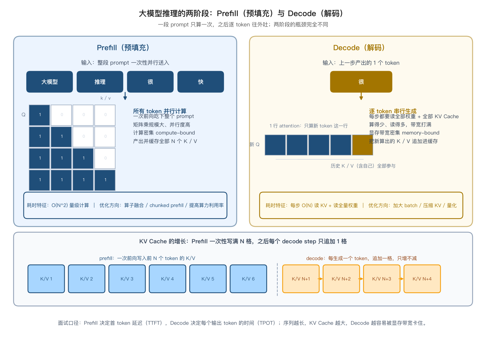

上图展示了同一请求内 Prefill 与 Decode 两阶段的张量形态差异：Prefill 是"一张 $n × d$ 的 Q 去乘 $n × d$ 的 K^T"，得到一个 $n × n$ 的注意力矩阵，属于典型的高算术强度 GEMM；Decode 是"一个 $1 × d$ 的 q 去乘 $S × d$ 的 K^T"，得到一个 $1 × S$ 的行向量，属于典型的低算术强度 GEMV。横轴 S 表示当前已缓存的序列长度，随 Decode 逐步增长。

**一句话区分**：Prefill 是**一次大批量的矩阵运算**，Decode 是**上千次小规模、串行、反复读显存的向量运算**。

#### 7.1.2 KV Cache：用空间换掉重复计算

**解决什么问题**：Decode 每一步都要算 $Attention(q_t, K_{1:t}, V_{1:t})$。如果每步都重算全部历史 token 的 K 和 V，那第 `t` 步的计算量是 $O(t)$，生成 `T` 个 token 的总计算量就是 $O(T^2)$——生成 1000 个字要付出平方级的代价，这在工程上完全不可接受。

**怎么做**：观察到一个关键事实——第 `t` 步算出的 $k_t$ 和 $v_t$，在第 `t+1`、`t+2`、乃至第 `T` 步都是**一模一样的**，它们不依赖后续生成的 token。既然如此，就在 Prefill 和每一步 Decode 中，把新算出的 $k_t$、$v_t$ 追加写进一块显存，下一步直接读出来用。这块显存就是 **KV Cache（键值缓存）**。

有了 KV Cache，第 `t` 步只需要计算**当前这一个 token** 的 q、k、v，然后和历史 K、V 做一次注意力。总计算量从 $O(T^2)$ 降到 $O(T)$——代价是显存占用从 $O(1)$ 涨到 $O(T)$。

```python
# 带 KV Cache 的 Decoder Layer 前向（伪代码，单层单头）
def forward(x_t, kv_cache, layer_id):
    # x_t: [batch, 1, d_model]  ← Decode 时 seq_len=1
    q = x_t @ W_q                      # [batch, 1, d_head]
    k = x_t @ W_k                      # [batch, 1, d_head]
    v = x_t @ W_v                      # [batch, 1, d_head]

    # 关键：把新算出的 k, v 追加进缓存
    kv_cache[layer_id].append(k, v)    # 缓存变为 [batch, t, d_head]

    K = kv_cache[layer_id].K           # [batch, t, d_head]  读历史
    V = kv_cache[layer_id].V           # [batch, t, d_head]

    attn = softmax(q @ K.T / sqrt(d_head))   # [batch, 1, t]
    out  = attn @ V                          # [batch, 1, d_head]
    return out @ W_o
```

**易错点**：KV Cache 缓存的是 **K 和 V，不缓存 Q**。因为 Q 每一步都是新的（来自当前 token），缓存它毫无意义。另外注意——同一个 token 出现在不同位置、不同上下文里，它的 KV Cache 内容是**不同的**（除了第一层），所以"相同 token 可以直接复用 KV"这个直觉一般是错的，只有共享前缀这种**前缀完全相同**的场景才能复用（见 §7.3.4）。

#### 7.1.3 KV Cache 显存公式（必须能手写）

这是本章最基础的白板题。先把符号定义清楚：

| 符号 | 含义 | 典型取值（LLaMA-3-8B） |
|---|---|---|
| `L` | Transformer 层数 $n_{\mathrm{layers}}$ | 32 |
| $n_{\mathrm{kv}}$ | 每层 KV 头数 `num_key_value_heads` | 8（GQA） |
| $d_h$ | 每个注意力头的维度 `head_dim` | 128 |
| `b` | batch size（并发序列数） | 动态 |
| `S` | 序列长度（prompt 加 已生成，通常按最大长度估） | 动态 |
| `p` | KV Cache 每个元素占用的字节数 | FP16 为 2，FP8 为 1 |
| `c` | K 和 V 两个张量 | 固定为 2 |

单个 token、单层、单个 KV 头需要缓存 $2 · d_h$ 个元素（K 一份，V 一份）。所以整个 batch 的 KV Cache 显存为：

$$
M_{\text{KV}} = 2 \cdot L \cdot n_{\text{kv}} \cdot d_h \cdot b \cdot S \cdot p
$$

**每个 token 的 KV Cache（单位字节）**，这是最常用的中间量：

$$
M_{\text{per-token}} = 2 \cdot L \cdot n_{\text{kv}} \cdot d_h \cdot p
$$

举几个真实的每 token 数字（FP16，`p = 2`）：

| 模型 | L | $n_{\mathrm{kv}}$ | $d_h$ | 每 token KV Cache | 8192 上下文单条 |
|---|---|---|---|---|---|
| LLaMA-2-7B（MHA） | 32 | 32 | 128 | 512 KB | 4.0 GB |
| LLaMA-2-70B（GQA-8） | 80 | 8 | 128 | 320 KB | 2.5 GB |
| LLaMA-3-8B（GQA-8） | 32 | 8 | 128 | 128 KB | 1.0 GB |
| Qwen2.5-72B（GQA-8） | 80 | 8 | 128 | 320 KB | 2.5 GB |
| DeepSeek-V3（MLA） | 61 | 见下 | 见下 | 约 70 KB | 约 0.57 GB |

> **面试常考的坑**：LLaMA-2-7B **不是 GQA**，它是标准的 MHA（`n_kv = 32`），所以每 token KV Cache 是 512 KB 而不是 128 KB。GQA 是从 LLaMA-2 的 34B 和 70B 才开始引入的。很多人张口就说"7B 的 GQA 8 组"，这是把 LLaMA-3-8B 的配置张冠李戴了。具体手算见 §7.9.1。

**从公式能直接读出四条工程结论**：

1. KV Cache 对 `S` 和 `b` 都是线性增长——**上下文一长、并发一高，显存立刻见底**。这就是为什么要做长上下文优化和显存管理。
2. $n_{\mathrm{kv}}$ 是模型结构决定的，改它就要改模型——这就是 GQA、MQA、MLA 存在的全部理由。
3. `p` 是量化维度，FP8 KV Cache 直接砍半——这是最简单无脑的一档优化。
4. 层数 `L` 也是线性项，MoE 模型层数多但 $n_{\mathrm{kv}}$ 可以做得小，两相乘除。

#### 7.1.4 为什么 Decode 是 memory-bound 而 Prefill 是 compute-bound

这是理解整个推理优化体系的**枢纽问题**。答不上来，后面所有优化（FlashDecoding、投机解码、连续批处理、P-D 分离）都是机械记忆。

**先明确两个硬件参数**（以 NVIDIA A100 80GB SXM 为例，数据来源：NVIDIA Ampere Architecture In-Depth 官方博客与 A100 白皮书）：

| 参数 | 数值 | 说明 |
|---|---|---|
| HBM2e 显存带宽 | 2039 GB/s | 每秒能搬运 2.039 TB 数据 |
| FP16 Tensor Core 峰值 | 312 TFLOPS | 每秒能做 3.12e14 次浮点运算 |
| 显存容量 | 80 GB | 装权重加 KV Cache 加 激活 |
| FP32 非矩阵运算 | 19.5 TFLOPS | 比矩阵乘慢约 16 倍，是 softmax 的代价 |

**算术强度（Arithmetic Intensity）** 的定义：每从 HBM 搬运 1 字节数据，能完成多少次浮点运算，单位是 FLOP per Byte。

$$
I = \frac{\text{FLOPs}}{\text{Bytes moved from HBM}}
$$

**机器的平衡点（ridge point）** 由硬件决定：

$$
I_{\text{machine}} = \frac{\text{峰值算力}}{\text{峰值带宽}} = \frac{312 \times 10^{12}}{2039 \times 10^{9}} \approx 153 \ \text{FLOP/Byte}
$$

判据非常干脆：

- 若算子的算术强度 **大于** 153，说明搬运一次数据能做很多运算，瓶颈在算力 —— **compute-bound（算力受限）**；
- 若算子的算术强度 **小于** 153，说明算力在空转等数据 —— **memory-bound（显存带宽受限）**。

**Prefill 的算术强度**

Prefill 有两种算子。注意力部分是 $n × d$ 乘 $d × n$，FLOPs 约 $4 n^2 d$（QK^T 加 PV 两次矩阵乘，每次 $2 n^2 d$），需要搬运的是 Q、K、V、O 四个 $n × d$ 的矩阵，即 `4 n d p` 字节：

$$
I_{\text{attn-prefill}} \approx \frac{4 n^2 d}{4 n d p} = \frac{n}{p}
$$

FP16 下 `p = 2`，只要 `n` 大于 306，注意力的算术强度就超过 153。而真实 prompt 动辄几百到几万 token，所以 **Prefill 稳稳地站在 compute-bound 一侧**。线性层（QKV 投影、MLP）更是纯粹的 GEMM，算术强度在 batch 维度上还能再乘一个 `b`，更是 compute-bound。

**Decode 的算术强度**

Decode 时情况急转直下。每一步要处理 batch 里 `b` 个序列各 1 个 token，但每个序列都要把自己的 KV Cache 全量读一遍：

- **FLOPs**：注意力部分约为 $2 · 2 · b · S · d_h · n_{\mathrm{heads}}$（每序列 $2 S d_h$ 的 qk 加 $2 S d_h$ 的 pv，再乘头数）。它随 `S` 线性增长，但系数很小。
- **显存搬运**：这才要命。除了读 KV Cache（大小正是上面那个公式），还要把整个模型的**权重**从 HBM 读一遍——所有线性层的 $W_q$、$W_k$、$W_v$、$W_o$、$W_{\mathrm{gate}}$、$W_{\mathrm{up}}$、$W_{\mathrm{down}}$，以及所有 embedding。对 7B 模型 FP16，这就是约 14 GB。**每一步 Decode 都要把 14 GB 权重完整读一遍，但只做了对应于 `b` 个 token 的计算**。

于是：

$$
I_{\text{decode}} \approx \frac{2 \cdot b \cdot (\text{FLOPs per token})}{2 \cdot P_{\text{model}} + M_{\text{KV}}}
$$

其中 $P_{\mathrm{model}}$ 是模型参数量。当 `b` 很小时（比如 `b = 1`），分子极小，分母约等于 14 GB，算术强度在 **1 到 10 FLOP/Byte** 这个量级——远低于 153，**所以 Decode 是彻头彻尾的 memory-bound**。

**这个结论的四个直接推论**（面试必答）：

1. **Decoder 阶段 GPU 算力利用率极低**。你花 10 万块买的 312 TFLOPS，Decode 时可能只用到 5%，剩下 95% 的 Tensor Core 在等 HBM 把权重搬过来。这就是为什么"推理卡"更看重带宽而不是算力——H100 相比 A100，带宽从 2.0 TB/s 提到 3.35 TB/s（提升 1.68 倍），而 FP16 算力从 312 提到约 989 TFLOPS（提升 3.2 倍），但**推理收益主要来自带宽那部分**。
2. **提高 batch size 是 Decode 唯一的"免费午餐"**。权重读一遍可以给 `b` 个序列复用，算术强度随 `b` 线性提升。所以**吞吐优化的第一性原理就是：在显存允许的范围内把 batch 做到最大**。而 batch 的天花板正是 KV Cache 显存——这就把问题闭环到了 §7.3 的 PagedAttention。
3. **Decode 的延迟几乎与 batch 大小无关**（在显存没打满前）。因为瓶颈是"读一遍 14 GB 权重"的时间，`b` 从 1 加到 32，时间几乎不变。所以单用户在线场景下，加大 batch 是白赚吞吐。
4. **Prefill 和 Decode 混在一起跑会互相伤害**。一个 32K token 的长 Prompt 请求做 Prefill，会长时间占满算力，导致同机上所有正在 Decode 的请求全部卡顿（因为它们的 Decode step 排不上队）。这就是 §7.7 的 Chunked Prefill 和 P-D 分离要解决的问题。

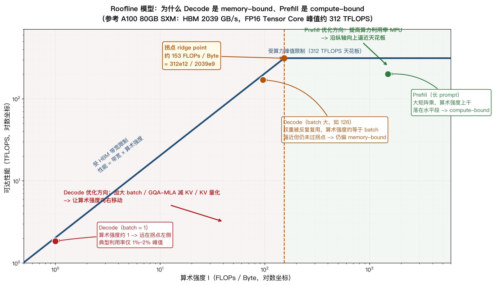

上图是 roofline 模型的示意。横轴是算术强度（对数刻度），纵轴是可达到的算力。左侧斜线是带宽墙，右侧水平线是算力墙，交点（ridge point）在 A100 FP16 上约为 153 FLOP/Byte。Decode（batch 小）落在左侧斜线上，加大 batch 会沿斜线向右上移动直到撞上算力墙；Prefill 落在右侧水平线附近，已经贴近算力上限，加大 batch 收益有限。**所有推理优化手段，本质上都是在把工作点往右上方推**。

#### 7.1.5 一个容易混淆的点：Decode 到底在算什么

很多人以为 Decode 慢是因为"一步步串行"。这只说对一半。串行导致的是**无法并行**，但即使不考虑串行，单步 Decode 本身也慢——因为一步的绝大部分时间花在**把权重从 HBM 搬到寄存器**上，而不是花在乘加运算上。

用数字感受一下（7B 模型、FP16、A100）：

- 一步 Decode 读权重：14 GB 除以 2039 GB/s，约 **6.9 ms**；
- 一步 Decode 的实际计算量：约 14 GFLOPs（2 乘 7B），除以 312 TFLOPS，理论只需 **0.045 ms**；

两者相差 **150 倍**。也就是说，理想情况下（算术强度无限高）一步 Decode 只要 0.045 ms，但因为 memory-bound，实际要 6.9 ms 量级（当然现实中还有 kernel launch、memory latency 等开销，单步实测通常在 15 到 30 ms）。

**这个 150 倍的鸿沟，就是整个推理优化行业存在的理由**。投机解码试图一次生成多个 token 来摊薄权重读取成本；连续批处理试图让同一步服务更多请求；量化试图把 14 GB 缩成 3.5 GB；PagedAttention 试图让 batch 尽可能大。所有招数都指向同一个目标。

---

### 7.2 KV Cache 优化演进全景：MHA 到 MQA 到 GQA 到 MLA

**这条演进线是推理方向面试的第一高频题**。它的内在逻辑极其清晰：目标始终是**压缩 KV Cache 的 $n_{\mathrm{kv}} · d_h$ 这一项**，而每一代方案都在"压缩比"和"效果损失"之间找新的平衡点。

#### 7.2.1 演进的动机链

| 代际 | 提出时间 | 核心手法 | KV Cache 每 token（相对 MHA） | 效果代价 |
|---|---|---|---|---|
| MHA | 2017（Transformer 原论文） | 每个 Q 头配独立 K、V 头 | 1 倍（基准） | 无，效果上限最高 |
| MQA | 2019（Shazeer, Google） | 所有 Q 头共享**一组** K、V | 约 MHA 的 $1 / n_{\mathrm{heads}}$ | 明显下降，长任务掉点 |
| GQA | 2023（Ainslie 等, Google） | Q 头分组，每组共享一组 K、V | 约 MHA 的 $n_{\mathrm{groups}} / n_{\mathrm{heads}}$ | 接近 MHA，可控 |
| MLA | 2024（DeepSeek-V2） | 低秩联合压缩，只存潜向量 | 约等价于 GQA 的 2.25 组 | 论文称强于 MHA |

#### 7.2.2 MHA：起点，也是天花板

标准多头注意力（Multi-Head Attention，MHA）中，$n_{\mathrm{heads}}$ 个 Q 头各自对应自己的 K 头和 V 头。KV Cache 需要缓存 $n_{\mathrm{heads}}$ 份 K 和 $n_{\mathrm{heads}}$ 份 V。

它的表达能力最强——每个头有独立的 K、V 投影矩阵，能捕捉完全不同的特征子空间。但代价是 KV Cache 与头数成正比。当 LLaMA-2-70B 用了 64 个头、80 层时，每 token 的 KV Cache 就是 $2 × 80 × 64 × 128 × 2 = 2.62 MB$（FP16），一个 4096 长度的请求就要 10 GB——**单条请求就吃掉一张 80GB 卡的八分之一**，batch 根本开不大。

#### 7.2.3 MQA：压缩到极致，代价也到极致

多查询注意力（Multi-Query Attention，MQA）由 Shazeer 在 2019 年提出，做法极端：**所有 Q 头共享唯一一组 K 和 V**。

$$
\text{KV Cache}_{\text{MQA}} = 2 \cdot L \cdot d_h \cdot S \cdot b \cdot p
$$

注意 `n_kv = 1`，公式里的 $n_{\mathrm{kv}}$ 项直接消失。对 64 头的模型，压缩比是 **64 倍**；对 32 头的模型，压缩比是 **32 倍**。

**代价**：所有头被迫用同一套 K、V 去做注意力，头的多样性被彻底摧毁。实测中 MQA 在长文本理解、多跳推理、代码生成等任务上有可观测的下降，而且**训练不稳定**（这也是为什么 MQA 提出后几年内在学术界反响平平，直到 PaLM、Falcon、StarCoder 等工程导向的模型才开始采用）。

**现状**：MQA 现在主要出现在两类地方——一是极致追求 Decode 带宽的小模型或端侧模型；二是在 MLA 中作为"共享 RoPE 分量"的角色出现（见 §7.2.5）。

#### 7.2.4 GQA：当前工业界的事实标准

分组查询注意力（Grouped-Query Attention，GQA）由 Ainslie 等人在 2023 年提出，是 MHA 和 MQA 之间连续谱上的一个插值点：把 $n_{\mathrm{heads}}$ 个 Q 头分成 $n_{\mathrm{groups}}$ 组，**每组内共享一组 K、V**。

$$
\text{KV Cache}_{\text{GQA}} = 2 \cdot L \cdot n_{\text{groups}} \cdot d_h \cdot S \cdot b \cdot p
$$

两个特例验证了它是插值：`n_groups = n_heads` 时退化成 MHA，`n_groups = 1` 时退化成 MQA。

**为什么 GQA 成了事实标准**：

1. **压缩比可按需调节**。主流模型普遍选 `n_groups = 8`：LLaMA-2-70B（64 头）压缩 8 倍，LLaMA-3-8B（32 头）压缩 4 倍，Qwen2.5 全系、Mistral、Gemma 都用 8 组。
2. **效果损失极小**。GQA 论文的核心实验结论是：GQA 的效果**接近 MHA 而远好于 MQA**，且绝大部分差距可以通过"更多训练步数"补回来。
3. **最关键的工程优势——可以低成本从已有 MHA checkpoint 转换**。论文提出 Uptraining：取一个训好的 MHA 模型，把同一组内所有头的 K、V 投影矩阵**取平均**合并成一组，再用原训练配方 5% 左右的算力微调一小段，就能恢复几乎全部效果。**这意味着所有 2023 年之前的 MHA 老模型都能无痛升级**，这是 GQA 迅速普及的决定性因素。

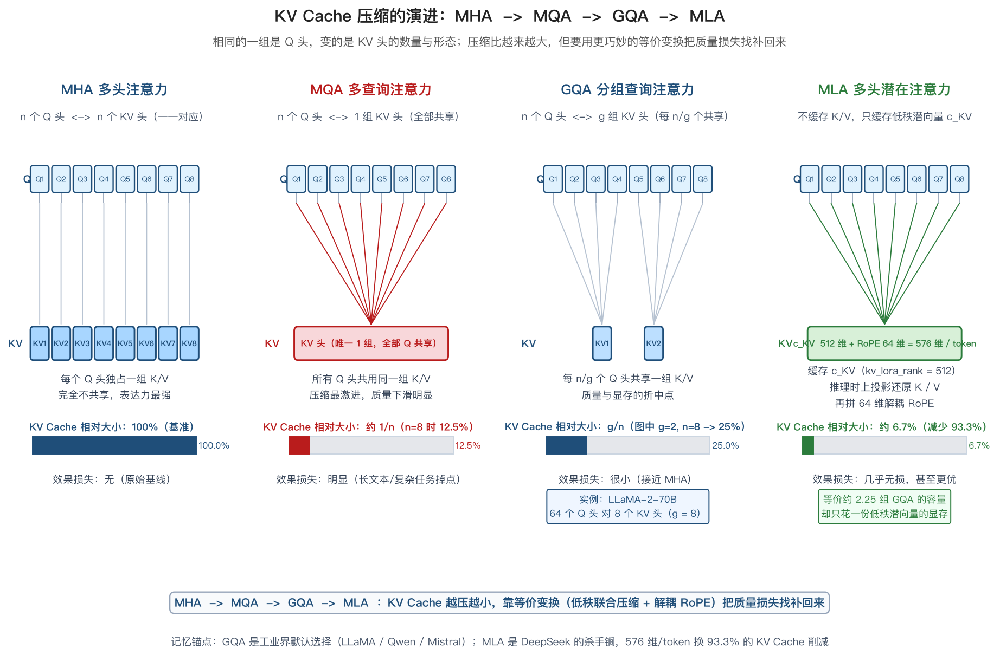

上图从左到右展示四种注意力结构的 KV 头组织方式。MHA 中每个 Q 头配一个独立 K 头和一个独立 V 头（一一对应）；MQA 中所有 Q 头共享唯一的 K 头和 V 头（多对一）；GQA 中 Q 头被分成若干组，每组共享一个 K 头和一个 V 头（多对一，但多组并行）；MLA 中所有 Q 头对应一个被低秩压缩的潜向量 $c_{\mathrm{KV}}$，加一个共享的 RoPE 分量 $k^R$，推理时通过"矩阵吸收"直接在潜空间完成注意力，永远不还原出完整的 K 和 V。

**GQA 的边界**：压缩比有上限。$n_{\mathrm{groups}}$ 从 8 再往下压到 4 或 2，效果损失开始加速；压到 1 就是 MQA。想在保持效果的前提下继续压缩，必须换思路——这就是 MLA。

#### 7.2.5 MLA：换个维度压缩（DeepSeek）

多头潜在注意力（Multi-head Latent Attention，MLA）由 DeepSeek 在 2024 年 5 月的 DeepSeek-V2 论文中提出。它的思路与前三代**根本不同**：

- MQA 和 GQA 是在**减少"存几份"**上做文章（每份仍然是完整的 $d_h$ 维）；
- MLA 是在**减少"每份存多少"**上做文章——它不存完整的 K 和 V，而存一个**低维潜向量**。

**核心机制三步走**：

**第一步：低秩 KV 联合压缩（Low-Rank Key-Value Joint Compression）**

不直接从隐状态 $h_t$ 投影出 K 和 V，而是先投影到一个低维"潜向量" $c_t^{KV}$：

$$
c_t^{KV} = W^{DKV} h_t , \quad c_t^{KV} \in \mathbb{R}^{d_c}
$$

其中 $d_c$（`kv_lora_rank`）远小于 $n_{\mathrm{heads}} · d_h$。以 DeepSeek-V3 为例：`d_c = 512`，而 $n_{\mathrm{heads}} · d_h = 128 × 128 = 16384$，**压缩到原来的 3.1%**。训练时再从 $c_t^{KV}$ 上投影还原出每个头的 K 和 V：

$$
k_{t,i}^{\text{nope}} = W^{UK}_i \, c_t^{KV} , \qquad v_{t,i} = W^{UV}_i \, c_t^{KV}
$$

**第二步：只在缓存里存潜向量（矩阵吸收）**

这是 MLA 最精妙的一步。**推理的 Decode 阶段根本不需要把 K、V 还原回高维**。原因是注意力计算可以重排：

$$
\text{score}_{t,i} = \frac{q_{t,i}^T k_{t,i}}{\sqrt{d_h}} = \frac{q_{t,i}^T W^{UK}_i c_t^{KV}}{\sqrt{d_h}} = \frac{(W^{UK}_i{}^T q_{t,i})^T c_t^{KV}}{\sqrt{d_h}}
$$

也就是说，把 $W^{UK}_i$ 先"吸收"进 Q 的投影里（`q` 直接与 $(W^{UK}_i)^{T}$ 相乘），然后直接与**低维潜向量** $c_t^{KV}$ 做点积，**完整的 `16384` 维 K 张量从头到尾没有在显存里存在过**。V 同理：$W^{UV}_i$ 可以吸收进输出投影 $W_o$，注意力输出等价于先对潜向量加权求和、再一次上投影，避免了逐头还原。

这个技巧叫**矩阵吸收（matrix absorption）**。它意味着 MLA 在 Decode 时，从 HBM 读出来的不是 $n_{\mathrm{heads}}$ 份 K 和 V，而只有**一份** $d_c$ 维的潜向量——这就是压缩的全部源泉。

**第三步：解耦 RoPE（Decoupled Rotary Position Embedding）**

上面这个"吸收"的推导有个前提：$q^T k$ 必须能拆成 $q^T W^{UK} c$ 的形式。但 RoPE 会在 `q` 和 `k` 上各乘一个与**位置相关**的旋转矩阵 $R_t$：

$$
q_{t,i}^T R_t^T R_{t'} k_{t',i}
$$

中间夹了个 $R_t^T R_{t'}$，矩阵吸收失效——$W^{UK}$ 没法简单地搬到 q 那边去。

DeepSeek 的解法是**维度拆分**：把每个头的维度拆成两段——一段不带位置编码（$q^{nope}$、$k^{nope}$，维度 $d_h^{nope}$），一段专门携带 RoPE（$q^R$、$k^R$，维度 $d_h^R$）。前者走矩阵吸收，后者单独处理。更进一步，RoPE 分量 $k^R$ 是**所有头共享的 MQA 形式**，只需缓存一份。

于是 MLA 每 token 的 KV Cache 是：

$$
M_{\text{per-token}}^{\text{MLA}} = L \cdot (d_c + d_h^R) \cdot p
$$

DeepSeek-V3 的具体数值：`d_c = 512`，$d_h^R = 64$，所以每 token 每层的 KV Cache 是 **576 个元素**，只存**一份**，不需要乘 K 和 V 两份（因为潜向量同时编码了 K 和 V 的信息）。

**93.3% 这个数字是怎么来的**（DeepSeek-V2 论文，面试常追问）：

论文原文是"相比 DeepSeek 67B 减少 93.3% 的 KV Cache、最大生成吞吐提升到 5.76 倍"。注意这**不是纯 MLA 的功劳**，而是三个因素相乘：

$$
1 - \frac{2.25}{8} \times \frac{60}{95} \times \frac{6}{16} \approx 93.3\%
$$

三项分别是：MLA 的 KV Cache 只相当于 **2.25 组 GQA**（对比 Dense 67B 的 8 组 GQA），层数从 95 降到 60，以及使用 6 bit 量化（对比 FP16 的 16 bit）。

单看 MLA 本身：576 维相当于 GQA 组数为 `576 除以 2 再除以 128 = 2.25`，而主流 GQA 模型开 8 组，所以 **MLA 相比 8 组 GQA 单层节省 71.88%**。 DeepSeek-V3 的 576 维约为 Qwen2.5-72B（2048 维）的 28.13%，同样是省 71.88%。

**为什么 MLA 效果反而可能更好**：MLA 把 Q 投影到 $128 × 192 = 24576$ 维（远大于隐层 7168），KV 上投影到 $128 × 256 = 32768$ 维，**表达能力比同规模 MHA 更强**。它用"训练时更大的投影矩阵"换"推理时更小的缓存"，两头都占了。这也是为什么 MLA 后续被 Kimi K2 等多个模型采用。

**MLA 的代价与边界**（面试加分项）：

- 实现复杂度高：矩阵吸收、解耦 RoPE、变长序列处理都需要定制 kernel；
- 与 RoPE 生态不完全兼容：要做 $d_h^{nope}$ 和 $d_h^R$ 的切分，迁移成本高于 GQA；
- 对短上下文收益不明显：省的是长序列下的显存，短 prompt 场景优势打折；
- 计算量上升：KV 投影矩阵变大（论文分析约为常规 GQA 的 3.26 倍计算量），在 compute-bound 的 Prefill 阶段反而更慢。

#### 7.2.6 四种结构横向对比（背诵表）

| 维度 | MHA | MQA | GQA | MLA |
|---|---|---|---|---|
| KV 头数 $n_{\mathrm{kv}}$ | $n_{\mathrm{heads}}$ | 1 | $n_{\mathrm{groups}}$（常用 8） | 等价于 2.25 组 |
| 每 token KV Cache | $2 L n_h d_h p$ | $2 L d_h p$ | $2 L n_g d_h p$ | $L (d_c + d_h^R) p$ |
| 相对 MHA 压缩比 | 1 倍 | 数十倍 | 4 到 8 倍 | 单层约 3.5 倍（对 8 组 GQA） |
| 表达能力 | 最强 | 最弱 | 接近 MHA | 论文称强于 MHA |
| 能否从老 checkpoint 转换 | 基准 | 需重训 | **可以，取平均加少量微调** | 需重训或专门转换（TransMLA） |
| 长上下文适性 | 差 | 好 | 较好 | **最好** |
| 实现复杂度 | 低 | 低 | 低 | 高（需定制 kernel） |
| 代表模型 | LLaMA-2-7B、GPT-2 | Falcon、StarCoder、PaLM | LLaMA-3 全系、Qwen2.5、Mistral | DeepSeek-V2、V3、R1、Kimi K2 |

**一句话总结这条线**：MHA 效果最好但存不下，MQA 存得下但效果崩，GQA 用"分组共享"在工程上找到了最优点（所以成了事实标准），MLA 则用"低秩压缩加矩阵吸收"换了个维度，在保持甚至提升表达能力的同时把 KV Cache 压到 GQA 的 2.25 组水平。

---

### 7.3 PagedAttention（vLLM）

**解决什么问题**：在 vLLM 之前，所有推理系统的 KV Cache 显存利用率只有 **20.4% 到 38.2%**（vLLM 论文实测数据），也就是**六到八成的显存是被白白浪费掉的**。显存浪费直接导致并发 batch 上不去，batch 上不去又直接导致吞吐上不去（回看 §7.1.4 的结论 2）。所以 PagedAttention 解决的是推理吞吐的**第一性问题**。

vLLM 由 UC Berkeley 的 Woosuk Kwon、Zhuohan Li 等人提出，论文《Efficient Memory Management for Large Language Model Serving with PagedAttention》发表于 SOSP 2023。

#### 7.3.1 OS 虚拟内存分页的类比

PagedAttention 的核心思想是**把操作系统里用了半个世纪的虚拟内存分页机制，原封不动地搬到 KV Cache 管理上**。这个类比是理解它的钥匙：

| 操作系统概念 | PagedAttention 对应概念 | 说明 |
|---|---|---|
| 进程（Process） | 请求（Request，即一条序列） | 显存的"用户" |
| 虚拟地址空间 | 逻辑 KV 块序列 | 请求看到的连续视图 |
| 物理内存页（Page） | 物理 KV 块（Physical Block） | 显存里真实的固定大小块 |
| 页表（Page Table） | 块表（Block Table） | 逻辑块到物理块的映射 |
| 分页（Paging） | 把 KV Cache 切成固定大小块 | 粒度单位 |
| 页内碎片 | 块内碎片（Internal Fragmentation） | 最后一个块没填满 |
| 缺页中断（Page Fault） | 块按需分配 | 用到才分配 |
| Copy-on-Write | 共享块的写时复制 | 前缀共享的关键 |

**为什么操作系统需要分页**：早期分段式内存管理要求给每个进程分配连续物理内存，结果内存碎片化严重——明明总空闲 640 MB，但都是 128 MB 加 512 MB 这样的碎块，一个需要 640 MB 连续空间的新进程就是跑不起来。分页把内存切成固定大小的页，进程的虚拟地址空间可以映射到任意零散的物理页，**外部碎片直接消失**。

**KV Cache 面临的是一模一样的问题**，而且更严重：深度学习框架要求 tensor 在显存里连续存储，所以推理系统必须为每个请求预分配一块**连续**的、按 `max_seq_len` 算的显存。但请求的输出长度**事先完全无法预知**——你没法知道这个用户要的是 20 个字的回答还是 2000 字的长文。

#### 7.3.2 block、逻辑块、物理块、块表

**Block（块）**：PagedAttention 把每个序列的 KV Cache 切成固定大小的块，每个块存放 `B` 个 token 的 K 和 V（vLLM 默认 `B = 16`）。块是分配的最小单位。

**逻辑块（Logical Block）**：从请求的视角看，它的 KV Cache 是一串从左到右、编号连续的逻辑块。第 `j` 个逻辑块包含第 `(j-1)B+1` 到 `jB` 个 token 的 K、V。逻辑块是**虚拟的、连续的**。

**物理块（Physical Block）**：GPU 显存里真实存在的一块显存区域，大小正好装 `B` 个 token 的 K、V。物理块是**真实的、可以散落在显存任意位置的**。

**块表（Block Table）**：每个序列维护一张映射表，记录"第 `j` 个逻辑块放在了哪个物理块上"。注意力 kernel 在读取 K、V 时，先查块表拿到物理块号，再去对应地址取数据。

**分块注意力的计算**：第 `i` 个 token 的 query 对第 `j` 个块的注意力为

$$
A_{ij} = \frac{\exp\!\big(q_i^T K_j / \sqrt{d}\big)}{\sum_{t=1}^{\lceil i/B \rceil} \exp\!\big(q_i^T K_t \mathbf{1} / \sqrt{d}\big)} , \qquad
o_i = \sum_{j=1}^{\lceil i/B \rceil} V_j A_{ij}^T
$$

其中 $K_j$ 是第 `j` 个块里 `B` 个 key 向量组成的矩阵，$V_j$ 同理。可以看到，**计算在块粒度上做，块与块之间不需要连续**——这就是 PagedAttention 名字的由来。

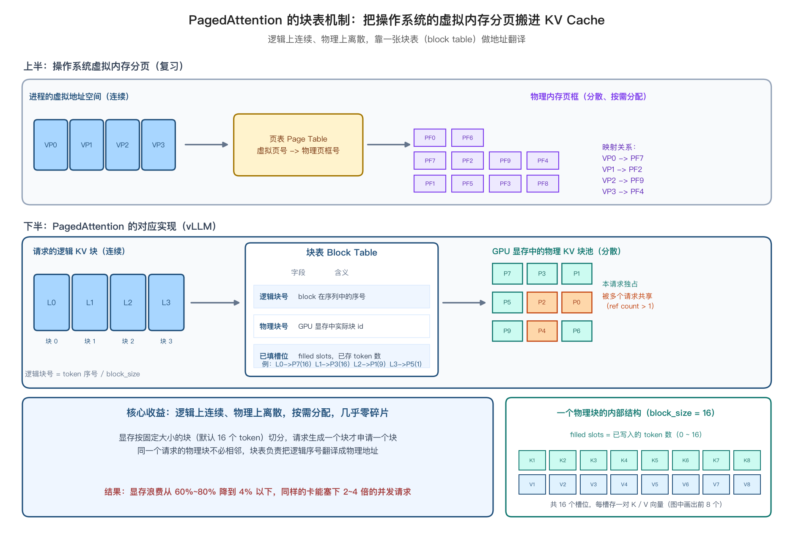

上图展示一个包含 4 个逻辑块的序列如何通过块表映射到 4 个散落在显存不同位置的物理块。序列视角看到的是"我的 KV Cache 是连续的 0 到 3 号逻辑块"，而 GPU 显存里它们实际位于物理块 7、2、13、0。块表（中间的表结构）负责这个翻译。注意力 kernel 遍历逻辑块编号，逐个查表取物理地址完成计算。注意物理块是不需要连续、也不需要有序的。

**块大小 `B` 怎么选**（论文消融实验，面试加分）：

- `B` 太小（如 4、8）：块表变长，kernel 查表开销上升，且难以利用 GPU 的内存合并访问（memory coalescing）；
- `B` 太大（如 256）：块内碎片变大，且不同序列间共享前缀时能共享的粒度变粗，命中率下降；
- 论文结论：在 ShareGPT 这类长序列数据集上，`B` 取 **16 到 128** 都表现良好；在 Alpaca 这类短序列数据集上，`B` 取 **16 和 32** 更安全，再大就会因为序列短而明显劣化。
- **vLLM 默认 `B = 16`，这是一个工程折中，不是数学常数**。

#### 7.3.3 显存浪费的三个来源与解决

传统系统（FasterTransformer、Orca）的 KV Cache 浪费来自三个不同的地方，vLLM 逐个击破：

**浪费一：预留浪费（Reservation）**

- **成因**：请求一进来就按 `max_seq_len`（比如 2048）整段预留，哪怕它实际只生成 50 个 token。预留的部分在请求整个生命周期内都被独占，其他请求碰不到。
- **vLLM 的解法**：**按需分配**。每生成一个块的内容，才申请一个新的物理块。请求结束才占用的显存，从"一开始就锁死"变成"用多少拿多少"。
- **消除程度**：完全消除。

**浪费二：内部碎片（Internal Fragmentation）**

- **成因**：即使我们开了天眼、提前知道这个请求最终会生成 517 个 token，按精确长度分配，那分配的块也必须是整数个——`517` 个 token 需要 `ceil(517 除以 16) = 33` 个块，最后那不到一个块的空间，最后那半个块（约 11 个 token 的空间）是浪费的。
- **vLLM 的解法**：无法完全消除，但**上限被锁死在"每个序列最多浪费不到一个块"**。相比传统方案可能浪费上千个 token 的空间，这个量级可以忽略。
- **消除程度**：从"可能上千 token"降到"最多 `B-1` 个 token"，即 15 个。

**浪费三：外部碎片（External Fragmentation）**

- **成因**：不同请求预留的长度不同（有的按 512 留、有的按 2048 留），请求结束后释放出来的空洞大小不一，新请求如果需要的连续空间大于任何一个空洞，就只能用不了这些空间。CUDA 的 `cudaMalloc` 和 `cudaFree` 也有这个问题。
- **vLLM 的解法**：**所有物理块大小完全相同**，任何空闲块都能服务任何请求，**外部碎片在数学上归零**。
- **消除程度**：完全消除。

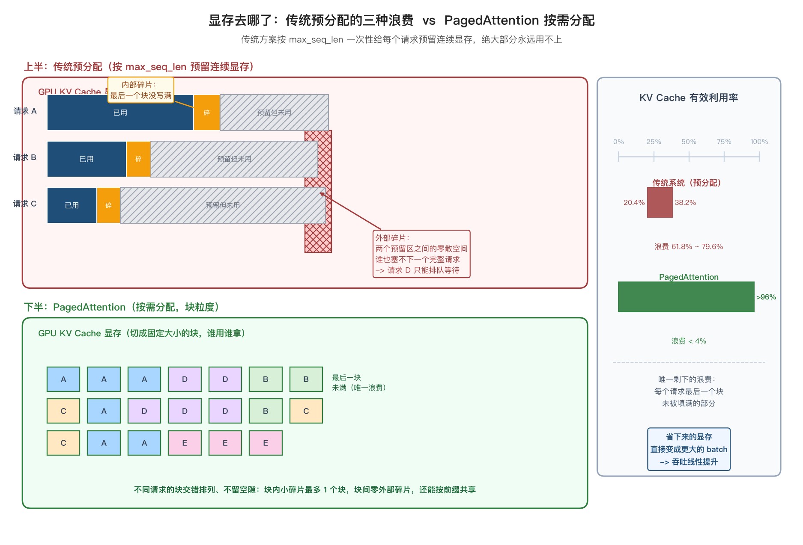

上图对比传统方案与 PagedAttention 的显存占用。左侧传统方案中，三个请求各自预留一大段连续空间（深色块是已用、浅色块是预留但未用的内部碎片、灰色块是请求间无法利用的外部碎片），总空闲格子明明还有 9 个，但因为不连续，新来的请求 4 需要 8 个连续格子却只能排队等待。右侧 PagedAttention 中，所有块大小统一，请求 4 可以零散地填进任意空闲块，显存被榨干。

**实测数据**（vLLM 论文 Figure 2 与官方博客）：

| 系统 | KV Cache 有效利用率 | 显存浪费率 |
|---|---|---|
| Orca（Max 分配策略） | 20.4% | 约 80% |
| Orca（Oracle，开天眼预知输出长度） | 38.2% | 约 62% |
| vLLM（PagedAttention） | **超过 96%** | **低于 4%** |

> **面试必背的两个数字**：20.4% 到 38.2%（传统系统利用率）和 96%（vLLM 利用率）。另外注意 Oracle 那一行——**即使让传统系统开天眼预知输出长度，它也只能用到 38.2%**。这说明 PagedAttention 的收益不只是"消除了过度预留"，分页本身和共享机制还有额外贡献。这是一个很有说服力的论证细节。

#### 7.3.4 Copy-on-Write 与前缀共享

**解决什么问题**：很多场景下不同序列的 KV Cache 有**完全相同的前缀**，传统系统因为每份 KV Cache 是独立连续存储，无法共享，只能重复存多份。

vLLM 的做法和 OS 的 Copy-on-Write 一模一样：多个逻辑块可以**映射到同一个物理块**，物理块上维护一个**引用计数（reference count）**。当某个序列要往共享块里写入新内容时，先把该物理块复制一份（引用计数减 1，新块计数置 1），再在新块上写——这就是写时复制。

**四类受益场景与实测收益**（vLLM 论文数据）：

**场景一：并行采样（Parallel Sampling）**

同一个 prompt 要求生成 `k` 个不同候选（比如让模型给 3 个答案供挑选）。这 `k` 条序列的 prompt 部分 KV Cache 完全相同，可以共享。

| 数据集 | 显存节省 |
|---|---|
| Alpaca（短序列） | 6.1% 到 9.8% |
| ShareGPT（长序列） | 16.2% 到 30.5% |

**场景二：Beam Search（束搜索）**

`k` 个 beam 之间共享大量历史前缀，而且随着 beam 的淘汰和更新，共享模式会动态变化——PagedAttention 的块级粒度正好能适应这种动态性。

| 数据集 | 显存节省 |
|---|---|
| Alpaca（束宽 6） | 37.6% 到 55.2% |
| ShareGPT（束宽 6） | 44.3% 到 66.3% |

**这是收益最大的场景**——束搜索在机器翻译、代码生成里很常用，能省一半以上的 KV Cache。论文还报告：在 OPT-13B 加 Alpaca 上，vLLM 相对 Orca（Oracle）的优势从普通采样的 1.3 倍上升到束宽 6 时的 2.3 倍。

**场景三：共享系统提示（Shared System Prompt）**

所有请求都带着同一段系统提示（system prompt）或 few-shot 示例。这段的 KV Cache 可以被所有请求共享，只需计算一次。

论文在 WMT16 英德翻译上的实测：

| 配置 | 相对 Orca（Oracle）的吞吐 |
|---|---|
| 共享 one-shot 前缀 | 1.67 倍 |
| 共享 five-shot 前缀 | 3.58 倍 |

**注意这个 3.58 倍**——few-shot 前缀越长，共享收益越大。在今天的 Agent 场景下，系统提示动辄 2000 到 5000 token（一堆工具定义、格式约束、few-shot 例子），**前缀共享是实打实的成本杀手**。这也是为什么生产环境强烈建议使用"固定系统提示前缀"来命中缓存（vLLM 里对应 Automatic Prefix Cache 功能）。

**场景四：多轮对话**

同一用户的多轮对话中，前几轮的历史是共享前缀，续接时可以复用（前提是路由到同一个 worker，这也是 vLLM Router 用一致性哈希做会话粘滞的原因）。

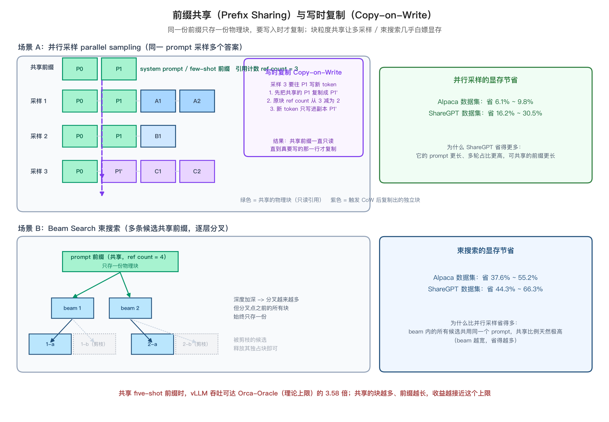

上图展示三个请求共享系统提示前缀的 Copy-on-Write 机制。上半部分：请求 A、B、C 的逻辑块 0 和 1 都指向物理块 5 和 3（系统提示部分），引用计数为 3；各自的生成部分指向不同物理块。下半部分：当请求 B 需要修改共享块的内容时，系统分配新物理块 11，把物理块 3 的内容复制过去，请求 B 的块表指向新块，物理块 3 的引用计数从 3 降到 2。这就是标准的写时复制。

#### 7.3.5 调度与抢占（Preemption）

即使有了 PagedAttention，极端情况下显存仍可能不够用。vLLM 引入**抢占（Preemption）**：当新请求进来但显存不足时，按"后来先抢占"的策略，把最近进入的请求换出，优先保护已经跑了很久的请求（避免用户等了半天被重置）。

**重要细节**：抢占以**序列组（Sequence Group）**为单位，而不是单条序列——因为一个请求的多条并行采样序列之间共享物理块，只抢其中一条是没意义的。

两种恢复策略：

- **交换（Swapping）**：把被抢占序列的 KV 块通过 PCIe 序列化到 CPU 内存，GPU 显存释放；重新调度时再拷回来。块越大，PCIe 传输的开销越能被摊薄，越划算。
- **重计算（Recomputation）**：直接丢弃 KV 块，重新调度时从头跑一遍 Prefill 重新生成。块小的时候（论文指出 64 token 及以下）重算往往比来回拷贝更快，因为大量小块拷贝的 PCIe 事务效率很低。

论文结论：在 16 到 64 的中等块大小下，两种策略端到端表现相当；**重计算的开销始终不超过交换开销的 20%**。

#### 7.3.6 吞吐提升实测数据

**论文内对比**（对比对象是当时的 SOTA 系统 Orca 和 NVIDIA FasterTransformer，使用 OPT 和 LLaMA 13B 到 175B，数据集 ShareGPT 与 Alpaca）：

| 对比对象 | vLLM 的吞吐倍数 |
|---|---|
| FasterTransformer | 最高 **22 倍** |
| Orca（Oracle，开天眼） | 1.7 倍 到 2.7 倍 |
| Orca（Max 预留策略） | 2.3 倍 到 4.3 倍 |

论文摘要的标准表述是"在相同延迟水平下，吞吐量比现有 SOTA 高 **2 到 4 倍**，且在长序列、大模型、复杂解码算法上优势更大"。

**官方博客的开发者视角对比**（LLaMA-7B 在 A10G、LLaMA-13B 在 A100-40GB）：

| 对比对象 | 单个 completion | 3 个并行 completion |
|---|---|---|
| HuggingFace Transformers | 14 倍 到 24 倍 | 8.5 倍 到 15 倍 |
| HuggingFace TGI | 2.2 倍 到 2.5 倍 | 3.3 倍 到 3.5 倍 |

> **注意区分这两组数字**：对 HF Transformers 的 14 到 24 倍，反映的是"未优化的通用推理代码"与"专用服务系统"的巨大差距，不全是 PagedAttention 的功劳。对 TGI 的 2.2 到 3.5 倍才是更公平的对照（TGI 也有连续批处理）。**面试时把两组数字的语义讲清楚，比背数字本身更得分**。

**PagedAttention 的代价**（面试加分的辩证视角）：

- **kernel 开销**：查块表和访问不连续显存，比直接读连续 tensor 慢。论文实测单个 kernel 延迟增加约 **20% 到 26%**。
- **但完全值得**：因为它能让你同时跑 **2 到 4 倍** 的请求。单 kernel 慢 20%，并发多 3 倍，净吞吐大幅上升。**这就是系统设计里典型的"用局部低效换取全局高效"**。

---

### 7.4 连续批处理 Continuous Batching

#### 7.4.1 静态批（Static Batching）的两个致命问题

**解决什么问题**：早期推理系统用静态批处理——攒够 `N` 个请求，一起送进 GPU，等**整批全部生成完**才释放这批、接下一批。这里有两个相互独立的问题。

**问题一：Padding 浪费**

一个 batch 里的序列长度必须对齐到最长的那条。请求 A 输出 50 token，请求 B 输出 500 token，那 A 的那 50 步之后，接下来的 450 步都是在为 A 计算一个**毫无用处的 padding token**——算力白白烧掉，显存也被 padding 占位。

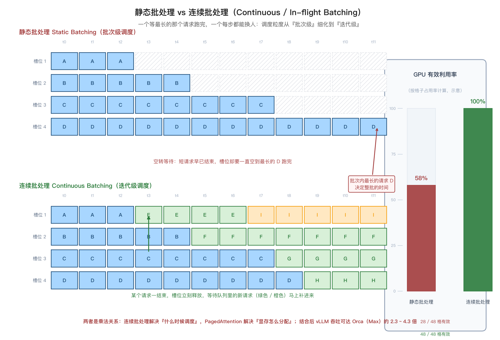

上图对比静态批与连续批的时间线。上半部分静态批：批次 0 包含请求 A、B、C，其中 B 最长（生成 5 个 token），A 和 C 各自早早生成完毕（标 EOS），但它们占用的槽位一直被 padding 占据，GPU 必须等 B 也结束后才能开始批次 1，图中灰色格子就是被浪费的算力。下半部分连续批：A 在第 2 步结束，槽位立即释放，请求 D 在第 3 步就插进来接上；C 在第 4 步结束，请求 E 在第 5 步接上。整个过程中 GPU 几乎没有空转的槽位。

**问题二：队头阻塞（Head-of-Line Blocking）**

比 padding 更严重。新来的请求必须**等当前整批全部跑完**才能进入。如果 batch 里有一个要生成 2000 token 的长请求，其他 31 个只需 50 token 的短请求就得陪着等 2000 步——**TTFT（首 token 延迟）被拉到几十秒**。这在线上服务里是不可接受的。

**量化感受一下**：假设 batch 里 90% 的请求 100 步完成，10% 的请求 1000 步完成。静态批的整体完成时间由最长的决定（1000 步），于是 90% 的用户都被迫等了 10 倍于自己需要的时间。平均延迟被长尾请求完全绑架。

#### 7.4.2 迭代级调度（Iteration-Level Scheduling）

连续批处理（Continuous Batching），也叫 **In-flight Batching**（NVIDIA Triton 的叫法）或 **Dynamic Batching**，核心思想简单到近乎朴素：

> **把批次的粒度从"请求级"降到"迭代级"。每生成完一个 token 步，调度器就重新审视一次：谁结束了？结束了就立刻把它的槽位和 KV Cache 释放掉；谁能加进来？从等待队列里挑一个补进去。**

具体流程（每个 Decode step）：

1. **执行一步**：对当前 batch 里的所有序列各做一次前向，各生成一个新 token；
2. **检测完成**：检查哪些序列生成了 EOS 或达到长度上限，标记为已完成；
3. **立即回收**：把已完成序列占用的 KV Cache 物理块释放回空闲池，**它们的输出立即返回给用户**（不用等同伴）；
4. **准入新请求**：从等待队列里按策略（FCFS、优先级、显存预算）挑若干请求，为它们**执行 Prefill**，然后把它们的序列插入 batch；
5. **进入下一步**。

关键的技术细节在于：**新请求不是等下一批才进来，而是在某一个 Decode step 里被"插队"Prefill 进去的**。也就是说，GPU 的一个 step 里可能同时包含"老请求的 Decode"和"新请求的 Prefill"——vLLM 的实现把这两者拼成一个统一的 batched forward。

**为什么这个想法很早就有、但直到 vLLM 才真正落地**（这是一个极好的面试故事）：

迭代级调度的思想并不新鲜，NVIDIA、Google、微软内部的推理系统早就有动态调度器。但**在 Transformer 上它没法落地**——因为 KV Cache 必须连续存储。想象一下连续批的场景：

```
GPU 显存（传统连续分配）：
[AAAA][BBBBBBBBBB][CCCC]
  ↑ 已完成         ↑ 已完成
     ↓ 释放后
[____][BBBBBBBBBB][____]
```

请求 A 和 C 完成了，空出两段空间，但它们是**不连续的**。新请求 D 需要 8 个连续格子，明明总共空了 9 格却装不下。传统分配器只有三条路：搬移显存（昂贵）、预留最坏情况（浪费）、重建 batch（复杂）——每条都抵消了调度的收益。

**所以真正的瓶颈不是调度算法，而是 KV Cache 内存管理。PagedAttention 把内存切成固定大小的块之后，任何空闲块都能填任何请求，连续批处理才真正可用。**

这两者的关系是：

- **PagedAttention 解决"能不能放下"**：把显存利用率从 20% 提到 96%，让 batch 的天花板（并发数）提高数倍；
- **连续批处理解决"放进去的槽位有没有被浪费"**：让每个槽位在整个生命周期里都保持满负荷。

**二者是乘法关系，不是加法关系**。缺了 PagedAttention，连续批会因为内存碎片而无法持续插入新请求；缺了连续批处理，PagedAttention 省下的显存会被 padding 和队头阻塞白白吃掉。vLLM 的成功正是因为它**同时**做对了这两件事——这也是为什么 vLLM 能一举超过 FasterTransformer 22 倍。

#### 7.4.3 连续批的工程要点

**Prefill 与 Decode 的混合执行**

一个 step 里同时有 Prefill（长序列、compute-bound）和 Decode（单 token、memory-bound）。它们的计算形态完全不同，朴素做法是把 Prefill 的序列 padding 到最长再拼在一起，这会引入新的浪费。vLLM 的做法是：

- 把待 Prefill 的请求单独组成一个 Prefill batch，用 FlashAttention 的变长接口（`varlen`）处理，避免 padding；
- Prefill 和 Decode 的 batch 分别执行，调度器控制各自的比例。

更进一步的优化见 §7.7.2 的 Chunked Prefill——把长 Prefill 切成小块，避免一次 Prefill 占满整个 step 导致其他请求的 Decode 被推迟（这是生产环境里 TPOT 抖动的头号原因）。

**调度策略的关键参数**

| 参数 | 含义 | 调优直觉 |
|---|---|---|
| `max_num_seqs` | 单步最大并发序列数 | 决定 batch 上限，受显存约束 |
| `max_num_batched_tokens` | 单步最多处理的 token 总数 | 控制单 step 耗时，避免长 Prefill 卡顿 |
| `max_model_len` | 单请求最大长度 | 决定 KV Cache 池的规划 |
| `gpu_memory_utilization` | vLLM 可用显存比例 | 默认 0.9，留出余量给激活和碎片 |
| `enable_prefix_caching` | 前缀缓存开关 | 系统提示长的场景必开 |

**抢占与公平性**

连续批下，长请求可能被反复抢占。生产环境需要注意：

- 设置合理的 `max_model_len` 和 `max_tokens`，避免单个请求无限生成；
- 用优先级队列区分在线请求与离线批处理请求；
- 监控 `num_preemptions` 指标，抢占率持续非零说明显存规划不足。

#### 7.4.4 连续批能带来多少提升

连续批的收益**高度依赖请求的异构性**——请求长度差异越大、输出长度方差越大，收益越明显：

| 场景 | 请求特征 | 连续批相对静态批的收益 |
|---|---|---|
| 批处理打分（离线） | 长度高度一致 | 有限，主要省掉批次间的空转 |
| 通用对话 | 长度差异中等 | 通常 2 到 4 倍吞吐 |
| Agent 与 长文生成 | 输出长度差异极大（20 到 4000） | 可达 5 到 10 倍以上 |

> **面试提醒**：被问"连续批提升多少"时，不要直接报一个数字。**先反问请求长度分布**——这正是体现工程经验的地方。同质负载下连续批收益有限（因为静态批的 padding 本来就少），异构负载下才有数量级差异。§7.9.3 会给一个具体的手算例子。

**连续批的边界**：

1. **batch 不是越大越好**。batch 大到一定程度后，Decode 从 memory-bound 转回 compute-bound，继续加 batch 只增加延迟不增加吞吐；
2. **KV Cache 显存是硬约束**。batch 乘以平均长度超过 KV Cache 池，就会触发抢占，吞吐反而下降；
3. **调度本身有开销**。每步都要做准入决策，请求极短时调度开销占比上升；
4. **和 Prefill 抢资源**。新请求不断插队做 Prefill，会挤压 Decode 的时间。生产环境通常用 Chunked Prefill 或限制每步 Prefill 的 token 预算来平衡。

### 7.5 注意力计算加速：FlashAttention 三代与 FlashDecoding

#### 7.5.1 标准注意力的真正瓶颈不是算力，是显存读写

**先看标准实现在干什么**（以 PyTorch 的 `scaled_dot_product_attention` 朴素路径为例）：

$$
S = QK^T \in \mathbb{R}^{N \times N}, \quad P = \text{softmax}(S), \quad O = PV \in \mathbb{R}^{N \times d}
$$

朴素实现会**在 HBM 里实实在在地把 $N × N$ 的 `S` 和 `P` 矩阵创建出来**：

| 步骤 | 操作 | HBM 读写量 |
|---|---|---|
| 1 | 读 Q、K，算 $S = QK^T$，写回 HBM | 读 `2Nd`，写 $N^2$ |
| 2 | 读 `S`，算 softmax 得 `P`，写回 HBM | 读 $N^2$，写 $N^2$ |
| 3 | 读 `P`、V，算 `O = PV`，写回 HBM | 读 $N^2 + Nd$，写 `Nd` |

总 HBM 访问量是 `O(N^2)` 量级（准确说是 $3 N^2$ 次读写加若干 `Nd` 项）。而实际需要做的浮点运算是 `O(N^2 d)` 量级。

**关键矛盾**：`N = 8192`、`d = 128` 时，$N^2 = 6.7e7$，$N^2 d = 8.6e9$。这意味着**每做 128 次浮点运算，就要往 HBM 存取 1 个元素**——算术强度低得可怕，GPU 99% 的时间在等数据。

**GPU 内存层级是理解 FlashAttention 的前提**：

| 层级 | A100 容量 | 带宽 | 相对延迟 |
|---|---|---|---|
| SRAM（共享内存加 L1） | 约 20 MB | 约 19 TB/s | 1 倍（基准） |
| HBM（显存） | 40 或 80 GB | 2039 GB/s | 约 10 倍 |
| CPU DRAM | 数百 GB | 约 10 到 50 GB/s（PCIe） | 约 100 倍 |

SRAM 比 HBM 快约 **10 倍**，但容量只有它的 **四千分之一**。标准注意力把中间矩阵全塞进 HBM，相当于放着 10 倍速的 SRAM 不用。

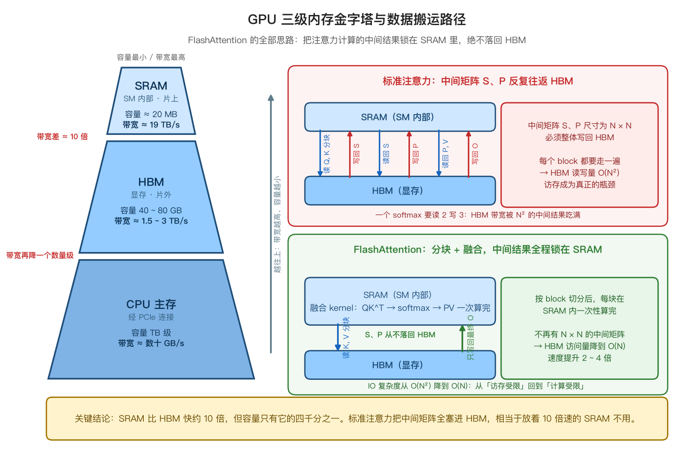

上图展示 GPU 的三级内存金字塔与数据搬运路径。SRAM 在 SM 内部，带宽最高但容量仅约 20 MB；HBM 是显存，容量大但带宽只有 SRAM 的十分之一；CPU 主存通过 PCIe 连接，带宽再降一个数量级。FlashAttention 的全部思路就是：**把注意力计算的中间结果锁在 SRAM 里，绝不落回 HBM**。

#### 7.5.2 FlashAttention v1：IO 感知的分块加在线 softmax

**解决什么问题**：上面分析的 `O(N^2)` HBM 读写。

**两条核心技术**：

**技术一：分块（Tiling）**

既然 SRAM 装不下整个 $N × N$ 矩阵，那就**把计算切成小块**。外层循环遍历 K、V 的块，内层循环遍历 Q 的块：每次把一块 $B_r × d$ 的 Q 和一块 $B_c × d$ 的 K、V 从 HBM 载入 SRAM，在 SRAM 里完成这一小块注意力计算，直接把输出累加到 O 的对应行，**S 和 P 从头到尾没有在 HBM 里存在过**。

**技术二：在线 softmax（Online Softmax）**

分块带来一个数学障碍：softmax 需要**全局的行最大值和行求和**，而分块计算时你只看到了部分元素。如果先算完所有块再 softmax，就得把中间结果存回 HBM，白干了。

FlashAttention 用**在线 softmax**（也叫 streaming softmax、Milakov 与 Gimelshein 的方法）解决：维护两个running 统计量——当前已见元素的行最大值 `m` 和归一化分母 `l`。每处理一个新块：

1. 计算新块的行最大值 $m_{\mathrm{new}} = max(m_{\mathrm{old}}, rowmax(S_{\mathrm{block}}))$；
2. 用 `exp(m_old - m_new)` 缩放旧的累加器 `O`，用 `exp(m_old - m_new)` 缩放旧的分母 `l`；
3. 把新块的 $exp(S_{\mathrm{block}} - m_{\mathrm{new}}) · V_{\mathrm{block}}$ 加进 `O`，把 $rowsum(exp(S_{\mathrm{block}} - m_{\mathrm{new}}))$ 加进 `l`；
4. 循环结束后，除以 `l` 得到最终输出。

这个"缩放旧累加器"的操作叫 **rescaling**，它是 v1 里非矩阵乘法开销的主要来源（v2 会重点优化它）。

```python
# FlashAttention v1 前向核心循环（伪代码）
O = zeros(N, d); m = -inf(N); l = zeros(N)

for j in range(0, N, Bc):                       # 遍历 K, V 块
    Kj, Vj = load(K[j:j+Bc], V[j:j+Bc])         # HBM 到 SRAM
    for i in range(0, N, Br):                   # 遍历 Q 块
        Qi = load(Q[i:i+Br]); Oi, mi, li = O[i:i+Br], m[i:i+Br], l[i:i+Br]
        Sij = Qi @ Kj.T                          # SRAM 内 GEMM
        mi_new = maximum(mi, rowmax(Sij))
        p = exp(Sij - mi_new)                    # SRAM 内
        li = li * exp(mi - mi_new) + rowsum(p)   # 在线更新分母
        Oi = Oi * exp(mi - mi_new) + p @ Vj      # 在线更新输出（含 rescale）
        mi = mi_new
        O[i:i+Br], m[i:i+Br], l[i:i+Br] = Oi, mi, li

O = O / l                                        # 最后统一归一化
```

**IO 复杂度与效果**：

- 标准注意力 HBM 访问：$Θ(N^2 + Nd)$；
- FlashAttention HBM 访问：$\Theta(N^2 d^2 / M)$，其中 `M` 是 SRAM 大小。由于 `M` 通常远大于 `d`（A100 上 20 MB 对比 $128^2 \times 2$ 字节 $= 32\,\mathrm{KB}$），实际减少 **4 到 16 倍**的显存流量。
- 显存占用从 `O(N^2)` 降到 `O(N)`（只需存输出 `O` 和统计量 `m`、`l`。
- **结果是精确的，不是近似**——在线 softmax 在数学上与标准 softmax 完全等价。

**实测**：GPT-2 上相比标准实现 **2 到 4 倍**加速，序列越长收益越大；BERT-large 比 MLPerf 1.1 记录快 15%，XLNet 快 47%。

**训练时的反向传播**：FlashAttention 采用类似梯度检查点的策略——前向不保存 `S` 和 `P`，反向时用 `O`、`m`、`l` 加上原始 Q、K、V 在 SRAM 里重算。FLOPs 略增，但省掉了 `O(N^2)` 的 HBM 读写，**净收益为正，重算开销实测不到 5%**。

#### 7.5.3 FlashAttention v2：向 GEMM 的效率看齐

**解决什么问题**：v1 比标准实现快了 2 到 4 倍，但**只达到 A100 理论峰值算力的 25% 到 40%**，而高度优化的 GEMM 能做到 80% 到 90%。差距在哪？

作者诊断出三个原因，对应三个改进：

**改进一：减少非矩阵乘法 FLOPs（约贡献 15%）**

A100 上矩阵乘法走 Tensor Core，FP16 达 312 TFLOPS；但 softmax 需要的 `exp`、`max`、逐元素乘加走的是**多功能单元**，FP32 只有 **19.5 TFLOPS**，**慢了 16 倍**。v1 里每处理一个块都要对累加器 `O` 做一次 rescale，这是纯逐元素运算，非常昂贵。

v2 的做法：**把 rescale 从循环里挪出去**。不对每个块都做 $O = O · exp(m_{\mathrm{old}} - m_{\mathrm{new}})$，而是在循环内只维护未归一化的累加器，把最终归一化推迟到循环结束后**只做一次**。数学上等价，但省掉了 $N/B_c$ 次的全量 rescale。

**改进二：沿序列长度维度并行化（约贡献 50%，长序列上）**

v1 只在 **batch** 和 **头数** 两个维度上并行。当 batch 小、头数少时，GPU 的 SM 大量空闲（低占用率）。

v2 把外层循环改成遍历 **Q 的块**（而不是 K、V 的块），每个 Q 块由一个独立的线程块处理——这样即使只有一个头、batch 为 1，也能把序列切成很多块塞满所有 SM。

**改进三：优化 warp 之间的工作划分（约贡献 20%）**

- v1：把 K、V 切给 4 个 warp，每个 warp 各自算一部分 $QK^T$，然后**通过共享内存通信同步**结果——产生大量共享内存读写；
- v2：把 **Q** 切给 4 个 warp，K、V 由所有 warp 共享。每个 warp 独立计算自己那部分 Q 的完整输出，**不需要 warp 之间通信**。

**外加一个因果掩码的免费午餐**：自回归模型要用 causal mask，v1 会把掩码应用到所有块上（包括那些被完全掩码掉的块，算了也白算）。v2 直接**跳过完全被掩码的 tile**，在 causal 场景下额外带来约 **2 倍**加速。

**IO 复杂度的理论最优性**：后续理论工作证明，在 `M` 远大于 $d^2$ 的常见区间内，FlashAttention-2 达到的 $Θ(N^2 d^2 / M)$ 已经是**最优**（差常数因子或多对数因子）。

**实测性能**：

| 指标 | 数值 |
|---|---|
| 相对 FlashAttention v1 | 约 **2 倍**加速 |
| A100 FP16 前向 | 达理论峰值的 **73%** |
| A100 FP16 后向 | 达理论峰值的 **63%** |
| 端到端训练 GPT 类模型 | 每 A100 达 **225 TFLOPS**（72% MFU） |
| 相对标准 PyTorch 注意力 | 最高 **9 倍** |

#### 7.5.4 FlashAttention v3：榨干 Hopper 的异步能力

**解决什么问题**：FlashAttention-2 在 A100 上能到 70% 峰值，但在 **H100 上只有 35%**。原因是它把 H100 当 A100 用——完全没利用 Hopper 架构的三个新硬件特性。

**Hopper 的三件新武器**：

1. **WGMMA（Warpgroup Matrix Multiply-Accumulate）**：新一代 Tensor Core 指令，吞吐量远高于 Ampere 的 `mma.sync`。没有 WGMMA，旧指令只能达到 Hopper Tensor Core 峰值吞吐的约三分之二。
2. **TMA（Tensor Memory Accelerator）**：专用硬件单元，负责全局内存与共享内存之间的**异步**批量数据传输，索引计算和越界检查都由硬件完成。这释放了大量寄存器资源，让块能开得更大。
3. **FP8 低精度**：Tensor Core 吞吐量翻倍——H100 SXM 上 FP16 为 **989 TFLOPS**，FP8 为 **1979 TFLOPS**（以上均为**稠密 dense 算力**；若启用 2:1 结构化稀疏，官方口径的 FP16 为 1979、FP8 为 3958 TFLOPS。看 NVIDIA 白皮书时务必分清这两个口径，否则会以为差了整整一倍）。

**FlashAttention-3 的三个技术创新**：

**创新一：Warp 专业化（Warp Specialization）**

把线程块里的 warp 分成**生产者**和**消费者**两组：生产者 warp 专职发起 TMA 异步加载，消费者 warp 专职做 WGMMA 矩阵乘。两者通过环形共享内存缓冲区交接，用 `__sync_warpgroup` 这类快速同步原语协调。这样数据搬运和计算彻底重叠，**HBM 延迟被完全隐藏**。

**创新二：GEMM 与 Softmax 的乒乓流水线（Pingpong Scheduling）**

这个问题的动机是一个非常漂亮的数字对比：H100 SXM5 上 FP16 矩阵乘是 **989 TFLOPS**，而特殊函数（softmax 的指数运算）只有 **3.9 TFLOPS**——**慢了 256 倍**！在头维度 128 时，矩阵乘的 FLOPS 是指数运算的 **512 倍**，这意味着**指数运算可能占到与矩阵乘相当的 50% 时间**。FP8 下更糟：矩阵乘速度翻倍，指数运算速度不变。

所以必须让矩阵乘和 softmax **并行跑**：Tensor Core 做矩阵乘的同时，多功能单元去算指数。

- **跨 warpgroup 的乒乓调度**：warpgroup 1 先做 GEMM，然后当它做 softmax 时，warpgroup 2 做 GEMM，如此交替。实测把 FP16 前向从约 570 TFLOPS 提到 **620 TFLOPS**。
- **warpgroup 内部的流水线**：即使单个 warpgroup 内，也可以让部分 softmax 与 GEMM 重叠（代价是寄存器压力上升）。实测从 620 提到 **640 到 660 TFLOPS**。

**创新三：FP8 加非相干处理（Incoherent Processing）**

FP8 的问题是量化误差——LLM 激活值里常有幅度远超其他特征的**离群值（outlier）**，导致量化困难。

FlashAttention-3 引入非相干处理：用**随机正交矩阵（Hadamard 变换加随机符号）**去乘 Q 和 K，把离群值的能量"摊平"到其他维度上，从而降低量化误差。Hadamard 变换只需 `O(d log d)` 而不是 `O(d^2)` 时间，且因为它是 memory-bound 的，可以与同样是 memory-bound 的旋转位置嵌入（RoPE）**免费融合**。

实测：在 0.1% 条目为大离群值的合成数据上，量化误差降低 **2.6 倍**。

**FlashAttention-3 实测性能**（H100）：

| 精度 | 性能 | 说明 |
|---|---|---|
| FP16 | 最高 **740 TFLOPS**，达 H100 理论峰值的 **75%** | 比 FlashAttention-2 快 **1.5 到 2.0 倍**（基准测试常见 1.6 到 1.8 倍） |
| FP8 | 接近 **1.2 PFLOPS** | 误差比基线 FP8 注意力低 2.6 倍 |

#### 7.5.5 三代 FlashAttention 横向对比

| 维度 | 标准注意力 | FA v1 | FA v2 | FA v3 |
|---|---|---|---|---|
| 目标硬件 | 通用 | Ampere（A100） | Ampere（A100） | Hopper（H100） |
| HBM 访问复杂度 | `O(N^2)` | `O(N^2 d^2 除以 M)` | 同 v1（已证最优） | 同 v1 |
| 显存占用 | `O(N^2)` | `O(N)` | `O(N)` | `O(N)` |
| 是否精确 | 是 | **是（非近似）** | 是 | 是 |
| GPU 峰值利用率 | 约 25% | 25% 到 40% | **50% 到 73%** | **75%**（H100） |
| 相对前代加速 | 基准 | 2 到 4 倍 | 约 2 倍 | 1.5 到 2.0 倍 |
| 关键创新 | 无 | 分块加在线 softmax | 减少非 matmul FLOP、序列维并行、warp 重分工 | Warp 专业化、GEMM 与 Softmax 重叠、FP8 加非相干处理 |
| 低精度支持 | FP16 加 BF16 | FP16 加 BF16 | FP16 加 BF16 | FP16、BF16、**FP8** |

> **面试高频追问：FlashAttention 是近似算法吗？** 不是。它计算的结果与标准注意力**逐位等价**（在浮点误差范围内）。优化的是**访存顺序**，不是数学内容。这一点必须答死——很多人误以为 FlashAttention 牺牲了精度。

#### 7.5.6 FlashDecoding：把长序列的 KV 切开并行

**解决什么问题**：FlashAttention 的并行维度是 batch 和头数，**在 Decode 阶段这两者都很小**——batch 可能只有 1 到 8，头数虽然几十但每个头的 KV 长度很长。结果是 GPU 严重欠饱和。

**核心思路**：既然 batch 和头数不够并行，那就**沿 KV 序列长度这个维度切**：

1. 把 KV Cache 沿序列维切成若干个 chunk（比如把 8192 长度切成 8 段，每段 1024）；
2. 每个 chunk **分配一个独立的 CUDA 线程块**，各自并行计算自己那段的部分注意力结果（局部的 `O`、`m`、`l`）；
3. 最后用一个轻量级的**归约 kernel（combine kernel）**把所有 chunk 的部分结果合并成最终输出。

因为每个 chunk 都维护自己的 running `m` 和 `l`，合并时只需再做一次标准的在线 softmax 合并——数学上仍然是精确的。

**收益**：在 batch 小、序列长的场景下，FlashDecoding 能把 Decode 的注意力部分加速 **数倍**；序列越长、batch 越小，收益越大。它已经是 vLLM 和 FlashAttention 官方库里处理长上下文 Decode 的标准做法。

**关键洞察**：FlashDecoding 提供的是**延迟**优化（单请求更快），而加大 batch 提供的是**吞吐**优化。二者不冲突，可以叠加。

#### 7.5.7 FlashAttention 与 PagedAttention 如何共存

**面试常问**：这两个 Attention 名字里都有 Attention，它们是一回事吗？是竞争关系吗？

**不是一回事，也不冲突——它们解决的是完全不同层次的问题**：

| 维度 | FlashAttention | PagedAttention |
|---|---|---|
| 层次 | **算子层**（单次注意力的 kernel 怎么写） | **系统层**（KV Cache 显存怎么管） |
| 解决的问题 | 单次注意力计算时 HBM 读写太多 | KV Cache 显存碎片与浪费 |
| 优化目标 | 降低单次计算的延迟与显存峰值 | 提高并发数与吞吐 |
| 手段 | 分块、在线 softmax、异步流水线 | 分页、块表、写时复制 |
| 效果 | 显存从 `O(N^2)` 降到 `O(N)` | 显存利用率从 20% 提到 96% |

**它们如何配合**：vLLM 的实现里，PagedAttention 负责告诉 kernel "第 `j` 个逻辑块在哪个物理地址"，FlashAttention 负责"拿到这些块之后怎么高效地算"。具体实现是 **PagedAttention v2 kernel**——它重写了 FlashAttention 的分块循环，把"从 HBM 载入 K、V 块"这一步替换成"先查块表、再从对应物理地址载入 K、V 块"。

也就是说：

- **FlashAttention 的分块逻辑保留了**（在 SRAM 里做 tile、在线 softmax）；
- **块的来源从"连续地址"变成了"块表跳转后的任意地址"**；
- 代价是需要额外的块表查表开销（约 20% 到 26% 的 kernel 延迟），但换来的是 96% 的显存利用率。

所以 vLLM 的性能公式大致是：**吞吐 = FlashAttention 的算子效率 × PagedAttention 的显存效率 × 连续批处理的调度效率**。三者是乘法关系，缺一不可。

---

### 7.6 投机解码 Speculative Decoding

#### 7.6.1 动机：Decode 的串行依赖能不能打破

回到 §7.1.5 的结论：Decode 慢的根源是**每一步都要把整个模型的权重从 HBM 读一遍，却只产出 1 个 token**。

自然的想法：能不能一次 forward 产出多个 token？答案是**不能**——自回归的因果依赖决定了第 `t+1` 个 token 依赖第 `t` 个 token 的输出。

但投机解码提供了一个精妙的迂回：**先用一个便宜的模型"猜"一串 token，再用大模型一次性"验"这一串**。"验"这一步是可以并行的（因为 `k` 个候选 token 都已经存在了，每个位置的前缀都是已知的），一次 forward 就能给出 `k` 个位置的全部 logits——这刚好把 `k` 次串行的大模型 forward 压成 1 次并行的 forward。

#### 7.6.2 原理：Draft 提议加 Target 并行验证

标准的投机解码（Leviathan et al. 2023，Chen/DeepMind 2023 同期独立提出）流程：

**第一步：Draft（提议）**

用一个**小得多的 draft 模型**（比如 target 是 70B，draft 用 7B）自回归地生成 $γ$ 个候选 token，得到序列 `x_1, ..., x_γ` 以及每个位置的 draft 概率分布 `p(x_i | 前缀)`。

这一步是串行的，但 draft 模型小，**成本低**。

**第二步：Verify（验证）**

把原始前缀加上这 $γ$ 个候选 token **拼成一个长度为 $γ$ 的序列**，一次性喂给 target 模型做一次 Prefill 式的 forward，**并行地**得到所有 $γ+1$ 个位置的 target 概率分布 `q(x_i | 前缀)`。

注意：**这一步产出的是 $γ+1$ 个分布**（第 $γ+1$ 个位置是 draft 没猜的，正好可以免费多采样一个 token）。

**第三步：Accept（接受或拒绝）**

从左到右逐个比较 draft 概率 `p` 和 target 概率 `q`，用**改进的拒绝采样**决定每个位置的 token 是被接受还是被拒绝：

- 若 `q(x_i)` 大于或等于 `p(x_i)`：直接接受；
- 若 `q(x_i)` 小于 `p(x_i)`：以 `q(x_i)` 除以 `p(x_i)` 的概率接受；
- 一旦某位置被拒绝，就从修正后的分布 `norm(max(0, q - p))` 中重新采样一个 token，并且**该位置之后的所有候选全部丢弃**。

**第四步：回退与继续**

把接受的 token 拼到输出里，回到第一步继续下一轮。

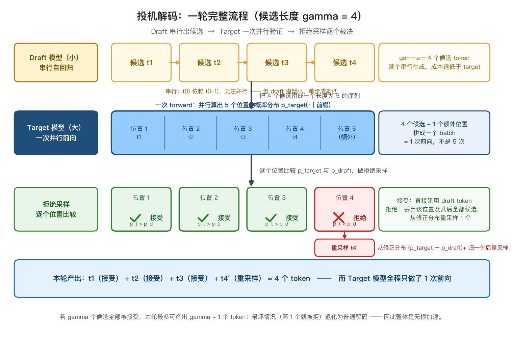

上图展示一轮投机解码的完整流程。上方是 draft 模型串行自回归地生成 4 个候选 token（浅色）；中部是 target 模型把这 4 个 token 拼成一个序列，一次 forward 并行算出 5 个位置的概率分布（深色的一次并行前向）；下方是逐个位置做拒绝采样比较，本例中前 3 个被接受、第 4 个被拒绝并从修正分布重采样，本轮共产出 4 个 token（3 个接受加重采 1 个），而 target 模型只跑了 1 次 forward。

#### 7.6.3 接受率与加速比公式

**符号定义**：

- $α$（接受率）：单个 draft token 被接受的概率，取值 0 到 1；
- $γ$：每轮 draft 提议的 token 数；
- `c`：draft 模型单次 forward 的成本与 target 模型单次 forward 成本的比值（通常 0.02 到 0.1）；
- `T`：target 模型单次 forward 的时间。

**每轮期望接受的 token 数**

假设各位置接受事件独立且概率同为 $α$，则"接受的 token 数"服从截断几何分布：

$$
\mathbb{E}[\text{accepted tokens}] = \sum_{k=1}^{\gamma} \alpha^k + 1 = \frac{1 - \alpha^{\gamma+1}}{1 - \alpha}
$$

注意末尾的 `+1`——即使所有 $γ$ 个候选都被接受，target 还会免费多产出 1 个 token；如果中途被拒绝，那个位置会被重采样成一个新 token，所以**每轮至少产出 1 个 token，最多产出 $γ+1$ 个**。

**每轮的期望耗时**

- draft 生成 $γ$ 个 token：$γ · c · T$；
- target 验证 1 次：`T`；
- 合计：$(γ c + 1) · T$。

**期望加速比**

$$
\text{Speedup} = \frac{\mathbb{E}[\text{accepted tokens}] \cdot T}{(\gamma c + 1) \cdot T} = \frac{1 - \alpha^{\gamma+1}}{(1 - \alpha)(\gamma c + 1)}
$$

**这个公式的四个推论**（面试必答）：

1. **加速比随 $α$ 单调上升，且是超线性的**。$α$ 从 0.5 提到 0.8，加速比可能翻倍。所以**接受率是投机解码的生命线**。
2. **$γ$ 不是越大越好**。分子 $1 - α^{γ+1}$ 随 $γ$ 增大趋于饱和（上限 $1/(1-α)$），分母 $γc+1$ 却线性增长。**存在一个最优 $γ$，通常在 3 到 8 之间**。
3. **`c` 是关键杠杆**。draft 模型越小越快，`c` 越小，收益越大。这也解释了为什么要用"feature 级"的 draft（EAGLE 只有 0.24B 到 0.99B 参数）。
4. **加速比存在理论上限** $1/(1-α)$。即使 $γ$ 趋近无穷、`c` 趋近 0，加速比也不会超过 $1/(1-α)$。所以 $α = 0.5$ 时最多快 2 倍，$α = 0.8$ 时最多快 5 倍。

#### 7.6.4 无损性：为什么采样分布完全一致

**这是投机解码最反直觉、也最容易被追问的地方**：明明用了小模型的输出，凭什么说结果和直接用大模型采样是同分布的？

**直觉解释（拒绝采样的经典套路）**：

拒绝采样有一个经典结论：如果你有目标分布 `q`，但只能用提议分布 `p` 采样，那么"以概率 `min(1, q(x)/p(x))` 接受样本 `x`，被拒绝时从修正分布重采样"这个流程，最终产出的样本**精确服从 `q`**。

投机解码正是这个套路的多步版本：

- 当 `q(x)` 大于或等于 `p(x)` 时，接受概率取 1；
- 当 `q(x)` 小于 `p(x)` 时，接受概率取 `q(x)` 除以 `p(x)`；

两者合起来就是 `min(1, q(x)/p(x))`。被拒绝的位置从 `norm(max(0, q-p))` 重采样——这一项精确地补上了"提议分布覆盖不到的那部分目标质量"。论文的附录给出了严格的归纳证明。

**贪心解码下的无损性更直观**：如果不用采样、只用 argmax（temperature 为 0），那么验证规则退化为"draft 的 argmax 与 target 的 argmax 一致就接受，不一致就用 target 的 token 替换并从该位置截断"。这个流程产出的序列与逐 token 贪心解码**逐 token 完全相同**——因为每一步你都在用 target 的真实 argmax 覆盖 draft 的猜测。

**重要边界**：

- **贪心解码**：严格无损，输出逐字相同；
- **带温度的采样**：分布无损（同分布），但**具体输出序列会不同**——因为它走了一条不同的随机路径。这意味着**同样的 seed 和 prompt，开不开投机解码得到的文本不一样**。这是生产环境需要注意的：如果你依赖可复现性，要么接受这个差异，要么在验证阶段固定随机数流。
- **数值误差**：不同 batch 形状下 kernel 的浮点累加顺序可能不同，极端情况下会有极小的数值差异。

#### 7.6.5 三条技术路线：独立 Draft、自 Draft、无 Draft

**路线一：独立 draft 模型（标准 Speculative Decoding）**

- **做法**：用一个同系列的小模型（LLaMA-7B 给 LLaMA-70B 做 draft，Qwen-1.8B 给 Qwen-72B 做 draft）。
- **优点**：实现简单，draft 模型可独立优化；接受率高（同系列模型分布接近）。
- **缺点**：需要额外显存常驻一个模型；**draft 和 target 的 tokenizer 与词表必须一致**，否则无法直接比较概率；小模型在某些专业领域（代码、数学、医疗）与大模型差距大，接受率暴跌。
- **适用**：有现成同系列小模型的场景。

**路线二：EAGLE（特征级外推）**

EAGLE（Extrapolation Algorithm for Greater Language-model Efficiency，ICML 2024）是目前**公认最快的投机方法**，已被 vLLM、SGLang、TensorRT-LLM、MLC-LLM 等主流框架集成。

- **核心洞察**：**LLM 的特征向量序列在时间上是可压缩的**——从前面的特征预测后面的特征，比从前面的 token 预测后面的 token 容易得多。
- **做法**：不从 token 层面 draft，而是拿 target 模型**倒数第二层的上下文特征向量**，用一个极轻量的自回归头（Auto-regression Head）去外推下一层的特征，再用 target 的 LM head 把特征映射回 token 分布。
- **draft 模型规模**：Vicuna-13B 的 EAGLE 头只有 **0.37B** 参数，LLaMA3-8B-Instruct 的只有 **0.25B**——比"用小模型当 draft"小一到两个数量级。
- **实测性能**（官方 README，Vicuna 13B 与 LLaMA2-Chat 13B 场景）：

| 方法 | 相对 vanilla 自回归解码的加速 |
|---|---|
| EAGLE-1（13B） | **3 倍** |
| EAGLE-2（13B） | **4 倍**（比 EAGLE-1 再快 1.4 倍） |
| EAGLE-3（13B） | **5.6 倍**（比 EAGLE-1 快 1.8 倍） |
| 对比 Lookahead | EAGLE 快 **2 倍** |
| 对比 Medusa | EAGLE 快 **1.6 倍** |

- **EAGLE-2 的改进**：用 draft 模型输出的置信度来**近似接受率**，据此动态调整 draft 树的结构（高置信处展开更多分支）。不需要额外训练，复用 EAGLE-1 权重。
- **EAGLE-3 的改进**：移除特征预测约束，改用训练时测试（training-time testing）来模拟这个过程；同时把顶层特征替换为**低、中、高层语义特征的融合**。
- **训练成本**：8 张 RTX 3090 上 **1 到 2 天**可训完——门槛很低。

**路线三：Medusa（多头并行，自 draft）**

- **做法**：不引入独立 draft 模型，而是**在 target 模型最后一层隐状态上直接挂 `k` 个额外的解码头（Medusa Head）**。第 1 个头预测下一个 token，第 2 个头预测下下个 token，以此类推。这些头用 target 模型自己的隐状态训练，只训练这些头（Medusa-1）或连同 backbone 一起训（Medusa-2）。
- **关键创新：树状注意力（Tree Attention）**：单个头在每个位置会给出 top-k 个候选，`k` 个头的候选组合起来是**指数级**的路径。Medusa 用**树结构**组织这些候选，并设计一个树掩码（tree mask），让一次 forward 就能验证整棵树上的所有路径——这是 Medusa 相对朴素多头方案的核心优势。
- **优点**：无独立 draft 模型，显存开销小（只是几个额外的 head）；与 target 模型同分布，接受率不错；可以只微调 head，冻结 backbone 保持原模型能力。
- **缺点**：需要为每种 target 模型单独训练 Medusa 头；头数固定，不如 EAGLE 的动态树灵活；原始 Medusa 的加速比（约 2.2 到 2.5 倍）低于 EAGLE。
- **适用**：没有合适小模型、但能接受一次 head 微调的场景。

**路线四：Lookahead Decoding（无 draft 模型）**

- **做法**：完全不需要 draft 模型，也不需要训练。利用 **Jacobi 迭代**思想：维护一个 n-gram 池（从模型自己已经生成的历史里提取），每一步并行地验证多个 n-gram 候选。
- **原理**：Jacobi 解码把自回归生成看成一个非线性方程组的定点迭代——先随机猜一串 token，然后反复用模型前向去"修正"直到收敛。Lookahead 用历史 n-gram 作为高质量的初始猜测，大幅减少迭代次数。
- **优点**：**零训练、零额外模型、即插即用**，对任何模型开箱可用；纯 Jacobian 并行，不引入第二个模型的显存。
- **缺点**：加速比低于 EAGLE（官方数据：EAGLE 比 Lookahead 快 2 倍）；n-gram 池的维护有 CPU 开销；在高度发散的开放生成任务上命中率下降明显（代码、模板化文本命中率最高）。

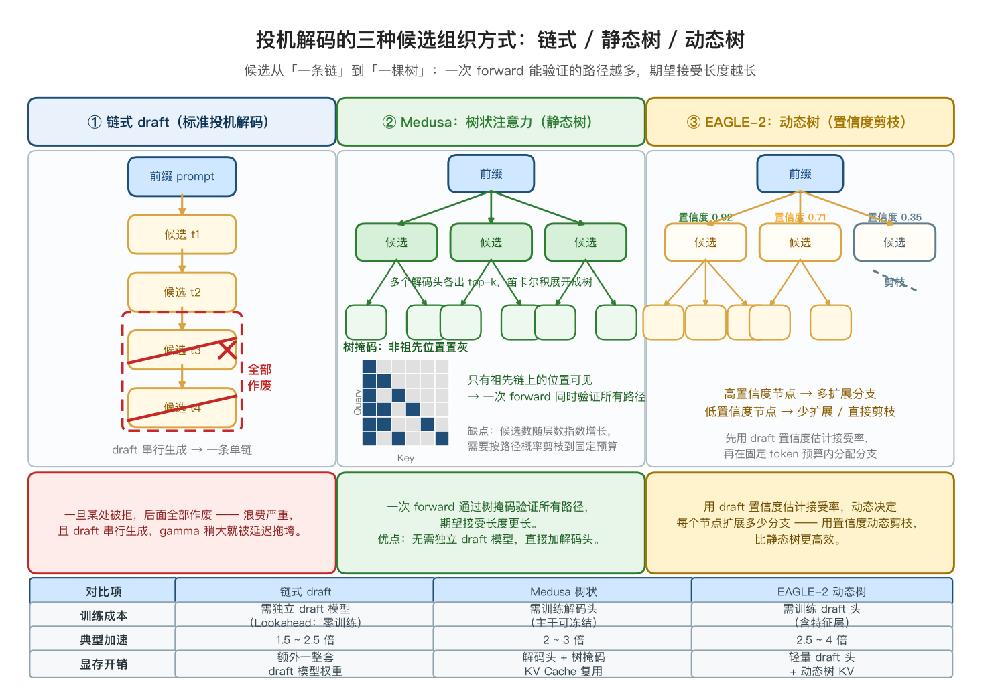

上图对比三种投机解码的候选组织方式。左侧标准链式 draft：draft 模型串出一条单链，target 验证这条链，一旦某处被拒，后面全部作废——浪费严重。中部 Medusa 的树状注意力：多个解码头各给出 top-k 候选，组合成一棵树，一次 forward 通过树掩码验证所有路径，接受路径更长。右侧 EAGLE-2 的动态树：用 draft 置信度估计接受率，动态决定每个节点展开多少分支（图中高置信节点展开 3 个分支、低置信节点只展开 1 个），把有限的 token 预算花在刀刃上。

#### 7.6.6 投机解码什么时候不划算

**这是面试的高阶问题——只会背公式不够，要说清适用边界。**

**不划算的情况**：

1. **batch size 已经很大时**。这是最重要的一个。当 batch 大到 Decode 已经转回 compute-bound（GPU 算力打满），投机解码带来的"少读几次权重"就不再是瓶颈，反而 draft 生成的开销和验证时的额外算力变成净负担。**经验法则：batch size 小于 8 到 16 时收益明显，超过 32 后收益迅速衰减甚至为负**。所以投机解码**主要是在线低并发场景的延迟优化手段，不是吞吐优化手段**。
2. **draft 与 target 差距过大**。小模型在专业领域（医疗、法律、数学竞赛）与大模型分布差异大，$α$ 可能掉到 0.3 以下，此时加速比接近 1，纯属白跑。
3. **输出高度发散的创作任务**。诗歌、开放式故事生成，接受率天然低；相反，代码补全、SQL 生成、格式化输出、模板化文案这类"可预测性强"的任务接受率常在 0.7 到 0.9，**是投机解码的最佳战场**。
4. **显存紧张时**。draft 模型要常驻显存，EAGLE 头虽然小，但 Medusa 的多头加独立 draft 模型会挤占 KV Cache 空间——而 KV Cache 空间直接决定并发数。**这是一个典型的"用并发换延迟"的取舍**。
5. **短输出场景**。只生成 20 个 token 的请求，投机解码的轮次启动开销占比高，收益被摊薄。
6. **Prefill 占主导时**。如果请求的 prompt 远长于输出（比如长文摘要），瓶颈在 Prefill 而不在 Decode，投机解码完全没有用武之地。

**划算的判断清单**（可直接背）：

| 条件 | 是否利于投机解码 |
|---|---|
| batch size 小（1 到 16） | 强烈有利 |
| 输出长（数百 token 以上） | 有利 |
| 任务可预测性强（代码、SQL、模板） | 有利 |
| 有同系列小模型或可训练 draft 头 | 有利（否则选 Lookahead） |
| 显存充裕 | 有利 |
| 高并发吞吐优先 | **不利** |
| Prefill 主导（长输入短输出） | **不利** |
| 高发散创作任务 | **不利** |

---

### 7.7 长上下文推理

长上下文（32K 到 1M token）的挑战分布在三个层面：**模型能不能理解**（位置编码外推）、**算得动不算得动**（注意力复杂度与显存）、**服务会不会被拖垮**（长 Prefill 的干扰）。三者要分开讲。

#### 7.7.1 位置编码外推：让训练在 4K 的模型理解 128K

**问题**：RoPE（Rotary Position Embedding，旋转位置编码）是绝对位置编码的一种相对化实现——它把位置 `m` 编码成作用在 Q、K 上的旋转矩阵，使得 $q_m^T k_n$ 只依赖相对位置 `m - n`。理论上它可以外推到任意长度，但**实测中一旦超过训练长度，困惑度（PPL）会灾难性飙升**。

**为什么**：训练时模型只见过有限范围内的旋转角度，超出范围的旋转模式是"分布外"的，注意力头不知道怎么处理。

**演进路线一：位置插值 PI（Positional Interpolation，Chen et al. 2023）**

**做法**：把位置索引整体缩放。位置 `m` 的编码改成 `m` 除以 `s`，其中 `s` 等于目标长度除以训练长度（如从 4K 扩到 32K 时 `s = 8`）。

**直觉**：原来 4K 的位置被"拉伸"到 32K，所有位置都落在训练见过的范围内。

**代价**：**高频分量被过度压缩**。RoPE 的不同维度对应不同的旋转频率，低频维度（捕捉长距离语义）本来就变化缓慢，再插值就更分不开了，模型区分近邻位置的能力下降。

**效果**：LLaMA 7B 到 65B 上，仅用 1000 步长文本微调，就把上下文扩到 32768。

**演进路线二：NTK-aware 插值（2023 年中）**

**洞察**：PI 对所有频率一视同仁地缩放是不合理的。根据 **NTK（Neural Tangent Kernel）理论**，高频维度应该保留更多分辨率（不缩放或缩放少），低频维度才需要大幅插值。

**做法**：对 RoPE 的底数 `b`（默认 10000）做变换，把缩放改成作用在频率上：

$$
b' = b \cdot s^{\frac{d}{d-2}}
$$

**效果**：**无需任何微调**就能显著改善外推（"免训练外推"），这是它相对 PI 的最大优势。后续又发展出 NTK-by-parts（分段处理不同频段的维度）。

**演进路线三：YaRN（Yet another RoPE extensioN，2023 年末）**

**做法**：集大成者，结合三招：

1. **NTK-by-parts 插值**：按维度频率分段，高频不插值、中频部分插值、低频完全插值；
2. **注意力温度校正**：在 softmax 前给注意力 logits 乘一个与缩放因子相关的温度 `sqrt(长度缩放的对数修正)`，补偿长序列下注意力分布变平的问题；
3. **只在少量长文本上微调**（典型是 64 到 400 步）。

**效果**：LLaMA-2 7B 到 70B 上以 **远低于之前方法的训练成本和 token 数**，把上下文扩到 **64K 和 128K**，且在长文档问答、长文摘要上保持接近原模型的性能。YaRN 是 2024 年社区最主流的长上下文扩展方案，被大量模型采用。

**演进路线四：LongRoPE（Microsoft，2024）**

**做法**：三个创新叠加：

1. **非均匀插值**：不再用统一的缩放因子，而是**用进化搜索为每个 RoPE 维度寻找最优缩放因子**（识别并保留需要保留的高频维度）；
2. **渐进式扩展**：先在 256K 上扩展，再以 256K 模型为起点继续扩到 2048K，避免一次跨度过大的不稳定；
3. **短上下文恢复**：扩展后模型在原始短上下文（4K、8K）上的性能会退化，LongRoPE 专门做了恢复，保证"扩长了但没变笨"。

**效果**：把 LLaMA2-7B 和 Mistral-7B 的上下文扩展到 **2048K（约 200 万 token）**，同时保持在原始短上下文窗口内的性能——这是"非均匀插值"思路的胜利。

| 方法 | 是否需要微调 | 典型扩展倍数 | 关键思想 | 代表应用 |
|---|---|---|---|---|
| PI 位置插值 | 需要（约 1000 步） | 8 倍（4K 到 32K） | 位置索引整体缩放 | LLaMA 长上下文早期方案 |
| NTK-aware | **免训练** | 8 到 16 倍 | 按频率缩放底数，保高频 | 快速外推验证 |
| YaRN | 少量（64 到 400 步） | 16 到 32 倍（到 128K） | NTK 分段加注意力温度校正 | 2024 年社区主流 |
| LongRoPE | 需要（分阶段） | 512 倍（到 2048K） | 逐维度非均匀搜索加渐进扩展 | 超长文档场景 |

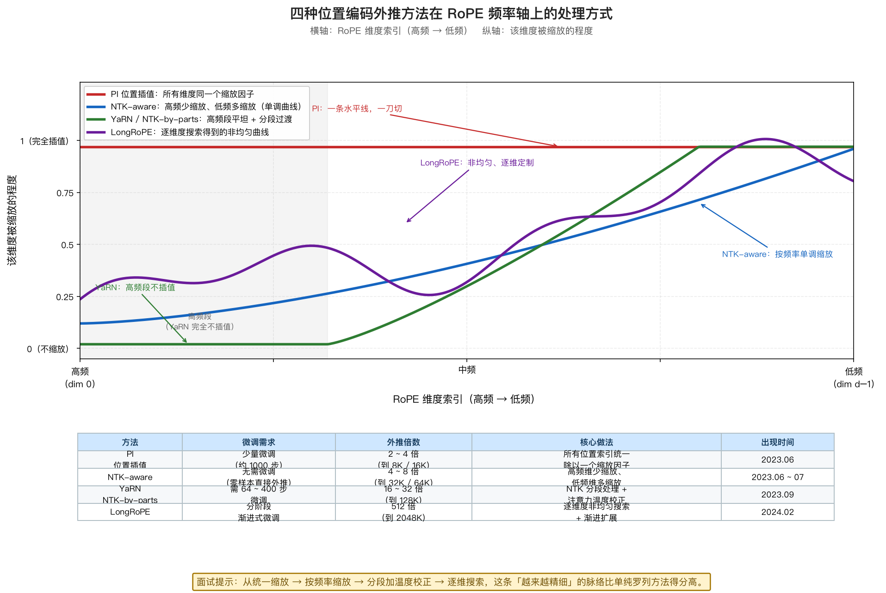

上图对比四种位置编码外推方法在 RoPE 旋转频率轴上的处理方式。横轴是 RoPE 的维度索引（从高频到低频），纵轴是该维度被缩放的程度。PI 对所有维度施加同一个缩放因子（水平线）；NTK-aware 让高频维度少缩放、低频维度多缩放（单调曲线）；YaRN 的 NTK-by-parts 分段处理，高频段完全不插值（平坦段）；LongRoPE 用搜索得到的非均匀曲线，逐维度定制。右侧示意的是各方法在超出训练长度后的困惑度曲线，PI 最早飙升，LongRoPE 最晚。

> **面试提醒**：回答长上下文外推时，按 **PI 到 NTK-aware 到 YaRN 到 LongRoPE** 这条时序讲，并点出"从统一缩放 → 按频率缩放 → 分段加温度校正 → 逐维搜索"这个"越来越精细"的脉络，比单纯罗列方法得分高得多。

#### 7.7.2 Chunked Prefill：为什么长 Prefill 会拖垮全体请求

**问题**：一个 32K token 的长文档请求进来，它的 Prefill 是 compute-bound 的，会**连续占据 GPU 算力几百毫秒到数秒**。在这段时间里，同机上所有正在 Decode 的请求都排不上队——它们的 TPOT（每个输出 token 的时间）会出现一个巨大的尖刺，用户会感觉到"回复突然卡住"。

这在生产环境是**最容易被投诉的抖动来源**之一：明明我的请求很短，为什么会被别人的长请求拖慢？

**Chunked Prefill 的做法**（源自 SARATHI 等工作的思路，现已是主流引擎的标配）：

1. 把长 Prefill 请求**切成固定大小的 chunk**（例如每 chunk 512 或 2048 个 token）；
2. 调度器**每个 step 只处理一个或少数几个 chunk**，chunk 与 Decode 请求**混合组成同一个 batch** 一起送进 GPU；
3. 这样每个 step 的耗时被"削峰填谷"成一个稳定的值，Decode 请求最多晚一个 step，不会被卡住几百毫秒。

**为什么这样能提升整体吞吐**（一个反直觉的收益）：

Prefill 是 compute-bound，Decode 是 memory-bound。把它们混在一起，**Prefill 的算力需求刚好填补 Decode 留下的算力空闲，而 Decode 的显存带宽需求刚好填补 Prefill 留下的带宽空闲**——两者互补，GPU 的算力和带宽同时被更充分地利用。这就是混合批处理（mixed batching）的"削峰"效应。

**关键调参**：`max_num_batched_tokens` 决定单个 step 能处理的最大 token 总数，它是**延迟与吞吐的权衡阀**：

- 设得小（如 512）：单 step 快，TPOT 平稳，但 Prefill 被切得很碎，TTFT 变长，且 kernel 效率下降；
- 设得大（如 16384）：Prefill 快，TTFT 短，但单 step 耗时长，TPOT 抖动大。

生产环境的经验是先按 P99 TTFT 和 P99 TPOT 的 SLA 反推一个值，再压测微调。

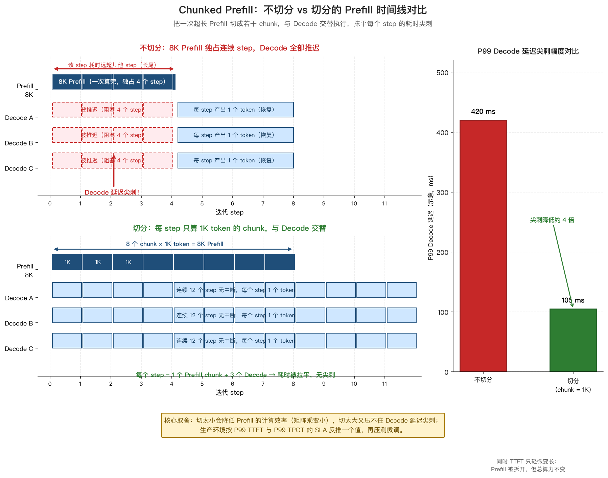

上图对比不切分与切分的 Prefill 时间线。上半部分：一个 8K token 的 Prefill 请求独占连续的多个 step（深色长条），期间三个 Decode 请求（浅色短条）全部被推迟，造成明显的延迟尖刺。下半部分：Prefill 被切成每 step 1K token 的 chunk（深色短条），与 Decode 请求交替执行，每个 step 的耗时被拉平，Decode 请求的最坏等待时间从 8 个 step 降到 1 个 step。

#### 7.7.3 Prefill-Decode 分离架构

**问题**：即使有了 Chunked Prefill，Prefill 和 Decode 仍然共享同一张卡的**权重量化方式、并行策略、batch 策略**——而这两者的最优配置根本不同：

| 维度 | Prefill 的最优配置 | Decode 的最优配置 |
|---|---|---|
| 瓶颈 | 算力（compute-bound） | 显存带宽（memory-bound） |
| 理想 batch | 小 batch 就够（长序列本身算量大） | **batch 越大越好**（摊薄权重读取） |
| 理想并行策略 | 张量并行降低延迟 | 张量并行加**更大的 DP 或 EP** 提高吞吐 |
| 理想量化 | 高精度（Prefill 对精度敏感） | 可更激进（Decode 主要受带宽限制） |
| 显存压力 | 主要是激活值 | 主要是 KV Cache |

**做法**：把 Prefill 和 Decode **部署到不同的 GPU 实例组**上：

1. 请求进来，先路由到一个 **Prefill 实例**做预填充，算出全部 KV Cache；
2. 通过高速网络（NVLink 或 RDMA）**把 KV Cache 传输到一个 Decode 实例**；
3. Decode 实例负责逐 token 生成，完成后返回结果。

**代表工作**：

- **DistServe**（OSDI 2024）：首次系统性地论证并实现了 P-D 分离，核心贡献是提出"按阶段分别优化批处理策略和并行策略"，并给出基于延迟 SLA 的自动资源配比算法。实测在同等 SLA 下显著提升可服务的请求率。
- **Mooncake**（Moonshot AI，Kimi 的线上架构）：**以 KV Cache 为中心的分离式架构**。核心是构建一个**分布式 KV Cache 池**（Mooncake Store），把 CPU 内存、SSD、GPU 显存统一成多层 KV Cache 存储，并通过"以存换算"（把可复用的 KV Cache 缓存下来，命中就跳过 Prefill）大幅提升吞吐。Mooncake 是 Kimi 在真实超大规模在线服务上验证过的架构，是 P-D 分离工程化的标杆。
- **vLLM 的 P-D 分离**：vLLM 从 v1 版本起支持 P-D 分离，并配套推出 **vLLM Router**——一个用 Rust 写的高性能、状态感知负载均衡器，支持 NIXL 和 NCCL 两种分离后端，并提供一致性哈希把同一会话粘到同一 worker 以复用 KV Cache。官方基准显示 vLLM Router 相比 llm-d 高 25% 吞吐、相比 K8s 原生负载均衡高 100% 吞吐。

**P-D 分离的代价**：

1. **KV Cache 传输开销**：一次请求的 KV Cache 可能有几百 MB 到数 GB，传输时间必须远小于 Prefill 时间才有意义。所以**必须有 NVLink 或 RDMA，纯 TCP 网络基本不可行**。
2. **调度复杂度**：需要动态决定 Prefill 与 Decode 实例的配比（流量波动时配比要跟着变），还要处理实例故障。
3. **适用场景受限**：只对"长输入、短输出"或"长输入、长输出"的场景收益大；短 prompt 场景下 KV Cache 传输的开销可能超过收益。

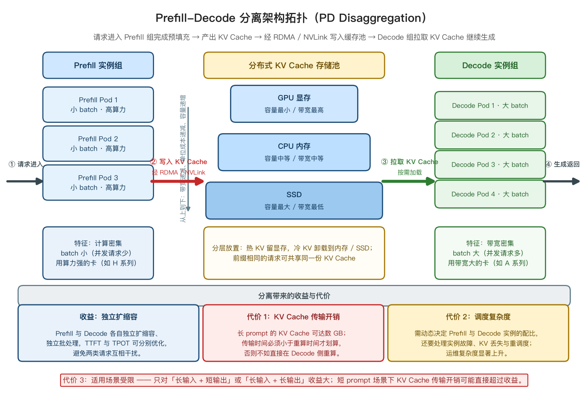

上图是 Prefill-Decode 分离架构的拓扑。左侧是 Prefill 实例组（几个 pod），中间是分布式 KV Cache 存储层（GPU 显存加 CPU 内存加 SSD 的多层池），右侧是 Decode 实例组。请求先到 Prefill 组完成预填充并产出 KV Cache，KV Cache 经由 RDMA 或 NVLink 写入缓存池，Decode 组从池中拉取对应 KV Cache 继续生成。图中还标注了 KV Cache 复用的路径：如果缓存池里已存在相同前缀的 KV Cache，请求可以跳过 Prefill 直接进 Decode 组。

#### 7.7.4 上下文压缩

当序列长到 KV Cache 装不下、或者注意力计算太慢时，还可以从"减少 KV 本身"入手：

**路线一：KV Cache 量化**

最简单直接。FP16 转 FP8 直接砍半，转 INT4 砍到四分之一。工程上常用的是 **per-token 加 per-channel 的分组量化**。收益确定，代价是长上下文任务（如 needle-in-a-haystack）上可能有轻微退化，需要做精度敏感的层跳过（如保留前几层为 FP16）。

**路线二：KV Cache 驱逐（Eviction）**

观察到注意力是**稀疏的**——生成某个 token 时，绝大多数历史 token 的注意力权重接近 0。于是可以动态淘汰不重要的 KV。

- **StreamingLLM**：发现并保留**注意力汇（attention sink）**——序列最前面几个 token 会吸引大量注意力（即使语义上不重要），保留它们加一个滑动窗口，就能让模型在**无限长**的流式输入上稳定工作，而不需要完整 KV Cache。
- **H2O（Heavy-Hitter Oracle）**：按累计注意力分数淘汰"非重击者"，只保留注意力分数最高的历史 token 加最近的滑动窗口。
- **Scissorhands、FastGen** 等：不同的重要性度量与逐头自适应策略。

**代价**：这些方法**不是无损的**——被驱逐的 KV 不可恢复。在需要"大海捞针"（长文档中精确检索某个细节）的任务上可能显著退化。适合流式对话、长文摘要这类"近期信息为主"的场景。

**路线三：Prompt 压缩（软提示压缩）**

用另一个模型把长 prompt 压缩成少量"软 token"（如 Gisting、AutoCompressor、ICAE）。这类方法需要在输入侧做额外计算，且压缩后的表示可解释性差，工程落地较少。

**路线四：稀疏注意力**

从架构上让注意力的复杂度低于 `O(N^2)`：滑动窗口注意力（Mistral）、局部加全局混合（Longformer、BigBird）、线性注意力（RWKV、Mamba 类状态空间模型）。这类是**训练期就要定下来**的方案，不是推理期的后优化。

---

### 7.8 推理引擎与部署栈

#### 7.8.1 六大引擎横向对比

| 维度 | vLLM | TGI | TensorRT-LLM | SGLang | LMDeploy | Ollama |
|---|---|---|---|---|---|---|
| 主导方 | vLLM 社区（原 UC Berkeley） | Hugging Face | NVIDIA | SGLang 社区（LMSYS 系） | 上海 AI Lab（InternLM 团队） | Ollama 团队 |
| 核心定位 | 通用高吞吐服务引擎 | 生产级托管服务 | **NVIDIA 硬件上的极致性能** | 复杂 LLM 程序的低延迟运行时 | 国产化与量化部署 | **本地桌面一键跑** |
| 核心优势技术 | PagedAttention、连续批、前缀缓存 | 连续批、流式、监控完善 | 图编译、算子融合、FP8、in-flight 批 | **RadixAttention 前缀树缓存**、结构化输出、投机解码 | **W4A16 AWQ 与 KV 量化**、TurboMind 引擎 | 极简 UX、模型即命令行 |
| 硬件绑定 | NVIDIA、AMD、**TPU**、多种后端 | NVIDIA、AMD、**Gaudi**、Inferentia | **仅 NVIDIA**（强绑定） | NVIDIA、AMD | NVIDIA、**昇腾等国产卡** | NVIDIA、AMD、**Apple Silicon**、CPU |
| 量化支持 | FP8、INT8、AWQ、GPTQ、bitsandbytes | GPTQ、AWQ、bitsandbytes、**EETQ** | FP8、INT8、INT4、**FP4**、AWQ | FP8、INT8、AWQ、GPTQ | **AWQ、KV INT8 与 INT4** | GGUF（llama.cpp 生态） |
| 长上下文 | P-D 分离、Chunked Prefill、前缀缓存 | 支持，能力中等 | 强（FP8 KV Cache、多卡） | 强（RadixAttention 命中率极高） | 支持 | 一般 |
| 投机解码 | 支持（EAGLE、Medusa、n-gram） | 支持 | 支持（含 EAGLE） | **支持且调优最好** | 支持 | 不支持 |
| 结构化输出 | 支持（XGrammar 等后端） | 支持（Outlines 后端） | 支持 | **支持（XGrammar 发源地）** | 支持 | 简单 JSON 模式 |
| 上手难度 | 低（`pip install` 加 OpenAI 兼容 API） | 低（Docker 优先） | **高**（需编译引擎、写 config） | 低 | 中 | **极低** |
| 适用场景 | 通用在线服务的默认选择 | 需要 HF 生态集成与托管 | 追求单卡极限吞吐、有工程投入 | 多轮 Agent、复杂提示编排 | 国产卡与显存受限场景 | 本地开发、桌面应用、个人助手 |

**选型建议（可直接背）**：

1. **默认选 vLLM**——社区最大、模型覆盖最广、硬件后端最多、OpenAI 兼容 API 开箱即用。90% 的场景它是正确答案。
2. **追求 NVIDIA 单卡极限性能、且团队有工程投入**选 TensorRT-LLM。它需要对每个模型编译一个 engine（有编译时间和版本耦合成本），但吞吐通常是最高的一档。
3. **多轮对话与 Agent 场景**选 SGLang——RadixAttention 的前缀缓存命中率远高于 vLLM 的块级前缀缓存，在"系统提示巨长加多轮对话"的场景下 TTFT 优势明显。
4. **国产化或显存极度受限**选 LMDeploy，它的 W4A16 量化与 KV 量化组合能在消费级卡上跑大模型。
5. **本地开发、演示、个人助手**选 Ollama。不要用它做生产服务——它的设计目标是易用性，不是吞吐。

> **面试陷阱**：不要说"哪个引擎最快"。正确答法是**先问场景**——并发多少、prompt 多长、什么硬件、要不要结构化输出、有没有国产化要求。脱离场景谈引擎优劣是没有意义的。

#### 7.8.2 结构化输出：让模型吐出合法的 JSON

**解决什么问题**：LLM 的输出是自由文本，但生产系统常常需要它能被程序解析——JSON、SQL、函数调用参数、特定格式的枚举。用 prompt 说"请输出 JSON"是不可靠的，模型经常输出 Markdown 代码块包裹、多余的解释文字、或者语法错误。

**技术路线：受限解码（Constrained Decoding、Guided Decoding）**

核心思想是**在采样阶段直接屏蔽非法 token**：

1. 用户提供 Schema（JSON Schema、正则表达式、上下文无关文法 CFG）；
2. 框架把 Schema 编译成一个**状态机**（正则表达式编译成 DFA 或 NFA，CFG 编译成下推自动机）；
3. 每一步解码时，先根据当前状态机状态算出**允许的下一个 token 集合**，构造一个掩码（mask）；
4. 把掩码作用到 logits 上（非法位置置为负无穷），再采样；
5. 采样出的 token 推进状态机状态，循环。

**结果**：**保证 100% 语法合法**，且不需要模型"自觉"。

| 方案 | 形式化工具 | 特点 |
|---|---|---|
| **Outlines** | 正则表达式、JSON Schema、CFG | Python 生态，最早普及的方案之一，TGI 的后端 |
| **XGrammar** | 上下文无关文法（CFG） | SGLang 团队出品，**性能最好**：把词表预先按"是否改变状态机状态"分类，绝大多数 step 只需查一个预计算的掩码位图，开销极低 |
| **Guidance** | 类模板语言 | 微软出品，把生成过程写成带约束的模板 |
| **lm-format-enforcer** | JSON Schema、正则 | 轻量，Hugging Face 生态常用 |
| **引擎内建 JSON Mode** | 各家自定义 | vLLM、TensorRT-LLM、SGLang 都内建，通常底层接 Outlines 或 XGrammar |

**工程要点与坑**：

- **首次编译 Schema 有开销**（把 JSON Schema 转成状态机），生产环境要**缓存**编译结果，否则每次请求都编译，首 token 延迟会爆炸；
- **性能影响有限但非零**：掩码构造是有成本的，XGrammar 通过"持久执行栈加词表预分类"把开销压到很低，但批量小、输出短时相对占比仍可见；
- **只保证语法，不保证语义**。模型输出的 JSON 语法一定合法，但字段值可能仍然是错的——该做的业务校验一个都不能少；
- **与投机解码的相互作用**：投机解码的 draft token 如果落在被掩码屏蔽的位置，会被直接拒绝，导致接受率下降。这是一个真实的调优点。

#### 7.8.3 服务指标体系

**四个核心延迟指标**（面试必会，且要能说清各自受什么影响）：

| 指标 | 全称 | 定义 | 主要受什么影响 |
|---|---|---|---|
| **TTFT** | Time To First Token | 从请求发出到收到第一个 token | **Prefill 时间加排队时间**。受 prompt 长度、调度队列深度、前缀缓存命中率影响 |
| **TPOT** | Time Per Output Token | 每个输出 token 的平均时间（不含首 token） | **Decode 单步时间**。受 batch size、模型大小、KV Cache 长度、带宽影响 |
| **ITL** | Inter-Token Latency | 相邻两个 token 之间的间隔 | 与 TPOT 接近，但**逐 token 统计，能暴露抖动**。受 Prefill 抢占、抢占恢复影响 |
| **E2E Latency** | End-to-End Latency | 从发出到收完最后一个 token | `TTFT 加 TPOT 乘 输出长度` |

**吞吐指标**：

| 指标 | 定义 | 说明 |
|---|---|---|
| **Throughput（吞吐）** | 单位时间生成的 token 总数（tokens/s） | 系统整体产出能力 |
| **Request Throughput** | 单位时间完成的请求数（req/s 或 RPS） | 更贴近业务视角 |
| **Goodput（有效吞吐）** | **满足 SLA 前提下的吞吐** | 最重要但最容易被忽略 |

**为什么 Goodput 比 Throughput 重要**（面试加分点）：

一个系统可以把 batch 开到极大，把吞吐做到很高，但每个请求的 TTFT 都被拖到 10 秒——这种"高吞吐"对在线服务毫无意义。**只有同时满足延迟 SLA 的那些请求才算有效产出**。DistServe 等工作的核心评测指标就是 Goodput（在满足 TTFT 和 TPOT 的 SLO 下，系统每秒能服务多少请求），而不是裸吞吐。

**利用率指标**：

| 指标 | 含义 | 健康区间 |
|---|---|---|
| KV Cache 利用率 | 已用 KV 块占总块的百分比 | 持续高于 90% 说明该扩容或缩短上下文 |
| 抢占次数（preemptions） | 因显存不足被换出的序列数 | **持续非零是显存规划的红灯** |
| 排队请求数 | 等待队列长度 | 持续积压说明容量不足 |
| Batch size 分布 | 实际并发序列数 | 远小于 `max_num_seqs` 说明请求量不足或调度受限 |

**SLA 设计的经验法则**：

1. **在线对话**：TTFT 的 P99 小于 1 秒，TPOT 的 P99 小于 50 ms（对应约 20 tokens/s，接近人类阅读速度）；
2. **流式补全与代码**：TTFT 更敏感（用户盯着光标等），TPOT 可放宽；
3. **离线批处理**：只看总吞吐，延迟无所谓——这时应该把 batch 开到最大、开启激进的投机解码关闭。

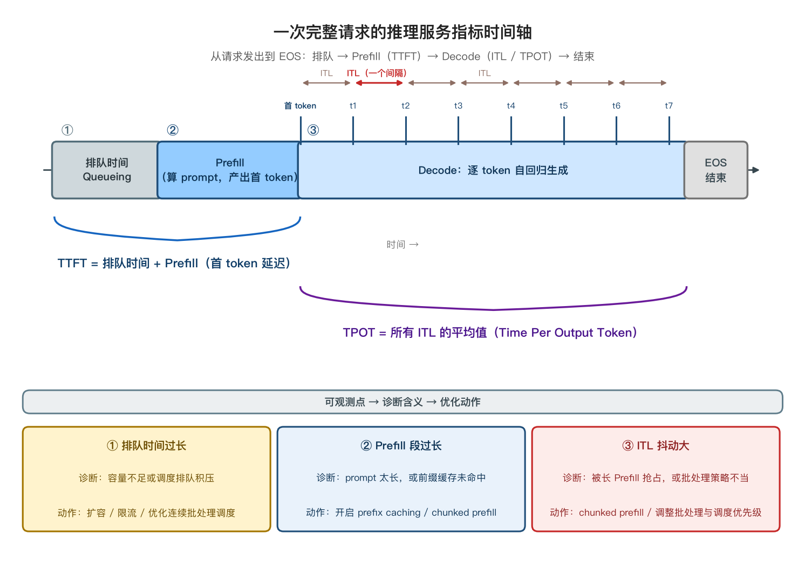

上图是一次完整请求的指标时间轴。横轴是时间，从请求发出开始。第一段是排队时间，接着是 Prefill 阶段（对应 TTFT），然后是若干个 Decode step（相邻 token 之间的间隔是 ITL，所有 ITL 的平均值是 TPOT），最后是 EOS。图中还标注了几个关键的可观测点：排队时间过长说明容量不足、Prefill 段过长说明 prompt 太长或前缀缓存未命中、ITL 出现尖刺说明有长 Prefill 抢占了算力。

### 7.9 手算模板（白板必会）

这一节的全部题目都给出**完整的中间步骤**。面试时不要跳步——考官看的是推导过程，不是最终数字。

---

#### 7.9.1 题目一：KV Cache 显存计算

**题目**：计算一个 32 层、GQA 8 组、`head_dim = 128` 的 7B 量级模型，在 `batch = 8`、`seq_len = 4096`、FP16 精度下的 KV Cache 显存大小。

**公式回顾**：

$$
M_{\text{KV}} = 2 \cdot L \cdot n_{\text{kv}} \cdot d_h \cdot b \cdot S \cdot p
$$

**符号代入**：

| 符号 | 值 | 说明 |
|---|---|---|
| `2` | 2 | K 和 V 各一份 |
| `L` | 32 | 层数 |
| $n_{\mathrm{kv}}$ | 8 | KV 头数（GQA 组数） |
| $d_h$ | 128 | 每头维度 |
| `b` | 8 | batch size |
| `S` | 4096 | 序列长度 |
| `p` | 2 | FP16 每元素 2 字节 |

**分步计算**：

第一步，算**每个 token** 需要缓存多少个元素：

$$
2 \times 32 \times 8 \times 128 = 65536 \ \text{个元素}
$$

第二步，换算成字节：

$$
65536 \times 2 = 131072 \ \text{字节} = 128 \ \text{KB}
$$

> **这个"每 token 128 KB"是必须记住的中间量**。有了它，任何长度、任何 batch 都能心算。

第三步，乘序列长度，得**单条序列**的 KV Cache：

$$
131072 \times 4096 = 536870912 \ \text{字节} = 512 \ \text{MB}
$$

第四步，乘 batch：

$$
512 \ \text{MB} \times 8 = 4096 \ \text{MB} = \mathbf{4 \ \text{GB}}
$$

**答案：4 GB。**

**延伸一：加上权重的总显存**

7B 模型 FP16 权重约 14 GB（8B 是 16 GB）。按 8B 算：

$$
16 \ \text{GB（权重）} + 4 \ \text{GB（KV Cache）} = 20 \ \text{GB}
$$

再加上激活值、CUDA context、碎片（通常留 2 到 4 GB），一张 **A100 40GB 就够，80GB 更是绰绰有余**。

**延伸二：换成真实的 LLaMA-2-7B（易错点）**

如 §7.1.3 所述，**LLaMA-2-7B 是 MHA，`n_kv = 32` 而不是 8**。重算：

$$
2 \times 32 \times 32 \times 128 \times 2 = 524288 \ \text{字节} = \mathbf{512 \ \text{KB 每 token}}
$$

$$
512 \ \text{KB} \times 4096 \times 8 = 16 \ \text{GB}
$$

**答案是 16 GB，是上面结果的 4 倍**。这就是 GQA 的价值——把 KV Cache 从 16 GB 砍到 4 GB，同样的卡可以多跑 4 倍的并发。

> **面试提醒**：如果考官说"LLaMA-2-7B，GQA 8 组"，你可以礼貌地指出"LLaMA-2-7B 实际是 MHA 32 个 KV 头，32 层加 GQA 8 组加 `head_dim = 128` 是 LLaMA-3-8B 的配置，我两个都算一遍"。**这个订正本身就是加分项**——它证明你真的碰过这些模型，不是背博客。

**延伸三：FP8 KV Cache**

`p` 从 2 变 1，直接砍半：4 GB 变 **2 GB**；真实 LLaMA-2-7B 从 16 GB 变 **8 GB**。

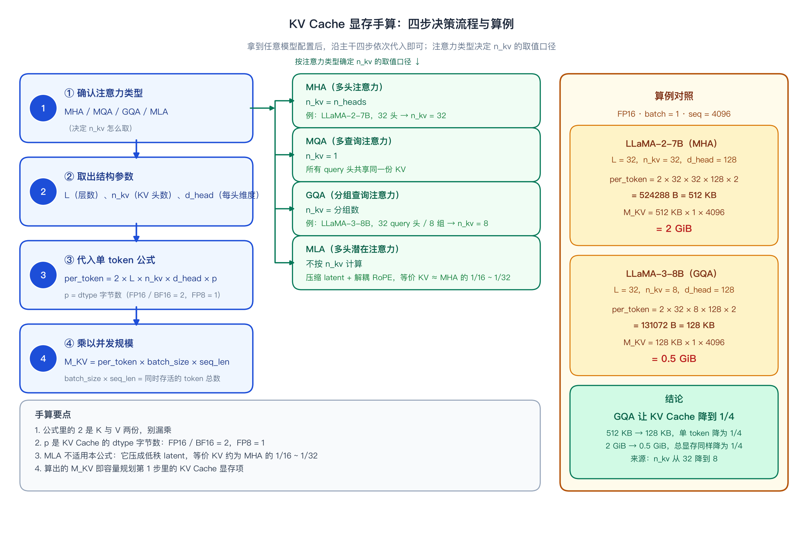

上图展示了题一的因子分解树：从最底层的六个因子（`2`、`L`、$n_{\mathrm{kv}}$、$d_h$、`b`、`S`、`p`）出发，逐层收敛到"每 token 每层 4 KB"、"每 token 全模型 128 KB"，再乘序列长度与 batch 得到最终 4 GB，最后与模型权重相加得到总显存；右侧两条虚线分支分别对应 MHA（4 倍）与 FP8（减半）两个变体。掌握这棵树，任何 KV Cache 显存题都能在 30 秒内估出量级。

**延伸四：反向估算并发上限（工程更常用）**

反过来用：一张 A100 80GB，扣掉权重 16 GB 与开销 4 GB，剩 60 GB 给 KV Cache。在 4096 上下文（单条 512 MB）下：

$$
\frac{60 \ \text{GB}}{512 \ \text{MB}} \approx 117 \ \text{条并发}
$$

如果上下文涨到 32K（单条 4 GB），并发直接掉到约 **15 条**。**上下文长度与并发数成反比，这是所有长上下文服务的硬约束**，也是 §7.7 各种长上下文优化技术存在的理由。

---

#### 7.9.2 题目二：判断 Prefill 与 Decode 的瓶颈

**题目**：A100 80GB SXM（HBM 带宽 2039 GB/s，FP16 Tensor Core 312 TFLOPS），部署 7B 模型（FP16 权重 14 GB）。假设序列长度 1024，KV Cache 每 token 128 KB。请计算 Decode 阶段在不同 batch 下的算术强度，判断是 memory-bound 还是 compute-bound，并给出单步耗时。

**第一步：算机器的平衡点（ridge point）**

$$
I_{\text{machine}} = \frac{312 \times 10^{12} \ \text{FLOP/s}}{2039 \times 10^{9} \ \text{Byte/s}} = 153 \ \text{FLOP/Byte}
$$

判据：算术强度大于 153 为 compute-bound，小于 153 为 memory-bound。

**第二步：算 batch = 1 的情况**

显存搬运量：

$$
M_{\text{moved}} = 14 \ \text{GB} + 128 \ \text{KB} \times 1024 = 14 \ \text{GB} + 0.128 \ \text{GB} = 14.13 \ \text{GB} = 1.413 \times 10^{10} \ \text{Byte}
$$

计算量（一个 token 过一遍 7B 模型，前向 FLOPs 为 `2N`）：

$$
\text{FLOPs} = 2 \times 7 \times 10^{9} = 1.4 \times 10^{10} \ \text{FLOP}
$$

算术强度：

$$
I = \frac{1.4 \times 10^{10}}{1.413 \times 10^{10}} \approx \mathbf{1 \ \text{FLOP/Byte}}
$$

**1 远小于 153，所以 batch 为 1 时 Decode 是极端 memory-bound。**

单步耗时：

$$
t_{\text{mem}} = \frac{14.13 \ \text{GB}}{2039 \ \text{GB/s}} = 6.93 \ \text{ms} , \qquad
t_{\text{compute}} = \frac{1.4 \times 10^{10}}{312 \times 10^{12}} = 0.045 \ \text{ms}
$$

算力利用率：

$$
\frac{0.045}{6.93} = \mathbf{0.65\%}
$$

> **这个 0.65% 是本节最震撼的数字**：batch 为 1 时，你花大价钱买的 312 TFLOPS 算力，**99.35% 是闲置的**。单序列吞吐约 $1 / 6.93ms ≈ 144 tokens/s$。

**第三步：batch 从 1 加到 32**

$$
\text{FLOPs} = 32 \times 1.4 \times 10^{10} = 4.48 \times 10^{11}
$$

$$
M_{\text{moved}} = 14 \ \text{GB} + 32 \times 0.128 \ \text{GB} = 18.19 \ \text{GB} = 1.819 \times 10^{10} \ \text{Byte}
$$

$$
I = \frac{4.48 \times 10^{11}}{1.819 \times 10^{10}} = \mathbf{24.6 \ \text{FLOP/Byte}}
$$

仍然远小于 153，**还是 memory-bound**。单步耗时：

$$
t = \frac{18.19}{2039} = 8.92 \ \text{ms}
$$

**关键对比**：

| 指标 | batch 为 1 | batch 为 32 | 变化 |
|---|---|---|---|
| 单步耗时 | 6.93 ms | 8.92 ms | 仅 **1.29 倍** |
| 单步产出 token | 1 | 32 | **32 倍** |
| 总吞吐 | 144 tokens/s | **3587 tokens/s** | **约 25 倍** |

**这就是"Decode 阶段加大 batch 是免费的午餐"的定量证明**——单步时间几乎不变，吞吐线性上涨。

**第四步：什么时候能转成 compute-bound？**

要让 `I` 达到 153，需要 `FLOPs` 与 `Bytes` 之比等于 153：

$$
\frac{b \times 1.4 \times 10^{10}}{14 \times 10^{9} + b \times 0.128 \times 10^{9}} = 153
$$

$$
b \times 1.4 \times 10^{10} = 153 \times (14 + 0.128 b) \times 10^{9}
$$

$$
14 b = 2142 + 19.58 b
$$

左边系数 14 小于右边 19.58，**方程无正解**——也就是说，在 1024 上下文下，**无论 batch 多大都不可能让算术强度达到 153**，因为 KV Cache 本身也在随 batch 线性增长，把带宽消耗一起抬上去了。

如果上下文更短（比如 512），KV 项系数减半，`14b = 2142 + 9.79b`，得 $b ≈ 511$。也就是说**在 512 上下文下需要约 500 的并发才能撞上算力墙**——而这时 KV Cache 已经占用 $500 × 64 MB = 32 GB$，加上权重 14 GB，接近 80 GB 上限。

**结论（面试标准答案）**：

> **在线服务的 Decode 阶段，在现实可达的 batch size 范围内几乎永远是 memory-bound。因此 Decode 优化的第一性原理是提高 batch 并发数，而 batch 的天花板由 KV Cache 显存决定，这就是 PagedAttention 的价值所在。**

**附：Prefill 的算术强度**

Prefill 处理 `n` 个 token，注意力部分 FLOPs 约 $4 n^2 d$，搬运 `4 n d p` 字节：

$$
I_{\text{attn-prefill}} \approx \frac{4 n^2 d}{4 n d p} = \frac{n}{p} = \frac{n}{2}
$$

`n = 1024` 时 `I = 512`，**远大于 153，所以 Prefill 是 compute-bound**。这就把两个阶段判据讲全了。

---

#### 7.9.3 题目三：静态批与连续批的吞吐差异

**题目**：一个批次有 8 个槽位，其中 6 个短请求各输出 50 token，2 个长请求各输出 1000 token。假设 Prefill 时间忽略，且 Decode 单步耗时 `T` 与 batch 大小无关（memory-bound 假设）。比较静态批与连续批的吞吐和平均延迟。

**静态批（Static Batching）**

总步数由最长的请求决定：

$$
\text{steps} = \max(50, 50, \dots, 1000, 1000) = 1000
$$

有用 token 总数：

$$
6 \times 50 + 2 \times 1000 = 300 + 2000 = 2300 \ \text{tokens}
$$

槽位利用率（有用 token 数除以总槽位步数）：

$$
\eta_{\text{static}} = \frac{2300}{8 \times 1000} = 28.75\%
$$

> **七成的 GPU 算力被 padding 烧掉了。**

吞吐（每单位 `T` 产出多少 token）：

$$
\text{Throughput}_{\text{static}} = \frac{2300}{1000 T} = \frac{2.3}{T}
$$

平均延迟：**每个请求都要等整批跑完**，所以无论长短都是 `1000T`：

$$
\text{Latency}_{\text{static}} = 1000 T
$$

**连续批（Continuous Batching）**

短请求在第 50 步完成，**槽位立即释放并由队列里的新请求接上**。假设队列充足，8 个槽位全程满载工作：

$$
\text{有用 token 总数} = 8 \times 1000 = 8000 \ \text{tokens}
$$

$$
\eta_{\text{continuous}} = 100\%
$$

$$
\text{Throughput}_{\text{continuous}} = \frac{8000}{1000 T} = \frac{8}{T}
$$

平均延迟：短请求在第 50 步就返回，长请求在第 1000 步返回：

$$
\text{Latency}_{\text{continuous}} = \frac{6 \times 50 T + 2 \times 1000 T}{8} = \frac{300 T + 2000 T}{8} = 287.5 T
$$

**对比结果**

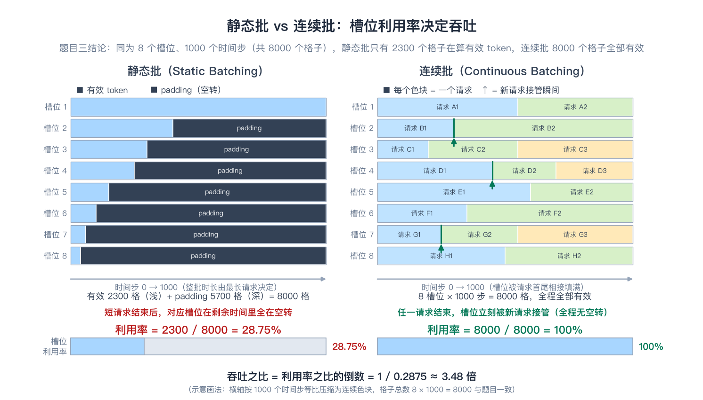

上图把题目三的结论可视化：左侧静态批的 8 个槽位在 1000 步中只有 2300 个格子是有效 token（浅色），其余 5700 个格子是 padding（深色），利用率 28.75%；右侧连续批中每个槽位在请求结束后立即被新请求接管，全程 8000 个格子全部有效。两者吞吐之比恰好等于槽位利用率之比的倒数，即 1 除以 0.2875 约等于 3.48 倍。

| 指标 | 静态批 | 连续批 | 提升 |
|---|---|---|---|
| 槽位利用率 | 28.75% | 100% | 3.48 倍 |
| 吞吐 | 每单位 `T` 产出 `2.3` 个 token | 每单位 `T` 产出 `8` 个 token | **3.48 倍** |
| 平均延迟 | `1000 T` | `287.5 T` | **3.48 倍** |
| 短请求延迟 | `1000 T` | `50 T` | **20 倍** |

**三个要点**：

1. **吞吐提升与延迟提升是同一个数字（3.48 倍）**，这不是巧合——由 Little's Law（$L = λW$）保证：并发数固定时，吞吐的提升必然等比例地降低平均驻留时间。
2. **短请求是最大受益者（20 倍）**。这正是"队头阻塞"被消除的直接体现，也是线上 P99 延迟改善最明显的地方。
3. **提升倍数可以直接用槽位利用率算**：`1 除以 0.2875 = 3.48`。这个公式可以推广——只要能估算出静态批的槽位利用率，就能立刻给出连续批的收益上界。

**推广公式**：

$$
\text{连续批相对静态批的收益} \approx \frac{1}{\eta_{\text{static}}} = \frac{\text{batch size} \times \max(\text{输出长度})}{\sum \text{各请求输出长度}}
$$

也就是说，**输出长度的方差越大，连续批收益越大**。长度完全齐整时收益为 1（没有提升）——这也解释了为什么离线批处理场景（长度可控）不太需要连续批。

---

#### 7.9.4 题目四：投机解码的加速比

**题目**：接受率 $α = 0.7$，每轮提议 $γ = 5$ 个 token，draft 模型单次前向成本是 target 的 `c = 0.05`。求期望加速比，并讨论 $γ$ 和 $α$ 的敏感性。

**公式**：

$$
\mathbb{E}[\text{accepted}] = \frac{1 - \alpha^{\gamma+1}}{1 - \alpha} , \qquad
\text{Speedup} = \frac{1 - \alpha^{\gamma+1}}{(1-\alpha)(\gamma c + 1)}
$$

**第一步：算期望接受 token 数**

先算 $α$ 的各次幂：

$$
0.7^1 = 0.7,\ 0.7^2 = 0.49,\ 0.7^3 = 0.343,\ 0.7^4 = 0.2401,\ 0.7^5 = 0.16807,\ 0.7^6 = 0.117649
$$

代入：

$$
\mathbb{E}[\text{accepted}] = \frac{1 - 0.7^{6}}{1 - 0.7} = \frac{1 - 0.117649}{0.3} = \frac{0.882351}{0.3} = 2.941
$$

**每轮平均产出 2.941 个 token**（而不是 5 个——因为有拒绝）。

**第二步：算每轮耗时**

$$
T_{\text{round}} = (\gamma c + 1) \cdot T = (5 \times 0.05 + 1) \cdot T = 1.25 T
$$

**第三步：算加速比**

$$
\text{Speedup} = \frac{2.941 \times T}{1.25 \times T} = \mathbf{2.35 \ \text{倍}}
$$

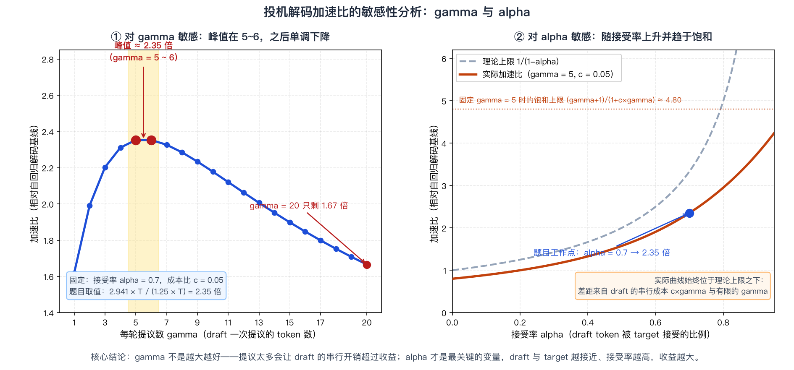

上图把加速比对两个自变量的敏感性画成曲线。左图固定接受率 $α = 0.7$ 与成本比 `c = 0.05`，横轴是每轮提议数 $γ$，曲线在 5 到 6 处达到峰值约 2.35 倍，随后单调下降，到 $γ = 20$ 时只剩 1.67 倍——这直观展示了 γ 不是越大越好。右图固定 $γ = 5$ 与 `c = 0.05`，横轴是接受率 $α$，曲线随 $α$ 快速上升，并在趋近理论上限（1 除以 1 减 α）时放缓，说明**接受率是投机解码的生命线**。

**答案：约 2.35 倍加速。**

**第四步：γ 的敏感性分析（固定 $α = 0.7$、`c = 0.05`）**

| $γ$ | $1 - α^(γ+1)$ | `E[accepted]` | $γc + 1$ | 加速比 |
|---|---|---|---|---|
| 1 | 0.51 | 1.700 | 1.05 | 1.62 |
| 3 | 0.7599 | 2.533 | 1.15 | **2.20** |
| 5 | 0.8824 | 2.941 | 1.25 | **2.35** |
| 6 | 0.9176 | 3.059 | 1.30 | **2.35** |
| 8 | 0.9596 | 3.199 | 1.40 | 2.29 |
| 10 | 0.9718 | 3.239 | 1.50 | 2.16 |
| 20 | 0.9992 | 3.331 | 2.00 | 1.67 |

**结论：$γ$ 存在最优值，本例在 5 到 6 附近**。继续增大 $γ$，分子 `E[accepted]` 趋于饱和（上限 $1/(1-α) = 3.33$），而分母线性增长，加速比反而下降。**这解释了为什么实践中 $γ$ 通常取 3 到 8，而不是越大越好。**

**第五步：$α$ 的敏感性分析（固定 $γ = 5$、`c = 0.05`）**

| $α$ | `E[accepted]` | 加速比 | 理论上限 $1/(1-α)$ |
|---|---|---|---|
| 0.3 | 1.428 | 1.14 | 1.43 |
| 0.5 | 1.969 | 1.58 | 2.00 |
| 0.7 | 2.941 | **2.35** | 3.33 |
| 0.8 | 3.689 | **2.95** | 5.00 |
| 0.9 | 4.686 | 3.75 | 10.0 |

**结论：$α$ 是最关键的变量**。$α$ 从 0.5 提到 0.8，加速比几乎翻倍（1.58 到 2.95）。**所以工程上一切努力（选同系列小模型、用 EAGLE 的特征级 draft、动态树调整）都是在提高接受率。**

**第六步：`c` 的敏感性（固定 $α = 0.7$、$γ = 5$）**

| `c` | $γc + 1$ | 加速比 |
|---|---|---|
| 0.02（EAGLE 量级） | 1.10 | 2.67 |
| 0.05 | 1.25 | 2.35 |
| 0.10（7B 给 70B 做 draft） | 1.50 | 1.96 |
| 0.30（draft 不够小） | 2.50 | 1.18 |

**结论**：draft 模型必须**足够小**。这也解释了为什么 EAGLE 用 0.25B 的特征外推头（对应 `c` 极低）能拿到 3 到 5 倍加速，而用 7B 给 70B 做 draft 通常只有 2 倍左右。

---

#### 7.9.5 题目五：部署容量估算

**题目**：需要为一个在线服务做容量规划。目标 `QPS = 20 req/s`，平均输入 1500 token（其中系统提示 800 token），平均输出 400 token。SLA：TTFT 的 P99 不超过 0.5 s，TPOT 的 P99 不超过 40 ms。模型用 LLaMA-3-8B FP16，硬件 A100 80GB。问：需要多少张卡？

**这是一个"从 SLA 反推容量"的完整推导，面试中非常常见。**

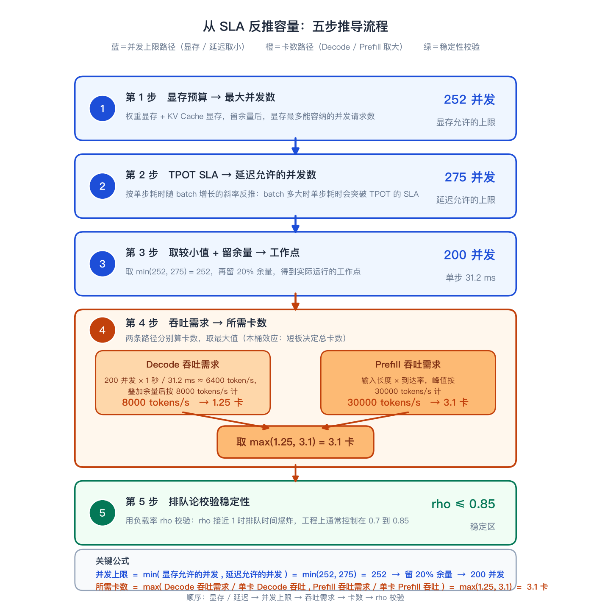

上图是容量规划的五步推导流程：从显存预算算出最大并发数（252），再由 TPOT 的 SLA 反推延迟允许的并发数（275），取较小值并留余量得到工作点（200 并发、单步 31.2 ms）；然后分别算 Decode 吞吐需求（8000 tokens 每秒，对应 1.25 卡）与 Prefill 吞吐需求（30000 tokens 每秒，对应 3.1 卡），取最大值；最后用排队论的负载率 $ρ$ 校验 TTFT 的 P99，得到最终 6 张卡（开启前缀缓存后降到 3 张）。图中重点标出了最容易被忽略的一步——**Prefill 需求往往才是真正的瓶颈**。

**第零步：明确硬件与模型参数**

| 参数 | 值 |
|---|---|
| 模型参数量 | 8B，FP16 权重 16 GB |
| KV Cache 每 token | 128 KB（32 层、GQA 8 组、`d_h = 128`、FP16） |
| HBM 带宽 | 2039 GB/s |
| FP16 峰值算力 | 312 TFLOPS，按 **50% MFU** 取 156 TFLOPS 有效算力 |

**第一步：由显存算最大并发数**

显存预算分配：

$$
80 \ \text{GB} - 16 \ \text{GB（权重）} - 4 \ \text{GB（激活、context、碎片）} = 60 \ \text{GB（可用于 KV Cache）}
$$

峰值时每序列长度取"输入加满输出"：

$$
S_{\text{peak}} = 1500 + 400 = 1900 \ \text{tokens}
$$

每序列 KV Cache：

$$
128 \ \text{KB} \times 1900 = 243.2 \ \text{MB} \approx 0.238 \ \text{GB}
$$

最大并发：

$$
N_{\text{concurrent}} = \frac{60}{0.238} \approx 252
$$

**显存允许约 250 条并发。**

**第二步：由 TPOT 的 SLA 反推可用并发数**

Decode 单步耗时取决于"读权重加读 KV Cache"的总带宽：

$$
t_{\text{step}} = \frac{16 \ \text{GB} + N \times 0.238 \ \text{GB}}{2039 \ \text{GB/s}}
$$

要求 $t_{\mathrm{step}}$ 不超过 40 ms（TPOT 的 SLA）：

$$
\frac{16 + 0.238 N}{2039} \leq 0.040 \ \Rightarrow \ 16 + 0.238 N \leq 81.6 \ \Rightarrow \ N \leq 275
$$

**延迟 SLA 允许约 275 条并发**——比显存的 252 宽松。取两者较小值：**并发上限 252**。

但 252 是"打满"状态，实际要留余量给 P99。取 **200 条并发**作为工作点：

$$
t_{\text{step}} = \frac{16 + 200 \times 0.238}{2039} = \frac{63.6}{2039} = 31.2 \ \text{ms}
$$

对应单序列 **32 tokens/s**，满足 TPOT 不超过 40 ms 且有 22% 余量。

**第三步：算单卡的 Decode 吞吐**

$$
\text{Decode 吞吐} = \frac{200 \ \text{tokens}}{0.0312 \ \text{s}} \approx 6410 \ \text{tokens/s}
$$

**第四步：算 Decode 需求的吞吐**

$$
20 \ \text{req/s} \times 400 \ \text{tokens} = 8000 \ \text{tokens/s}
$$

Decode 需要的卡数：

$$
\frac{8000}{6410} = 1.25 \ \Rightarrow \ \mathbf{2 张卡}
$$

**第五步：算 Prefill 需求（容易被漏掉，但往往才是瓶颈！）**

Prefill 每秒需要处理的输入 token：

$$
20 \ \text{req/s} \times 1500 \ \text{tokens} = 30000 \ \text{tokens/s}
$$

单卡 Prefill 能力（compute-bound，前向 FLOPs 为 `2N`）：

$$
\text{Prefill 吞吐} = \frac{156 \times 10^{12}}{2 \times 8 \times 10^{9}} = \frac{156 \times 10^{12}}{1.6 \times 10^{10}} = 9750 \ \text{tokens/s}
$$

Prefill 需要的卡数：

$$
\frac{30000}{9750} = \mathbf{3.1 张卡}
$$

**注意：Prefill 的需求（3.1 卡）比 Decode 的需求（1.25 卡）大得多！** 这是长输入短输出场景的典型特征，很多人只算 Decode 会严重低估成本。

**第六步：用排队论校验 TTFT 的 P99**

单卡 Prefill 一条请求的服务时间：

$$
t_{\text{prefill}} = \frac{1500}{9750} = 0.154 \ \text{s}
$$

用 `N` 张卡，每卡的负载率：

$$
\rho = \frac{30000}{N \times 9750} = \frac{3.077}{N}
$$

按 M/M/1 近似，平均响应时间约为服务时间的 $1/(1-ρ)$ 倍：

| 卡数 `N` | 负载率 $ρ$ | 排队放大因子 | TTFT 估计 | 是否满足 0.5 s |
|---|---|---|---|---|
| 4 | 0.769 | 4.33 | 0.667 s | 不满足 |
| 5 | 0.615 | 2.60 | 0.400 s | 勉强满足 |
| 6 | 0.513 | 2.05 | 0.316 s | **满足，有余量** |
| 8 | 0.385 | 1.63 | 0.251 s | 充裕 |

**结论：需要 6 张 A100**（满足 P99 SLA 且有约 35% 余量；5 张卡的 0.40 s 在 P99 处大概率会破线）。

**第七步：优化——开启前缀缓存**

输入中 800 token 是系统提示，且对所有请求相同。开启 Automatic Prefix Caching 后，真正需要计算的只有：

$$
1500 - 800 = 700 \ \text{tokens}
$$

新的 Prefill 需求：

$$
20 \times 700 = 14000 \ \text{tokens/s} \ \Rightarrow \ \frac{14000}{9750} = 1.44 \ \text{张卡（算力下限）}
$$

用 3 张卡时 $ρ = 14000 / (3 × 9750) = 0.479$，放大因子 1.92，TTFT 约 $700/9750 × 1.92 = 0.138 s$——**大幅满足**。

**最终答案对比**：

| 方案 | Prefill 需求 | Decode 需求 | TTFT 约束 | **最终卡数** |
|---|---|---|---|---|
| 朴素方案 | 3.1 卡 | 1.25 卡 | 6 卡 | **6 张** |
| 开前缀缓存 | 1.44 卡 | 1.25 卡 | 3 卡 | **3 张** |

**节省一半的卡，只靠一个开关。**

**这个方法论的三个要点（面试总结）**：

1. **分别算 Prefill 和 Decode 的需求，取最大值**。很多人只算 Decode，在长输入场景下会严重低估。
2. **一定要用排队论校验 P99，不能用平均值**。按平均负载算出来 4 张卡"够用"，但 P99 会崩——$ρ$ 超过 0.7 后排队延迟是超线性增长的。
3. **先想软件优化再想加卡**。前缀缓存、量化、投机解码、Chunked Prefill 都可能直接把卡数砍半，成本远低于采购。

---

### 7.10 高频面试题

#### 概念辨析类

**Q1：Prefill 和 Decode 阶段的区别是什么？为什么优化手段不同？**

- Prefill 处理整个 prompt，输入是 $n × d$ 的矩阵，做矩阵乘矩阵，算术强度高（约 `n/2`），**compute-bound**；
- Decode 每步处理 1 个 token，做矩阵乘向量，且要把全部权重和 KV Cache 读一遍，**memory-bound**，算术强度约 1 到 25；
- 优化 Prefill 要提高算力利用率：FlashAttention、Chunked Prefill、投机解码无效；
- 优化 Decode 要提高带宽利用率与并发：加大 batch、KV Cache 压缩、量化、连续批处理、投机解码；
- **两个阶段的最优配置不同（batch 大小、并行策略、量化精度），这是 Prefill-Decode 分离架构的根本动机**。

**Q2：KV Cache 存的是什么？为什么不缓存 Q？**

- 存的是每一层、每一个 KV 头的 **K 向量和 V 向量**，形状为 `[L, n_kv, S, d_h]` 两份；
- 不缓存 Q 是因为：Decode 每一步的 Q 只来自当前新 token，是全新的，**历史 Q 永远不会再用**；
- K 和 V 则会被后续所有 step 反复读取，缓存它们把总计算量从 `O(T^2)` 降到 `O(T)`；
- **易错点**：同一个 token 在不同位置或不同上下文下，它的 KV Cache 内容一般是不同的（除第一层外）——所以"相同 token 可以直接复用 KV"这个直觉通常不成立，只有**共享前缀**才能复用。

**Q3：MHA、MQA、GQA、MLA 的区别与演进逻辑？**

- MHA：每个 Q 头配独立 KV 头，表达力最强，KV Cache 与头数成正比；
- MQA：所有 Q 头共享一组 KV，压缩数十倍但效果明显下降；
- GQA：Q 头分组，每组共享一组 KV，`n_groups = n_heads` 退化为 MHA，`n_groups = 1` 退化为 MQA，**主流取 8 组，效果接近 MHA**；
- GQA 的决定性优势：**可以从训练好的 MHA checkpoint 通过"组内 KV 投影矩阵取平均加少量微调"低成本转换**，所有老模型都能升级；
- MLA：换个维度——存低秩潜向量 $c_{\mathrm{KV}}$（512 维）而不是完整 KV，通过**矩阵吸收**在潜空间直接做注意力，永远不还原高维 KV；每 token 576 维，等价于 **2.25 组 GQA**；
- **演进脉络**：从"减少存几份"到"减少每份存多少"，压缩比从 4 到 8 倍提升到对 GQA 再省 71.88%。

**Q4：MLA 的矩阵吸收是怎么回事？为什么需要解耦 RoPE？**

- 矩阵吸收：注意力分数 $q^T k = q^T W^{UK} c = (W^{UK^T} q)^T c$，把上投影矩阵 $W^{UK}$ 吸收进 Q 侧，**直接与 512 维潜向量做点积**，完整的 16384 维 K 从不落显存；V 的 $W^{UV}$ 可吸收进输出投影 $W_o$；
- 解耦 RoPE 的必要性：RoPE 会在 q 和 k 上各乘位置相关的旋转矩阵 `R`，$q^T R_t^T R_{t'} k$ 中间夹了旋转矩阵，**矩阵吸收失效**；
- 解法：把每头维度拆成不带 RoPE 的 $d_h^{nope}$ 与携带 RoPE 的 $d_h^R$ 两段，前者走吸收，后者按 MQA 方式共享缓存一份；
- 结果：每 token 每层只存 `512 + 64 = 576` 个元素，且只存一份（不需要乘 2）。

**Q5：PagedAttention 和 FlashAttention 是一回事吗？**

- **不是，也不冲突**——它们在不同层次；
- FlashAttention 是**算子层**优化：解决单次注意力计算中 HBM 读写过多的问题，手段是分块加在线 softmax，把显存从 `O(N^2)` 降到 `O(N)`，结果是精确的；
- PagedAttention 是**系统层**优化：解决 KV Cache 显存碎片和浪费的问题，手段是分页加块表加写时复制，把显存利用率从 20% 提到 96%；
- 共存方式：vLLM 把 FlashAttention 的分块循环改写成"先查块表、再从物理地址载入"，即 PagedAttention v2 kernel，**保留 FlashAttention 的 SRAM 分块计算，只把数据来源改成块表跳转**；
- 代价：查表加非连续访存使单 kernel 慢约 20% 到 26%，但换来 2 到 4 倍并发，**净收益巨大**。

**Q6：投机解码为什么说它是"无损"的？**

- 它的验证步骤是标准的**拒绝采样**：以概率 `min(1, q(x)/p(x))` 接受 draft 提议的 token；
- 被拒绝时从修正分布 `norm(max(0, q - p))` 重采样——这一项精确补上了提议分布覆盖不到的目标概率质量；
- 因此输出的**分布**与目标模型的分布严格一致；
- 贪心解码下更严格：draft 的 argmax 与 target 的 argmax 一致就接受，不一致就用 target 的 token 替换并截断，输出**逐 token 完全相同**；
- **边界**：带温度采样时是"同分布"而非"同序列"——同样的 seed 和 prompt，开不开投机解码会得到不同的文本。生产环境若依赖可复现性需注意。

**Q7：TTFT、TPOT、ITL 三者什么关系？Goodput 为什么重要？**

- TTFT：请求发出到收到首 token，主要受 Prefill 时间和排队时间影响；
- TPOT：每个输出 token 的平均时间（不含首 token），受 Decode 单步时间影响；
- ITL：相邻 token 的间隔，**逐 token 统计，能暴露 TPOT 平均值掩盖的抖动**（比如被长 Prefill 抢占造成的尖刺）；
- 关系：$\text{E2E 延迟} = \text{TTFT} + \text{TPOT} \times \text{输出长度}$；ITL 的均值约等于 TPOT；
- **Goodput 是"满足 SLA 前提下的吞吐"**——把 batch 开到极大可以把裸吞吐做得很高，但 TTFT 被拖到 10 秒，对在线服务毫无意义。**只看 Throughput 不看 Goodput 是自欺欺人**。

#### 原理推导类

**Q8：为什么 Decode 阶段加大 batch 几乎不增加单步延迟？**

- Decode 是 memory-bound，单步时间约等于"读一遍权重加读一遍 KV Cache"的时间；
- 权重是**所有序列共享的**——读一遍 14 GB 权重，服务 1 条序列和服务 32 条序列，这 14 GB 都要读一遍且只读一遍；
- 所以 batch 从 1 加到 32，搬运量从 14.13 GB 只涨到 18.19 GB（涨 29%），而产出从 1 个 token 涨到 32 个；
- 定量：`batch = 1` 时单步 6.93 ms、吞吐 144 tokens/s；`batch = 32` 时单步 8.92 ms、吞吐 3587 tokens/s；
- **前提**：batch 增大到 Decode 转回 compute-bound 之前。超过临界点后单步时间会开始线性上升。

**Q9：在线服务的 Decode 阶段有可能变成 compute-bound 吗？**

- 理论上可以，但现实中很难；
- 算术强度 `I` 等于 $b × 2N$ 除以 $(2N_bytes + b × KV_per_token × S)$，随 batch 增大趋于饱和于 `2N` 除以 $(KV_per_token × S)$；
- 1024 上下文、7B 模型下这个饱和值约 $14/0.128 ≈ 109$（考虑单位是 FLOP 与 Byte 的比例，本例算出来不足以越过 153），**方程无正解，即永远达不到**；
- 上下文 512 时需要约 500 并发才撞上算力墙，此时 KV Cache 已占 32 GB；
- **结论：现实中 Decode 基本永远 memory-bound，所以"加大 batch"几乎是唯一且免费的吞吐优化手段。**

**Q10：FlashAttention v2 相比 v1 做了哪三个改进？**

1. **减少非 matmul FLOPs**：A100 上矩阵乘 312 TFLOPS 而 softmax 的指数运算只有 19.5 TFLOPS（慢 16 倍）。v2 把累加器的 rescale 从循环内挪到循环后只做一次，省掉每个块的全量 rescale（约贡献 15%）；
2. **沿序列长度维度并行**：v1 只在 batch 和头数上并行，小 batch 时 SM 大量空闲；v2 把外层循环改成遍历 Q 块，每个 Q 块一个线程块，大幅提升占用率（约贡献 50%）；
3. **优化 warp 分工**：v1 切 K、V 给 4 个 warp 再经共享内存同步；v2 切 Q 给 4 个 warp、K 和 V 共享，**warp 之间无需通信**（约贡献 20%）；
- 外加因果掩码下**跳过完全被掩码的 tile**，额外约 2 倍；
- 效果：约 2 倍加速，A100 上达峰值 **73%**（前向）与 63%（后向）。

**Q11：FlashAttention-3 为什么要做 GEMM 与 Softmax 的重叠？**

- 数字动机：H100 SXM5 上 FP16 矩阵乘 **989 TFLOPS**，而特殊函数（指数运算）只有 **3.9 TFLOPS**，**慢 256 倍**；
- 头维度 128 时矩阵乘 FLOPS 是指数运算的 512 倍，**指数运算可能占到与矩阵乘相当的 50% 时间**；
- FP8 下更糟：矩阵乘速度翻倍，指数运算速度不变；
- 解法是乒乓调度：warpgroup 1 做 GEMM 时 warpgroup 2 做 Softmax，交替执行（570 到 620 TFLOPS）；再在 warpgroup 内部流水（620 到 640-660 TFLOPS）；
- 配合 WGMMA、TMA 异步加载与 warp 专业化（生产者 warp 管 TMA、消费者 warp 管 WGMMA），最终 FP16 达 **740 TFLOPS（H100 峰值 75%）**，FP8 接近 **1.2 PFLOPS**。

**Q12：FlashDecoding 解决什么问题？和加大 batch 有什么区别？**

- 问题：Decode 时 batch 小、头数少，FlashAttention 的并行维度不够，GPU 严重欠饱和；
- 做法：**沿 KV 序列长度维度切分**，把 KV Cache 切成若干 chunk，每个 chunk 分配一个线程块并行计算局部注意力（各自的 `O`、`m`、`l`），最后用一个轻量归约 kernel 合并；
- 因为各 chunk 都维护自己的 online softmax 统计量，合并时再做一次标准合并即可，**结果仍然精确**；
- 与加大 batch 的区别：**FlashDecoding 降低单请求延迟**（单序列也能并行），**加大 batch 提高系统吞吐**（需要足够请求量）；
- 二者不冲突，可叠加。

**Q13：投机解码的加速比公式里，$γ$ 为什么不是越大越好？**

- 分子 $E[accepted] = (1 - α^{γ+1})/(1-α)$ 随 $γ$ 增大**趋于饱和**，上限是 $1/(1-α)$；
- 分母 $γc + 1$ 随 $γ$ **线性增长**；
- 所以加速比先升后降，存在最优 $γ$；
- $α = 0.7$、`c = 0.05` 时：$γ = 3$ 得 2.20 倍，$γ = 5$ 与 $γ = 6$ 得峰值 2.35 倍，$γ = 10$ 降至 2.16 倍，$γ = 20$ 降至 1.67 倍；
- 工程上 $γ$ 通常取 3 到 8，且**更好的做法是像 EAGLE-2 那样用置信度动态决定树结构**，而不是固定 $γ$。

**Q14：为什么 RoPE 直接外推会崩？PI、NTK-aware、YaRN 分别怎么修？**

- RoPE 理论上只依赖相对位置，但训练时模型只见过有限范围的旋转角度，**超范围的旋转模式是分布外的**，注意力头不知道如何处理，PPL 灾难性飙升；
- **PI**：把位置索引整体缩放 `m/s`，所有位置落回训练范围；代价是高频分量被过度压缩，近邻位置区分能力下降；需约 1000 步微调，4K 到 32K；
- **NTK-aware**：按频率缩放底数 $b' = b × s^{d/(d-2)}$，高频少缩放、低频多缩放；**免训练即可外推**；
- **YaRN**：NTK-by-parts 分段插值（高频不插值、中频部分插值、低频全插值）加**注意力温度校正**（补偿长序列下注意力分布变平）加少量微调（64 到 400 步），扩到 64K 与 128K；
- **LongRoPE**：用进化搜索**逐维度**找最优缩放因子，加渐进式扩展（256K 再到 2048K）加短上下文恢复，扩到 **2048K**。

#### 工程选型类

**Q15：vLLM、TensorRT-LLM、SGLang 怎么选？**

- **默认选 vLLM**：社区最大、模型覆盖最广、硬件后端最多（NVIDIA、AMD、TPU）、OpenAI 兼容 API 开箱即用，90% 场景的正确答案；
- **选 TensorRT-LLM**：追求 NVIDIA 单卡极限吞吐、且团队有工程投入；代价是**每个模型要编译一个 engine**，有编译时间与版本耦合成本；
- **选 SGLang**：多轮对话与 Agent 场景——**RadixAttention 的前缀树缓存命中率远高于 vLLM 的块级前缀缓存**，系统提示长加多轮对话时 TTFT 优势明显；另外它的结构化输出（XGrammar）与投机解码调优最好；
- **选 LMDeploy**：国产化（昇腾等）或显存极度受限，W4A16 量化加 KV 量化组合能在消费级卡上跑大模型；
- **选 TGI**：已在 Hugging Face 生态内、需要托管与完善监控；
- **选 Ollama**：仅本地开发与演示，**不要用于生产服务**（设计目标是易用性不是吞吐）。

**Q16：什么时候不该用投机解码？**

- **batch 已很大时**（超过 32）：Decode 已转回 compute-bound，"少读权重"不再是瓶颈，draft 开销变成净负担；经验法则是 **batch 小于 8 到 16 收益明显**；
- **Prefill 主导时**（长输入短输出，如长文摘要）：瓶颈不在 Decode，投机解码无的放矢；
- **高发散创作任务**：接受率 $α$ 可能低于 0.3，加速比接近 1；代码、SQL、模板化输出才有 0.7 到 0.9；
- **显存紧张时**：draft 模型要常驻显存，挤占 KV Cache 空间，而 KV Cache 直接决定并发数——**典型的"用并发换延迟"取舍**；
- **短输出场景**：轮次启动开销占比高；
- **核心判断**：投机解码是**在线低并发场景的延迟优化手段，不是吞吐优化手段**。

**Q17：块大小（block size）怎么选？vLLM 为什么默认 16？**

- 太小（4、8）：块表变长，查表开销上升，且难以利用 GPU 的内存合并访问；
- 太大（256）：块内碎片变大（最多浪费 `B-1` 个 token），且前缀共享的粒度变粗、命中率下降；
- 论文消融：ShareGPT 长序列上 **16 到 128** 都表现良好；Alpaca 短序列上 **16 和 32** 更安全，再大因序列短而明显劣化；
- **vLLM 默认 16 是工程折中，不是数学常数**；
- 抢占恢复策略也受影响：块大于 64 时 swapping 更划算，块小于 64 时 recomputation 往往更快（PCIe 小块传输效率低），论文测得 16 到 64 之间两者相当。

**Q18：结构化输出（JSON mode、guided decoding）是怎么实现的？有什么坑？**

- 原理：把 Schema（JSON Schema、正则、CFG）编译成**状态机**，每步解码时算出允许的 token 集合、构造掩码作用到 logits 上（非法位置置负无穷）再采样，采样出的 token 推进状态机；
- 效果：**保证 100% 语法合法**，不依赖模型自觉；
- 后端选择：Outlines（正则、JSON Schema、CFG，TGI 用）、**XGrammar（CFG，SGLang 出品，性能最好**——词表按"是否改变状态机状态"预分类，多数 step 只需查预计算掩码位图）、Guidance、lm-format-enforcer；
- **坑一**：首次编译 Schema 有开销，生产环境必须**缓存编译结果**，否则每次请求编译，TTFT 爆炸；
- **坑二**：只保证语法合法，**不保证语义正确**，业务校验一个都不能少；
- **坑三**：与投机解码相互作用——draft token 若落在被屏蔽位置会直接被拒，**接受率下降**，需要调优。

**Q19：什么时候该上 Prefill-Decode 分离？**

- 适合：长输入（数千到数万 token）加大量并发，且 Prefill 与 Decode 的最优配置严重分化时；
- 收益来源：Prefill 组用小 batch 加低延迟并行策略，Decode 组用大 batch 加高吞吐策略，各自独立伸缩；Mooncake 进一步用分布式 KV Cache 池做"以存换算"，命中前缀就跳过 Prefill；
- **前提条件**：必须有 **NVLink 或 RDMA** 高速互联，KV Cache 传输时间要远小于 Prefill 时间，纯 TCP 基本不可行；
- 代价：调度复杂度（要动态调整 P 与 D 的实例配比）、故障处理、短 prompt 场景下传输开销可能超过收益；
- 代表工作：DistServe（OSDI 2024，学术首创）、Mooncake（Kimi 线上架构）、vLLM 的 P-D 分离加 vLLM Router。

**Q20：Chunked Prefill 解决什么问题？`max_num_batched_tokens` 怎么调？**

- 问题：一个 32K token 的 Prefill 会连续占据 GPU 数百毫秒到数秒，期间所有 Decode 请求排不上队，**TPOT 出现巨大尖刺**——这是生产环境最容易被投诉的抖动来源；
- 做法：把长 Prefill 切成固定大小的 chunk，每 step 只处理一个或少数几个 chunk，**chunk 与 Decode 请求混合成同一 batch**；
- 额外收益：Prefill 是 compute-bound、Decode 是 memory-bound，混合后**算力和带宽互补**，整体利用率提升；
- 调参权衡：设得小（512）单 step 快、TPOT 平稳但 TTFT 变长且 kernel 效率下降；设得大（16384）Prefill 快、TTFT 短但 TPOT 抖动大；
- 实操：先按 P99 TTFT 与 P99 TPOT 的 SLA 反推，再压测微调。

#### 故障排查类

**Q21：线上 TTFT 突然变高，怎么排查？**

- 先看**排队时间**：队列积压说明容量不足（QPS 超预期或单请求变慢）；
- 查 **prompt 长度分布**是否变化（用户开始贴长文档、RAG 塞了太多 chunk）；
- 查**前缀缓存命中率**：系统提示是否被改动（改一个字就全失效）、是否路由到了同一个 worker（vLLM Router 用一致性哈希做会话粘滞就是为了这个）；
- 查**抢占率**：`num_preemptions` 持续非零说明 KV Cache 不够用，请求被换出后要重算 Prefill；
- 查是否**没开 Chunked Prefill**：一个长请求会独占多个 step，把其他请求的 TTFT 全部拉高；
- 最后看硬件：是否有卡掉线、NVLink 降速、温度降频。

**Q22：TPOT 出现周期性尖刺，可能是什么原因？**

- **最常见：长 Prefill 抢占**——开 Chunked Prefill 或限制单步 Prefill token 预算；
- **抢占恢复**：序列被 swap 到 CPU 再拷回，或重算 Prefill，都会造成一次性的大延迟；
- **KV Cache 增长**：序列越长，每步要读的 KV 越多，单步时间随生成长度**缓慢上升**是正常的；如果上升过快，检查是否有异常长序列；
- **batch 剧烈波动**：并发数忽高忽低（流量突发），单步时间随之波动；
- **结构化输出的掩码构造**：每步构造掩码有成本，在 batch 小、输出短时相对占比明显；
- **其他租户干扰**：多模型共卡、MIG 配置不当、其他进程抢占带宽。

**Q23：KV Cache 显存不够用，有哪些手段？按优先级排。**

1. **开前缀缓存**（Automatic Prefix Caching）——系统提示长的场景直接砍掉大部分 Prefill 与对应的 KV；
2. **KV Cache 量化**：FP16 转 FP8 直接砍半，转 INT4 砍到四分之一，最简单无脑；
3. **限制 `max_model_len` 与 `max_tokens`**——很多请求其实不需要那么长，是配置放得太松；
4. **换用更省 KV 的模型**：GQA 8 组优于 MHA，MLA 优于 GQA，MoE 模型激活参数少；
5. **KV Cache 驱逐**：StreamingLLM（保留 attention sink 加滑动窗口）、H2O（按累计注意力分数淘汰）——**注意这些是有损的**，"大海捞针"类任务会退化；
6. **Offload 到 CPU 内存或 SSD**（Mooncake 的思路）——以带宽换容量；
7. **最后才是加卡**。

**Q24：并发数上不去，`max_num_seqs` 设得很大但实测 batch 很小，为什么？**

- **显存不足**：最可能的原因，检查 KV Cache 池大小与实际利用率，看 `num_preemptions` 是否非零；
- **`max_num_batched_tokens` 卡住**：单 step 的 token 预算被打满，新请求无法准入；
- **请求量本身不足**：流量低的时候当然凑不满 batch；
- **`gpu_memory_utilization` 设得太低**：默认 0.9，如果调到 0.7，留给 KV Cache 的空间大幅缩水；
- **Prefill 占满了调度配额**：大量长 Prefill 请求排队，Decode 侧并发反而上不去；
- **调度配置**：`waiting_served_ratio`、`max_long_partial_prefills` 等参数会主动限制准入。

**Q25：同样一张卡，为什么实际吞吐远低于理论值？**

- 先确认瓶颈在哪一侧：**Decode 看带宽、Prefill 看算力**，用 roofline 定位；
- batch 太小（Decode 未饱和）——加大并发；
- 没用 FlashAttention 或用了非优化的 attention 实现；
- 没开连续批处理——padding 和队头阻塞吃掉大量算力（见题目三的 28.75% 利用率）；
- 权重精度：FP32 会比 FP16 慢一倍带宽；量化到 INT8 或 FP8 能直接提升；
- kernel launch 开销与 CPU 侧瓶颈：Python 调度、tokenizer、 detokenizer、HTTP 序列化都可能成为瓶颈，特别是输出 token 多时；
- **MFU 现实值**：训练能到 50% 以上就很好，推理服务能到 30% 到 40% 已属正常，不要拿理论峰值当目标。

**Q26：多卡部署时，张量并行和流水线并行怎么选？**

- **张量并行（TP）**：层内切分，每步都要 all-reduce，通信量大但延迟低；**适合单节点内（NVLink 高带宽），是推理的首选**；TP 度不要跨节点；
- **流水线并行（PP）**：层间切分，通信量小但有 bubble；**适合跨节点、且模型大到单节点放不下时**；推理中 PP 会拉长 TTFT，用得比训练少；
- **推理的常规选择**：单卡能放下就用单卡加 DP 多副本（吞吐最高、无通信开销）；放不下就用**单节点内 TP**（2、4、8）；再不行才 TP 加 PP；
- MoE 模型另有 **EP（专家并行）**，因为专家是稀疏激活的；
- **注意**：Decode 阶段 TP 的 all-reduce 是延迟敏感的，跨节点 TP 会严重拖慢 TPOT。

**Q27：做容量规划时为什么必须分开算 Prefill 和 Decode？**

- 两者的瓶颈资源不同：Prefill 吃算力，Decode 吃带宽；
- 长输入短输出（RAG 问答、长文摘要）：**Prefill 主导**，用 $\mathrm{QPS} \times \text{输入长度} \times 2N$ 除以有效算力决定卡数；
- 短输入长输出（代码生成、创作）：**Decode 主导**，$\mathrm{QPS} \times \text{输出长度}$ 除以单卡 Decode 吞吐决定卡数；
- 题目五的实例：Prefill 需求 3.1 卡、Decode 需求 1.25 卡，**只算 Decode 会低估 2.5 倍**；
- 还要用排队论校验 P99：$ρ$ 超过 0.7 后排队延迟超线性增长，按平均负载算出来的卡数一定不够。

**Q28：长上下文服务中，"以存换算"是什么意思？**

- 出处：Mooncake（Kimi 的线上架构）的核心理念；
- 含义：**把可复用的 KV Cache 存下来（GPU 显存、CPU 内存、SSD 多层池），请求命中就直接跳过 Prefill**，用存储成本换掉 GPU 算力成本；
- 因为 Prefill 是 compute-bound 且成本高（在长输入场景下往往是瓶颈），而存储（尤其是 SSD）便宜得多；
- 命中率是关键，取决于：系统提示是否固定、用户会话是否路由到同一节点（一致性哈希）、多轮对话的复用率；
- 收益在题目五里量化过：**开启前缀缓存把卡数从 6 张降到 3 张**。

---

### 7.11 三句话总结

1. **推理的所有优化都指向同一个物理事实**：Decode 阶段每生成一个 token 都要把整个模型的权重从 HBM 搬一遍，却只做一次微小的向量运算，算术强度约 1 而机器平衡点约 153，**所以 Decode 是 memory-bound，加大 batch 是唯一免费的午餐，而 batch 的天花板由 KV Cache 显存决定**——这就是 MQA、GQA、MLA、PagedAttention、连续批处理、量化等一系列技术存在的全部理由。

2. **优化手段分四个层次，且是乘法关系而非加法关系**：**模型结构层**（MHA 到 MQA 到 GQA 到 MLA，压缩 KV Cache 的 $n_{\mathrm{kv}} · d_h$ 项）、**算子层**（FlashAttention 用分块加在线 softmax 把 HBM 访问降到最优，FlashDecoding 在序列维补上并行度）、**系统层**（PagedAttention 把显存利用率从 20% 提到 96%，连续批处理把槽位利用率从 28.75% 提到 100%）、**调度层**（Chunked Prefill 削峰、P-D 分离让两个阶段各自用最优配置）——吞吐等于四层效率的乘积，任何一层短板都会拉垮整体。

3. **工程落地要先想软件再想加卡，且必须看 Goodput 而不是 Throughput**：开启前缀缓存可以把卡数从 6 张降到 3 张，FP8 KV Cache 直接砍半显存，投机解码在低并发下给 2 到 5 倍延迟收益；但容量规划必须分开算 Prefill 与 Decode 的需求、用排队论校验 P99、先问场景再选引擎——**裸吞吐再高，SLA 不满足就是零**。

---

### 7.12 延伸阅读

#### 核心论文与对应代码

> 说明：本表统一给出**官方代码仓库或官方技术博客**作为入口，避免引用受网络可达性限制的论文站点。论文原文可按标题检索。

| 主题 | 文献 | 可访问资源 |
|---|---|---|
| PagedAttention 与 vLLM | Kwon et al., SOSP 2023 | https://github.com/vllm-project/vllm |
| Orca（迭代级调度先驱） | Yu et al., OSDI 2022 | https://www.usenix.org/conference/osdi22/presentation/yu |
| FlashAttention v1 与 v2 | Dao et al., NeurIPS 2022 及 2023 | https://github.com/Dao-AILab/flash-attention |
| FlashAttention v3 | Shah et al., NeurIPS 2024 | https://pytorch.org/blog/flashattention-3/ |
| FlashDecoding | Dao et al., 2023 | https://pytorch.org/blog/flash-decoding/ |
| 投机解码 | Leviathan et al., 2023 与 Chen et al., 2023 | https://github.com/vllm-project/vllm （见文档 Speculative Decoding 章节） |
| MQA | Shazeer, 2019 | https://lilianweng.github.io/posts/2023-01-10-inference-optimization/ |
| GQA | Ainslie et al., EMNLP 2023 | https://lilianweng.github.io/posts/2023-01-10-inference-optimization/ |
| MLA 与 DeepSeek-V2 | DeepSeek-AI, 2024 | https://github.com/deepseek-ai/DeepSeek-V2 |
| 位置插值 PI 与 NTK-aware | Chen et al., 2023 及社区工作 | https://github.com/jquesnelle/yarn |
| YaRN | Peng et al., 2023 | https://github.com/jquesnelle/yarn |
| LongRoPE | Ding et al., 2024 | https://github.com/microsoft/LongRoPE |
| Chunked Prefill（SARATHI） | Agrawal et al., MLSys 2024 | https://github.com/microsoft/sarathi-serve |
| DistServe（P-D 分离） | Zhong et al., OSDI 2024 | https://github.com/LLMServe/DistServe |
| Mooncake | Qin et al., 2024 | https://github.com/kvcache-ai/Mooncake |
| StreamingLLM | Xiao et al., ICLR 2024 | https://github.com/mit-han-lab/streaming-llm |
| H2O（KV 驱逐） | Zhang et al., NeurIPS 2023 | https://github.com/FMInference/H2O |

#### 开源仓库

| 项目 | 说明 | 链接 |
|---|---|---|
| vLLM | PagedAttention 与连续批的参考实现，社区最大 | https://github.com/vllm-project/vllm |
| FlashAttention | 三代 FA 的官方实现 | https://github.com/Dao-AILab/flash-attention |
| FlashInfer | 注意力 kernel 库，vLLM 与 SGLang 的后端之一 | https://github.com/flashinfer-ai/flashinfer |
| SGLang | RadixAttention 与 XGrammar，Agent 场景首选 | https://github.com/sgl-project/sglang |
| TensorRT-LLM | NVIDIA 官方推理引擎，极致性能 | https://github.com/NVIDIA/TensorRT-LLM |
| text-generation-inference | Hugging Face 生产级服务框架 | https://github.com/huggingface/text-generation-inference |
| LMDeploy | 上海 AI Lab，量化与国产卡支持 | https://github.com/InternLM/lmdeploy |
| Ollama | 本地一键运行 | https://github.com/ollama/ollama |
| EAGLE | 特征级投机解码，目前最快的投机方法 | https://github.com/SafeAILab/EAGLE |
| Medusa | 多头并行解码与树状注意力 | https://github.com/FasterDecoding/Medusa |
| DistServe | P-D 分离的开源实现 | https://github.com/LLMServe/DistServe |
| Mooncake | Kimi 的 KV Cache 中心化分离架构 | https://github.com/kvcache-ai/Mooncake |
| XGrammar | 高性能结构化输出引擎 | https://github.com/mlc-ai/xgrammar |
| Outlines | 受限解码库 | https://github.com/dottxt-ai/outlines |
| StreamingLLM | Attention Sink 与流式长上下文 | https://github.com/mit-han-lab/streaming-llm |
| DeepSeek-V3 | MLA 的官方推理代码 | https://github.com/deepseek-ai/DeepSeek-V3 |

#### 博客与官方资料

| 主题 | 来源 | 链接 |
|---|---|---|
| Transformer 推理优化全景（强烈推荐入门） | Lilian Weng, Lil'Log | https://lilianweng.github.io/posts/2023-01-10-inference-optimization/ |
| FlashAttention-3 官方技术博客 | PyTorch Blog | https://pytorch.org/blog/flashattention-3/ |
| FlashDecoding 官方博客 | PyTorch Blog | https://pytorch.org/blog/flash-decoding/ |
| NVIDIA Ampere 架构深度解析（A100 参数权威来源） | NVIDIA Developer Blog | https://developer.nvidia.com/blog/nvidia-ampere-architecture-in-depth/ |
| NVIDIA Hopper 架构深度解析（H100 参数权威来源） | NVIDIA Developer Blog | https://developer.nvidia.com/blog/nvidia-hopper-architecture-in-depth/ |
| vLLM 官方博客（P-D 分离、Router、各版本特性） | vLLM Blog | https://blog.vllm.ai/ |
| Lookahead Decoding 官方发布 | LMSYS Blog | https://lmsys.org/blog/2023-11-21-lookahead-decoding/ |
| 投机解码的直观解释 | Jay Alammar, The Illustrated Transformer 系列 | https://jalammar.github.io/ |
| 动手学深度学习（Transformer 与注意力基础） | D2L 中文版 | https://zh.d2l.ai/ |

**建议的学习路径**：先读 Lilian Weng 的推理优化综述建立全景，再精读 PagedAttention 论文（它的 Motivation 与 Figure 写得极好），接着读 FlashAttention 系列三篇（体会"为硬件设计算法"的思路），最后动手跑一遍 vLLM，用 `--enable-prefix-caching` 和 `--speculative-model` 两个开关实测收益——**理论看十遍不如压测一次**。
