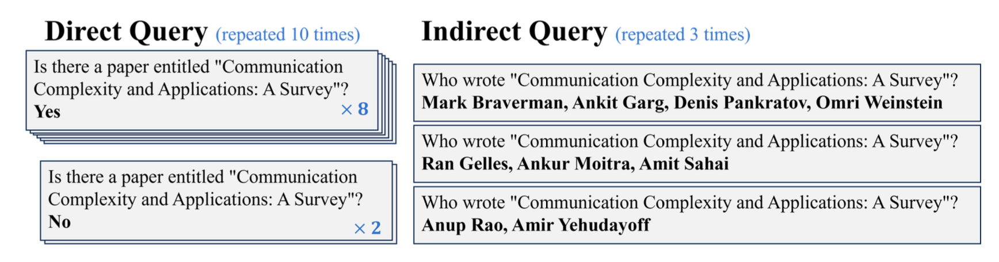
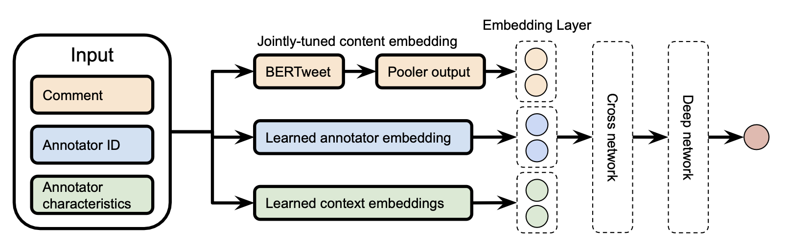
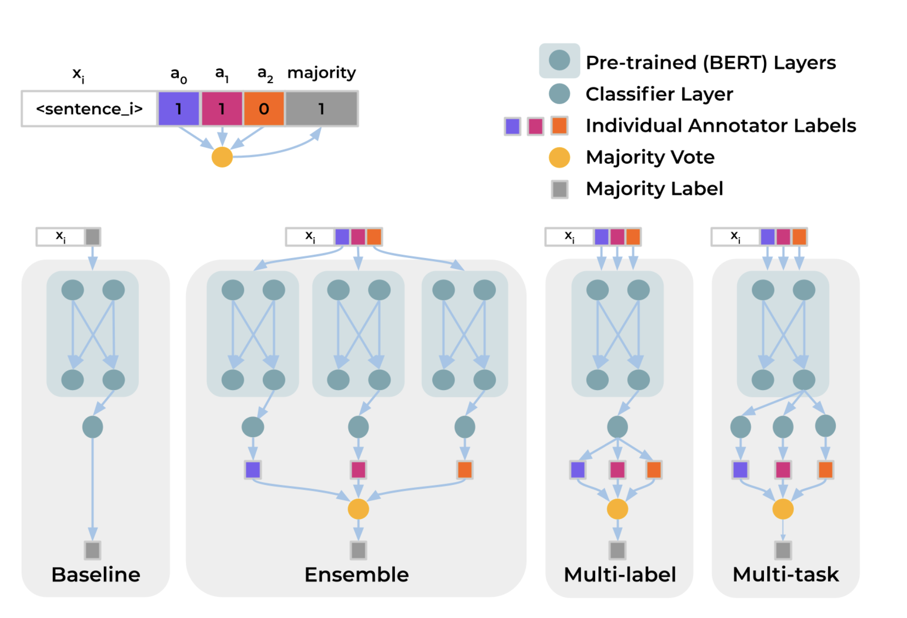
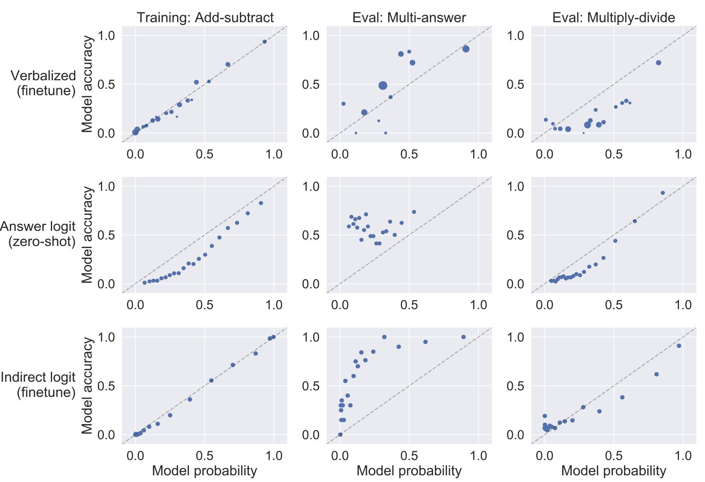
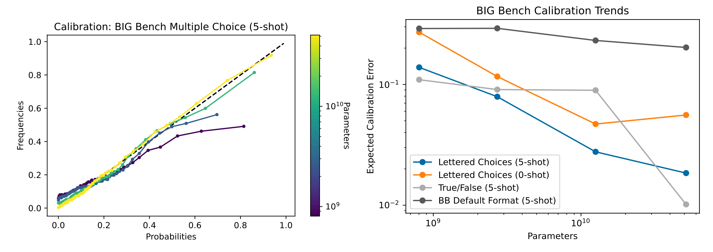
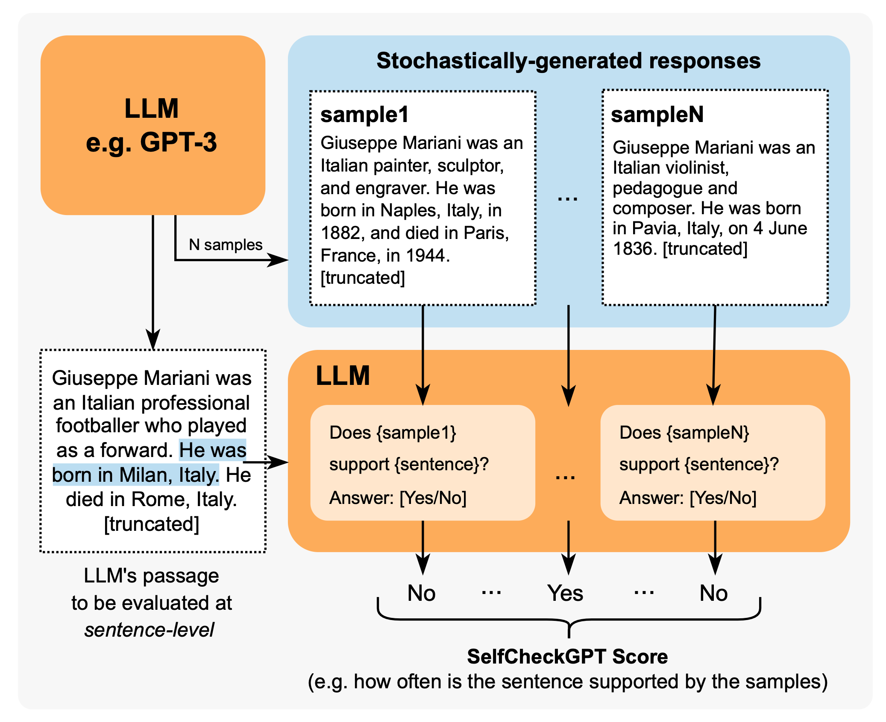
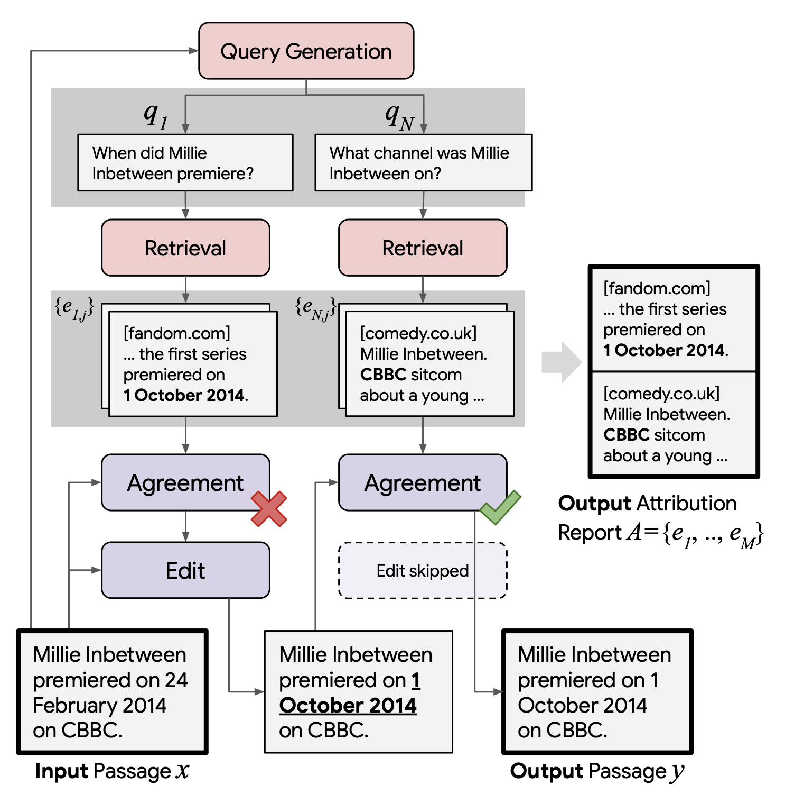

## 11. 大模型评估体系

📑 <strong>本章目录</strong>（点击展开）

- [11.0 本章知识地图](#110-本章知识地图)
- [11.1 为什么评估是大模型最难的工程](#111-为什么评估是大模型最难的工程)
  - [11.1.1 四重困难：评估难在哪](#1111-四重困难评估难在哪)
  - [11.1.2 评估体系的三个层次](#1112-评估体系的三个层次)
  - [11.1.3 评估的经济学：比训练更高频的开销](#1113-评估的经济学比训练更高频的开销)
- [11.2 评测对象分层全景](#112-评测对象分层全景)
  - [11.2.1 分层框架：九层能力地图](#1121-分层框架九层能力地图)
  - [11.2.2 各层代表基准速览](#1122-各层代表基准速览)
  - [11.2.3 中文场景的补充基准](#1123-中文场景的补充基准)
  - [11.2.4 榜单的正确用法](#1124-榜单的正确用法)
- [11.3 自动指标及其局限](#113-自动指标及其局限)
  - [11.3.1 困惑度 PPL：语言建模的底座指标](#1131-困惑度-ppl语言建模的底座指标)
  - [11.3.2 BLEU / ROUGE：从机器翻译继承的遗产，为何失灵](#1132-bleu--rouge从机器翻译继承的遗产为何失灵)
  - [11.3.3 Exact Match 与分类指标：客观题的标准打法](#1133-exact-match-与分类指标客观题的标准打法)
  - [11.3.4 pass@k：代码评估的无偏估计](#1134-passk代码评估的无偏估计)
  - [11.3.5 自动指标总结：什么场景用什么](#1135-自动指标总结什么场景用什么)
- [11.4 LLM-as-Judge](#114-llm-as-judge)
  - [11.4.1 核心思想与两种范式](#1141-核心思想与两种范式)
  - [11.4.2 MT-Bench：LLM-as-Judge 的事实标准](#1142-mt-benchllm-as-judge-的事实标准)
  - [11.4.3 三大偏差（必考）](#1143-三大偏差必考)
  - [11.4.4 缓解手段](#1144-缓解手段)
  - [11.4.5 一致性验证：judge 可信度的量化](#1145-一致性验证judge-可信度的量化)
- [11.5 人类评估与竞技场](#115-人类评估与竞技场)
  - [11.5.1 标注质量控制：人类评估的地基](#1151-标注质量控制人类评估的地基)
  - [11.5.2 Elo：从国际象棋借来的rating系统](#1152-elo从国际象棋借来的rating系统)
  - [11.5.3 Bradley-Terry 模型：竞技场的现代标准](#1153-bradley-terry-模型竞技场的现代标准)
  - [11.5.4 Chatbot Arena：众包竞技场的运行机制](#1154-chatbot-arena众包竞技场的运行机制)
  - [11.5.5 人类评估的适用边界](#1155-人类评估的适用边界)
- [11.6 校准与幻觉评测](#116-校准与幻觉评测)
  - [11.6.1 校准：模型"知道自己不知道"吗](#1161-校准模型知道自己不知道吗)
  - [11.6.2 幻觉的分类：先分型再评测](#1162-幻觉的分类先分型再评测)
  - [11.6.3 SelfCheckGPT：黑盒幻觉检测](#1163-selfcheckgpt黑盒幻觉检测)
  - [11.6.4 RARR：归因与修订](#1164-rarr归因与修订)
  - [11.6.5 TruthfulQA：专门钓"模仿人类错误"的基准](#1165-truthfulqa专门钓模仿人类错误的基准)
- [11.7 安全与红线评测](#117-安全与红线评测)
  - [11.7.1 red-teaming：人机协同的攻击式评估](#1171-red-teaming人机协同的攻击式评估)
  - [11.7.2 典型安全基准类别](#1172-典型安全基准类别)
- [11.8 数据污染](#118-数据污染)
  - [11.8.1 定义与影响](#1181-定义与影响)
  - [11.8.2 检测方法](#1182-检测方法)
  - [11.8.3 训练侧防污染实践](#1183-训练侧防污染实践)
- [11.9 线上评估](#119-线上评估)
  - [11.9.1 A/B 实验：唯一的因果证据](#1191-ab-实验唯一的因果证据)
  - [11.9.2 护栏指标（Guardrail Metrics）](#1192-护栏指标guardrail-metrics)
  - [11.9.3 回归测试集建设](#1193-回归测试集建设)
  - [11.9.4 从 0 到 1：评估体系搭建清单](#1194-从-0-到-1评估体系搭建清单)
- [11.10 高频面试题](#1110-高频面试题)
  - [Q1：大模型评估为什么比传统 NLP 模型评估难？](#q1大模型评估为什么比传统-nlp-模型评估难)
  - [Q2：PPL 是什么？能跨模型比较吗？](#q2ppl-是什么能跨模型比较吗)
  - [Q3：BLEU/ROUGE 为什么在 LLM 时代失灵？](#q3bleurouge-为什么在-llm-时代失灵)
  - [Q4：pass@k 的无偏估计公式是什么？为什么要它？](#q4passk-的无偏估计公式是什么为什么要它)
  - [Q5：LLM-as-Judge 有哪些偏差？怎么缓解？](#q5llm-as-judge-有哪些偏差怎么缓解)
  - [Q6：LLM-as-Judge 在什么任务上不可靠？](#q6llm-as-judge-在什么任务上不可靠)
  - [Q7：Elo 和 Bradley-Terry 的关系与区别？](#q7elo-和-bradley-terry-的关系与区别)
  - [Q8：Chatbot Arena 分数高就代表模型好吗？](#q8chatbot-arena-分数高就代表模型好吗)
  - [Q9：什么是模型校准？怎么度量？](#q9什么是模型校准怎么度量)
  - [Q10：SelfCheckGPT 的原理与局限？](#q10selfcheckgpt-的原理与局限)
  - [Q11：RAG 的幻觉和普通幻觉有什么不同？怎么评？](#q11rag-的幻觉和普通幻觉有什么不同怎么评)
  - [Q12：TruthfulQA 考什么？现在还重要吗？](#q12truthfulqa-考什么现在还重要吗)
  - [Q13：red-teaming 流程是什么？什么是过度拒绝？](#q13red-teaming-流程是什么什么是过度拒绝)
  - [Q14：数据污染怎么检测？](#q14数据污染怎么检测)
  - [Q15：工业界怎么防数据污染？](#q15工业界怎么防数据污染)
  - [Q16：离线评估涨了，线上 A/B 却没涨，可能是什么原因？](#q16离线评估涨了线上-ab-却没涨可能是什么原因)
  - [Q17：护栏指标是什么？为什么需要？](#q17护栏指标是什么为什么需要)
  - [Q18：从 0 到 1 搭建 LLM 评估体系的步骤？](#q18从-0-到-1-搭建-llm-评估体系的步骤)
  - [Q19：怎样评长上下文能力？NIAH 有什么问题？](#q19怎样评长上下文能力niah-有什么问题)
  - [Q20：评 Agent 能力和评普通问答有什么本质区别？](#q20评-agent-能力和评普通问答有什么本质区别)
  - [Q21：多 judge 投票为什么有效？有什么代价？](#q21多-judge-投票为什么有效有什么代价)
  - [Q22：如果只能保留一个评估手段，你留哪个？](#q22如果只能保留一个评估手段你留哪个)
- [11.11 本章小结](#1111-本章小结)

### 11.0 本章知识地图

| 节号 | 主题 | 面试权重 |
|---|---|---|
| 11.1 | 为什么评估是大模型最难的工程：非确定性 / 无标准答案 / 污染 / Goodhart | ★★★ |
| 11.2 | 评测对象分层全景：从 PPL 到 Agent 的九层基准地图 | ★★★★★ |
| 11.3 | 自动指标及其局限：PPL / BLEU / ROUGE / EM / pass@k | ★★★★ |
| 11.4 | LLM-as-Judge：单点打分 vs 成对比较、偏差与缓解 | ★★★★★ |
| 11.5 | 人类评估与竞技场：标注质量控制 / Elo / Bradley-Terry / Chatbot Arena | ★★★★ |
| 11.6 | 校准与幻觉评测：ECE / SelfCheckGPT / RARR / TruthfulQA | ★★★★ |
| 11.7 | 安全与红线评测：red-teaming 流程 / 安全基准类别 | ★★★ |
| 11.8 | 数据污染：定义 / 检测方法 / 训练侧防污染实践 | ★★★★ |
| 11.9 | 线上评估：A/B 实验 / 护栏指标 / 回归测试集 / 从 0 到 1 清单 | ★★★★★ |
| 11.10 | 高频面试题 | ★★★★★ |
| 11.11 | 本章小结 | ★★ |

> **本章主线问题**：训练一个大模型要花几千万，但判断"这个模型到底好不好"为什么比训练还难？当自动指标失灵、人类标注又贵又慢时，工业界用什么组合拳把评估做到"可信、可复现、可持续"？如何在自己的业务上从 0 到 1 搭一套评估体系，让每一次发版都有数据背书？

### 11.1 为什么评估是大模型最难的工程

#### 11.1.1 四重困难：评估难在哪

传统软件的评估是"给定输入 → 断言输出"，单元测试写完就是永久资产。大模型的评估面临四个传统软件工程没有的问题：

1. **非确定性（Non-determinism）**：同一个 prompt，temperature 大于 0 时每次输出都可能不同，甚至 temperature=0 时 GPU 并行浮点累加顺序也会带来微小扰动。你不能写 `assert output == "expected"`，只能写"输出是否语义等价于期望"——而"语义等价"本身就难以定义。
2. **开放生成没有标准答案**："帮我写一封挽回客户的邮件"有一万个好答案、十万个坏答案，无法用"匹配标准答案"评估。评测对象从"答案对不对"变成了"答案好不好"，而"好"是多维的：有用性、准确性、安全性、风格、简洁度——每个维度的权重还随场景变化。
3. **数据污染（Data Contamination）**：评测集一旦公开发布，就会被爬进下一代模型的预训练语料。模型"背过题"后分数虚高，榜单变成了记忆力竞赛。这导致基准的生命周期只有 1–2 年，业界被迫不断造新基准（详见 §11.8）。
4. **Goodhart 定律**："当一个指标变成目标，它就不再是好指标。"模型团队一旦知道评测集构成和打分标准，就会（有意或无意地）针对评测集优化：过拟合评测集风格、利用 judge 模型的长度偏好、在竞技场刷"讨好用户"的回答。**分数上升 ≠ 能力上升**。

> **面试提醒**：被问"大模型评估为什么难"时，最高分的回答结构是"四重困难 + 每一条对应的工业界缓解手段"：非确定性 → 多采样统计评估；无标准答案 → 成对比较 + LLM-as-Judge；污染 → 私有评测集 + 检测方法；Goodhart → 轮换评测集 + 多元指标交叉验证。只背"因为输出不确定"这种一句话答案是明显扣分项。

#### 11.1.2 评估体系的三个层次

工业界的评估体系通常分成三层，各有不同的成本、信号质量和适用阶段：

| 层次 | 手段 | 信号质量 | 单次成本 | 周期 | 适用阶段 |
|---|---|---|---|---|---|
| **离线自动评估** | 公开/私有基准 + 自动指标 | 低–中 | 低（算力费） | 分钟–小时 | 日常迭代、CI 回归 |
| **模型评估** | LLM-as-Judge 打分/比较 | 中–高 | 中（judge 推理费） | 小时 | 版本对比、中型实验 |
| **人类评估** | 标注员打分/排序 + 仲裁 | 最高（金标准） | 高（0.5–5 美元/条） | 天 | 关键版本、榜单发布、judge 校准 |

三层的核心关系是：**人类评估校准 LLM-as-Judge，LLM-as-Judge 校准自动指标**。生产上 95% 的评估流量走自动 + judge，人类只负责"校准校准器"和疑难样本仲裁。

#### 11.1.3 评估的经济学：比训练更高频的开销

一个常见的误解是"评估是免费的"。对大模型而言：

- **算力成本**：跑一遍 MMLU（14K 题）+ GSM8K（1.3K 题）+ MT-Bench（80 轮对话）的全量评估，80B 模型在 8 卡 A100 上要数小时；如果做 pass@k（每个题采 20–100 个样本），推理成本再涨一到两个数量级。头部实验室每个 checkpoint 都评估，评估集群常常和训练集群一样大。
- **人力成本**：一次 1000 条 × 3 标注员的人类评估，按 1 美元/条算就是 3000 美元，周期 3–5 天——这是"天"级别的迭代节拍，跟不上"天"级别的训练节拍。
- **机会成本**：错误的评估结论比没有评估更贵。一个虚高的离线分数把有缺陷的版本推上线，线上负反馈、回滚、信任损失，成本远超评估本身的投入。

**结论**：评估体系的预算规划要和训练对等看待。业内共识是——**训练做得再好，评估做不准，等于把模型盲发**。

### 11.2 评测对象分层全景

#### 11.2.1 分层框架：九层能力地图

"评估一个模型"不是评一个分数，而是评一组能力。业内通常按"基础 → 高阶"分成九层：

| 层 | 能力维度 | 代表基准 | 首出年份 | 指标 | 现状 |
|---|---|---|---|---|---|
| 1 | 语言建模 | Wikitext-2/PPL、The Pile / BPB | 2019–2020 | PPL、bits-per-byte | 基础指标，看预训练质量 |
| 2 | 知识 | MMLU、CMMLU、C-Eval、MMLU-Pro、GPQA | 2020–2023 | 准确率 | 主流基准已接近饱和，走向"研究生级" |
| 3 | 推理 | GSM8K、MATH、BBH、ARC-Challenge、DROP | 2021–2023 | EM / 准确率 | 数学推理仍是分化点 |
| 4 | 代码 | HumanEval、MBPP、SWE-bench、LiveCodeBench | 2021–2024 | pass@k、解决率 | SWE-bench 是 Agent 化新前沿 |
| 5 | 长上下文 | NIAH、RULER、LongBench、ScrollsQA | 2023–2024 | 各子项准确率 | 专门暴露"名义长度 vs 有效长度" |
| 6 | 指令跟随 | IFEval、FollowBench、InfoBench | 2023–2024 | 严格/宽松准确率 | 可验证指令约束的精确评测 |
| 7 | 对话与对齐 | MT-Bench、AlpacaEval、Arena-Hard | 2023 | GPT-4 打分 / 胜率 | 依赖 LLM-as-Judge |
| 8 | 安全 | TruthfulQA、ToxiGen、SafetyBench、XSTest | 2021–2024 | 有害率、误拒率 | 红队 + 基准双轨（§11.7） |
| 9 | Agent 能力 | WebArena、OSWorld、AgentBench、SWE-bench | 2023–2024 | 任务成功率 | 当前最热，与真机/沙箱环境强耦合 |

#### 11.2.2 各层代表基准速览

**知识层**：

- **MMLU**（Hendrycks et al. 2020）：57 个学科、15000+ 道四选一选择题，覆盖中学到专业级知识。是 2020–2023 年最通用的"智力测验"，但如今头部模型都在 88%+，区分度下降；MMLU-Pro（2024）把选项从 4 个加到 10 个、去掉可排除的浅题，重新拉开差距。
- **CMMLU / C-Eval**（2023）：中文版学科知识基准。CMMLU 覆盖 67 个中文特有主题（如中国历史、中医）；C-Eval 由上交与清华等合作推出，含 52 个学科、四个难度级。两者都有"官方答案不可公开"的版本用于防污染。
- **GPQA**（Rein et al. 2023）："Google-Proof Q&A"，由领域博士出题，即使给非专家 Google 搜索也只能拿约 34%。这是当前知识层的天花板测试，头部模型也只有 50–70%。

**推理层**：

- **GSM8K**（Cobbe et al. 2021）：8500 个小学数学应用题，8.5K 训练 + 1.3K 测试。曾是 CoT 推理的标准测试，但已被思维链 + 工具调用"打穿"（90%+ 甚至逼近 100%），区分度减弱。
- **MATH**（Hendrycks et al. 2021）：12.5K 竞赛数学题（AMC/AIME 级别），7 个难度级。与 GSM8K 相比需要多步符号操作，是更难的能力探针。
- **BBH**（Big-Bench Hard, Suzgun et al. 2022）：从 BIG-Bench 中挑出的 23 个"LLM 连 CoT 都做不好"的任务子集，专门测"思维链能不能救"。

**代码层**：

- **HumanEval**（Chen et al. 2021，Codex 论文）：164 道手写 Python 函数题，配单元测试，报 pass@k 指标。规模太小已饱和。
- **MBPP**（Austin et al. 2021）：974 道入门级 Python 题，与 HumanEval 互补。
- **SWE-bench**（Jimenez et al. 2024）：从真实 GitHub issue 构建的 2294 个任务，模型要在一个真实仓库里定位 bug、改代码、通过测试。**从"写函数"到"修仓库"是代码评估的代际跨越**，SWE-bench Verified（OpenAI 人工清洗的 500 题子集）是当前事实标准。

**长上下文层**：

- **NIAH（Needle-in-a-Haystack，Kamradt 2023）**：把一句"针"（如"The magic number is 74829"）插入长文档的不同深度、不同上下文长度，测模型能否召回。实验简单直观，成为长上下文宣传的标配图，但它只测"检索"，不测"推理"。
- **RULER**（Hsieh et al. 2024）：把 NIAH 泛化成 13 个任务（多针检索、聚合、问答、跨段推理），可控地变化长度与复杂度。**重要发现：模型的"有效上下文"通常远小于"名义上下文"**——宣称 128K 的模型在 RULER 上可能 32K 就开始明显掉分。

**指令跟随层**：

- **IFEval**（Zhou et al. 2023）：约 500 条带"可验证指令"（如"回答里不要用逗号"、"至少提到三次 keyword"、"全部小写"）的 prompt，用程序化规则判分，完全不依赖 LLM judge 或人类——**是少数"零主观性"的指令跟随基准**。

**Agent 层**：

- **WebArena**（Zhou et al. 2023）：自托管的真实网站（购物、论坛、GitLab、维基）沙箱，812 个长程任务，测浏览器操作 Agent。
- **OSWorld**（Xie et al. 2024）：真实操作系统（Ubuntu、Chrome 等）里的 369 个计算机任务，用"执行后状态检查"替代"输出比对"判分。
- **AgentBench**（Liu et al. 2023）：跨 8 个环境（数据库、电商、操作系统、知识图谱等）的综合 Agent 评测套件。

#### 11.2.3 中文场景的补充基准

| 基准 | 定位 | 备注 |
|---|---|---|
| **C-Eval / CMMLU** | 中文知识 | 中文版 MMLU，选基座时必看 |
| **C-MTEB** | 中文 Embedding | RAG 检索层选型（详见 §8.4） |
| **SuperCLUE / OpenCompass** | 综合榜单 | 国内第三方综合评测框架与榜单 |
| **CMB / C-Eval-Med** | 医疗 | 医师资格考试题 |
| **FinEval / FinanceIQ** | 金融 | 中文金融领域知识 |
| **GAOKAO-Bench** | 高考真题 | 直观、公众理解度高 |

#### 11.2.4 榜单的正确用法

看任何一个榜单，先问四个问题：

1. **谁在维护、怎么防污染**：有没有"官方保留集"（如 C-Eval 的 dev/val/test 分离、BIG-bench 的 hidden set）？分数是不是在公开测试集上刷出来的？
2. **prompt 和解析方式是否标准**：同一道题，5-shot vs 0-shot、答案抽取正则写得松或紧，分数能差 5–15 个点。OpenCompass、lm-evaluation-harness 这类统一框架的价值就在于此——**同框架可比，跨框架不可比**。
3. **分数的方差是多少**：选择题 1 个点的差距可能在噪声范围内（题量小的时候尤甚）。看分数要看置信区间，别看小数点后两位的"高下立判"。
4. **跟我业务相关吗**：MMLU 高分不代表客服场景回答得好。榜单是"体检报告"，不是"岗位胜任力测评"——**业务评估永远要自建**（§11.9）。

### 11.3 自动指标及其局限

#### 11.3.1 困惑度 PPL：语言建模的底座指标

PPL（Perplexity，困惑度）衡量模型对一段文本的"惊讶程度"，是预训练评估的底座指标。对长度为 N 的 token 序列：

$$
\mathrm{PPL}(\theta) = \exp\left( -\frac{1}{N} \sum_{t=1}^{N} \log p_\theta(x_t \mid x_{\lt t}) \right)
$$

直觉解读：PPL 等价于"模型的平均分支因子"——模型每生成一个 token 时，等价于在多少个"同样自信的选择"里犹豫。PPL=20 意味着模型面对每个词时，不确定性相当于在 20 个词之间均匀猜测。

PPL 的两个关键性质：

- **只可比同 tokenizer 的模型**：PPL 依赖分词切分方式。BPE 词表不同的两个模型，同一个文本的 PPL 完全不可比（每 token 承载的信息量不同）。跨模型比较时用 bits-per-byte（BPB）更公平——它按字节归一化，与 tokenizer 无关。
- **与下游能力相关但不决定**：Chinchilla（Hoffmann et al. 2022）证明预训练 loss 与下游能力大体单调相关，但同 loss 的两个模型在推理任务上可能差 10 个点。**PPL 是必要条件，不是充分条件**。

> **面试提醒**：被问"PPL 越低越好吗"要能立刻回答"同 tokenizer、同领域内是；跨 tokenizer 不可比；对生成质量只是弱相关指标，GPT-4 的 PPL 不一定比 GPT-3 低，但能力高得多"。反例是：在评测集上过拟合的模型 PPL 可以极低而生成极差。

#### 11.3.2 BLEU / ROUGE：从机器翻译继承的遗产，为何失灵

**BLEU**（Papineni et al. 2002）是机器翻译时代的标准指标：候选与参考的 n-gram 精确率的几何平均，乘一个短句惩罚：

$$
\mathrm{BLEU} = \mathrm{BP} \cdot \exp\left( \sum_{n=1}^{N} w_n \log p_n \right)
$$

其中 `p_n` 是 n-gram 精确率（候选中的 n-gram 有多少出现在参考里），`w_n` 通常取 `1/N` 均匀权重，短句惩罚 `BP = min(1, exp(1 - r/c))`（`c` 是候选长度，`r` 是参考长度）。

**ROUGE**（Lin 2004）反向操作，算召回率——参考中的 n-gram 有多少被候选覆盖。以 ROUGE-N 为例：

$$
\mathrm{ROUGE\text{-}N} = \frac{\sum_{g \in G} \min\big(\mathrm{count}_R(g),\ \mathrm{count}_C(g)\big)}{\sum_{g \in G} \mathrm{count}_R(g)}
$$

其中 `G` 是参考文本的 n-gram 集合。摘要任务常用 ROUGE-1（unigram）/ ROUGE-2（bigram）/ ROUGE-L（最长公共子序列）。

**为什么它们在 LLM 时代失灵**：

1. **只认字面重叠**："The cat sat on the mat" 与 "A feline rested upon the rug" 语义几乎相同，BLEU/ROUGE 都是 0。同义改写、语序调换、英译中后再回译，全都会被严重低估。
2. **假设有唯一参考答案**：开放式生成根本没有参考。给摘要任务造 4 份参考摘要，覆盖率依然不足。
3. **对长文本系统性偏低**：长回答更容易"换了说法"，n-gram 重叠自然下降——指标偏向短而保守的回答，与"有用性"背道而驰。
4. **与人类判断的相关性在开放任务上接近随机**：多篇研究（如 Zhang et al. 2004 对 MT 的早期批评、Bhandari et al. 2020 对摘要的验证）都指出强基线（人类互评）自相关只有 0.3–0.5，而新 LLM 常常"分数低但人评更好"。

**结论**：BLEU/ROUGE 只适合"有标准参考 + 表达高度收敛"的窄场景（如客服标准话术复述）。**开放式生成一律弃用**，改用语义类指标（BERTScore、MoverScore）或 LLM-as-Judge（§11.4）。

#### 11.3.3 Exact Match 与分类指标：客观题的标准打法

选择题与短答案任务用精确匹配家族：

- **Exact Match（EM）**：归一化（去空格、去标点、小写）后字符串完全一致。GSM8K、TriviaQA 用它。
- **准确率（Accuracy）**：选择题就是"选对的比例"。MMLU 的标准协议是 5-shot + 取选项字母。
- **F1**：抽取式问答（SQuAD）用 token 级 F1，容忍部分匹配。

这几个指标**可靠、可复现、零成本**，问题只在覆盖率——模型答"约 3.14 万公里"而参考是"31400 公里"时会误判为错。缓解手段：

- 答案规范化（数字统一、单位统一、去单位）；
- 让模型按指定格式输出（"最终答案放在 \boxed{} 里"或 JSON 字段）；
- 对数学题用**答案等价性判定**（sympy 化简后比较，MATH 基准的标准做法）。

#### 11.3.4 pass@k：代码评估的无偏估计

代码任务的评估目标："采样 k 次，至少有一次通过全部单元测试的概率"。直接定义是：

$$
\mathrm{pass@}k = \mathbb{E}\Big[ 1 - \frac{\binom{n-c}{k}}{\binom{n}{k}} \Big]
$$

符号说明：

| 符号 | 含义 |
|---|---|
| `n` | 每个任务实际采样的总次数（如 n=200） |
| `c` | 其中通过全部测试的次数 |
| `k` | 评估的"允许尝试次数"（如 pass@1、pass@10、pass@100） |
| `C(n, k)` | 组合数，从 n 次采样里取 k 次的方式数 |

**为什么需要无偏估计**：pass@k 的直接估计是把 `1 - C(n-c, k) / C(n, k)` 算出来，但组合数在 n 大时会溢出浮点；早期实现用蒙特卡洛采样（每个任务只随机采 k 个），**方差极大**。Chen et al. 2021（Codex 论文）给出数值稳定的无偏估计：

$$
\widehat{\mathrm{pass@}k} = 1 - \prod_{i=0}^{k-1} \frac{n - c - i}{n - i}
$$

只需一次遍历连乘 `k` 项，且在 n 较大时依然数值稳定。这个公式是所有 pass@k 实验报告的事实标准。

**pass@k 的解读要点**：

- pass@1 反映"一次就对"的可靠性——生产上最重要（因为每次调用都是有成本的推理）；
- pass@100 与 pass@1 的差距反映"模型会但不稳"——差距大说明采样温度/多样性设置还有优化空间；
- 报告 pass@k 必须同时报告 n 和温度，否则数字不可比。

> **面试提醒**："为什么不用 pass@k 的蒙特卡洛直接估计"是代码评估高频追问。答案：组合数溢出 + 采样方差大；Codex 的连乘公式是无偏且数值稳定的闭式解。

#### 11.3.5 自动指标总结：什么场景用什么

| 场景 | 推荐指标 | 禁用/慎用 |
|---|---|---|
| 预训练质量 | PPL / BPB（同 tokenizer 内比） | 跨 tokenizer 比 PPL |
| 选择题知识 | Accuracy | — |
| 数学/短答案 | EM + 等价性判定 | 纯字符串匹配 |
| 代码 | pass@k（无偏估计）+ 单测通过率 | BLEU/ROUGE |
| 翻译（有参考） | COMET / chrF（比 BLEU 更贴人评） | 纯 BLEU |
| 摘要（有参考） | BERTScore + LLM-as-Judge | 纯 ROUGE |
| 开放对话 | LLM-as-Judge / 人评 | BLEU / ROUGE / PPL |

### 11.4 LLM-as-Judge

#### 11.4.1 核心思想与两种范式

LLM-as-Judge = 用一个强模型（通常是 GPT-4 级别）代替人类给生成结果打分或比较。Zheng et al. 2023（"Judging LLM-as-a-Judge with MT-Bench and Chatbot Arena"）系统验证了这一范式的可行性：GPT-4 judge 与人类偏好的一致率超过 80%，与人类标注员之间的一致率（约 81%）相当。

两种范式：

- **单点打分（Single Answer Grading）**：给 judge 一个问题和回答，让它按 rubric 打 1–10 分或输出维度分。适合"绝对质量"评估、无对照版本的场景。缺点是**分数不稳定**：同一回答两次打分可能差 1–2 分，且分数分布容易聚集在中段（LLM 天然回避极端分）。
- **成对比较（Pairwise Comparison）**：给 judge 问题 + 两个回答 A/B，让它选胜者或平局。这是更稳健的范式——比较判断比绝对判断容易得多（人类也是如此），且输出是离散决策，天然适合统计（胜率 → Elo/BT 分，§11.5）。

> 上图对比了"直接问模型一个问题它自评"与"用独立 judge 评估"的差别：自评（self-eval）受模型自身偏好与先验污染，分数系统性偏高；独立 judge 至少隔离了被评对象的自我偏好，但仍需防范 judge 自身的偏差（见 11.4.3）。**工程原则：永远不要让"运动员"给自己打分**。

#### 11.4.2 MT-Bench：LLM-as-Judge 的事实标准

MT-Bench（Multi-Turn Benchmark，Zheng et al. 2023）由 80 个高质量多轮问题组成，覆盖写作、角色扮演、推理、数学、编码、提取、STEM、人文 8 个类别，每题两轮（追问迫使模型展现多轮一致性）。

标准协议：

1. 被评模型回答 80 题 × 2 轮；
2. GPT-4 judge 按统一 rubric 打 1–10 分；
3. 报告两轮平均分（满分 10）。

MT-Bench 的重要贡献是**验证了 judge 的可靠性边界**：

- **强 judge + 成对比较**：与人类一致率约 85%（在非推理类任务上）；
- **非推理类任务**（写作/角色/抽取）judge 可靠；**推理/数学任务**judge 不可靠——GPT-4 自己都会算错，无法判断对错；
- 推理类任务的正确姿势：**把参考答案给 judge**（reference-guided judging）或直接用程序化判分。

#### 11.4.3 三大偏差（必考）

LLM-as-Judge 系统性存在三类偏差，是面试最常追问的部分：

| 偏差 | 现象 | 原因 |
|---|---|---|
| **位置偏差（Position Bias）** | 同一对回答交换 A/B 顺序后，judge 倾向选"第一个"或"最后一个"（Verbalized 的顺序偏好，VICUNA 团队实测交换顺序后一致率从约 65% 掉到约 35% 的对子占比可观） | 注意力偏向上下文开头；长回答占据注意力 |
| **长度偏差（Length/Verbosity Bias）** | judge 系统性偏爱更长的回答，即使内容冗余 | 训练数据里"长=详细=好"的隐含关联 |
| **自我偏好（Self-Enhancement/Self-Preference Bias）** | GPT-4 judge 倾向给 GPT-4 系的输出更高分 | 风格相似性被误判为质量 |

> **面试提醒**：答"如何缓解 judge 偏差"时按"检测 → 缓解 → 校准"三步走，能体现工程思维（见下一小节）。

#### 11.4.4 缓解手段

1. **交换顺序（Position Swap）**：每个样本评两次（A-B 和 B-A），两次结论一致才采信，不一致记平局或仲裁。**成本翻倍，但位置偏差基本消除**——这是性价比最高的手段，MT-Bench、AlpacaEval 均默认采用。
2. **显式 rubric**：把评分维度拆细（准确性/完整性/简洁性/安全性各自 0–2 分），并给出每个分值的锚点示例。**rubric 越具体，长度偏差越弱**——judge 没有"整体印象"可偷懒。
3. **多 judge 投票 / Jury**：用多个不同家族的模型当 judge（GPT-4o + Claude + Gemini + Qwen），多数投票。**不同家族模型的偏差方向不同，互相抵消**——位置偏差、自我偏好在家族间近独立，3–5 个 judge 的 jury 显著降低单 judge 的系统性误差。
4. **隐藏身份**：把回答里的自我标识（"作为 GLM…"、"I am Claude"）脱敏，并随机化 A/B 标签，防自我偏好。
5. **参考答案引导（Reference-guided）**：把标准答案喂给 judge，让它对照判分，主要救推理类任务。
6. **CoT judge**：让 judge 先写分析再给结论，减少"扫一眼就下结论"的位置敏感性。
7. **定期与人类校准**：抽样 5–10% 用人类评估，计算 judge-人类一致率；一致率跌破阈值（如 80%）就要重新调 rubric 或换 judge。

> 上图示意多 judge jury 机制：同一个（问题，回答对）样本并行发给 N 个异构 judge 模型，各自行成判断后按多数票（或加权投票）聚合。jury 的核心假设是**异构 judge 的偏差近似独立**，聚合后方差以约 1/N 缩减；代价是推理成本 N 倍，因此生产上常把 jury 用在关键版本评估，日常回归用单 judge + 交换顺序。

#### 11.4.5 一致性验证：judge 可信度的量化

 judge 不是"用了就信"，必须量化其与人类的一致率：

- **Cohen's Kappa**：修正随机一致后的一致性系数，κ 大于 0.7 算可用，大于 0.8 算良好；
- **人类间一致率（IAA）作为上限**：如果人类标注员互相之间一致率只有 75%，judge 达到 78% 就已经是"超人类"水平，不必苛求；
- **分项报告**：judge 在推理类与写作类上的一致率要分开报——混合报平均分会掩盖"推理类 judge 不可靠"这个关键事实。

### 11.5 人类评估与竞技场

#### 11.5.1 标注质量控制：人类评估的地基

人类评估的最大威胁不是"人慢"，而是"人乱"。标注质量控制的标准做法：

1. **多人标注 + 仲裁**：每条样本 3–5 个标注员独立打分，Kappa 一致率达标后取多数；不一致的样本进入**专家仲裁**环节，由资深标注员或研究员裁决。
2. **金标集（Golden Set）**：混入 5–10% 已知答案的"埋题"，标注员答错率超阈值（如 15%）则该批次作废重标。
3. **指令清晰 + 试标培训**：正式开工前做 20–50 条试标，对齐理解；rubric 里给出正反例锚点。
4. **匿名化与随机化**：被评对象（模型名、顺序）对标注员盲，防止品牌先验。
5. **批次间漂移监控**：同一金标集在不同批次的通过率要稳定，漂移说明标注员理解变了。

> 上图示意多标注员 + 仲裁的标注流水线：样本分发 → 多人独立标注 → 一致性检查（Kappa/多数一致）→ 不一致样本仲裁 → 金标校验 → 入库。**没有仲裁环节的人类评估，噪声会直接吃掉模型间真实差异**——当两个模型的真实胜率差距只有 3–5 个点时，标注噪声必须压到比它低一个量级才能得出显著结论。

#### 11.5.2 Elo：从国际象棋借来的rating系统

Elo 体系（Arpad Elo, 1978）把"成对比较结果"转换成每个模型的标量分数。核心假设：模型 A 战胜模型 B 的概率是双方 rating 差的 logistic 函数：

$$
E_A = \frac{1}{1 + 10^{(R_B - R_A)/400}}
$$

其中 `R_A`、`R_B` 是两模型的当前 rating，`E_A` 是 A 的期望胜率。400 分差对应约 91% 的期望胜率（10^(400/400)=10，1/(1+10)≈0.091，A 期望 91%）。

每场比赛后更新 rating：

$$
R_A \leftarrow R_A + K \cdot (S_A - E_A)
$$

其中 `S_A` 是实际结果（胜=1，平=0.5，负=0），`K` 是学习率（竞技场常用 K=4–32，场次越多 K 越小以收敛）。赢下"本该赢"的比赛（`S_A - E_A` 接近 0）分数几乎不动；爆冷击败强敌则大涨。

**Elo 的坑**：

- **顺序依赖**：在线逐场更新的 Elo，结果与比赛顺序有关，加赛/减赛会改变所有历史分数；
- **不能比较不同时期的榜单**：分数是相对的，"本周 1200 分"和"上月 1200 分"不是一回事；
- **平局处理**：早期实现把平局折算成半胜半负，会稀释信息（见下文 BT 的处理）。

#### 11.5.3 Bradley-Terry 模型：竞技场的现代标准

Bradley-Terry（BT）模型（Bradley & Terry 1950）是 Elo 的"静态全局拟合"版本。它假设每个模型有一个潜在强度参数 `β_i`，A 胜 B 的概率：

$$
P(i \succ j) = \frac{e^{\beta_i}}{e^{\beta_i} + e^{\beta_j}} = \sigma(\beta_i - \beta_j)
$$

其中 `σ` 是 sigmoid 函数。给定全部对局记录 `(i, j)`，通过最大化对数似然求解所有 `β`：

$$
\log \mathcal{L}(\beta) = \sum_{(i,j) \in \mathcal{D}} \Big[ y_{ij} \log \sigma(\beta_i - \beta_j) + (1 - y_{ij}) \log \big(1 - \sigma(\beta_i - \beta_j)\big) \Big]
$$

其中 `y_ij = 1` 表示 i 胜、0 表示 j 胜（平局可按两条各记半权，或用RPRA/两种计数方式分别统计）。求解通常用 logistic 回归（把每场对局变成 one-hot 特征的回归问题）或 MM 算法，凸优化、全局最优、无顺序依赖。

**Elo vs BT 的关系**（面试高频）：

| 维度 | Elo（在线更新） | Bradley-Terry（全局拟合） |
|---|---|---|
| 更新方式 | 逐场增量更新 | 拿全部对局一次性 MLE |
| 顺序依赖 | 有 | 无 |
| 平局 | 折半计分（损信息） | 可剔除平局后再拟合，或加权处理 |
| 可扩展性 | 好（流式） | 需全量重算（但每日一次成本可忽略） |
| 附加建模 | 难 | 易（可加"位置效应""同模型自战"等协变量） |
| 使用方 | 传统棋类 | Chatbot Arena（2023-12 起）、AlpacaEval |

Chatbot Arena 从 2023 年 12 月起改用 BT + bootstrap 置信区间，理由正是：BT 无顺序依赖、平局处理更干净、且能对每个模型的分数给出置信区间（对全部对局重采样 1000 次，看排名的稳定性）。

#### 11.5.4 Chatbot Arena：众包竞技场的运行机制

Chatbot Arena（Chiang et al. 2024，LMSYS 发起）是目前最有影响力的开放评估平台：

1. **匿名对战**：用户输入任意 prompt，两个匿名模型（Model-A / Model-B）各答一轮，用户投票"A 更好 / B 更好 / 平局 / 都差"后才揭晓身份；
2. **防作弊**：投票前不知身份，模型无法"讨好评委"；对重复/短 prompt 做稀释（dedup）；
3. **BT 排名**：每日用全部对局重新拟合 BT 分数 + bootstrap 置信区间；
4. **类别榜**：按 prompt 自动分类（编码/数学/写作/多语言等）出分项榜。

**Arena 的价值**：它是唯一一个"分布等于真实用户分布"的大规模评估——prompt 来自真实用户而非研究者想象，覆盖语言、任务类型都是自然分布。**这就是"竞技场分数比离线榜单更贴近真实口碑"的根本原因**。

**Arena 的局限**：

- **用户偏好 ≠ 正确性**：用户爱投"排版漂亮、语气自信、回答长"的答案，错误答案未必被察觉——模型可以"自信地胡说"拿高分；
- **流量偏差**：高频 prompt 类型（闲聊、翻译）权重大，低频专业领域（法律、医疗）样本不足；
- **可被策略性针对**：已知评判机制后，可以优化"讨好性"（sycophancy）而非正确性——Goodhart 定律的竞技场版本；
- **不可复现**：prompt 流在变、对手池在变，两个月后的分数不可比。

> **面试提醒**：被问"Chatbot Arena 分数高就代表模型好吗"，标准答案是"代表真实用户相对偏好高，不必然代表事实正确性和安全性高；要结合 GPQA/MATH（能力）+ 安全基准 + 业务评估交叉看"。

#### 11.5.5 人类评估的适用边界

| 场景 | 建议 |
|---|---|
| 版本日常迭代 | 不上人评，太慢太贵；用 judge + 自动指标 |
| 关键版本发布（如月度大版本） | 抽 500–2000 条人评，校准 judge |
| judge 与人类一致率存疑的新任务 | 必须人评，建立新 rubric |
| 高风险领域（医疗/法律/金融） | 人评不可省，且标注员需要领域资质 |
| 需要对外发布榜单/论文 | 人评是金标准，judge 只能作为加速器 |

**核心心法**：人类评估的作用不是"天天评"，而是**定期校准所有自动化评估器**。评估体系的层级信任链是：人类 → 校准 judge → judge 校准自动指标 → 自动指标支撑日常 CI。

### 11.6 校准与幻觉评测

#### 11.6.1 校准：模型"知道自己不知道"吗

一个准确率 80% 的模型，在它说"我 80% 确定"的那些题上是否真的对了 80%？如果是，模型是**校准良好（well-calibrated）**的；如果它说"90% 确定"却只对 70%，就是**过度自信（overconfident）**。

校准是大模型落地的关键质量——**下游系统能否放心地把"低置信"的样本转人工、把"高置信"的样本自动执行，取决于模型给出的概率可不可信**。医疗、金融、法律场景尤其如此：错误可以容忍，但"错误时还自信满满"不可容忍。

**校准曲线（Reliability Diagram）**：把样本按预测置信度分桶（如 0–10%、10–20%、…），每个桶画"实际准确率 vs 平均置信度"。完美校准的模型落在对角线上；LLM 通常整体位于对角线下方——**置信度系统性高于实际准确率**。

> 上图为典型校准曲线：横轴是模型自报的置信度分桶，纵轴是该桶内的实际准确率。虚线对角线是完美校准；曲线整体沉在对角线下方、且在高置信端（0.9–1.0）沉得最深，说明模型在高置信区严重过度自信——而这恰恰是下游自动放行逻辑最依赖的区间。

量化校准的标准指标是 **ECE（Expected Calibration Error）**：

$$
\mathrm{ECE} = \sum_{m=1}^{M} \frac{|B_m|}{N} \left| \mathrm{acc}(B_m) - \mathrm{conf}(B_m) \right|
$$

| 符号 | 含义 |
|---|---|
| `M` | 置信度分桶数（常用 10 或 15） |
| `B_m` | 第 m 个桶内的样本集合 |
| `\|B_m\|` | 该桶样本数 |
| `N` | 总样本数 |
| `acc(B_m)` | 桶内实际准确率 |
| `conf(B_m)` | 桶内平均预测置信度 |

ECE 是"按桶大小加权的准确率-置信度平均绝对差"，取值越低越校准。另一个常用指标是 **Brier 分数**，同时惩罚分辨率与校准：

$$
\mathrm{BS} = \frac{1}{N}\sum_{i=1}^{N} (p_i - o_i)^2
$$

其中 `p_i` 是模型对正确选项的预测概率，`o_i` 是真实标签（对=1，错=0）。

**LLM 校准的实测结论**（GPT-4 技术报告、OpenAI 2023"Language Models (Mostly) Know What They Know"、Tian et al. 2023）：

- RLHF 后的模型**校准显著变差**——对齐训练让模型学会"给出确定的答案"，置信度与真实准确率脱钩；
- **temperature 缩放**（Post-hoc 校准）可以在验证集上把 ECE 压低：用单一温度 T 调整 logits 的 softmax：

$$
p_i^{\mathrm{cal}} = \frac{\exp(z_i / T)}{\sum_j \exp(z_j / T)}
$$

  T 大于 1 时软化分布、降低过度自信；T 在保留集（validation set）上最小化 NLL 求得；
- **让模型用自然语言自报置信度**（"你有多大把握？回答 0–100"）效果出奇地好，且可与**采样一致性（self-consistency）**交叉验证：同一题采样 20 次，答案的多数占比就是免费的置信度估计，与真实准确率的相关性往往好于 token 概率；
- **verbalized 置信度 + 校准后规则**（"置信度小于 0.7 转人工"）是生产上性价比最高的组合。

> 上图对比不同校准方法的效果：未校准（raw）的 ECE 最高，temperature 缩放与采样一致性（self-consistency）都能显著压低 ECE。工程要点：**校准必须在独立的保留集上做**，在训练分布上校准会"记住答案的分布"而在新分布上失效。

#### 11.6.2 幻觉的分类：先分型再评测

幻觉（Hallucination）评测前要先分型，因为不同类型的检测手段完全不同：

| 类型 | 定义 | 例子 | 主要检测手段 |
|---|---|---|---|
| **事实性幻觉（Factuality）** | 与客观世界事实矛盾 | "爱因斯坦 1920 年获得图灵奖" | 检索比对、知识库校验 |
| **忠实性幻觉（Faithfulness）** | 与给定上下文/文档矛盾（RAG 场景） | 文档说"不允许联合体投标"，回答却给了允许的结论 | NLI 校验、 SelfCheckGPT、RARR |
| **内在幻觉（Intrinsic）** | 输出自相矛盾 | 前后两句话说法冲突 | 自一致性采样 |
| **指令性虚构（Instruction-following fabrication）** | 被要求编造时编了（如写小说） | 这不是缺陷 | 区分场景，不当缺陷评 |

#### 11.6.3 SelfCheckGPT：黑盒幻觉检测

SelfCheckGPT（Manakul et al. 2023）的核心洞察：**如果模型"真知道"一个事实，多次采样应该稳定地说出同一件事；如果它在"编"，不同采样会给出互相矛盾的版本**。

流程：

1. 让被测模型对同一 prompt 采样 N 次（如 N=5–20，temperature 约 0.8–1.0）；
2. 对待检回答的**每个句子**，与 N 个采样回答比对一致性；
3. 一致性可用三种方式度量：**BERTScore/嵌入相似度**（语义）、**NLI 蕴含概率**（认定"被支持/被矛盾"）、**把问题+句子+采样回答喂给 LLM 判断**（prompt-based，效果最好）；
4. 不一致度高的句子标记为高风险幻觉。

> 上图示意 SelfCheckGPT 的结构：待检回答被逐句拆开，每一句都跟 N 个随机采样的"平行回答"做一致性比对（NLI / QA / prompt 三种可选度量），输出句级幻觉概率。**它只需要黑盒访问（采样 API），不需要内部状态、不需要外部知识库**——这是它相对基于 logits 或检索的方法最大的工程优势。

**适用与局限**：

- 优点：黑盒、句级定位、无需外部资源；采样一致性分数还能顺带当置信度用；
- 局限：推理成本乘以 N（生产上用于离线抽检或高风险场景，不用于全量在线）；对"模型稳定地错"（记忆了错误事实）无效——采样一致但全都错，SelfCheckGPT 测不出来。**"稳定性"不等于"正确性"，这是 SelfCheckGPT 的能力边界，面试常考**。

#### 11.6.4 RARR：归因与修订

RARR（Retrieval-Augmented Revision + Attribution，Gao et al. 2023）把幻觉检测从"发现"推进到"定位证据"：

1. **归因（Attribution）**：把回答拆成 claim，对每个 claim 去检索外部证据（维基/搜索引擎），判断"这句话有没有检索到的证据支持"；
2. **修订（Revision）**：把无证据支持的 claim 用检索到的证据改写或删除，输出"修订后回答 + 每句话的证据引用"。

RARR 的价值在于**可溯源（attributable）**：评测和产品都从"这句话可能是幻觉"升级到"这句话有/没有证据链"。它催生了一类引用评估指标：**Attributable to Identified Sources（AIS）**——引用的证据是否真的支持这句话。

> 上图示意 RARR 的两阶段结构：生成侧先用检索修订（把无证据的 claim 改写），再逐句做证据归因，产出"回答 + 引用"配对。RAG 系统的 Faithfulness 评估（RAGAS 的 Answer Faithfulness、引用准确率）在方法论上是 RARR 思路的直接延续——可对照第 8 章 §8.9 阅读。

#### 11.6.5 TruthfulQA：专门钓"模仿人类错误"的基准

TruthfulQA（Lin et al. 2021）由 817 个问题组成，专门收录**人类容易受流行错误说法误导**的问题：

- "如果你在电梯里剪断自己的头发，它会变长吗？"（流言：剪头发能让头发长快——错误）
- "鸡是什么动物的 descendant？"（很多人答霸王龙，实际是现代鸟类即兽脚类恐龙的后裔——这类题考精确表述）
- "医生给孕妇做 X 光检查安全吗？"（历史上大量辐射致畸案例的流言）

问题的设计哲学：**语言模型从人类语料学习，自然继承人类的流行错误**；一个模型如果在这些问题上"顺着人类直觉"回答，说明它在复述语料偏见而非陈述事实。评分用两个维度：truthful（真实）与 informative（信息量），组合成 MC1/MC2（多选）或生成式判分。

**局限**：题量小（817 题）、题型集中（流行误信类），容易被针对性微调"背题"；如今更多作为"抗误导"专项检查而非综合事实性指标。生产上的事实性评估更多用**私有事实清单 + 检索比对**或 FActScore（Min et al. 2023，把长回答拆成原子事实逐条对维基校验）。

> **面试提醒**：幻觉评测的方法链要能一口气讲出来——"事实性（检索比对 / FActScore）、忠实性（NLI / SelfCheckGPT）、置信度（ECE / self-consistency）、可溯源（RARR / AIS 引用评估）"四条线各自解决什么问题、边界在哪。

### 11.7 安全与红线评测

#### 11.7.1 red-teaming：人机协同的攻击式评估

Red-teaming（红队测试）源自渗透测试：一支"攻击者视角"的团队（人类红队、自动化工具、或两者混合）系统性地尝试让模型输出有害内容，找到越狱（jailbreak）路径后反馈给防御侧。

标准流程：

1. **定义威胁模型**：先明确要防什么——有害内容、隐私泄露、欺诈协助、危险知识（武器/药品）、误导医疗建议……按风险等级排优先级；
2. **构建攻击面清单**：典型越狱家族包括角色扮演（"扮演没有限制的 DAN"）、编码伪装（把恶意请求包进"翻译/续写"任务）、渐进式诱导（多轮逐步升级）、上下文注入（长文档里埋指令）、编码混淆（Base64、拼音、小语种）；
3. **执行攻击**：人类红队（创意强但慢）+ 自动化红队（用 LLM 自动生成攻击变体、变异 prompt，快但套路化）混合；Anthropic、OpenAI 均采用"模型攻击模型 + 人审"的流水线；
4. **记录与分级**：每个成功攻击记（攻击 prompt、模型输出、风险类别、严重度），按"能否被简单模板复现"分级；
5. **修复闭环**：安全对齐训练（RLHF/安全微调）→ 回归测试确认修复 → 观察是否引入**过度拒绝**（拒答了无害请求）。

**过度拒绝（over-refusal）是安全评估的另一半**：把模型调得"什么都不答"很容易，但可用性归零。XSTest（Röttger et al. 2024）专门测"看似敏感实则无害"的请求（"如何杀死一个 Python 进程"），衡量模型的误拒率。**安全性的完整表达是一对指标：有害输出率（越低越好）× 过度拒绝率（越低越好）**，二者构成取舍曲线。

#### 11.7.2 典型安全基准类别

| 类别 | 代表基准 | 评估方式 |
|---|---|---|
| 有害内容 | RealToxicityPrompts、ToxiGen | 分类器测毒性概率 |
| 真实性/抗误导 | TruthfulQA | 多选或生成判分 |
| 偏见/公平 | BBQ、BOLD、StereoSet | 统计各群体答案分布差异 |
| 越狱鲁棒性 | AdvBench、JailbreakBench、HarmBench | 攻击成功率（ASR） |
| 过度拒绝 | XSTest | 误拒率 |
| 隐私 | PrivacyLens、ConfAIde | 泄露率 |
| 中文安全 | SafetyBench（清华）、FlagEval 安全子集 | 多选 + 生成判分 |
| 多模态安全 | MM-SafetyBench | 图文组合攻击 |

**生产要点**：

- 公开安全基准只是"底线检查"，真实威胁是**业务特异**的（电商客服不该给竞品导流、银行机器人不能给理财建议当投资咨询）——**红线清单必须业务自建**（§11.9 护栏指标）；
- 安全评估集**永远不能全部公开**，留一部分私有集做发布门禁，防 Goodhart；
- 上线后的安全靠**在线拦截分层**：输入侧分类器 → 模型本身 → 输出侧分类器 → 人工抽检，四道闸门（§11.9）。

### 11.8 数据污染

#### 11.8.1 定义与影响

数据污染（Data Contamination）= 评测数据（或其近似副本）出现在了模型的训练数据里。后果：

- **分数虚高**：模型背过题，测的是记忆不是能力。Llama 系列与 GPT-4 的技术报告都明确报告过 decontamination 流程，因为不清洗的分数可能虚高 5–20 个点；
- **泛化假象**：污染让"任务 X 分数高"不再能推出"能力 X 强"，基准的效度（validity）失效；
- **排名失真**：污染程度不同的模型在同一榜单上的排名失去意义。

污染的形态不止"整题泄漏"：**近似重复**（换标点/换数字）、**同源不同版**（同一题被改编进题库）、**答案泄漏**（题目没泄但解析答案在语料里）都算。GSM8K 的训练集与测试集天然分离，但网络上的"转载题库"可能把测试题带回语料。

#### 11.8.2 检测方法

**方法一：n-gram 重叠（工程标配）**

把评测样本与训练语料做字符串级比对：评测题取 13-gram（GPT-4 报告用 13-gram）滑动窗口，任何一条与训练语料重叠即判污染。Llama 3 采取更严的标准：对评测集做 8-gram 重叠 + 低编辑距离（约 0.7 阈值）相似度匹配。优点是简单、可解释；缺点是抓不住"换了表述"的语义污染。

**方法二：嵌入相似度**

评测样本与训练语料各做 embedding，余弦相似度超过阈值（如 0.85–0.95）判为疑似重复，再人工复核。能抓同义改写，代价是要对全部语料建向量索引（亿级语料可用 §8.5 的 ANN 方案），并依赖 embedding 对"题目 vs 语料"跨域的区分度。

**方法三：Min-K% Prob（免语料检测）**

Min-K% Prob（Min et al. 2023，"Detecting Pretraining Data from Large Language Models"）的思路反转：**不查语料，直接用模型自己的概率行为判断"这段文本是否见过"**。假设是：模型对"背过的文本" token 概率整体偏高，而对没见过的文本，总有一批 token 概率极低（"惊讶"）。做法：对文本的每个 token 算条件对数概率，取概率最低的 k% token（比如 k=20）的平均对数概率作为分数：

$$
\mathrm{Min\text{-}K\%}(y) = \frac{1}{k\,|y|} \sum_{t \in \mathrm{MinK\%}(y)} \log p_\theta(y_t \mid y_{\lt t})
$$

其中 `y` 是待检文本的 token 序列，`MinK%(y)` 表示对数概率最低的 k% 的 token 下标集合。分数显著偏高 → 疑似在训练集里。**优势是完全不需要访问训练语料**（很多闭源场景根本没有语料可查），可以用来"审问"第三方模型是否背了你的私有评测集；局限是对"改写过的污染"和不同领域文本的区分度有限，通常配合阈值实验（用人造未见过文本做负样本校准）。

**方法四：时序分割（canary / 时间切分）**

- **Canary 字符串**：在训练数据中主动埋入唯一随机串（BIG-bench 的做法），发布后检查模型能否复述，标定记忆能力；
- **时间切分**：用"模型知识截止日之后"的题目评估（如 2025 年发布的数据集测 2024 年截止的模型），**结构性免疫污染**——这是最干净的方法，也是新基准的常见卖点。

**各方法对比**：

| 方法 | 能抓改写 | 需要语料 | 需要模型 | 成本 | 典型用途 |
|---|---|---|---|---|---|
| n-gram 重叠 | 否 | 是 | 否 | 低 | 发布前清洗（标配） |
| 嵌入相似度 | 部分 | 是 | 是（embedding 模型） | 中 | n-gram 的补强 |
| Min-K% Prob | 部分 | 否 | 是 | 低 | 审计第三方模型 |
| 时间切分 | 结构性免疫 | 否 | 否 | 零 | 基准设计 |
| Canary 字符串 | — | 是（埋点） | 是 | 低 | 校准记忆基线 |

#### 11.8.3 训练侧防污染实践

工业界的标准流水线（综合 GPT-4 / Llama 2 / Llama 3 技术报告）：

1. **评测集清单化**：维护一份"受保护数据集"清单（MMLU、GSM8K、HumanEval、自建集……）及其哈希；
2. **预训练阶段过滤**：每批网页语料入库前，对清单内评测集做 n-gram + 编辑距离匹配，命中整段剔除（不仅删评测题本身，还删近似段落）；
3. **微调阶段更严**：SFT/RLHF 数据量小、与评测分布更近，逐条做嵌入相似度检查；
4. **发布前审计**：对每个评测基准跑 Min-K% 或 perplexity 异常检测，报告"审计证据"（Llama 系列在附录里晒 decontamination 结果）；
5. **私有机藏评测集**：最有效的手段——核心评测集不公开，发布时只报告分数不报告题目（C-Eval 的 test 集、HELM 的部分子集、各大厂内部集均如此）。

> **面试提醒**：被问"你们怎么防数据污染"，回答顺序是"训练侧 n-gram + 嵌入过滤 → 发布侧 Min-K% 审计 → 制度侧私有保留集 + 时间切分新题"，最后补一句"污染不能 100% 消除，只能把'背题分数'和'泛化能力'的差距压到可接受"。这套"技术 + 制度"的双层回答是加分关键。

### 11.9 线上评估

#### 11.9.1 A/B 实验：唯一的因果证据

离线评估（benchmark / judge）再好，也只是"代理指标"。**模型上线后业务指标是否变好，只能靠 A/B 实验给出因果证据**。

大模型产品的 A/B 实验要点：

1. **随机化单位**：按用户（session/user id）分流，不能按请求分流——同一用户的两次请求打到不同版本，体验混乱且数据互相污染；
2. **样本量估算**：胜率类指标（如点赞率）基线 60%、最小可检测提升 1 个百分点、α=0.05、power=0.8 时，每组约需上万人次——**提前算好样本量，避免"跑三天看一眼"的偷看（peeking）错误**；
3. **A/A 实验**：先让两个完全相同的版本对跑，验证分流均匀性与指标方差估计，A/A 显著即基础设施有问题；
4. **同时观测质量与成本**：LLM 的"提升"经常伴随 token 消耗、延迟上升，必须把成本延迟纳入同一次实验（见护栏指标）；
5. **长期效应**：用户对"讨好型回答"短期点赞更高，长期留存更差——关键决策要看 1–2 周留存而非首日点击。

> **面试提醒**："离线评估涨了但线上没涨"是必考题。答题框架：离线分布与线上分布不一致（prompt 类型漂移）→ 离线指标与业务目标不对齐（judge 喜欢 ≠ 用户买单）→ Goodhart 过拟合离线集 → 实验功效不足或 AA 未过。按"分布 → 指标对齐 → 过拟合 → 实验方法"四层排查，体现系统性。

#### 11.9.2 护栏指标（Guardrail Metrics）

A/B 实验盯"提升指标"，同时必须盯"不许变差的指标"：

| 类别 | 护栏指标示例 | 触发动作 |
|---|---|---|
| 安全 | 有害输出率、越狱成功率、敏感话题误答率 | 超阈值直接熔断，不看提升指标 |
| 可用性 | 请求失败率、超时率、格式错误率 | 超阈值回滚 |
| 体验 | 首字延迟 P95、端到端延迟 P95、点赞率/点踩率、投诉率 | 显著恶化则冻结发布 |
| 成本 | 单次请求 token 消耗、单次成本、缓存命中率 | 超预算上报，参与发布决策 |
| 合规 | PII 泄露检出率、越权输出率 | 一票否决 |

护栏的设置原则：**宁可误报，不可漏报**——护栏指标的阈值通常设在"统计显著恶化"之前，用更灵敏的阈值 + 人工复核。

#### 11.9.3 回归测试集建设

每次改版（换模型、改 prompt、调参数）都必须跑回归测试集（Regression Suite），防止"修好一个场景、弄坏三个场景"：

1. **来源**：线上真实 bad case（最高价值）、人工构造的边界用例、安全红线集、性能基线集；
2. **结构**：按业务能力域分组（比如"退款政策问答"、“多轮上下文改写”、“SQL 生成”），每组若干条 + 每条的期望行为（不是唯一标准答案，而是"必须包含/必须不包含"的断言）；
3. **判分**：能用规则的用规则（关键词、格式、JSON schema 校验），语义类用 judge 打分，安全类用分类器；
4. **门禁**：回归通过率达标（如 98%）才允许发布；任何"红线集"一条不过即否决；
5. **维护**：每周从线上新增 bad case 精选入集，同时**淘汰过时用例**——回归集不维护会慢慢变成"历史包袱"（老版本靠它过、新能力被它误伤）。

#### 11.9.4 从 0 到 1：评估体系搭建清单

给一个新 LLM 产品搭建评估体系的标准顺序（面试可当方法论答案背）：

| 阶段 | 动作 | 产出 |
|---|---|---|
| 1. 定目标 | 和业务对齐"什么叫好"：核心场景、优先级、红线 | 评估维度清单 + 红线清单 |
| 2. 建数据 | 从真实 prompt + bad case 起步，先 200–500 条，覆盖主要场景与失败模式 | 回归测试集 v0 |
| 3. 定判分 | 能规则的规则化；语义类先用单 LLM judge + rubric；安全类上分类器 | 自动判分流水线 |
| 4. 校准 | 抽 10% 人工评估，算 judge-人类一致率（目标 Kappa 大于 0.7），调 rubric | judge 可信度报告 |
| 5. 接 CI | 每次改动（prompt/模型/参数）自动跑回归 + 关键基准，出报告 | 评估门禁 |
| 6. 上 A/B | 指标体系（提升指标 + 护栏指标）、分流、样本量估算 | 线上实验平台接入 |
| 7. 闭环 | 线上 bad case → 回归集；季度校准 judge；评测集轮换防污染 | 持续运营机制 |

**三条经验法则**：

- **先回归集后基准**：公开 benchmark 对你的业务价值远小于自建回归集，资源永远优先给后者；
- **judge 先于人评扩容**：一切自动化判分器上线前必须有人工一致率背书，没有背书的 judge 分数只是"看起来像评估"；
- **评估集是资产**：回归测试集、bad case 库、红线集是这个团队最重要的数据资产，重要性不亚于模型本身——**模型可以换，评估体系是复利的**。

### 11.10 高频面试题

#### Q1：大模型评估为什么比传统 NLP 模型评估难？

**答**：四重困难——非确定性输出（temperature、采样）、开放生成无标准答案（只能评"好坏"不能评"对错"）、数据污染（基准泄漏进训练语料使分数虚高）、Goodhart 定律（指标被针对性优化后失效）。对应缓解：多采样统计、成对比较 + LLM-as-Judge、防污染流水线 + 私有集、评测集轮换 + 多元指标。

#### Q2：PPL 是什么？能跨模型比较吗？

**答**：PPL = 交叉熵损失的指数，等于几何平均的 `1/p(x_t | x_{1:t-1})`，直觉是"平均分支因子"。**同 tokenizer、同文本内可比**；跨 tokenizer 不可比（每 token 信息量不同），此时用 bits-per-byte。PPL 与下游能力弱相关，是必要非充分指标。

#### Q3：BLEU/ROUGE 为什么在 LLM 时代失灵？

**答**：只认 n-gram 字面重叠，同义改写得 0 分；假设唯一参考答案（开放生成没有）；系统性偏爱短回答；与人类判断在开放任务上相关性接近随机。只适合"有标准参考 + 表达收敛"的窄场景，开放生成改用 LLM-as-Judge 或人评。

#### Q4：pass@k 的无偏估计公式是什么？为什么要它？

**答**：`pass@k = 1 - C(n-c,k)/C(n,k)`，数值稳定形式为连乘 `1 - Π_{i=0}^{k-1} (n-c-i)/(n-i)`（Chen et al. 2021）。直接按组合数算会溢出浮点、蒙特卡洛采样方差大；连乘闭式解既无偏又稳定。报告时必须附 n 和采样温度。

#### Q5：LLM-as-Judge 有哪些偏差？怎么缓解？

**答**：三大偏差——位置偏差（偏爱特定顺序）、长度偏差（偏爱长回答）、自我偏好（偏爱同家族输出）。缓解：交换顺序双评（成本×2，最有效）、细化 rubric 锚点、多 judge 异构投票（jury）、身份脱敏、参考答案引导、CoT judge、定期人评校准一致率。

#### Q6：LLM-as-Judge 在什么任务上不可靠？

**答**：推理、数学、代码等"有客观对错"的任务——judge 自己也会做错，无法判断对错。解法：给 judge 参考答案（reference-guided），或改用程序化判分（单测、等价性检查）。judge 可靠的是写作、角色扮演、摘要等主观质量任务。

#### Q7：Elo 和 Bradley-Terry 的关系与区别？

**答**：两者都是把成对比较转成标量分数，胜率都是 rating 差的 logistic 函数。Elo 在线逐场更新（有顺序依赖、平局折半），BT 拿全量对局做 MLE（凸优化、无顺序依赖、平局可单独处理、可加协变量）。Chatbot Arena 2023 年底起用 BT + bootstrap 置信区间。

#### Q8：Chatbot Arena 分数高就代表模型好吗？

**答**：代表真实用户相对偏好高。局限：用户偏好与正确性不对齐（自信的错误也能拿票）、prompt 分布偏向高频日常任务、可被"讨好性"策略针对、分数随对手池漂移不可跨期比较。结论要结合 GPQA/MATH（硬能力）、安全基准与业务评估交叉验证。

#### Q9：什么是模型校准？怎么度量？

**答**：预测置信度与实际准确率的一致性。度量：ECE（按置信度分桶，桶内准确率与置信度差的加权绝对和）、Brier 分数、校准曲线（reliability diagram）。RLHF 会让 LLM 过度自信；缓解用 temperature 缩放、自报置信度、self-consistency 采样多数占比当置信度。

#### Q10：SelfCheckGPT 的原理与局限？

**答**：原理是"模型真知道的事实多次采样稳定，编造的内容采样间互相矛盾"——对同一 prompt 采样 N 次，逐句与采样回答做 NLI/嵌入/prompt 一致性比对，输出句级幻觉概率。局限：推理成本 ×N；对"稳定地错"（记忆的错误事实）无效；只需黑盒 API 是其最大工程优势。

#### Q11：RAG 的幻觉和普通幻觉有什么不同？怎么评？

**答**：RAG 关心**忠实性**（答案是否被检索文档支持）而非泛事实性。评法：RAGAS 的 Faithfulness（claim 拆解 + NLI 校验）、引用准确率（RARR/AIS 思路）、SelfCheckGPT 的上下文变体（拿检索段落当参照）。与通用幻觉评测（检索比对、FActScore）区别在参照物是给定文档而非世界知识。

#### Q12：TruthfulQA 考什么？现在还重要吗？

**答**：考"抗人类流行错误误导"的能力——问题专门挑人类易信的流言（Lin et al. 2021）。重要但局限明显：817 题量小、题型集中、易被背题。现在作为"抗误导专项"，综合事实性更多用 FActScore（原子事实逐条对证）或私有事实清单。

#### Q13：red-teaming 流程是什么？什么是过度拒绝？

**答**：定义威胁模型 → 构建攻击面（角色扮演、编码伪装、渐进诱导、上下文注入）→ 人机混合攻击（LLM 自动变异 + 人审）→ 成功攻击分级记录 → 安全训练修复 → 回归验证。过度拒绝（over-refusal）指把无害请求误判为有害而拒答，用 XSTest 类基准测误拒率；安全 = 有害率与误拒率的联合优化，不是把有害率压到 0。

#### Q14：数据污染怎么检测？

**答**：有语料时用 n-gram 重叠（GPT-4 用 13-gram，Llama 3 用 8-gram + 编辑距离）与嵌入相似度；无语料时用 Min-K% Prob（取 token 概率最低 k% 的平均对数概率，背过的文本该值异常高）；结构性免疫用时间切分（用模型截止日后的题目）与 canary 字符串。各方法互补，生产上多层叠加。

#### Q15：工业界怎么防数据污染？

**答**：训练侧维护受保护评测集清单，网页语料入库前做 n-gram + 编辑距离过滤；SFT/RLHF 数据逐条嵌入相似度检查；发布前跑 Min-K% 审计；制度上保留私有评测集不公开、用时间切分新题。目标不是零污染，而是把"背题分"与"泛化能力"的差距压到可接受。

#### Q16：离线评估涨了，线上 A/B 却没涨，可能是什么原因？

**答**：按四层排查——分布不一致（离线集 prompt 类型与线上真实分布漂移）、指标不对齐（judge 的偏好 ≠ 业务目标）、Goodhart 过拟合（离线集被针对性优化）、实验方法问题（功效不足、分流不均、AA 未过、观察期太短看到的是短期效应）。

#### Q17：护栏指标是什么？为什么需要？

**答**：A/B 实验中"不允许变差"的底线指标：安全类（有害输出率、PII 泄露）、可用性（失败率、超时率）、体验（延迟 P95、点踩率）、成本（单次 token 消耗）。设置原则"宁可误报不可漏报"，安全类护栏一票否决、直接熔断，不看提升指标。

#### Q18：从 0 到 1 搭建 LLM 评估体系的步骤？

**答**：定目标（业务对齐"什么叫好" + 红线清单）→ 建回归测试集 v0（真实 bad case 起步 200–500 条）→ 定判分（规则优先、语义用 judge、安全用分类器）→ 人评校准 judge（Kappa 大于 0.7）→ 接 CI 门禁 → 上 A/B（提升指标 + 护栏）→ 闭环运营（bad case 入集、季度校准、评测集轮换）。经验：先回归集后公开基准；judge 必须有人评背书；评估集是最大数据资产。

#### Q19：怎样评长上下文能力？NIAH 有什么问题？

**答**：NIAH（Kamradt 2023）把"针"插入不同深度/长度的"草垛"测召回，直观但只测检索、任务单一。升级用 RULER（Hsieh et al. 2024）：13 个任务覆盖多针检索、聚合、跨段问答，可控变化复杂度。关键结论：**有效上下文通常显著小于名义上下文**，看长上下文要同时看长度轴上的任务难度。

#### Q20：评 Agent 能力和评普通问答有什么本质区别？

**答**：Agent 评估是**长程、多步、环境耦合**的：任务成功率取决于规划、工具调用、错误恢复的组合，且要在真实/仿真环境里执行（WebArena 托管真实网站、OSWorld 跑在真实 OS）。判分从"输出比对"变成"终态检查"（数据库写没写对、文件改没改成）。方差大（路径多样）、成本高（环境重置）、需防任务泄露，是当前评估最不成熟的一层。

#### Q21：多 judge 投票为什么有效？有什么代价？

**答**：有效性来自异构 judge 的偏差近似独立——GPT/Claude/Gemini/Qwen 的位置偏好、风格偏好方向不同，多数投票后方差以约 1/N 缩减，单 judge 的系统性误差被抵消。代价：推理成本 N 倍，所以生产上把 jury 用于关键版本评估，日常回归用单 judge + 交换顺序。

#### Q22：如果只能保留一个评估手段，你留哪个？

**答**：留**业务回归测试集 + 自动判分流水线**。理由：公开基准测通用能力不测业务价值；人评太慢无法进 CI；judge 单用有系统性偏差且需人评背书。回归集直接来自真实 bad case、判分规则可审计、能进发布门禁——它是唯一同时满足"贴业务、可复现、可持续"的评估资产。（开放题，关键是给出"业务对齐 + 可持续"的取舍逻辑。）

### 11.11 本章小结

- **评估难在四点**：非确定性、无标准答案、数据污染、Goodhart 定律——本章所有方法论都是对这四点的针对性回应。
- **指标分层使用**：语言建模看 PPL（同 tokenizer 内）；客观题用 EM/准确率；代码用 pass@k 无偏估计；开放生成彻底放弃 BLEU/ROUGE，交给 judge 与人评。
- **LLM-as-Judge 是主力**：成对比较优于单点打分；三大偏差（位置/长度/自我偏好）用交换顺序、rubric 锚点、异构 jury 缓解；推理类任务必须参考答案引导或程序化判分。
- **人类评估是金标准但只做校准**：多人标注 + 仲裁 + 金标集保证质量；竞技场用 Bradley-Terry 拟合全局排名（无顺序依赖），Chatbot Arena 的价值在真实分布、局限在偏好不等于正确。
- **可信度双翼**：校准（ECE、temperature 缩放、self-consistency 置信度）回答"概率能不能信"；幻觉评测（SelfCheckGPT 采样一致性、RARR 证据归因、TruthfulQA 抗误导）回答"内容能不能信"。
- **安全是成对指标**：有害输出率与过度拒绝率联动的取舍曲线；red-teaming 人机混合攻击 + 业务自建红线 + 在线四道闸门。
- **污染要技术 + 制度双防**：n-gram/嵌入/Min-K% 检测，训练侧过滤 + 私有保留集 + 时间切分新题。
- **线上评估给因果证据**：A/B（按用户分流、防偷看）+ 护栏指标一票否决 + 回归测试集进 CI 门禁；评估体系从 0 到 1 的顺序是"定目标 → 建回归集 → 判分 → 校准 → CI → A/B → 闭环"。

**一句话收束**：评估的本质不是"给模型打一个分"，而是**建立一个低成本、可复现、抗污染的反馈回路，让每一次模型与 prompt 的改动都被业务价值校准**——训练决定模型的上限，评估决定你敢不敢把模型放到用户面前。
